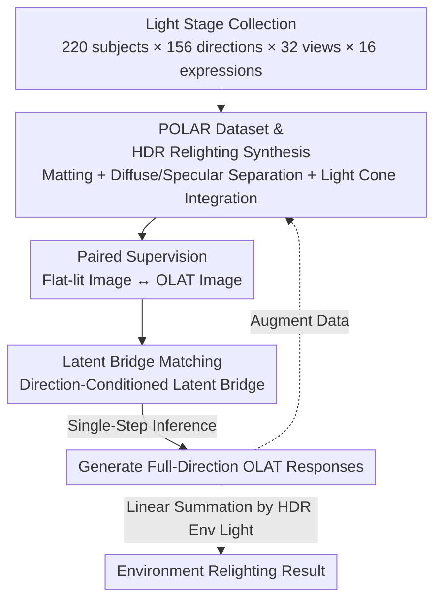

# POLAR: A Portrait OLAT Dataset and Generative Framework for Illumination-Aware Face Modeling

**Conference**: CVPR 2026  
**Paper**: [CVF Open Access](https://openaccess.thecvf.com/content/CVPR2026/html/Chen_POLAR_A_Portrait_OLAT_Dataset_and_Generative_Framework_for_Illumination-Aware_CVPR_2026_paper.html)  
**Code**: None (Project page https://rex0191.github.io/POLAR/)  
**Area**: Image Generation / Portrait Relighting  
**Keywords**: OLAT, Face Relighting, Light Stage, Flow/Bridge Matching, HDR Environment Lighting

## TL;DR
The authors simultaneously collected the largest open-source face OLAT (One-Light-at-a-Time) dataset, POLAR (220 subjects, 156 light directions, 32 views, 16 expressions, 4K), and trained a generative model, POLARNet, based on "latent bridge matching." POLARNet generates single-light responses in various directions directly from a flat-lit portrait in a single step, followed by linear composition for relighting under arbitrary HDR environment lighting, achieving physical consistency and cross-identity generalization.

## Background & Motivation
**Background**: Portrait relighting aims to change the lighting environment of a face while preserving identity and geometry. Recent neural rendering and diffusion generation have reached high visual quality, but the authors emphasize an overlooked bottleneck—**models are limited by the physical fidelity and scale of training data**. Among all lighting data, OLAT (One-Light-at-a-Time, capturing one light direction at a time) is the most faithful measurement of facial light transport. Since light transport is linear, any environment light can be reconstructed by linearly combining these single-light bases, making OLAT the bridge between physical rendering and data-driven learning.

**Limitations of Prior Work**: OLAT data is extremely scarce. Industry light stage data (Adobe/Netflix/Google) is mostly closed-source. Publicly available OLAT datasets either have too few identities (< 10), low resolution, or lack expression diversity. A massive gap exists between the "need for high-fidelity relightable face data" and "limited public resources."

**Key Challenge**: OLAT acquisition must occur in controlled light stages, **only covering the captured individuals**, failing to generalize to arbitrary subjects. To make a relighting model work for any face, massive and diverse OLAT supervision is required. The cost/proprietary nature of data collection and the model's hunger for scale form a deadlock.

**Key Insight**: The authors create a "chicken and egg" closed loop where data and models feed each other—real OLAT data constrains the model toward physical accuracy, while the model synthesizes OLAT for arbitrary new faces to expand data diversity. A key observation is that **lighting changes are not random image variations but follow consistent physical laws**; thus, they can be modeled as a continuous trajectory between two semantically aligned endpoints (flat-lit image $\leftrightarrow$ target OLAT image), rather than denoising from Gaussian noise like diffusion.

**Core Idea**: Reformulate "relighting" as a "continuous, physically interpretable transformation between two lighting states"—using direction-conditioned latent bridge matching to learn this trajectory, enabling single-step inference from a flat-lit image to generate specified OLAT responses.

## Method
POLAR produces two main outputs: **a dataset** (POLAR, including acquisition + HDR relighting synthesis pipeline) and **a generative model** (POLARNet, generating OLAT from a single portrait). They are linked by the physical principle of linear light transport.

### Overall Architecture
The pipeline consists of three segments: (1) Capturing real OLAT in a custom light stage, followed by matting and diffusion synthesis to create large-scale HDR relighted portraits (POLAR dataset); (2) Training POLARNet on paired "flat-lit $\leftrightarrow$ OLAT" images from POLAR using a direction-conditioned latent bridge; (3) At inference, given any flat-lit portrait, it generates responses for all 156 directions in one step, then linearly composites them per target HDR environment lighting. Generated OLAT can further augment the data.

### Key Designs

**1. POLAR Dataset and Physics-Calibrated HDR Relighting Synthesis: Scalable Supervision**

Original OLAT images represent "a face under a single directional light." To serve as supervision for relighting, they must be composited into arbitrary HDR environments. The foundational formula is linear superposition: given OLAT images $\{I_i\}$ and light directions $\{l_i\}$, appearance under environment light $E(l)$ is approximated by $I_E \approx \sum_i w_i I_i$, where $w_i = \int_{\Omega_i} E(l)\,dl$ is the light cone integral. Direct summation works for diffuse components, but specularities cause exposure imbalance. The key improvement is **decoupling diffuse and specular weighting**:

$$I_E \approx \alpha \sum_i w_i^{\text{diff}} I_i + (1-\alpha)\sum_i I_i \odot w_i^{\text{spec}}$$

Diffuse weights $w^{\text{diff}}$ are calculated from grayscale intensity (avoiding skin color tinting), while specular weights $w^{\text{spec}}$ retain RGB (restoring colored highlights). $\odot$ denotes element-wise multiplication, and $\alpha$ is a scene-dependent mixing coefficient. Energy normalization and perceptual tone-mapping are also applied. **Light cone integration** is used instead of point light approximation to better capture high-intensity local light. The final dataset includes 220 subjects / 32 views / 16 expressions / 4K, totaling 28.8M frames via HDR synthesis.

**2. Pair-wise Latent Bridge Matching: Utilizing Physical Structure**

Portrait relighting differs from general image translation—flat-lit and OLAT images of the same person share **identical appearance except for lighting direction and intensity**. Standard diffusion denoising from Gaussian noise often entangles lighting with texture/identity. The authors use a **continuous latent bridge between two semantically aligned endpoints**: flat-lit image $x_u$ and target OLAT image $x_l$ are encoded as $z_u = E(x_u)$ and $z_l = E(x_l^{(\theta, \phi)})$. The bridge interpolation is:

$$z_t = (1-t)z_u + t z_l + \sigma\sqrt{t(1-t)}\,\epsilon$$

where $\epsilon \sim \mathcal{N}(0,I)$ introduces controlled randomness, and $t\in[0,1]$ parameterizes the lighting path. Unlike original Flow Matching which maps **unaligned domains**, this uses **paired align supervision** to ensure the trajectory evolves only along the lighting dimension, preserving shared identity.

**3. Direction-Conditioned Velocity Field and Single-Step Inference**

The velocity network $v_\theta$ takes light direction $c_{\text{dir}} = (\sin\theta, \cos\theta, \sin\phi, \cos\phi)$ as input. Training aims to minimize:

$$L_{\text{LBM}} = \mathbb{E}_{t,\epsilon}\big[\,\|v_\theta(z_t, t, c_{\text{dir}}) - (z_l - z_t)/(1-t)\|_2^2\,\big]$$

During inference, given a flat-lit image $I_{\text{uni}}$ and target direction $L=(\theta, \phi)$, the model performs **single-step** prediction: $\hat z_l = z_u + (1-t)\,v_\theta(z_u, t{=}0, c_{\text{dir}})$. Decoding $\hat I_{\text{olat}}(L) = D(\hat z_l)$ yields the single-light image, bypassing iterative integration.

### Loss & Training
The total objective includes three regularization terms: $L_{\text{total}} = L_{\text{LBM}} + \lambda_{\text{id}}L_{\text{id}} + \lambda_{\text{pix}}L_{\text{pix}} + \lambda_{\text{energy}}L_{\text{energy}}$.
- **Identity Consistency** $L_{\text{id}}$: USes a pre-trained face encoder (ArcFace) to ensure identity stability in image space.
- **Energy/Uncertainty-Aware Pixel Loss** $L_{\text{pix}} = \|w \odot (\hat I_{\text{olat}} - I_{\text{olat}})\|_1$, with pixel weights $w(x) = \min(1, \kappa I_{\text{olat}}(x)/\bar I_{\text{olat}})$ scaling by relative brightness to suppress low-signal dark areas and emphasize highlight shading.
- **Energy Regularization** $L_{\text{energy}}$: Constrains total exposure to match ground truth.

## Key Experimental Results

### Main Results
Evaluation on in-the-wild portraits compared against SwitchLight (physics-inspired decomposition), IC-Light, and DreamLight.

| Method | LPIPS↓ | PSNR↑ | SSIM↑ |
|------|--------|-------|-------|
| SwitchLight | 0.168 | 20.69 | **0.84** |
| IC-Light | 0.314 | 18.47 | 0.702 |
| DreamLight | 0.175 | 19.87 | 0.79 |
| **POLARNet (Ours)** | **0.115** | **22.12** | 0.82 |

POLARNet achieves the lowest perceptual error and highest PSNR, with SSIM competitive with SwitchLight.

### Dataset Comparison

| Dataset | Subjects | View | Exp | Total Frames | Res | Open |
|--------|-------|------|------|--------|--------|------|
| ICT-3DRFE | 23 | 2 | 15 | 14K | 1K | ✓ |
| FaceOLAT | 139 | 40 | 4 | 5.5M | 4K | ✓ |
| **POLAR (Ours)** | **220** | 32 | **16** | **28.8M** | 4K | ✓ |

POLAR leads in identity count, expression diversity, and total frames among open-source resources.

### Ablation Study

| Configuration | Observation | Explanation |
|------|------|------|
| Physical OLAT Sum vs. Background-conditioned | Ours maintains consistent shading during HDR rotation; context methods show shadow jumps. | Value of explicit lighting structure over context dependency. |
| w/o Energy/Uncertainty Loss | Model overfits dark areas, resulting in dark images with lost contrast. | Weighting preserves high-frequency shading in bright areas. |

### Key Findings
- **Physics > Context**: In HDR rotation tests, context-based methods (inferring light from backgrounds) produce flickering shadows. Ours ensures continuous shading and highlights.
- **Synthetic OLAT $\approx$ Real OLAT**: Environmental relighting results using generated OLAT sequences closely match results from real light stage captures.
- **Energy-Aware Loss is Critical**: Without it, the vast number of dark pixels in OLAT targets biases the model toward overall underexposure.

## Highlights & Insights
- **Data-Model Loop**: Real measurements provide physical constraints, while the model synthesizes diverse data for new subjects, breaking the acquisition deadlock.
- **Relighting via Bridge Matching**: Relighting endpoints are semantically aligned. Modeling a deterministic trajectory between latents preserves identity better and enables faster inference than diffusion.
- **Diffuse/Specular Separation**: This detail ensures linear superposition remains stable under colored lights by treating skin tone and highlights differently.

## Limitations & Future Work
- High-frequency details are sometimes lost near highlight and shadow boundaries.
- Performance drops under extreme face poses or lighting conditions.
- Future work: Extension to **video OLAT synthesis** for temporally consistent lighting.

## Related Work & Insights
- **vs. SwitchLight**: SwitchLight uses simplified BRDF models which miss complex light transport like sub-surface scattering; Ours learns transport directly from data.
- **vs. IC-Light / DreamLight**: These rely on background context and lack physical consistency when environments rotate; Ours is physically consistent.
- **vs. Standard LBM**: While original LBM maps distribution between domains, Ours utilizes paired supervision to ensure deterministic, physics-grounded transitions.

## Rating
- Novelty: ⭐⭐⭐⭐ 
- Experimental Thoroughness: ⭐⭐⭐ 
- Writing Quality: ⭐⭐⭐⭐ 
- Value: ⭐⭐⭐⭐⭐ (Essential resource for the relighting community)

<!-- RELATED:START -->

## Related Papers

- [\[CVPR 2026\] Generative Modeling of Weights: Generalization or Memorization?](generative_modeling_of_weights_generalization_or_memorization.md)
- [\[CVPR 2026\] FG-Portrait: 3D Flow Guided Editable Portrait Animation](fg-portrait_3d_flow_guided_editable_portrait_animation.md)
- [\[CVPR 2026\] SpatialDiff: 3D-Aware Object Movement via Implicit Spatial Modeling](spatialdiff_3d-aware_object_movement_via_implicit_spatial_modeling.md)
- [\[CVPR 2026\] ExpPortrait: Expressive Portrait Generation via Personalized Representation](expportrait_expressive_portrait_generation_via_personalized_representation.md)
- [\[CVPR 2026\] UniGenDet: A Unified Generative-Discriminative Framework for Co-evolutionary Generation and Detection](unigendet_a_unified_generative-discriminative_framework_for_co-evolutionary_imag.md)

<!-- RELATED:END -->
