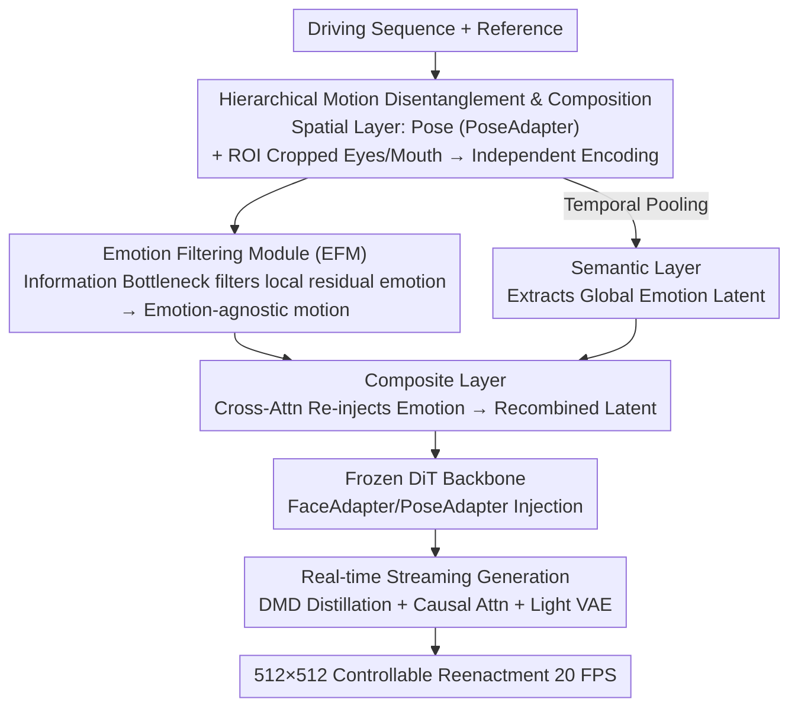

# PortraitDirector: A Hierarchical Disentanglement Framework for Controllable and Real-time Facial Reenactment

**Conference**: CVPR 2026  
**Paper**: [CVF Open Access](https://openaccess.thecvf.com/content/CVPR2026/html/Ji_PortraitDirector_A_Hierarchical_Disentanglement_Framework_for_Controllable_and_Real-time_Facial_CVPR_2026_paper.html)  
**Code**: TBD  
**Area**: Image Generation / Facial Reenactment  
**Keywords**: Facial Reenactment, Motion Disentanglement, Information Bottleneck, Diffusion Distillation, Real-time Generation

## TL;DR
PortraitDirector reformulates facial reenactment from "driving an entangled holistic motion signal" to a "hierarchical composition task." It disentangles head pose, local expressions (eyes/mouth), and global emotions through spatial, semantic, and composite layers before recombining them. A global emotion filtering module based on the Information Bottleneck principle is introduced to remove residual emotions from local motions. Combined with diffusion distillation, causal attention, and a lightweight VAE, it achieves controllable real-time reenactment at 512×512 resolution, 20 FPS, and 800 ms latency on a single NVIDIA 5090.

## Background & Motivation
**Background**: Facial reenactment uses the motion of a driving video to animate a reference face, aiming for photo-realistic, identity-preserving results with fine-grained control over components like expression and head pose. Existing methods generally follow two paths: geometric proxies (3DMM, facial landmarks, e.g., AniPortrait, StyleAvatar) or learned implicit motion latents (Face-vid2vid, LivePortrait, and recent diffusion-based generators like XPortrait, HunyuanPortrait).

**Limitations of Prior Work**: Both approaches have limitations. Holistic end-to-end models learn motion as a single entangled representation, which offers high expressiveness but **sacrifices fine-grained controllability**—making it impossible to manipulate individual motion components. Conversely, methods targeting controllability face two issues: geometric proxy-based methods are limited by the proxy's expressiveness (e.g., unable to isolate emotion from physical movement), while pioneers like EDTalk and PD-FGC rely on **indirect supervision via specialized training targets and data augmentation** to disentangle the latent space, which often fails to achieve robust or complete separation.

**Key Challenge**: A long-standing trade-off exists between expressiveness and controllability, rooted in the **convention of modeling facial motion as a single holistic signal**. If entanglement occurs at the encoding stage, post-hoc separation is destined to be incomplete. Furthermore, the emotion inherent in the driving frames often **dominates the synthesis results**, causing the output to ignore or resist the target emotion.

**Goal**: To achieve both "high expressiveness" and "fine-grained controllability"—enabling photo-realistic reconstruction where eyes, mouth, head pose, and emotion are independently controlled by different driving sources.

**Key Insight**: The authors observe that facial motion is not a single entangled signal but a **multi-layer composition**—different components operate on different spatial, semantic, and temporal scales (pose is global physical motion; eyes/mouth are local high-frequency motions; emotion is global low-frequency semantics). Therefore, they should be separated at the **physical level before encoding**, rather than being forcibly disentangled from latent codes post-hoc.

**Core Idea**: Reframe reenactment from a "driving" task to a "composition" task—route components to specialized layers for disentanglement based on their attributes, then recombine them into a unified, expressive motion latent. Use an Information Bottleneck to filter residual emotions from local motions, breaking the inherent "motion ↔ emotion" entanglement.

## Method

### Overall Architecture
PortraitDirector is based on the Wan-I2V Diffusion Transformer (DiT) architecture. First, a base reenactment model is pre-trained using the Wan-Animate paradigm, consisting of a MotionEncoder (extracting motion latent $l_{face}$ from cropped faces), a PoseEncoder (mapping explicit head pose parameters to $l_{pose}$), a DiT (predicting denoising results from noise latents and motion conditions), and FaceAdapter/PoseAdapter (injecting face/pose latents into DiT via cross-attention). The pre-training objective is the standard diffusion denoising loss, with extra weighting on the facial region (mask weight increased by $1+\lambda M$, where $\lambda=50$).

Building on this, the core **Hierarchical Motion Disentanglement and Composition** module is introduced as a "plug-and-play" replacement for the original MotionEncoder: the driving sequence is pre-processed to yield head pose latents and initial motion latents for specific facial regions (eyes, mouth) → the **Emotion Filtering Module (EFM)** filters residual emotions while a parallel branch uses temporal pooling to extract global emotion latents → these are recombined into a holistic motion latent in the **Composite Layer** → finally injected into the frozen DiT backbone alongside the pose latent via cross-attention. A set of **Real-time Streaming Generation** optimizations is applied to achieve real-time performance on consumer GPUs. During training, the DiT backbone and the MotionEncoder used for emotion are frozen; only the new modules are optimized.

### Key Designs

**1. Hierarchical Motion Disentanglement and Composition: Decompose and Recombine at the Physical Level**

This directly addresses the entanglement caused by holistic modeling. The authors use a three-layer structure. The **Spatial Layer** separates components that are spatially independent: head pose is stripped from local facial motion—using MediaPipe for face detection to derive position $f_w, f_h = x/s, y/s$ and scale $f_s = \Delta s/s$, and HopeNet to estimate rotation angles $f_p, f_y, f_r$. These form $f_{pose} = (f_w, f_h, f_s, f_p, f_y, f_r)$, which is encoded via PoseEncoder into $l_{pose}$ and **injected through an independent PoseAdapter**. This path is entirely separate from the expression flow, enabling explicit control over position and rotation—fixing the scale entanglement and weak pose control issues seen in models like XPortrait2. Local expressions are cropped **before encoding**—MediaPipe detects landmarks to crop ROI for eyes and mouth, which are sent to specialized MotionEncoders to obtain $l_{eye}$ and $l_{mouth}$. This input-level separation prevents motion leakage. The **Semantic Layer** treats emotion as a low-frequency, temporally smooth component: temporal pooling is applied to motion latents over a video window $l_{emo} = \frac{1}{N} \sum_i^N l_i$, suppressing high-frequency local actions while retaining the emotional state. The MotionEncoder used here shares parameters with the reenactment model but is frozen to leverage pre-trained knowledge for extracting global semantics. Finally, the **Composite Layer** re-synthesizes "emotion-agnostic basic motion" and "emotion style":

$$l^{compose}_{mouth}=l^{basic}_{mouth}+\mathrm{CrossAttn}(l^{basic}_{mouth},l_{emo}),\quad l'_{full}=\mathrm{SelfAttn}(\mathrm{MLP}(l^{compose}_{eye}\oplus l^{compose}_{mouth})),\quad l_{full}=\mathrm{CrossAttn}(l'_{full},l_{emo})$$

Emotion is re-injected into eye and mouth latents via cross-attention, followed by self-attention for fusion and conflict resolution, and a final cross-attention layer for global emotional modulation.

**2. Emotion Filtering Module (EFM): Using Information Bottleneck to Squeeze Residual Emotions**

Even with structural decomposition, local latents may still contain residual emotions—e.g., mouth latents from a driving frame inevitably encode the original emotion, which **weakens the control of the global emotion latent**. EFM adopts an analysis-by-synthesis approach based on the Information Bottleneck principle. It acts as an autoencoder-style module where the **analysis phase** serves as a low-capacity channel. An Encoder compresses local latents (like $l_{mouth}$) into a compact 128-dimensional feature space, and a Decoder restores emotion-agnostic latents $l^{basic}_{mouth}$. The low-dimensional bottleneck and KL-divergence regularization force the module to discard emotional data, retaining only basic motion. During the **synthesis phase**, the Composite Layer re-injects global emotion. The system is optimized end-to-end to reconstruct original holistic motion latents, forcing the bottleneck to learn meaningful disentanglement without relying on neutral expression datasets.

**3. Real-time Streaming Generation: A Three-Pronged Optimization**

High-fidelity diffusion reenactment is computationally expensive. The authors apply several optimizations: **DiT Distillation** uses Distribution Matching Distillation (DMD) to reduce sampling from 20 steps to 4 (CFG=2), converts bidirectional attention to causal attention for streaming, and adds sliding window masks with KV caching for efficient inference. **VAE Acceleration**: Since the Wan-VAE decoder accounts for ~50% of the latency in a 4-step streaming model, the decoder width is reduced to 1/4 and retrained with a reconstruction target $L_{vae} = \|x_{pred} - x_{gt}\|_2^2 + \lambda L_{LPIPS}(x_{pred}, x_{gt})$ ($\lambda = 1$). This yields a 4× speedup in decoding with minimal quality loss. The final pipeline achieves ~20 FPS with 800 ms end-to-end latency at 512×512 resolution.

### Loss & Training
Training occurs in two stages. First, a base reenactment model is trained for 100K steps on the VFHQ + NerSemble + MEAD datasets (~300k clips $\le 30s$ at 512×512). Data augmentation follows XPortrait2 (random scaling, color jittering, piecewise affine transforms on driving frames, and random cropping on source images) to ensure identity is extracted only from the source image. Second, the DiT backbone, PoseEncoder, and emotion MotionEncoder are frozen, while the disentanglement modules are fine-tuned for 20K steps. In addition to the denoising loss $L$, a latent constraint ensures the composite latent matches the output of the pre-trained MotionEncoder: $L_{latent} = \mathbb{E}[\|l_{gt} - l_{pred}\|] + (1 - \frac{l_{gt} \cdot l_{pred}}{\|l_{gt}\|\|l_{pred}\|})$, with total loss $L_{edit} = L + L_{latent}$.

## Key Experimental Results

### Main Results
Reenactment evaluation on VFHQ (200 videos × 48 frames, 200 reference images). Self-reenactment is measured by MSE/SSIM/LPIPS; cross-reenactment by identity (ArcFace cosine similarity), pose, and expression similarity (L2 distance).

| Method | MSE↓ | SSIM↑ | LPIPS↓ | ID-SIM↑ | Pose↓ | Expression↓ |
| :--- | :--- | :--- | :--- | :--- | :--- | :--- |
| AniPortrait | 0.032 | 0.576 | 0.429 | 0.886 | 8.347 | 0.027 |
| Follow-Your-Emoji | 0.033 | 0.570 | 0.428 | **0.892** | 9.543 | 0.026 |
| XPortrait2 | 0.046 | 0.540 | 0.462 | 0.823 | 4.894 | 0.010 |
| EDTalk | 0.022 | 0.641 | 0.405 | 0.792 | 8.169 | 0.017 |
| PDFGC | 0.047 | 0.531 | 0.563 | 0.756 | 19.401 | 0.026 |
| **Ours** | **0.018** | **0.654** | **0.316** | 0.880 | **4.707** | **0.010** |

Ours leads in reconstruction quality (MSE/SSIM/LPIPS) and pose/expression control. ID-SIM is slightly lower than Follow-Your-Emoji (0.880 vs 0.892). A major advantage is **robustness to scale changes**—unlike XPortrait2, which maintains reference frame scale at the cost of higher reconstruction loss, Ours explicitly decouples pose to mitigate scale entanglement.

Single-component control accuracy on MEAD:

| Method | Pose↓ | Expression↓ | Mouth↓ | Eye↓ |
| :--- | :--- | :--- | :--- | :--- |
| EDTalk | 25.999 | 0.028 | 0.014 | – |
| PDFGC | 33.081 | 0.035 | 0.025 | 0.046 |
| AniPortrait | 19.200 | 0.032 | – | – |
| Follow-Your-Emoji | 16.160 | 0.029 | – | – |
| **Ours** | **13.695** | **0.023** | **0.012** | **0.033** |

Ours achieves the best scores across all four individual control metrics.

### Ablation Study

| Configuration | Observation | Description |
| :--- | :--- | :--- |
| Full model | Scale robustness, independent emotion control | Complete model |
| w/o Struct | Severe scale entanglement; model follows reference scale | Validates the need for explicit Pose-Expression separation |
| w/o EFM | Reduced ability to suppress source emotion | Validates EFM's role in emotion disentanglement |

### Key Findings
- Removing structural decomposition (w/o Struct) replicates XPortrait2's scale entanglement issues; explicit separation is key to robustness.
- Without EFM, the model cannot suppress source emotions, allowing the driving image's inherent emotion to override target control.
- In the 4-step streaming model, the VAE decoder is the primary bottleneck (~50% latency). Reducing its width by 3/4 provides a ~4× speedup with negligible quality loss.

## Highlights & Insights
- **"Cropping at the physical level before encoding" vs. "Post-hoc latent disentanglement"**: Cropping eyes and mouth for independent encoding ensures decoupling at the source—a strategy more robust than latent space orthogonal constraints and transferable to other controllable generation tasks.
- **Information Bottleneck as an "Emotion Filter"**: Modeling emotion removal as a low-capacity bottleneck with KL-divergence avoids dependency on neutral datasets while maintaining overall expressiveness.
- **Truly Real-time Controllable Diffusion Reenactment**: The combination of DMD distillation, causal streaming, and a lightweight VAE allows high-fidelity, fine-grained control to be feasible on consumer-grade GPUs for the first time.

## Limitations & Future Work
- The ablation study relies on qualitative results and **lacks quantitative tables** for module contributions.
- ID-SIM is slightly lower than Follow-Your-Emoji, suggesting information loss during the disentanglement-recomposition process.
- Dependency on external detectors (MediaPipe, HopeNet) means failures in these modules (e.g., occlusion, extreme angles) could cascade through the pipeline.
- The temporal pooling assumption ("emotion = low frequency, action = high frequency") may fail for rapid emotion changes or exaggerated theatrical expressions.

## Related Work & Insights
- **vs. EDTalk / PD-FGC**: These methods decompose holistic latents post-hoc using complex constraints. Ours separates them at the physical level before encoding and uses EFM for explicit emotion filtering, leading to more robust results.
- **vs. XPortrait2 / AniPortrait**: Earlier methods often struggle with scale entanglement or limited expression control (usually localized to the mouth). Ours enables four-dimensional independent control (eyes, mouth, pose, emotion).
- **Technical Contribution**: Beyond the model architecture, the engineering optimizations (distillation + causal attention + VAE acceleration) reduce end-to-end latency to 800 ms, critical for real-world interactive applications like digital humans.

## Rating
- Novelty: ⭐⭐⭐⭐ The "Reenactment = Hierarchical Composition" perspective combined with Information Bottleneck filtering is well-integrated.
- Experimental Thoroughness: ⭐⭐⭐ Strong main comparisons, but lacks quantitative detail in the ablation study.
- Writing Quality: ⭐⭐⭐⭐ Motivation and architecture are clearly explained.
- Value: ⭐⭐⭐⭐ High practical value for real-time digital human and live-streaming applications.

<!-- RELATED:START -->

## Related Papers

- [\[CVPR 2026\] Semantic Scale Space: A Framework for Controllable Image Abstraction](semantic_scale_space_a_framework_for_controllable_image_abstraction.md)
- [\[CVPR 2026\] DreamStereo: Towards Real-Time Stereo Inpainting for HD Videos](dreamstereo_towards_real-time_stereo_inpainting_for_hd_videos.md)
- [\[CVPR 2026\] FlashDecoder: Real-Time Latent-to-Pixel Streaming Decoder with Transformers](flashdecoder_real-time_latent-to-pixel_streaming_decoder_with_transformers.md)
- [\[ECCV 2024\] MotionLCM: Real-time Controllable Motion Generation via Latent Consistency Model](../../ECCV2024/image_generation/motionlcm_real-time_controllable_motion_generation_via_latent_consistency_model.md)
- [\[CVPR 2026\] StreamAvatar: Streaming Diffusion Models for Real-Time Interactive Human Avatars](streamavatar_streaming_diffusion_models_for_real-time_interactive_human_avatars.md)

<!-- RELATED:END -->
