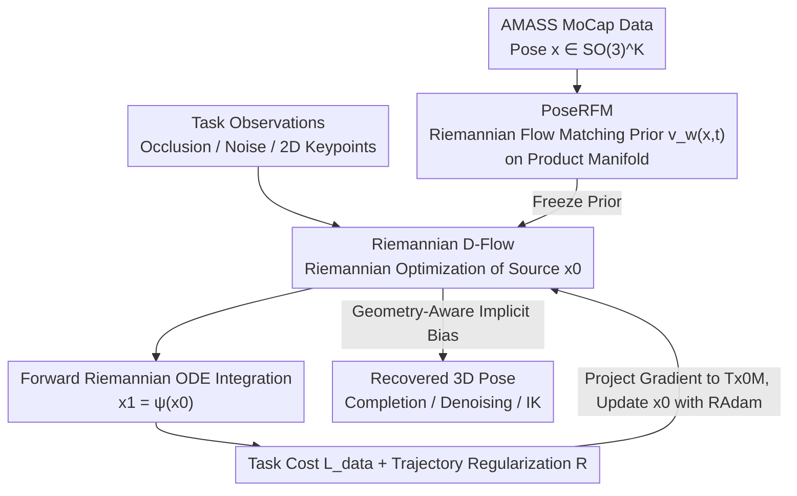

# PoseD-Flow: Versatile and Guided Flow Matching Model of Human Pose

**Conference**: CVPR 2026  
**Paper**: [CVF Open Access](https://openaccess.thecvf.com/content/CVPR2026/html/Nadar_PoseD-Flow_Versatile_and_Guided_Flow_Matching_Model_of_Human_Pose_CVPR_2026_paper.html)  
**Code**: https://github.com/circle-group/PoseDFlow  
**Area**: 3D Human Pose / Generative Prior / Flow Matching  
**Keywords**: Riemannian Flow Matching, Human Pose Prior, Training-Free Guidance, Inverse Problems, SO(3) Manifold

## TL;DR
This paper proposes PoseD-Flow, the first generative prior to bring **Riemannian Flow Matching (RFM)** to human pose. Named PoseRFM, it is directly defined on the product manifold $SO(3)^K$ of joint rotations. Combined with a task-agnostic guidance mechanism called **Riemannian D-Flow** (which backpropagates gradients through the Riemannian ODE sampling process to optimize only the source point), it achieves new SOTA performance on three types of inverse problems—pose completion, denoising, and inverse kinematics—especially under occlusion and noise.

## Background & Motivation
**Background**: Recovering plausible 3D human academic poses from incomplete, noisy, and occluded 2D/3D observations hinges on having a generative prior that "knows" what constitutes a valid pose. Recently, diffusion models (DPoser), neural distance fields (PoseNDF, NRDF), and VAEs (VPoser, HuMoR) have been used as pose priors, performing conditional inversion during inference to solve inverse problems.

**Limitations of Prior Work**: As the strongest and most tractable generative paradigm today, **flow matching** has never been applied to human pose due to two main barriers: (1) there is no **pre-trained flow prior** available; (2) joint poses are inherently **non-Euclidean** (each joint is a rotation on $SO(3)$), and modeling them as unconstrained Euclidean vectors violates the geometric structure. Furthermore, using an unconditionally trained generative process in reverse as an inference engine relies on notoriously hard-to-tune **training-free guidance**, which remains an open problem for geometrically constrained targets like human poses.

**Key Challenge**: Existing pose priors either do not use flow matching (missing out on the most expressive paradigm) or force poses into Euclidean space (violating their true configuration space—the product manifold of rotations). Neither can fully exploit the modeling capacity of flow matching while respecting the geometry of poses.

**Goal**: (1) Create the first RFM pose prior directly defined on $SO(3)^K$; (2) Provide a geometry-respecting, training-free guidance method to use this prior as an inverse problem solver without task-specific retraining.

**Key Insight**: The authors extend the concept of Euclidean **D-Flow** (which formulates controllable generation as optimizing the initial noise/source point of a frozen generative model to minimize the endpoint cost) to Riemannian manifolds. Since the flow is integrated along an ODE on the manifold, they backpropagate through this manifold ODE to perform Riemannian optimization on the source point.

**Core Idea**: They replace "Euclidean diffusion priors + heuristic guidance" with "RFM prior on manifolds + source optimization via backpropagation through Riemannian ODE sampling". They theoretically prove that this source optimization naturally carries an implicit bias shaped by the **data covariance + manifold curvature**, driving the solution towards realistic and stable poses.

## Method

### Overall Architecture
PoseD-Flow works in two steps representing two component contributions. **Step 1 (Offline Training)**: PoseRFM learns a Riemannian flow matching prior directly on the product manifold of joint rotations $\mathcal{M}:=SO(3)^K$ using large-scale AMASS motion capture data. This time-conditioned vector field $v_w(x,t)$ transports the noise distribution $p_0$ to the real pose distribution $p_1$ manifold-wise. **Step 2 (Inference-time Guidance)**: For a specific inverse problem (completion/denoising/IK), PoseRFM is frozen, and Riemannian D-Flow solves a **source optimization problem**: finding a source point $x_0$ on the manifold such that the endpoint $x_1=\psi(x_0)$ obtained via ODE integration satisfies the task cost $L_{\text{data}}$ and resides in the high-density region of PoseRFM. Each iteration integrates the ODE forward to get $x_1$, evaluates the cost, projects the gradient back to the tangent space of $x_0$, and updates $x_0$ using Riemannian Adam. No task-specific parameters are trained during the entire inference phase.

### Key Designs

**1. PoseRFM: Riemannian Flow Matching Prior Directly on the $SO(3)^K$ Product Manifold**

The pain point is that human pose priors either bypass flow matching or flatten the $K$ joint rotations into Euclidean vectors, destroying geometry. The authors define the pose as $x=\{R_k\in SO(3)\}_{k=1}^{K}$ (with $K=21$ joint rotations for SMPL). The configuration space is the product manifold $\mathcal{M}=SO(3)^K$, inheriting the distance $d_\mathcal{M}$, exponential map $\mathrm{Exp}$, logarithmic map $\mathrm{Log}$, and Riemannian gradient. Instead of directly regressing the intractable marginal vector field, RFM regresses a **closed-form conditional vector field** on the geodesic path interpolation, taking the minimum-norm conditional field:

$$u_t(x\mid x_1)=\frac{1}{1-t}\,\mathrm{Log}_x(x_1),$$

During training, $x_1\sim p_1$ and $t\sim U(0,1)$ are sampled. Moving along the geodesic yields $x_t=\mathrm{Exp}_{x_0}(t\,\mathrm{Log}_{x_0}(x_1))$, minimizing $\|v_w(x_t,t)-u_t(x_t\mid x_1)\|_g^2$ under the tangent space metric. The network is a simple 4-layer MLP with a hidden dimension of 512, which takes the 189-dimensional ($21\times3\times3$) pose and time $t$ as input, and outputs tangent space vectors. Sampling uses Riemannian-Euler integration on the manifold: $x_{t+\delta}=\mathrm{Exp}_{x_t}(\delta\,\Pi_{T_{x_t}\mathcal{M}}(v_w(x_t,t)))$. This represents the **first** human pose prior (large-scale, geometric version) based on flow matching, outperforming the diffusion baseline DPoser in unconditional generation in terms of FID and nearest neighbor distance.

**2. Riemannian D-Flow: Training-Free Guidance and Source Optimization via Riemannian ODE Backpropagation**

With the frozen prior $v_w\equiv u_t$, how can it be used to solve a conditional task it wasn't trained on? The authors formulate controllable generation as a **Riemannian source optimization** problem:

$$\min_{x_0\in\mathcal{M}}\Big[\,L(x^{(1)}):=L_{\text{data}}(x^{(1)})+R(x_0,u)\,\Big],\quad x^{(1)}=\psi(x_0),$$

where $x^{(1)}$ is the endpoint obtained by forward-integrating the Riemannian ODE starting from $x_0$. In each iteration, Euler integration forward-solves the ODE to yield $x_1$, the cost $L(x_1)$ is evaluated, the gradient with respect to the source point $\nabla_{x_0}L(\psi(x_0))$ is computed, **projected onto the tangent space of $x_0$** to obtain the Riemannian gradient, and the source is updated with **Riemannian Adam** (transporting momentum via parallel transport and stepping on the manifold via $\mathrm{Exp}$). This lifts the Euclidean D-Flow idea of "optimizing initial noise of a frozen model" to manifolds. It requires no classifier-free training or task-specific retraining, makes any RFM prior universally applicable, and constitutes the **first general training-free guidance for RFM**. All tasks share a trajectory regularization $R=L_{\text{traj}}=\sum_{i}\sum_{k}(3-\mathrm{tr}(x_{ik}))$, which penalizes large rotation angles, regularizing the trajectory to suppress erratic behaviors and physically implausible rotations.

**3. Geometry-Aware Implicit Bias: Why Source Optimization Naturally Favors Realistic Poses**

Why is "optimizing the source" more robust than editing the endpoint directly? The authors provide a theoretical explanation. First, they define the tangent space denoiser as $\mu(x)=\mathbb{E}[\mathrm{Log}_x(x_1)\mid x(t)=x]$ and prove its covariant derivative decomposes as $(\nabla\mu)_v=A_x[C(x)v]+R_x[v]$, where $C(x)$ is the (semi-definite) **covariance operator** under the conditional distribution and $R_x$ is a curvature-induced residual. As $t\to1$, $C(x)$ approaches the local data covariance. They then prove a Riemannian adjoint relation linking the Riemannian gradients of the start and endpoints through the pullback map $D\psi(x_0)^\ast$. Consequently (Theorem 4), the endpoint shift induced by a single-step source update is:

$$\delta x^{(1)}=-\eta\underbrace{\big[D_{x_0}\psi\,(D_{x_0}\psi)^\ast\big]}_{K:\ \text{PSD, representing local covariance}}\,\mathrm{grad}_{x^{(1)}}L(x^{(1)}),$$

This means the endpoint gradient is **filtered/projected by operator $K$ onto the reachable subspace of the data manifold**—when the flow generates the data distribution, $K$ is precisely the local covariance of the data. Simply put, source optimization automatically biases the updates to high-density directions, corrected by the manifold curvature, pulling the solution towards realistic and stable poses. This explains why PoseD-Flow is exceptionally robust under noise, occlusion, and ambiguity. Euclidean D-Flow is a special case (where the curvature term $R_x$ cancels out with the score derivative, and $K$ degenerates to a scalar covariance).

### Loss & Training
PoseRFM is trained for 50k steps using AdamW (lr 1e-3, weight decay 1e-4, EMA 0.99, batch size 4096, ReduceLROnPlateau). During inference, the three tasks only differ in $L_{\text{data}}$ while keeping the prior and regularization constant:
- **Pose Completion**: $L_{\text{data}}=\sum_{k\in\Omega}\cos^{-1}\!\big(\frac{\mathrm{tr}(x_k^\top x_k^{\text{obs}})-1}{2}\big)$, which is the geodesic distance over the observed joint set $\Omega$, minimizing the rotation discrepancy between generated poses and observations.
- **Motion Denoising**: $L_{\text{data}}=L_{\text{joints}}+\lambda L_{\text{smooth}}$, where $L_{\text{joints}}$ is the $\ell_2$ difference between the joints from the SMPL forward kinematics and the noisy joints, and $L_{\text{smooth}}$ enforces temporal smoothness using geodesic distances between adjacent frames.
- **Inverse Kinematics / HMR**: $L_{\text{data}}=L_{\text{2D}}+L_\theta+L_\beta$, containing the Geman-McClure robust re-projection error for projected 2D keypoints, joint angle priors, and shape regularization, following the SMPLify optimization pipeline.

## Key Experimental Results

### Main Results
Evaluation covers unconditional generation, pose completion, motion denoising, and human mesh recovery (HMR/IK). The model is trained on AMASS and generalizes to HPS/EHF/3DPW with zero-shot fine-tuning.

Unconditional Generation (FID/dNN lower is better, APD diversity higher is better):

| Method | FID ↓ | APD (cm) ↑ | dNN (rad) ↓ |
|------|-------|-----------|-------------|
| VPoser | 0.048 | 14.68 | 0.074 |
| DPoser (Diffusion SOTA) | 0.019 | 14.99 | 0.073 |
| PoseFM (Euclidean FM Baseline) | 0.016 | 14.76 | 0.079 |
| **PoseRFM (N=100)** | **0.014** | 15.48 | **0.069** |
| **PoseRFM (N=1000)** | **0.013** | 15.54 | 0.070 |

FID and dNN are both the lowest (highest realism) with competitive diversity; few methods with higher APD (Pose-NDF, NRDF) trade off realism.

Human Mesh Recovery on EHF (PA-MPJPE, mm):

| Method | From Scratch | CLIFF Initialization |
|------|-------------|-------------|
| DPoser | 56.05 | 49.05 |
| **PoseRFM** | **54.85** | **47.24** |

Motion Denoising on AMASS (MPJPE, mm, $\sigma=40/100$mm): DPoser scores 19.87 / 33.18, **PoseRFM scores 18.88 / 34.68**; on HPS, PoseRFM scores 19.79 / **32.95**, outperforming comprehensively. Detailed HMR metrics (CLIFF initialization): PCK@50 improves from 66.62 (DPoser) to **71.40**.

### Ablation Study
Deconstructing geometric components (model types FM vs RFM, data loss MSE vs Geodesic, and trajectory loss) on pose completion, MPVPE(mm)/APD(cm):

| Configuration | Geo Loss | Traj Loss | Occ. left leg MPVPE ↓ | Occ. legs MPVPE ↓ |
|------|:-:|:-:|------|------|
| PoseFM (Euclidean) | ✗ | ✗ | 102.60 | 129.04 |
| PoseFM + Geometry Loss | ✓ | ✗ | 91.00 | 115.58 |
| PoseFM + Geometry (Full) | ✓ | ✓ | 90.46 | 115.67 |
| **PoseRFM (Full)** | ✓ | ✓ | **83.81** | **95.00** |

### Key Findings
- **Geometry modeling is the game-changer**: The Euclidean PoseFM actually **degrades** when geodesic/trajectory losses are added (since it does not model the manifold, leaving a conflict between geometry losses and Euclidean assumptions). Conversely, for PoseRFM, while starting similarly, the accuracy improves dramatically while still maintaining diversity once geodesic + trajectory losses are introduced. This implies that the "manifold prior" and "geometric loss" must work in tandem.
- **Most advantageous under denoising/occlusion**: As noise increases or occlusion becomes heavier, PoseD-Flow's advantage over the diffusion baseline becomes more pronounced, which aligns with the theoretical geometric implicit bias.
- **Limitations of the MPVPE metric itself**: In the completion task, MPVPE assumes the ground truth (GT) is the unique correct solution, penalizing other equally plausible completions. The authors suggest that metrics accounting for "plausible completion distributions" (similar to FID) are needed.

## Highlights & Insights
- **Lifting the entire D-Flow framework to Riemannian manifolds**: This is not just a matter of swapping distance metrics. Every aspect, including conditional vector fields, source optimization, Riemannian Adam, and adjoint gradients, is fully geometricized. They offer a closed-form conditional field $\frac{1}{1-t}\mathrm{Log}_x(x_1)$ implemented as a lightweight MLP—easy to generalize to other inverse problems on $SO(3)$/product manifolds (e.g., proteins, molecules, robotic grasp poses).
- **An elegant theory for the self-regularizing property of "source optimization"**: Theorem 4 characterizes the effect of source updates on the endpoint via a PSD operator $K \approx$ local data covariance matrix. This provides a geometric justification for why D-Flow-like methods are stable, rather than relying purely on empirical evidence.
- **One prior, three task types, zero task training**: Swapping only $L_{\text{data}}$ at inference solves completion, denoising, and IK. This "frozen prior + swapped loss" paradigm is highly deployment-friendly.

## Limitations & Future Work
- Inference involves **per-sample iterative optimization** (requiring forward ODE solving + backpropagation per step), making it slower than feed-forward regression. The paper prioritizes accuracy and robustness and does not emphasize speed.
- Evaluation is mostly within the AMASS pipeline. **End-effector orientations** (hands/feet) occasionally look unnatural for both methods; fine-grained joints remain a challenge.
- While highlighting the unfairness of MPVPE on "multiple plausible solutions", the authors **do not propose an alternative metric**, meaning the diversity advantage in completion tasks is not fully captured by existing metrics.
- The model only targets **single-frame poses** (explicitly excluding motion modeling in its scope). Temporal consistency is enforced externally via $L_{\text{smooth}}$ rather than intrinsically by the prior. Direct formulation of RFM on motion sequence manifolds represents an exciting future direction.

## Related Work & Insights
- **vs DPoser (Diffusion prior + optimization via diffusion)**: DPoser represents Euclidean diffusion, whereas PoseD-Flow utilizes flow matching on manifolds. Under equivalent training-free inversion settings, PoseRFM excels in FID/PA-MPJPE/PCK, and theoretically explains the robustifying nature of geometry.
- **vs PoseNDF / NRDF (Neural distance fields with iterative projection)**: These methods project samples to a neural distance field, achieving high diversity but poor realism (worse FID/dNN). PoseD-Flow uses a generative flow prior, delivering significantly superior realism.
- **vs Euclidean D-Flow [4] / OC-Flow / TFG-Flow**: This work is the **first general training-free guidance for RFM**. Euclidean D-Flow is proven to be a special case (where curvature residuals cancel out). While TFG-Flow and OC-Flow touch upon $SO(3)$, they do not target inverse problems on product manifolds like human poses.

## Rating
- Novelty: ⭐⭐⭐⭐⭐ The first Riemannian flow matching prior for human pose + the first RFM general training-free guidance, backed by solid theory.
- Experimental Thoroughness: ⭐⭐⭐⭐ Covers unconditional generation, completion, denoising, and IK, across multiple datasets with clear ablations; discussion on speed and potential metrics is slightly sparse.
- Writing Quality: ⭐⭐⭐⭐ Highly structured. Dense geometric notations require some background knowledge.
- Value: ⭐⭐⭐⭐⭐ The "frozen manifold prior + swapped loss" paradigm is highly transferable to 3D pose and broader geometric inverse problems.

<!-- RELATED:START -->

## Related Papers

- [\[ICLR 2026\] Source-Guided Flow Matching](../../ICLR2026/image_generation/source-guided_flow_matching.md)
- [\[CVPR 2026\] Flow Matching for Multimodal Distributions](flow_matching_for_multimodal_distributions.md)
- [\[CVPR 2026\] EgoFlow: Gradient-Guided Flow Matching for Egocentric 6DoF Object Motion Generation](egoflow_gradient-guided_flow_matching_for_egocentric_6dof_object_motion_generati.md)
- [\[CVPR 2026\] Stable Mean Flow: Lyapunov-Inspired One-Step Flow Matching](stable_mean_flow_lyapunov-inspired_one-step_flow_matching.md)
- [\[CVPR 2026\] Spatiotemporal Pyramid Flow Matching for Climate Emulation](spatiotemporal_pyramid_flow_matching_for_climate_emulation.md)

<!-- RELATED:END -->
