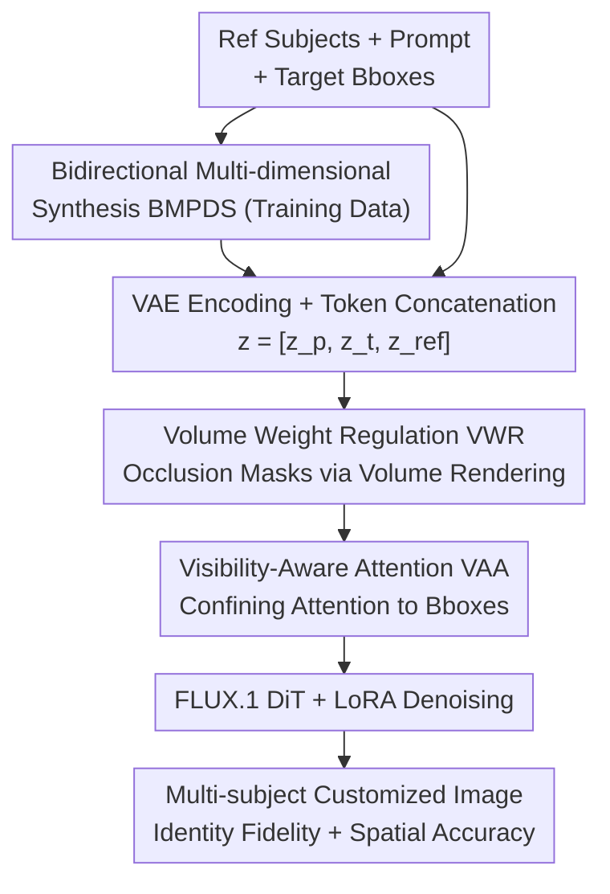

# PositionIC: Unified Position and Identity Consistency for Image Customization

**Conference**: CVPR 2026  
**Paper**: [CVF Open Access](https://openaccess.thecvf.com/content/CVPR2026/html/Hu_PositionIC_Unified_Position_and_Identity_Consistency_for_Image_Customization_CVPR_2026_paper.html)  
**Code**: https://github.com/MeiGenAI/PositionIC  
**Area**: Diffusion Models / Image Customization  
**Keywords**: Subject Customization, Position Control, Identity Consistency, Visibility-Aware Attention, Volume Rendering

## TL;DR
PositionIC utilizes an automated data synthesis pipeline (BMPDS) to generate multi-subject paired data with positional annotations. It then employs a NeRF-inspired "Visibility-Aware Attention" mechanism to restrict each reference subject's attention range within a specified bounding box. This approach achieves SOTA identity fidelity and spatial controllability for multi-subject customization without introducing additional training parameters or inference overhead.

## Background & Motivation

**Background**: Subject-driven image customization has made significant progress in "identity fidelity." Given a reference object image, models can transfer its appearance into new scenes. The mainstream approach encodes the reference image into tokens and concatenates them into a Diffusion Transformer (DiT), relying on global attention for the target region to "absorb" reference features.

**Limitations of Prior Work**: Practical industrial applications (e-commerce displays, picture book illustrations, interior design) require fine-grained spatial control: where subjects are placed, their sizes, their occlusion relationships, and their mutual layout. Existing methods excel at deciding "what to generate" but struggle to precisely control "where and how each subject appears." A few works attempting layout control (e.g., GLIGEN, MS-Diffusion) fall into a trade-off: either positions are accurate but identity is blurred, or identity is preserved but placement is inaccurate.

**Key Challenge**: The authors decompose the root causes into two coupled bottlenecks. First is the **data bottleneck**—there is almost no large-scale paired dataset with explicit multi-subject positional annotations, preventing models from learning spatial reasoning. Existing open-source data (e.g., Subject200K) uses diptychs with low resolution and subject inconsistency. Second is the **mechanism bottleneck**—global attention in DiT entangles "semantic identity" with "spatial layout." Since one token can see all tokens in the image, it is difficult to enforce that "this subject should only appear in this box and understand occlusion."

**Goal**: Redefine the task as subject customization requiring both "identity fidelity" and "instance-level spatial controllability," while simultaneously overcoming both the data and mechanism bottlenecks.

**Key Insight**: Regarding data, a bidirectional, multi-dimensional automated synthesis and filtering pipeline is used to create high-fidelity data with positional annotations. Regarding the mechanism, the concept of NeRF volume rendering is borrowed to calculate physically plausible attention weight masks for occlusion. These masks are used to "confine" each reference subject's attention field to specified regions, using attention masking to decouple layout and identity instead of training an additional control network.

## Method

### Overall Architecture
PositionIC consists of two tightly coupled components: the **BMPDS data synthesis pipeline** for generating training data and a **layout-aware diffusion framework** for position control during generation. During inference, inputs include several reference subject images, a text prompt, and a target bounding box for each subject. The output is a target image where these subjects are synthesized at specified positions and occlusions while maintaining their respective identity fidelity.

The generation framework is based on FLUX.1-dev (using UNO initialization and UnoPE position encoding extensions), training a rank=512 LoRA. Reference images are encoded by a VAE into $z_{ref}$, concatenated with text embeddings $z_p$ and noise latents $z_t$ as DiT input tokens, passing through $N$ double-stream and $N$ single-stream Transformer layers. The key lies in using the bounding boxes to calculate a "Volume Weight Mask" via volume rendering. This mask is injected into every attention calculation layer as **Visibility-Aware Attention (VAA)**, forcing each reference subject to influence only its assigned area and masking reference subjects from each other.

### Key Designs

**1. BMPDS: Bidirectional Multi-dimensional Perception Data Synthesis for Positional Data**

This component addresses the data bottleneck. BMPDS uses "hierarchical generation + hierarchical filtering" through three stages: (1) Training a weak customization model on Subject200K, then segmenting its output and feeding it into a Flux-Outpainting model with random placement to inject spatial signals; the resulting high-fidelity pairs train a stronger PositionIC-Single model. (2) **Forward generation** of multi-subject pairs—using PositionIC-Single to process Subject200K samples independently, followed by random pairing, positioning, and outpainting. (3) **Backward generation**—LLMs write multi-subject descriptions, Flux generates high-resolution images, then objects are detected, cropped, and back-projected to reference images via PositionIC-Single. These bidirectional paths expand diversity while suppressing subject drift, resulting in PIC-400K.

To handle synthetic noise, a **multi-dimensional perception filter** is used. Authors found direct MLLM comparison for fine-grained consistency to be weak. Thus, they score at three levels: visual similarity using CLIP-I and DINO $s_v$ to filter obvious inconsistencies, semantic similarity $s_{vlm}$ via MLLMs (e.g., GPT-4o), and caption-based ranking. Only the top subset of PIC-400K is kept, refining it into PIC-98K.

**2. Volume Weight Regulation (VWR): Physically Plausible Attention Masks for Occlusion**

Bounding boxes alone are insufficient—the model needs to know front-to-back occlusion relationships when multiple subjects overlap. The authors leverage Volume Rendering to model occlusion by treating 2D layout control as a composite image captured by an orthogonal virtual camera. Analogous to NeRF, the accumulated color $C(r)$ along a camera ray is $C(r)=\int_{t_n}^{t_f} T(t)\,\sigma(r(t))\,c(r(t),d)\,dt$, with transmittance $T(t)=\exp(-\int_{t_n}^{t}\sigma(r(s))\,ds)$.

VWR applies these weights as attention masks. Given a foreground mask $M_i$ and sampling interval $\delta$, the volume weight for the $n$-th distance level is:

$$\hat{M}_n = \exp\!\Big(-\sum_{j=1}^{n-1}\sigma_i\delta\Big)\big(1-\exp(-\sigma_n\delta)\big)\,M_n\,\hat{M}_{n-1}$$

Unlike standard volume rendering, $\hat{M}_n$ represents the attention allocated to the reference image in specific regions, using **semantic density** $\sigma_i$ to encode object interactions. "Closer" subjects receive higher weight, while "back" subjects' weights are suppressed in overlap regions.

**3. Visibility-Aware Attention (VAA): Decoupling Layout and Identity via Masking**

VAA constructs an attention mask $M$ to block irrelevant regions: reference subjects are invisible to each other $M(z^i_{ref}, z^j_{ref})=0\ (i\neq j)$; a reference subject's visibility to noise tokens is defined by its volume weight $M(z^i_{ref}, z^n_t)=\hat{M}_i$; other positions $M(\text{other})=1$. The mask enters the softmax in additive log form:

$$\text{Attention} = \text{Softmax}\!\Big(\frac{QK^\top}{\sqrt{d}} + \log M\Big)\cdot V$$

This design leaves "semantic identity" to the reference features while delegating "spatial layout" to the masks, achieving decoupling without introducing extra parameters.

### Loss & Training
PositionIC trains a rank=512 LoRA based on FLUX.1-dev on 8×A100 GPUs with a total batch size of 128 and a learning rate of $10^{-5}$ using cosine warmup. A two-stage curriculum is used: first training on 44k single-subject pairs for 10k steps, then continuing for 8k steps on 54k multi-subject pairs.

## Key Experimental Results

### Main Results
Single-subject and multi-subject customization on DreamBench (CLIP-I/DINO for identity similarity, CLIP-T for text fidelity):

| Task | Method | CLIP-I↑ | CLIP-T↑ | DINO↑ |
|------|------|---------|---------|-------|
| Single-subject | UNO | 0.840 | 0.253 | 0.814 |
| Single-subject | DreamO | 0.835 | 0.258 | 0.802 |
| Single-subject | **PositionIC** | **0.846** | **0.269** | **0.823** |
| Multi-subject | UNO | 0.781 | 0.279 | 0.707 |
| Multi-subject | DreamO | 0.779 | 0.273 | 0.698 |
| Multi-subject | **PositionIC** | **0.819** | 0.279 | **0.771** |

PositionIC leads in all three metrics for single-subject tasks and significantly outperforms others in identity fidelity (CLIP-I/DINO) for the more challenging multi-subject scenario.

Spatial controllability on PositionIC-Bench (mIoU and AP calculated via VisionR1):

| Method | Single-subject IoU↑ | Single-subject AP↑ | Multi-subject mIoU↑ | Multi-subject AP↑ |
|------|------------|-----------|-------------|-----------|
| MS-Diffusion | 0.501 | 0.097 | 0.421 | 0.028 |
| Instance-Diffusion | 0.789 | 0.593 | 0.799 | 0.497 |
| GLIGEN | 0.808 | 0.632 | 0.825 | 0.628 |
| **PositionIC** | **0.828** | 0.628 | **0.860** | **0.701** |

Ours exceeds all baselines in multi-subject mIoU and AP. Methods like MS-Diffusion experience a collapse in spatial accuracy in multi-subject settings (AP < 0.03).

### Ablation Study
| Configuration | Observation | Explanation |
|------|------|------|
| Subject200K | Lowest score | Poor resolution and inconsistency in legacy data |
| PIC-400K | Significantly higher | Bidirectional synthesis expands scale and diversity |
| PIC-98K (Filtered) | Highest score | Multi-dimensional filtering improves quality over quantity |
| w/o VWR | Failure to handle occlusion | VWR is essential for resolving front-to-back relations |
| Full (VWR + VAA) | Correct overlap handling | Complete model |

### Key Findings
- **Filtering is more valuable than scale**: PIC-98K (filtered) > PIC-400K (full) > Subject200K.
- **VWR resolves multi-subject occlusion**: Removing VWR leads to failure in "A behind B" instructions and concept confusion.
- **Multi-subject as an advantage amplifier**: While methods perform similarly on single subjects, PositionIC's advantage in identity and spatial precision widens significantly in multi-subject scenarios.

## Highlights & Insights
- **NeRF Volume Rendering in Attention Masks**: Using semantic density instead of physical density to model "who to notice" is an innovative cross-domain migration.
- **Zero-cost Decoupling**: VAA maintains identity and spatial consistency by modifying visibility without adding parameters, resolving the "position vs. identity" trade-off through constraint rather than complexity.
- **Reusable Synthesis Pipeline**: The bidirectional generation and multi-dimensional filtering paradigm can be migrated to any controllable generation task lacking paired data.
- **Clarity on Attention Accumulation**: Linking identity fidelity to the strength of attention between target and reference regions provides a clear explanation for why previous multi-subject methods suffered from blurring.

## Limitations & Future Work
- **Dependency on bounding boxes**: Control is limited to rectangular boxes; non-rectangular layouts or fine-grained pose/orientation control may require different primitives.
- **Heavy reliance on external models**: The BMPDS pipeline depends on Flux, GPT-4o, and detection models; errors in these components propagate to the training data.
- **Semantic density $\sigma_i$ setting**: The specific implementation of $\sigma_i$ is relegated to the appendix; its sensitivity and impact on robustness were not analyzed in detail in the main text.
- **Custom benchmark**: PositionIC-Bench is self-constructed; while it fills a gap in positional evaluation, SOTA claims on custom benchmarks require third-party verification.

## Related Work & Insights
- **vs. GLIGEN**: GLIGEN injects Fourier position embeddings as grounding tokens. PositionIC uses volume weight masks for attention blocking, outperforming GLIGEN in multi-subject mIoU/AP without needing extra trainable modules.
- **vs. MS-Diffusion**: MS-Diffusion relies on grounding resamplers; PositionIC uses masks to decouple mechanisms, preventing spatial accuracy collapse.
- **vs. UNO / DreamO**: These are identity-strong but lack explicit position control. PositionIC extends their concatenation paradigm with visibility masks, adding spatial control while preserving identity.

## Rating
- Novelty: ⭐⭐⭐⭐⭐ Adapting NeRF volume rendering for zero-cost attention masking combined with a bidirectional synthesis pipeline is highly original.
- Experimental Thoroughness: ⭐⭐⭐⭐ Extensive benchmarks and ablations provided, though the main spatial benchmark is self-constructed.
- Writing Quality: ⭐⭐⭐⭐ Clear logical chain from motivation to solution.
- Value: ⭐⭐⭐⭐⭐ High practical value for e-commerce and design; code and data are open-sourced.

<!-- RELATED:START -->

<!-- RELATED:END -->

## Related Papers

- [\[CVPR 2026\] Scaling Multi-Identity Consistency for Image Customization via Multi-to-Multi Matching Paradigm](scaling_multi-identity_consistency_for_image_customization_via_multi-to-multi_ma.md)
- [\[CVPR 2026\] Resolving the Identity Crisis in Text-to-Image Generation](resolving_the_identity_crisis_in_text-to-image_generation.md)
- [\[CVPR 2026\] Image Diffusion Preview with Consistency Solver](image_diffusion_preview_with_consistency_solver.md)
- [\[CVPR 2026\] PureCC: Pure Learning for Text-to-Image Concept Customization](purecc_pure_learning_for_text-to-image_concept_customization.md)
- [\[CVPR 2026\] Unified Customized Generation by Disentangled Reward Modeling](unified_customized_generation_by_disentangled_reward_modeling.md)

<!-- RELATED:END -->
