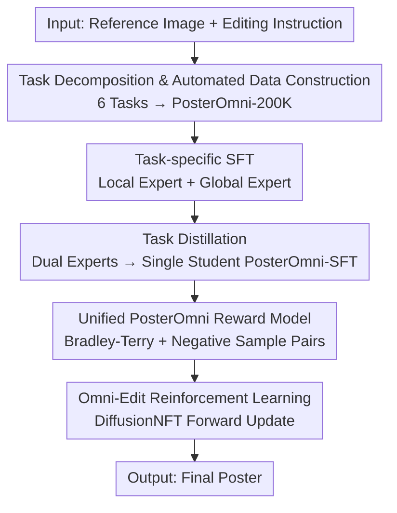

# PosterOmni: Generalized Artistic Poster Creation via Task Distillation and Unified Reward Feedback

**Conference**: CVPR 2026  
**Paper**: [CVF Open Access](https://openaccess.thecvf.com/content/CVPR2026/html/Chen_PosterOmni_Generalized_Artistic_Poster_Creation_via_Task_Distillation_and_Unified_CVPR_2026_paper.html)  
**Code**: Project Page https://ephemeral182.github.io/PosterOmni/  
**Area**: Image Generation / Diffusion Models  
**Keywords**: Image-to-Poster Generation, Task Distillation, Reward Feedback, Diffusion RL, Unified Model

## TL;DR
PosterOmni decomposes "image-to-poster" generation into six tasks across two categories: local editing (expansion/inpainting/scaling/identity preservation) and global creation (layout/style transfer). It first trains local and global experts, then integrates them into a single student model via task distillation. Finally, a unified reward model and DiffusionNFT reinforcement learning are used to align aesthetics and instructions. This single model outperforms all open-source editing models on the custom PosterOmni-Bench and approaches or exceeds closed-source commercial systems like Seedream-4.0.

## Background & Motivation
**Background**: Most real-world poster creation is "image-driven"—designers start from existing photos, product images, or templates, making local modifications while adding text, layout, and style. Existing open-source editing models (Qwen-Image-Edit, FLUX.1 Kontext, ICEdit) excel at natural image editing (background swaps, object removal), while closed-source commercial systems (Seedream-3/4, GPT-Image, Gemini-2.5) can handle complex posters but are expensive and uncontrollable.

**Limitations of Prior Work**: Directly applying general editing models to posters leads to failures in poster-specific tasks like scaling, identity-consistent generation, and layout-driven global synthesis, resulting in misaligned layouts, distorted text, and aesthetic degradation. Currently, no open framework specifically targets "multi-task image-to-poster" generation.

**Key Challenge**: Poster creation naturally couples two demands: **pixel-level precision** for local editing (preserving specific visual entities) and **concept-level understanding** for global creation (interpreting abstract design intents like layout and style). Mixing these in a single model during training leads to interference, where low-level error correction and high-level composition goals conflict.

**Goal**: To develop a unified model that excels at all six poster tasks simultaneously, ensuring both local precision and the preservation of global composition and aesthetics.

**Key Insight**: Unlike previous approaches that mix all editing tasks during training, the authors decompose image-to-poster generation from a **task-centric perspective** into local editing and global creation groups. This allows each group to be trained as an expert before fusion, avoiding early-stage interference.

**Core Idea**: Use "task distillation + unified reward feedback" to distill the capabilities of two experts into a lightweight student model, and employ poster-oriented reinforcement learning to align with human aesthetic preferences, rather than training a "monolithic" model from scratch.

## Method

### Overall Architecture
PosterOmni does not train from scratch but transforms a strong open-source editing model (Qwen-Image-Edit [2509]) into a poster expert. The pipeline consists of four steps: first, an automated data pipeline creates PosterOmni-200K covering six tasks; second, the tasks are divided into local editing and global creation groups to train two experts through LoRA SFT; third, task distillation merges these experts into a single student backbone (PosterOmni-SFT); finally, a unified reward model is trained, and Omni-Edit reinforcement learning via DiffusionNFT is applied to align aesthetics and instruction accuracy. Evaluation is conducted on the custom PosterOmni-Bench.

### Key Designs

**1. Task Decomposition + Automated Data Construction: Converting "Image-to-Poster" into Trainable 6-Task Paired Data**

The primary limitation is the lack of multi-task image-to-poster data. The authors decompose poster creation into six representative tasks: local editing (expansion, inpainting, scaling, identity-driven generation) and global creation (style-driven and layout-driven generation). The former emphasizes local precision and entity fidelity, while the latter emphasizes overall re-interpretation of abstract design concepts. An automated pipeline is built: using GPT and Qwen3 to sample and combine prompts from entity libraries (products/food/events...) and style libraries (minimalist/retro/Y2K...), and rendering candidate images with Qwen-Image. Early filtering removes samples with missing subjects, broken text, or collapsed layouts. Multimodal filtering follows: the training set uses PaddleOCR + Jina-clip-v2 to verify text and image-text consistency; the benchmark set is stricter, using Gemini-2.5-Flash for task suitability and SAM-2 for mask supervision. These specialized sub-pipelines yield PosterOmni-200K with 200,000+ paired samples.

**2. Task Distillation: Merging Local and Global Experts into a Single Student while Avoiding Parameter-level Interference**

Merging LoRA experts directly at the parameter level (e.g., linear addition, SVD, ZipLoRA) often causes degradation due to latent space discrepancies. Instead, the authors train two experts $E_{local}$ and $E_{global}$ (rank-128 LoRA, flow matching loss $\mathcal{L}_{SFT}=\mathbb{E}\,[\,\lVert v_t-v_\theta(x_t,t,c_t)\rVert_2^2\,]$, mixed with text-only data for character-level rendering). Task distillation then teaches a new student under the joint supervision of both experts:
$$\mathcal{L}_{total}=\underbrace{\mathbb{E}\,[\,\lVert v_t-v_\theta\rVert_2^2\,]}_{\text{text rendering auxiliary loss}}+\lambda_E\,\underbrace{\mathbb{E}\,[\,\lVert v_\theta-v_E\rVert_2^2\,]}_{\text{task distillation loss}}$$
where $v_E$ is the output velocity field of the corresponding expert and $\lambda_E=1$. This ensures the student (half-rank LoRA 64) inherits both local precision and global reasoning without expert interference.

**3. Unified PosterOmni Reward Model: Simultaneously Learning Aesthetic Preference and Task Fidelity**

To overcome the issues of SFT shortcuts and lack of high-level aesthetic understanding, a unified reward model $R_{omni}$ (Qwen3-VL encoder + MLP head) is trained. Preference data is constructed from SFT model outputs, with the best versions selected by Gemini-2.5-Pro and human review. A clever **negative sample pair strategy** treats the input image as "rejected" and the generated result as "preferred" to force the model to learn what truly constitutes a completed image-to-poster task. Each sample is a quadruple $(I_{in},p_{t,edit},I_{chosen},I_{rejected})$, using the Bradley-Terry form for alignment:
$$\mathcal{L}_{BT}=-\mathbb{E}\big[\log\sigma\big(r_\theta(I_{chosen})-r_\theta(I_{rejected})\big)\big]$$

**4. Omni-Edit Reinforcement Learning: Injecting Reward Signals into Forward Diffusion for Aesthetic Alignment**

Standard policy gradients are unstable for diffusion models. The authors extend DiffusionNFT to image-to-poster tasks, optimizing the strategy over the forward process (unlike the backward trajectories in GRPO) for more stable gradients. It couples DiffusionNFT with task-specific scores from $R_{omni}$ to jointly optimize local/global tasks and improve poster aesthetics. The policy loss is:
$$\mathcal{L}_{RL}=\mathbb{E}_{c,t}\big[\,r\lVert v^{+}_\theta-v\rVert_2^2+(1-r)\lVert v^{-}_\theta-v\rVert_2^2\,\big]$$
where $r\in[0,1]$ is the normalized reward from $R_{omni}$, and positive/negative policies are defined as $v^{+}_\theta=(1-\beta)v_{old}+\beta v_\theta$ and $v^{-}_\theta=(1+\beta)v_{old}-\beta v_\theta$, with $\beta$ controlling the update intensity. This stage updates a lightweight rank-32 LoRA on PosterOmni-SFT for 500 steps.

### Loss & Training
Four stages use different LoRA ranks: local/global experts at rank-128 (lr=1e-4, 100K/50K steps), task distillation student at rank-64 (lr=2e-4, 4000 steps, $\lambda_E=1$), reward model at rank-64 (lr=1e-4, 6000 steps), and Omni-Edit RL at rank-32 (500 steps). AdamW is used throughout, with task balancing via random sampling and auxiliary text rendering loss to prevent character quality degradation.

## Key Experimental Results

### Main Results
Evaluation was conducted on PosterOmni-Bench (540 Chinese / 480 English prompts). Weights for aesthetics and task completion were scored by Gemini-2.5-Pro (1–5 scale).

| Model | Expand | Inpaint | Rescale | ID Consist | Layout | Style | Total ↑ |
|------|------|------|------|----------|----------|----------|--------|
| Qwen-Image-Edit [2509] (Baseline, Open) | 4.28/4.24 | 3.95/3.79 | 3.40/3.54 | 3.06/3.37 | 3.44/2.97 | 2.91/2.83 | 3.51/3.46 |
| UniWorld-V2-Qwen (Open) | 4.25/4.22 | 3.57/3.18 | 3.07/3.23 | 2.87/3.20 | 3.66/3.79 | 3.14/2.85 | 3.42/3.41 |
| Seedream-4.0 (Closed Commercial) | 4.41/4.57 | 4.44/4.64 | 4.00/3.69 | 4.53/4.62 | 4.05/4.22 | 4.23/4.31 | 4.28/4.34 |
| **PosterOmni (Ours)** | **4.76/4.72** | **4.69/4.77** | 3.97/3.81 | 3.98/4.23 | 4.20/4.35 | 3.99/4.36 | **4.27/4.37** |
| vs. Baseline | +0.48/+0.48 | +0.74/+0.98 | +0.57/+0.27 | +0.92/+0.86 | +0.76/+1.38 | +1.08/+1.53 | +0.76/+0.91 |

PosterOmni exceeds all open-source systems and matches or surpasses Seedream-4.0, especially on the Chinese set (4.37 vs 4.34), with the largest gains in style-driven creation tasks (+1.08/+1.53).

### Ablation Study
Task Distillation Ablation (Avg score for local extend / global layout tasks):

| Config | Local / Global ↑ | Insight |
|------|---------------|------|
| Qwen-Image-Edit Baseline | 4.28 / 3.44 | Weak cross-task generalization |
| (i) Joint Training (L+G) | 4.33 / 3.72 | Interference between editing and composition |
| (ii) Local Expert Only | 4.48 / 2.79 | Strong local, failed global |
| (iii) Global Expert Only | 3.35 / 3.96 | Strong global, failed local |
| (iv) Task Distillation | 4.39 / 3.82 | Stable in both |
| (v) (iv) + Text Aux Loss (PosterOmni-SFT) | 4.43 / 3.89 | Best text clarity |

Unified Reward Feedback Ablation:

| Config | Local / Global ↑ | Insight |
|------|---------------|------|
| PosterOmni-SFT | 4.43 / 3.89 | Baseline before RL |
| (i) + VLM Reward $R_v$ + Omni-Edit RL | 4.58 / 3.97 | VLM as generic reward |
| (ii) + Unified $R_{omni}$ + FlowGRPO | 4.65 / 4.08 | Alternative RL strategy |
| (iii) + Unified $R_{omni}$ + Omni-Edit RL (Ours) | **4.76 / 4.20** | Best Reward + RL combination |

### Key Findings
- Single-expert results validated the "interference" hypothesis: global scores collapsed to 2.79 with only the local expert. Task distillation stabilizes both, proving the conflict stems from training interference rather than model capacity.
- The text rendering auxiliary loss is crucial; removing it degrades text clarity, showing that specialized training can erode character-level rendering.
- The combination of a task-specific reward $R_{omni}$ and Omni-Edit RL (4.76/4.20) is the primary driver of performance gains compared to generic VLM rewards or other RL strategies.

## Highlights & Insights
- **Negative Sample Pair Strategy**: Treating the input image as "rejected" provides a free stream of negative samples to the reward model, teaching it to distinguish between "task not completed" and "task completed," which is more efficient than manual pair labeling.
- **Task Distillation vs. Parameter Fusion**: When LoRA experts have high latent space divergence, distilling functionality into a student is superior to merging parameters (SVD/ZipLoRA). This "feature-level fusion" insight is transferable to other multi-expert merging scenarios.
- **Reward-RL Synergy**: Injecting task-specific rewards directly into the forward diffusion target of DiffusionNFT suggests that the semantic granularity of the reward signal must match the optimization objective for effective diffusion RL.

## Limitations & Future Work
- Evaluation relies heavily on Gemini-2.5-Pro as a scorer; VLM reviewers may have inherent biases, and the study lacks large-scale human subjective evaluations for cross-validation.
- The pipeline involves five stages (data, dual experts, distillation, reward, RL), resulting in high engineering complexity and reproduction costs.
- Performance on "rescaling" tasks still slightly lags behind Seedream-4.0 in certain scenarios, suggesting that geometric rearrangement remains a challenge.
- The framework is tightly coupled with specific base models and external tools (SAM-2, BrushNet, PaddleDet), and its transferability to other base models or languages is not fully verified.

## Related Work & Insights
- **vs Qwen-Image-Edit / FLUX.1 Kontext / ICEdit**: While these handle general natural image editing, PosterOmni specializes in multi-task poster creation, leading significantly in poster-specific tasks like scaling and layout-driven generation.
- **vs Seedream-4.0 / GPT-Image / Gemini**: PosterOmni achieves commercial-grade quality using an open-source base and a unified pipeline, proving that open solutions can be competitive.
- **vs UniWorld-V2**: Unlike UniWorld-V2, which uses general LLM logits as rewards, PosterOmni uses task-specific $R_{omni}$ coupled with DiffusionNFT, providing more relevant semantic signals for posters.
- **vs PosterMaker / DreamPoster**: These do not support diverse tasks like layout transfer or rescaling. PosterOmni is the first to unify these six tasks and establish the PosterOmni-Bench.

## Rating
- Novelty: ⭐⭐⭐⭐ The combination of task distillation, unified rewards, and DiffusionNFT for posters is a novel integration, though individual components are engineering adaptations of existing techniques.
- Experimental Thoroughness: ⭐⭐⭐⭐ Extensive coverage of six tasks and two benchmarks with comprehensive ablation studies, though lacking human evaluation.
- Writing Quality: ⭐⭐⭐⭐ Clear description of the four-stage pipeline and task decomposition, though many details are relegated to the appendix.
- Value: ⭐⭐⭐⭐ Provides a practical recipe and benchmark for achieving commercial-grade poster generation with open-source tools.

<!-- RELATED:START -->

## Related Papers

- [\[CVPR 2026\] FontCrafter: High-Fidelity Element-Driven Artistic Font Creation with Visual In-Context Generation](fontcrafter_high-fidelity_element-driven_artistic_font_creation_with_visual_in-c.md)
- [\[CVPR 2026\] Unified Customized Generation by Disentangled Reward Modeling](unified_customized_generation_by_disentangled_reward_modeling.md)
- [\[CVPR 2026\] TAG-MoE: Task-Aware Gating for Unified Generative Mixture-of-Experts](tag-moe_task-aware_gating_for_unified_generative_mixture-of-experts.md)
- [\[CVPR 2026\] SimplePoster: A Simple Baseline for Product Poster Generation](simpleposter_a_simple_baseline_for_product_poster_generation.md)
- [\[CVPR 2026\] ThinkGen: Generalized Thinking for Visual Generation](thinkgen_generalized_thinking_for_visual_generation.md)

<!-- RELATED:END -->
