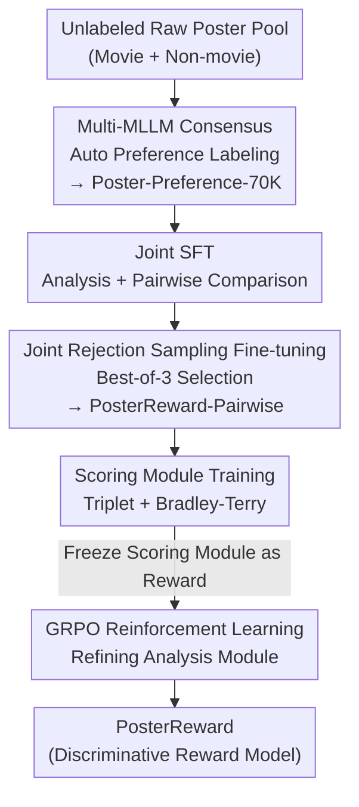

# PosterReward: Unlocking Accurate Evaluation for High-Quality Graphic Design Generation

**Conference**: CVPR 2026  
**Paper**: [CVF Open Access](https://openaccess.thecvf.com/content/CVPR2026/html/Lai_PosterReward_Unlocking_Accurate_Evaluation_for_High-Quality_Graphic_Design_Generation_CVPR_2026_paper.html)  
**Code**: [Project Page](https://alexlai2860.github.io/PosterReward/)  
**Area**: Image Generation / Reward Models  
**Keywords**: Poster Generation, Reward Model, Graphic Design Evaluation, AI Preference Data, Cascaded Training

## TL;DR
PosterReward automatically constructs a 70K poster preference dataset using consensus from multiple MLLMs and employs an "image analysis-driven" four-stage cascaded training. This results in the first reward model specifically designed to evaluate the generation quality of posters and graphic designs, improving accuracy from a baseline of 40%~53% to 86% on both self-built and public preference benchmarks.

## Background & Motivation

**Background**: With the rapid progress of text rendering capabilities in text-to-image models such as Flux, Seedream, and Qwen-Image, end-to-end generation of graphic design content like posters has become increasingly feasible. To perform post-training (e.g., Flow-GRPO, Pref-GRPO, Diffusion-NFT) for continuous quality improvement, a reward model capable of scoring is required to provide supervision signals.

**Limitations of Prior Work**: Existing reward models (HPSv3, UnifiedReward, etc.) are primarily oriented toward "general image aesthetic preferences," focusing on global beauty while **ignoring typography and layout, the two most critical dimensions of posters**. A high-quality poster requires not only aesthetic imagery but also accurate text rendering and rational layout composition. When directly applying general reward models to posters, most baseline accuracies on the author's high-quality benchmark, PosterRewardBench-Advanced, are only 41%~53%, nearly equivalent to random guessing.

**Key Challenge**: The root cause lies in the data—domain-specific poster preference data is extremely scarce. In the largest public preference set, HPDv3, the "design" category accounts for only 9.9%, far below categories like humans, architecture, or art. Without specialized poster preference data, specialized poster evaluators cannot be trained, which further bottlenecks reward-driven post-training.

**Goal**: (1) Generate reliable poster preference data at low cost; (2) Train a reward model capable of **jointly** evaluating and balancing five dimensions: "basic visual quality, AI artifacts, text accuracy, prompt following, and aesthetic value"; (3) Establish benchmarks for both poster evaluation and generation.

**Key Insight**: The authors point out that poster preference cannot be simply represented by a weighted average of the five dimensions—a strong reward model must **jointly analyze these dimensions and reason about their tradeoffs**. Thus, the mechanism is to use "image analysis" as a hub, where a module capable of writing multi-dimensional analytical text feeds the scoring module.

**Core Idea**: Replace human annotation with "multi-MLLM consensus" to automatically label preference data. Use a two-stage discriminative structure consisting of an "analysis module producing text reasoning → scoring module providing scalar scores," and unify discriminative and generative reward models into a cascaded training pipeline for collaborative optimization.

## Method

### Overall Architecture

PosterReward consists of two components: the **Data Pipeline** (automatically generating 70K poster preference pairs) and the **Model Pipeline** (training a reward model via four-stage cascaded training).

The data pipeline utilizes independent filtering and pairing processes for movie and non-movie poster designs, followed by unified multi-model verification to obtain Poster-Preference-70K. The model pipeline simultaneously trains two types of reward models: the discriminative **PosterReward** (inputting image + prompt + analysis text, outputting a scalar score) and the generative **PosterReward-Pairwise** (inputting two images, outputting Yes/No judgments followed by CoT reasoning). These are integrated into a cascaded pipeline centered on "image analysis" through four sequential stages (Joint SFT → Joint Rejection Sampling → Scoring Module Training → RL), allowing the models to benefit from each other.

### Key Designs

**1. Automatic Preference Pipeline via Multi-MLLM Consensus: Replacing Humans with AI Consensus**

The scarcity of poster preference data and the high cost of manual annotation are major bottlenecks. The authors developed an automated pipeline to extract reliable preference pairs from unlabeled raw images. Two types of data are processed: **Movie posters**, which feature many portraits and align well with HPSv3 aesthetics, are first scored by HPSv3. Then, Kendall's W (coefficient of concordance across six ranking rounds) is used to filter the most stable 30K prompt groups (450K potential pairs). A lightweight closed-source ranker performs six rounds of ranking, retaining pairs with consistent order in at least five rounds, resulting in 164K candidates. **Non-movie posters** (generated by Qwen-Image-Lightning) first involve retaining same-size pairs (214K), followed by dual filtering using CLIP (semantic similarity) and DINOv3 (structural similarity), selecting the union of top-15K DINOv3 and top-25K CLIP to obtain 36K high-variance pairs. An additional 36K high-quality Seedream 4.0 posters are added to reach 108K candidates. Finally, **multi-model verification** is performed: Gemini-2.5-Pro, GPT-5, and GLM-4.5v are used for pairwise comparisons. To address strong position bias in MLLMs, each pair is **evaluated twice by swapping the order**. The essence of this "cascaded" design is to use cheap models for coarse filtering and expensive models for fine verification, ensuring reliability while controlling costs.

**2. Two-Stage Discriminative PosterReward: Explicitly Feeding Analysis Text to the Scoring Head**

The authors analyze the flaws of three types of pointwise reward models: direct scalar regression is prone to labeling bias, logit-based methods based on human-defined labels struggle to align with real image distributions, and pure discriminative models lack interpretability and cannot be improved through test-time scaling. Consequently, a **two-stage** discriminative model was designed. The first stage is an **analysis module** fine-tuned from Qwen3-VL-8B, which takes an image and prompt to produce multi-dimensional analysis text across five dimensions. The second stage is a **scoring module** that takes the image, analysis text, and prompt, using a two-layer MLP connected via SiLU (replacing the last layer of Qwen3-VL-8B) to output a scalar score. The key is that the analysis text is **explicitly** passed as the basis for scoring, effectively hardcoding the chain of "reasoning before scoring" into the architecture. This retains the efficiency of discriminative scoring for RL post-training while gaining interpretability and space for test-time scaling. A lightweight version, **PosterReward-Lite**, which removes the analysis module, is also provided for speed-sensitive scenarios.

**3. Generative PosterReward-Pairwise: Judgment Before Reasoning to Protect Judgment Token Logits**

To perform preference filtering for the data pipeline and provide the initial analysis module for the cascaded pipeline, the authors fine-tuned a generative pairwise reward model from Qwen3-VL-8B. Following RewardDance, the model is trained to **output the Yes/No preference judgment first, followed by CoT reasoning**, rather than the reverse. The reason is practical: if the judgment follows reasoning, the CoT text might contaminate the probability distribution of the judgment token. Prioritizing the judgment preserves the purity of the logits used to derive preference scores. During inference, the full CoT can be omitted for acceleration. During training, the positions of the chosen and rejected images are **randomly swapped** to balance Yes/No responses, suppressing inherent position bias. Experiments show negligible position bias, significantly outperforming off-the-shelf MLLMs.

**4. Four-Stage Cascaded Training Pipeline: Collaborative Optimization via Image Analysis**

The four stages are: **(a) Joint Supervised Fine-Tuning**—using Gemini-2.5-Pro to label "Single-image Analysis" and "Pairwise Comparison + CoT" tasks (246K analysis and 160K pairwise samples). Author believes learning to judge quality enhances analytical ability and vice versa; **(b) Joint Rejection Sampling Fine-Tuning**—sampling three responses for each prompt in both tasks, using Gemini-2.5-Flash-Lite to select the best. Incorrect judgments are replaced with Gemini-2.5-Pro ground truth. The resulting model is the final PosterReward-Pairwise and serves as the initial analysis module for the fourth stage; **(c) Scoring Module Training**—re-labeling analysis text using the stage-two model, organizing samples into triplets $x_w=(I_w,P,A_w)$ and $x_l=(I_l,P,A_l)$ (image, shared prompt, analysis text), and optimizing with the Bradley-Terry loss:

$$\mathcal{L}_{BT} = -\mathbb{E}_{(x_w,x_l)\sim D}\big[\log\sigma\big(r_\theta(x_w)-r_\theta(x_l)\big)\big]$$

**(d) Reinforcement Learning**—freezing the scoring module as the reward function and refining the analysis module using GRPO. For sample $i$, the reward $r_i$ is the scoring module's output for preferred samples and its negative for rejected ones, normalized within the batch to an advantage $\hat{A}_i=(r_i-\text{mean}(r))/\text{std}(r)$. The analysis policy $\pi_\theta$ is optimized using the GRPO objective with clipping and KL regularization:

$$\mathcal{L}_{GRPO}(\theta)=\mathbb{E}\Big[\min\big(\rho_i(\theta)\hat{A}_i,\ \text{clip}(\rho_i(\theta),1-\delta,1+\delta)\hat{A}_i\big)-\beta D_{KL}(\pi_\theta\|\pi_{ref})\Big]$$

The synergy of the pipeline lies in the fact that the joint analysis task directly boosts PosterReward-Pairwise performance, while the refined analysis module significantly improves PosterReward score quality. "Image analysis" serves as both the input for the discriminative model and the target for RL optimization, allowing the models to feed into each other.

## Key Experimental Results

### Main Results

Accuracy of pointwise reward models across benchmarks (PRB = PosterRewardBench):

| Model | MMRB2 | HPDv3 | PRB-Basic | PRB-Advanced |
|------|------|------|------|------|
| ImageReward | 53.0 | 58.6 | 60.7 | 49.3 |
| PickScore | 57.6 | 65.6 | 66.7 | 44.1 |
| HPSv2 | 55.0 | 65.3 | 70.8 | 43.7 |
| UnifiedReward* | 56.9 | 59.4 | 60.0 | 52.7 |
| HPSv3 | 58.5 | 76.9 | 72.9 | 41.2 |
| PosterReward-Lite | 60.5 | 77.1 | 83.9 | 85.0 |
| **PosterReward** | 59.6 | **77.8** | **86.7** | **86.0** |

PosterReward achieves 86.0% on the most challenging PRB-Advanced, whereas baselines stagnate between 40%~53%. It also reaches 86.7% on the OOD PRB-Basic and leads on public sets HPDv3 and MMRB2, indicating no overfitting to specific benchmarks.

Accuracy of generative (pairwise) models on PosterRewardBench (Yes/No subsets):

| Model | PRB-Basic Avg | PRB-Advanced Avg |
|------|------|------|
| UnifiedReward-think | 68.3 | 50.6 |
| Qwen3-VL-Plus | 64.5 | 56.4 |
| Gemini-2.5-Pro | 79.3 | 75.2 |
| GPT-5 | **85.4** | 82.9 |
| **PosterReward-Pairwise** | 83.0 | **83.8** |

### Ablation Study

Cumulative contribution of PosterReward components (Accuracy ↑):

| Configuration | HPDv3 | PRB-Basic | PRB-Advanced |
|------|------|------|------|
| PosterReward-Lite (Scoring only) | 77.1 | 83.9 | 85.0 |
| + Analysis (Adding analysis module) | 77.5 | 85.7 | 85.8 |
| + Analysis + GRPO (Full PosterReward) | 77.8 | 86.7 | 86.0 |

PosterReward-Pairwise training stage ablation (Avg Accuracy ↑):

| Configuration | Advanced Avg | Basic Avg | Description |
|------|------|------|------|
| SFT (Single) | 81.93 | 81.72 | Single-task SFT only |
| SFT (Joint) | 82.71 | 81.92 | Joint dual-task SFT |
| + RSFT (Single) | 82.96 | 82.11 | Added single-task rejection sampling |
| + RSFT (Joint) | 83.82 | 82.98 | Added joint rejection sampling (Final) |

### Key Findings
- **Analysis module is the main driver for discriminative model gains**: In poster benchmarks, adding the analysis module improved PRB-Basic from 83.9 to 85.7 (+1.8), and GRPO further refined it to 86.7. Smaller gains were seen on HPDv3 (77.1 to 77.8), suggesting that analytical text is more beneficial for posters requiring "layout/typography" inspection.
- **Joint training > Single-task**: Jointly training "analysis + pairwise comparison" was consistently superior in both SFT and RSFT stages, confirming the "judgment and analysis facilitate each other" hypothesis.
- **Position bias is a major pitfall for MLLM-as-a-judge**: General MLLMs show vast differences in Yes/No accuracy when swapping image order, whereas PosterReward-Pairwise is nearly immune due to balanced training data.
- **On the generation benchmark PosterBench**, the closed-source Nano-Banana-Pro is the strongest overall (Mean 13.36). Among open-source models, Qwen-Image-2512 (11.86) approaches SOTA closed-source models. Older models like Seedream-3.0 and SD3.5-L still struggle with precise text rendering and layout (SD3.5-L Mean -2.90).

## Highlights & Insights
- **"Analysis text as an intermediary" restores interpretability to discriminative reward models**: While discriminative models are fast but black-box, the authors use a module that explicitly outputs five-dimensional analysis text, making scores justifiable and restoring space for test-time scaling. This "explain before scoring" structure is transferable to any evaluation task requiring multi-factor tradeoffs.
- **Low-cost data paradigm via cascading and multi-model consensus**: Coarse filtering with cheap models followed by fine verification with expensive models (and order swapping), combined with consistency checks (Kendall's W) and redundancy removal (CLIP/DINOv3), provides a replicable blueprint for automatically creating specialized preference data.
- **Synergy between judgment and analysis**: Using the generative pairwise model as both a data filter and the initial analysis module for the discriminative model allows one training pipeline to serve two models, which is highly efficient.
- **Judgment before reasoning protects logits**: This tactical sequence directly ensures that preference scores derived from judgment-token logits are reliable— a valuable practical trick.

## Limitations & Future Work
- **Dependence on closed-source MLLM labels**: The data relies on consensus from Gemini/GPT/GLM, and rejection sampling ground truth comes from Gemini. The upper bound of the reward model is capped by the preferences and biases of these teacher models.
- **Lack of Chinese prompt support**: The authors acknowledge that current reward models lack the capability to evaluate Chinese prompts. Post-training experiments only utilized English, avoiding Chinese scenarios in text-heavy poster tasks.
- **Potential self-consistency bias in evaluation**: Using PosterReward as the judge to rank generation models in PosterBench carries a potential risk of "circular validation," where the reward model prefers its own training data distribution. This lack of large-scale human verification of the rankings is a limitation.
- **Improvements**: Making analysis dimensions configurable, introducing human-in-the-loop calibration to correct MLLM teacher bias, and applying the reward model directly to text-to-image post-training with end-to-end gain reporting.

## Related Work & Insights
- **vs. HPSv3 / General Preference Models**: General models target global aesthetics, with design data making up only 9.9%. They are nearly random on posters (PRB-Advanced 41%); PosterReward fills the gap for typography and text dimensions, reaching 86% on the same benchmark.
- **vs. UnifiedReward / RewardDance (Generative Paradigm)**: This work adopts the "judgment before CoT" logic but goes beyond generative pairwise comparisons by distilling the knowledge into a discriminative module, avoiding the computational explosion of pairwise comparisons in RL post-training.
- **vs. Layout-centric / Agent-based Evaluation**: Previous methods either focused solely on layout or used decoupled agents to provide fragmented feedback. PosterReward provides a unified reward signal to capture the interplay between structure, typography, and aesthetics.

## Rating
- Novelty: ⭐⭐⭐⭐ First specialized reward model for posters/graphics. The combination of "analysis-driven scoring" and "cascaded synergy" is solid, though individual components follow existing paradigms.
- Experimental Thoroughness: ⭐⭐⭐⭐ Dual self-built benchmarks plus public HPDv3/MMRB2 validation. Comprehensive ablations; however, post-training gains are qualitative and lack end-to-end quantitative metrics.
- Writing Quality: ⭐⭐⭐⭐ Motivation and cascaded pipeline are clearly explained; some hyperparameter details require the supplementary material.
- Value: ⭐⭐⭐⭐ Directly addresses the reward signal gap in text-to-image post-training. The data pipeline and benchmarks are highly reusable for the community.

<!-- RELATED:START -->

## Related Papers

- [\[CVPR 2026\] PSDesigner: Automated Graphic Design with a Human-Like Creative Workflow](psdesigner_automated_graphic_design_with_a_human-like_creative_workflow.md)
- [\[CVPR 2026\] Frequency-Aware Flow Matching for High-Quality Image Generation](freqflow_frequency_aware_flow_matching.md)
- [\[ICCV 2025\] Rethinking Layered Graphic Design Generation with a Top-Down Approach](../../ICCV2025/image_generation/rethinking_layered_graphic_design_generation_with_a_top-down_approach.md)
- [\[CVPR 2025\] From Elements to Design: A Layered Approach for Automatic Graphic Design Composition](../../CVPR2025/image_generation/from_elements_to_design_a_layered_approach_for_automatic_graphic_design_composit.md)
- [\[CVPR 2026\] EffectErase: Joint Video Object Removal and Insertion for High-Quality Effect Erasing](effecterase_joint_video_object_removal_and_insertion_for_high-quality_effect_era.md)

<!-- RELATED:END -->
