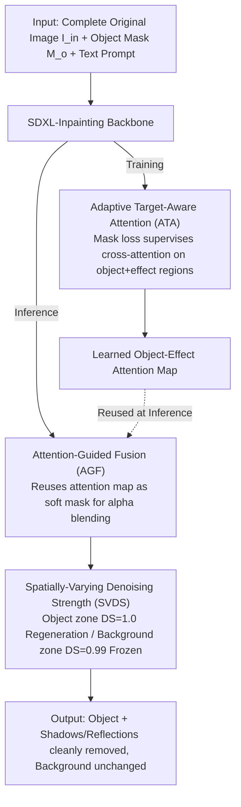

# Precise Object and Effect Removal with Adaptive Target-Aware Attention

**Conference**: CVPR 2026  
**arXiv**: [2505.22636](https://arxiv.org/abs/2505.22636)  
**Code**: [https://zjx0101.github.io/projects/ObjectClear](https://zjx0101.github.io/projects/ObjectClear)  
**Area**: Image Generation  
**Keywords**: Object Removal, Shadow/Reflection Elimination, Diffusion Models, Attention-Guided Fusion, Dataset Construction

## TL;DR
The ObjectClear framework is proposed, which decouples foreground removal from background reconstruction via Adaptive Target-Aware Attention (ATA). Combined with Attention-Guided Fusion (AGF) and Spatially-Varying Denoising Strength (SVDS) strategies, it achieves precise removal of target objects and their incidental effects (shadows, reflections). Additionally, the first large-scale Object-Effect Removal dataset, OBER, is constructed.

## Background & Motivation

**Background**: Image inpainting and object removal based on diffusion models have become the mainstream paradigm, erasing undesired objects by combining target segmentation masks with diffusion generators. Representative methods include SDXL-Inpainting, PowerPaint, BrushNet, and RORem.

**Limitations of Prior Work**: Existing methods face three core issues—(a) **Effect Residuals**: They only remove the object itself, struggling to eliminate visual effects like shadows and reflections; (b) **Hallucinations**: They generate unwanted new objects or textures in the removed areas; (c) **Background Alteration**: Colors and textures in non-target areas are inadvertently modified.

**Key Challenge**: There is a lack of explicit modeling for the correlation between target objects and their incidental visual effects, as well as a lack of effective constraints to guide the generation model's attention toward the removal regions. Existing datasets are either based on simulated data (lacking real-world effect annotations) or are too small and not publicly available.

**Key Insight**: This work decouples foreground removal from background reconstruction—learning target-aware attention maps to adaptively locate objects and their effect regions while maintaining high background fidelity. Furthermore, a large-scale hybrid dataset featuring object+effect mask annotations is constructed.

**Core Idea**: Adaptive Target-Aware Attention (ATA) is used to learn attention maps of object-effect regions. These maps are then utilized during inference for attention-guided fusion, achieving the dual goals of precise removal and background preservation.

## Method

### Overall Architecture
ObjectClear addresses the difficult task of cleanly erasing an object along with its shadows and reflections without disturbing the background. The entire pipeline is built upon SDXL-Inpainting. Its input is $\langle z_t, I_{in}, M_o, c \rangle$: latent noise, the original image, the object mask, and a text prompt. An easily overlooked but critical choice is feeding the **complete original image** $I_{in}$ into the network instead of the traditionally masked image $I_m$ used in inpainting. By retaining the full image, the model can clearly perceive shadows cast by the object, reflections on glass, and even the background visible through transparent objects, which serve as cues for locating the "effect regions."

During the training phase, the model learns to reconstruct the object and its effects while being constrained to focus cross-attention on the object+effect region (ATA). During inference, the attention map learned during training is reused as a fusion mask (AGF), and a denoising strategy that handles object and background regions separately (SVDS) is applied. This ensures both "thorough removal" and "fixed background."

### Key Designs

**1. Adaptive Target-Aware Attention (ATA): Allowing Attention to Grow Object-Effect Masks**

Existing methods often target only the object itself and rely on the model to implicitly guess the location of shadows and reflections, leading to residual effects. ATA explicitly teaches the model to locate these regions: first, text embeddings of the prompt "remove the instance of" are concatenated with visual embeddings of the object (extracted by a CLIP visual encoder from $I_{in} \cdot M_o$ and projected via an MLP) to serve as guidance signals for cross-attention. Then, the cross-attention map $\mathbf{A}$ corresponding to the visual embedding token is directly supervised by the object-effect mask $M_{fg}$ using a contrastive mask loss:

$$\mathcal{L}_{mask} = \text{mean}(\mathbf{A}[1-M_{fg}]) - \text{mean}(\mathbf{A}[M_{fg}])$$

In other words, it suppresses attention in background areas and enhances attention in foreground (object+effect) areas. After training, the attention map itself becomes a soft mask identifying the object and its artifacts, embedding the relationship between the object and its effects into the network rather than relying on chance.

**2. Attention-Guided Fusion (AGF): Reusing Learned Attention Maps as Inference Fusion Masks**

Diffusion denoising and VAE reconstruction naturally cause subtle drifts in the background—slight shifts in color and texture. AGF utilizes the output of ATA during inference to mitigate this: it takes the first-layer cross-attention map (corresponding to the object embedding), upsamples it to the original resolution, and applies Gaussian blurring to create an object-effect mask with soft edges. This mask is used for alpha blending of the generated result and the original input—using the generated result for the foreground and keeping the original image for the background. The elegance lies in the fact that this mask does not require additional user input (distinguishing it from methods like BrushNet), but is naturally learned during training.

**3. Spatially-Varying Denoising Strength (SVDS): Full Regeneration for Objects, Freezing for Background**

A uniform denoising strength poses a dilemma: $DS=1.0$ (complete generation from noise) erases objects cleanly but causes global color shifts; $DS=0.99$ maintains color consistency but fails to remove objects thoroughly. SVDS applies different strengths to different regions—the object mask region uses $DS=1.0$ to regenerate a clean background, while the background region uses $DS=0.99$ and continuously re-injects the original background during the denoising process to ensure color stability. This decouples the contradiction between "clean removal" and "color consistency."

### OBER Dataset Construction
Precise effect removal requires real-world data with object-effect annotations, which are scarce. OBER fills this gap using a hybrid approach of "Photography + Simulation." **Captured Data (2,878 pairs)** involves using a fixed camera to take two images with and without the object. Object masks are created using DINO+SAM, and object-effect masks (including shadows/reflections) are automatically calculated via pixel-wise differences between the input and ground truth (GT). **Simulated Data (10,000 images)** is collected by sourcing background images (screened for flat regions via Mask2Former and depth consistency via Depth Anything V2), then using alpha blending to composite foreground objects and effect layers. Complex scenes with multi-object occlusions are also constructed; effect region alpha is calculated as $\alpha(p) = (I_{gt} - I_{in})/(I_{gt} + \varepsilon)$. The two sources complement each other: captured data provides realistic lighting, while simulated data provides scale and occlusion diversity.

### Loss & Training
The model is trained based on SDXL-Inpainting at $512 \times 512$ resolution with a batch size of 32 on 8× A100 GPUs for 100k steps, using a learning rate of 1e-5. The total loss is the standard diffusion loss plus the aforementioned $\mathcal{L}_{mask}$. During inference, a guidance scale of 1.0 is used with 20 denoising steps.

## Key Experimental Results

### Main Results

| Dataset | Metric | ObjectClear | OmniPaint (Prev. SOTA) | Gain |
|--------|------|-------------|---------------------|------|
| RORD-Val | PSNR↑ | **26.24** | 22.75 | +3.49 |
| RORD-Val | PSNR-BG↑ | **29.78** | 24.66 | +5.12 |
| RORD-Val | LPIPS↓ | **0.1157** | 0.1178 | -0.002 |
| OBER-Test | PSNR↑ | **33.04** | 29.06 | +3.98 |
| OBER-Test | PSNR-BG↑ | **35.62** | 30.04 | +5.58 |
| OBER-Test | LPIPS↓ | **0.0342** | 0.0521 | -0.018 |

Key Insight: ObjectClear outperforms all methods using object-effect masks, even when it only uses object masks. The PSNR-BG metric is significantly higher (+5dB), showing a clear advantage in background preservation.

### Ablation Study

| Configuration | PSNR↑ | PSNR-BG↑ | LPIPS↓ | Description |
|------|-------|----------|--------|------|
| CC Data Only | 27.29 | 27.96 | 0.0910 | Baseline |
| + ATA | 27.56 | 28.37 | 0.0845 | Effect of Attention |
| + Sim. Data | 28.04 | 28.80 | 0.0805 | Contribution of Simulated Data |
| + AGF | 32.77 | 35.50 | 0.0348 | **AGF contributes the most** |
| + SVDS | **33.04** | **35.62** | **0.0342** | Full Model |

### Key Findings
- **AGF is the primary contributor**: Adding AGF causes PSNR to jump from 28.04 to 32.77 (+4.73dB) because it directly uses learned attention maps to protect the background.
- ATA and Sim. Data each contribute approximately 0.5dB, while SVDS adds another 0.3dB.
- Multi-object simulated data is crucial for robustness in complex scenes involving occlusions and object interactions.

## Highlights & Insights
- The **collaborative design of ATA+AGF** is clever: the attention map learned during training not only improves removal precision but also serves as a natural guidance signal for fusion during inference, serving a dual purpose.
- The concept of **SVDS spatially heterogeneous denoising** is generalizable—it can be used in any diffusion editing task requiring regional differentiation by applying different denoising strengths.
- The **dataset construction pipeline** (pixel difference for effect mask extraction + alpha blending for simulation) provides a reusable toolchain.

## Limitations & Future Work
- Training resolution is limited to $512 \times 512$, requiring extra adaptation for high-resolution practical applications.
- The object mask relies on external segmentation models (DINO+SAM); mask quality directly affects results.
- For extremely complex multi-light source scenes (e.g., intersecting shadows of multiple objects), automatic extraction of effect masks may be inaccurate.
- Only static images are handled; video object removal requires additional temporal consistency design.

## Related Work & Insights
- **vs OmniPaint**: While both require only object masks, OmniPaint learns effect removal implicitly, whereas ObjectClear explicitly models effect regions via ATA, leading to a 5dB+ lead in PSNR-BG.
- **vs RORem**: RORem requires manual annotation for quality assurance, whereas ObjectClear automatically obtains high-quality effect masks through photography and pixel differences.
- **vs Attentive Eraser**: Both focus on attention mechanisms, but Attentive Eraser performs test-time optimization, while ObjectClear learns via mask loss during the training phase.

## Rating
- Novelty: ⭐⭐⭐⭐ The collaborative design of ATA/AGF/SVDS is elegant, though the core concept (explicit effect modeling + attention guidance) is relatively intuitive.
- Experimental Thoroughness: ⭐⭐⭐⭐⭐ Includes three test sets (including a self-built Wild set), comprehensive ablation, and fair comparisons (under two mask settings).
- Writing Quality: ⭐⭐⭐⭐ Clear structure and detailed description of the dataset construction process.
- Value: ⭐⭐⭐⭐ The OBER dataset and precise effect removal are highly valuable for practical applications, though a high-resolution version is needed.

<!-- RELATED:START -->

## Related Papers

- [\[CVPR 2026\] Object-WIPER: Training-Free Object and Associated Effect Removal in Videos](object-wiper_training-free_object_and_associated_effect_removal_in_videos.md)
- [\[ICML 2026\] AdaEraser: Training-Free Object Removal via Adaptive Attention Suppression](../../ICML2026/image_generation/adaeraser_training-free_object_removal_via_adaptive_attention_suppression.md)
- [\[CVPR 2026\] EffectErase: Joint Video Object Removal and Insertion for High-Quality Effect Erasing](effecterase_joint_video_object_removal_and_insertion_for_high-quality_effect_era.md)
- [\[CVPR 2026\] Diff-SemiER: Transparency-Aware Adaptive Fusion Diffusion Model with Generative Prior for Semi-Transparent Eyeglasses Removal](diff-semier_transparency-aware_adaptive_fusion_diffusion_model_with_generative_p.md)
- [\[CVPR 2026\] Adaptive Auxiliary Prompt Blending for Target-Faithful Diffusion Generation](adaptive_auxiliary_prompt_blending_for_target-faithful_diffusion_generation.md)

<!-- RELATED:END -->
