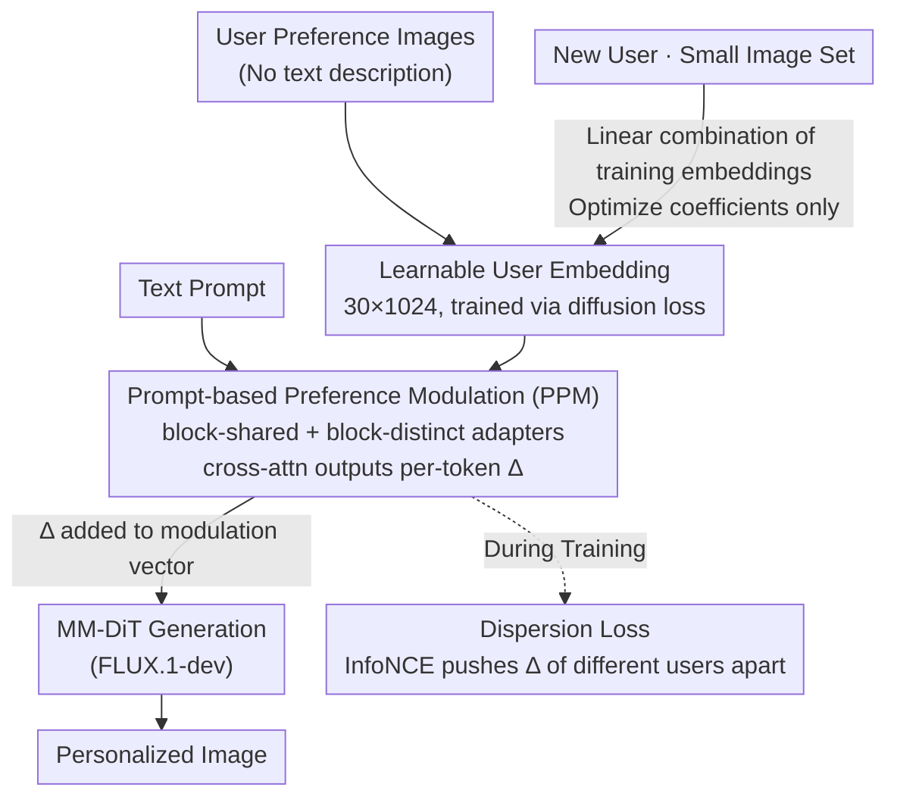

# Premier: Personalized Preference Modulation with Learnable User Embedding in Text-to-Image Generation

**Conference**: CVPR 2026  
**Paper**: [CVF Open Access](https://openaccess.thecvf.com/content/CVPR2026/html/Wang_Premier_Personalized_Preference_Modulation_with_Learnable_User_Embedding_in_Text-to-Image_CVPR_2026_paper.html)  
**Code**: TBD  
**Area**: Diffusion Models / Personalized Image Generation  
**Keywords**: Personalized Text-to-Image, Learnable User Embedding, Preference Modulation, MM-DiT, Dispersion Loss

## TL;DR
Premier represents each user's preference as a **learnable embedding**. A preference adapter fuses this embedding with text prompts to output per-token modulation directions injected into the MM-DiT modulation mechanism. A dispersion loss is employed to separate preference directions among different users. To address the cold-start problem for new users with scarce data, the model uses a "linear combination of existing user embeddings," enabling the generation of personalized images based on preference images without any textual preference descriptions.

## Background & Motivation
**Background**: Text-to-image (T2I) generation quality (e.g., FLUX, Diffusion models) has reached high standards and is widely used by non-professional users. However, many users struggle to accurately describe their desired images via text, and preferences are often "tacit and hard to articulate." Fortunately, user behaviors such as clicks, downloads, and favorites implicitly contain preferences—images selected by users naturally carry their "taste." Personalized T2I aims to extract preferences from these images to guide generation.

**Limitations of Prior Work**: Current mainstream methods rely on Multimodal Large Language Models (MLLM) to extract preferences from images, but two paths face issues: (1) Extracting MLLM hidden states as preference representations and injecting them via a connector—where the connector becomes a performance bottleneck, "downgrading" the rich preference information; (2) Letting the MLLM output natural language preference descriptions—where T2I models show poor instruction-following for complex, nuanced descriptions. Furthermore, weak correlations in user preference history lead MLLMs to ignore fine-grained differences as history grows, reducing preference fidelity.

**Key Challenge**: The "representation space" and "injection method" for preference information are bottlenecks. Discrepancies between MLLM hidden state spaces/semantics and T2I models lead to information loss during cross-space conversion. Concatenating preferences as condition tokens into MM-DiT causes **token dilution**—given the already high number of text and image tokens, effective control requires more dedicated tokens or LoRA fine-tuning, both of which may degrade original model performance.

**Goal**: (1) Identify a user preference representation more faithful than MLLM extraction; (2) Develop a fine-grained injection method that avoids dilution; (3) Solve the cold-start problem for new users with limited preference images.

**Key Insight**: Instead of using MLLM to "translate" preferences, preference representations should be **learned end-to-end via diffusion loss backpropagation**—learnable user embeddings naturally reside in the representation space usable by the T2I model. For injection, **modulation** is preferred over token concatenation. Modulation applies preferences at each text-token level, avoiding dilution and completing the process before image generation by operating on text encoder tokens.

**Core Idea**: Represent preferences with learnable user embeddings + convert them into per-token modulation directions via a preference adapter for MM-DiT (Prompt-based Preference Modulation, PPM) + force the model to distinguish users via dispersion loss + resolve new user cold-start via linear combinations.

## Method

### Overall Architecture
Premier is based on FLUX.1-dev and consists of a two-stage pipeline: "Preference Representation → Preference Modulation → Training Regularization → New User Cold Start." Inputs are user preference images (no text description required) and a text prompt; the output is an image matching user taste while remaining faithful to the text.

In the first stage, two preference adapters and learnable preference embeddings for each training user (1,000 users with sufficient data) are **jointly trained**. Each user embedding is a $30\times1024$ learnable tensor. The preference adapter uses text tokens as queries and user embeddings as keys/values in cross-attention to output a preference modulation direction $\Delta$ for each text token, which is added to the original MM-DiT modulation vector (PPM). To prevent the adapter from learning only "generic preferences," a dispersion loss pushes the modulation directions of different users apart in feature space during training. In the second stage for new users, the adapters and training user embeddings are frozen; the new user is represented as a **linear combination** of training user embeddings, optimizing only the combination coefficients to obtain stable preference embeddings even with scarce data.

### Key Designs

**1. Prompt-based Preference Modulation (PPM): Learnable User Embeddings + Dual Adapters for Per-token Modulation**

This core mechanism addresses "MLLM information loss + token dilution." Instead of MLLM, Premier assigns a learnable embedding $e_u$ to each user, learned directly in the T2I model's space. Injection uses modulation: in MM-DiT, the original modulation vector $y$ is shared across tokens. By adding a direction $\Delta$ to a specific text token's modulation ($y_i' = y + \Delta_i$), reference attributes can be "transferred" to corresponding objects. Premier uses two adapters to calculate $\Delta$ for each text token $e_{p_i}$:

$$y_i^{\,j} = y + \Delta_{\text{shared}}(e_u, e_{p_i}) + \Delta_{\text{distinct}}^{\,j}(e_u, e_{p_i})$$

The block-shared adapter outputs $\Delta_{\text{shared}}$ consistent across all DiT blocks, while the block-distinct adapter expands the output dimension in the final layer to provide **different** directions $\Delta_{\text{distinct}}^{\,j}$ for different DiT blocks (indexed by $j$). Both use cross-attention ($Q$: text tokens; $K, V$: user embeddings) with three attention blocks each. This allows fine-grained, flexible preference control at the "per-token" level without token dilution.

**2. Dispersion Loss: Forcing Adapters to Distinguish by User Rather Than Just Text**

To prevent the adapter from **overfitting to text tokens** and ignoring user features (where different users generate nearly identical images, reflecting only "generic preferences"), the authors introduce a contrastive dispersion loss based on InfoNCE. This encourages $\Delta$ for different users to be far apart in feature space by treating modulation directions from other users in the same batch as negative samples:

$$L_{\text{disp}} = \log \sum_{j} \exp\!\big(-D(\Delta_\theta(e_u, e_p),\, \Delta_\theta(e_{u'}, e_p))\big)$$

where $D$ is the L2 distance, the prompt $p$ is set to null, and $u, u'$ are different users. The total loss is:

$$L = L_{\text{flow}} + \lambda_{\text{shared}} L_{\text{disp}}^{\text{shared}} + \lambda_{\text{distinct}} L_{\text{disp}}^{\text{distinct}}$$

**3. New User Cold Start: Robust Representation via Linear Combination of Embeddings**

Directly training embeddings for new users with very few preference images leads to instability or overfitting. Since training embeddings for the 1,000 initial users (40–80 samples each) are stable, Premier represents new user embeddings as a **linear combination** of these existing embeddings. In the second stage, only the combination coefficients are optimized. This leverages stable, pre-trained embeddings to achieve robust personalized representations even with minimal historical data.

### Loss & Training
Two-stage training using the Prodigy optimizer (LR 1.0). Phase 1: Jointly train adapters and user embeddings (8×A800, batch 16, 4000 epochs, $\lambda_{\text{shared}}=\lambda_{\text{distinct}}=0.1$). Phase 2: Optimize linear coefficients for new users (Single A800, batch 2, 5000 steps) using only $L_{\text{flow}}$.

## Key Experimental Results

### Main Results: Preference Alignment Comparison
With 8 historical images, Premier achieves the best ViPer Score, ViPer Rate, CLIP T2I, and LPIPS.

| Method | ViPer Score↑ | ViPer Rate↑ | CLIP T2I↑ | LPIPS↓ |
|------|--------------|-------------|-----------|--------|
| Bagel | 0.6277 | 0.777 | 0.2988 | 0.6641 |
| Qwen-Image-Edit | 0.5075 | 0.703 | 0.3107 | 0.6438 |
| DrUM | 0.4688 | 0.613 | 0.3101 | 0.6407 |
| ViPer | 0.5159 | 0.676 | 0.2981 | 0.6564 |
| **Premier (Ours)** | **0.6889** | **0.876** | **0.3183** | **0.5986** |

### Ablation Study
| Configuration | ViPer Score↑ | ViPer Rate↑ | CLIP T2I↑ | LPIPS↓ |
|------|--------------|-------------|-----------|--------|
| Full Premier | 0.6889 | 0.876 | 0.3183 | 0.5986 |
| w/o $\Delta_{\text{shared}}$ | 0.4818 | 0.667 | 0.3162 | 0.6247 |
| w/o $\Delta_{\text{distinct}}$ | 0.4917 | 0.669 | 0.3131 | 0.6353 |
| w/o Dispersion Loss | 0.4498 | 0.618 | 0.3162 | 0.6249 |
| w/o PPM | 0.6492 | 0.840 | 0.3074 | 0.6225 |

### Key Findings
- **Dispersion loss is the most critical component**: Removing it drops the ViPer Score by ~0.24, confirming it prevents the adapter from collapsing into generic preferences.
- **Dual adapters are complementary**: Removing either block-shared or block-distinct components significantly degrades performance.
- **Cold-start strategy efficacy**: The "linear combination" strategy significantly outperforms direct embedding training when historical data is scarce (length 2/4/8) and converges as data increases.

## Highlights & Insights
- **Representation Consistency**: Using learnable embeddings in the generator's space avoids cross-modal information loss common in MLLM-based extraction.
- **Modulation vs. Concatenation**: Modulation effectively avoids token dilution and allows preference injection during the text encoding phase, providing a new paradigm for controllable generation.
- **Explicit Modeling of Personalization Failure**: The introduction of dispersion loss specifically targets the issue of preference "collapse" during multi-user training.
- **Robustness in Low-data Regimes**: The linear combination of pre-trained embeddings is a lightweight but effective technique for few-shot personalization.

## Limitations & Future Work
- **Dataset Dependency**: Relies on PrefBench; generalization across other domains/datasets remains unverified.
- **Evaluation Bias**: High reliance on the ViPer proxy model for scoring, which may introduce self-evaluation biases.
- **Training for New Users**: While stable, the approach still requires optimizing coefficients for new users (5000 steps), falling short of true "zero-training" plug-and-play personalization.

## Related Work & Insights
- **vs. ViPer**: ViPer depends on textual descriptions and MLLM instruction following; Premier is end-to-end and vision-only, achieving significantly higher alignment.
- **vs. Reference-based Generation (IP-Adapter, etc.)**: While borrowing the "modulation" concept used in style/attribute transfer, Premier focuses on aggregating user-level preferences across multiple images rather than single-image control.

## Rating
- Novelty: ⭐⭐⭐⭐
- Experimental Thoroughness: ⭐⭐⭐
- Writing Quality: ⭐⭐⭐⭐
- Value: ⭐⭐⭐⭐

<!-- RELATED:START -->

## Related Papers

- [\[CVPR 2026\] Design Your Ad: Personalized Advertising Image and Text Generation with Unified Autoregressive Models](design_your_ad_personalized_advertising_image_and_text_generation_with_unified_a.md)
- [\[CVPR 2026\] Test-Time Alignment of Text-to-Image Diffusion Models via Null-Text Embedding Optimisation](test-time_alignment_of_text-to-image_diffusion_models_via_null-text_embedding_op.md)
- [\[CVPR 2026\] OSPO: Object-Centric Self-Improving Preference Optimization for Text-to-Image Generation](ospo_object-centric_self-improving_preference_optimization_for_text-to-image_gen.md)
- [\[CVPR 2026\] Compositional Text-to-Image Generation Via Region-aware Bimodal Direct Preference Optimization](compositional_text-to-image_generation_via_region-aware_bimodal_direct_preferenc.md)
- [\[ICLR 2026\] Directional Textual Inversion for Personalized Text-to-Image Generation](../../ICLR2026/image_generation/directional_textual_inversion_for_personalized_text-to-image_generation.md)

<!-- RELATED:END -->
