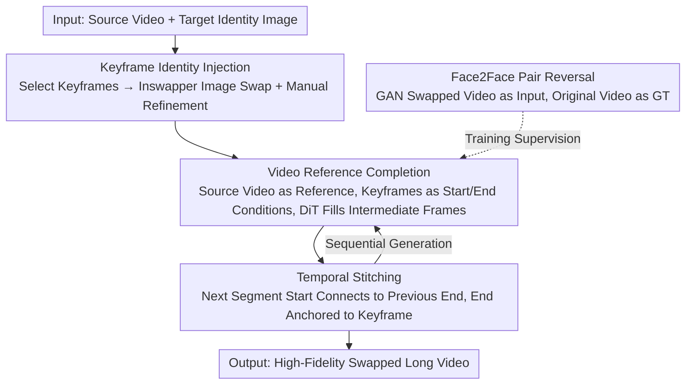

# Preserving Source Video Realism: High-Fidelity Face Swapping for Cinematic Quality

**Conference**: CVPR 2026  
**arXiv**: [2512.07951](https://arxiv.org/abs/2512.07951)  
**Code**: [Project Page](https://aim-uofa.github.io/LivingSwap)  
**Area**: Diffusion Models / Video Editing  
**Keywords**: Face swapping, video-reference guidance, keyframe injection, temporal stitching, cinematic quality

## TL;DR

LivingSwap is proposed as the first video-reference-guided face swapping model. Utilizing a controllable pipeline of keyframe identity injection, source video reference completion, and temporal stitching, it achieves high-fidelity face swapping in long videos. By maintaining source details such as expressions, lighting, and motion while consistently injecting the target identity, it reduces manual editing effort by 40 times.

## Background & Motivation

1. **Background**: There is a strong demand for video face swapping in film and television production. Existing methods are primarily divided into two categories: GAN-based methods, which process frames individually and offer strong identity injection but suffer from poor realism and temporal flickering; and diffusion-based inpainting methods, which regenerate the face area after masking it, providing better temporal consistency but losing fidelity as original pixels (expressions, lighting, fine textures) cannot be perfectly recovered.

2. **Limitations of Prior Work**: Diffusion inpainting methods rely on external encoders to extract intermediate representations (e.g., landmarks, 3D face), which inevitably lose rich information from the source video. While GAN methods can retain more details by using the full source frame as input, they exhibit severe temporal inconsistency over long sequences. Recent breakthroughs in reference-guided generation for image editing have allowed for both editing flexibility and high-fidelity reconstruction.

3. **Key Challenge**: How to stably and consistently inject a target identity into long videos while preserving rich source visual attributes such as lighting, expressions, and subtle dynamics?

4. **Goal**: (1) Stable and consistent identity injection in long videos; (2) High-fidelity preservation of non-identity attributes (lighting, expression, background); (3) Temporal consistency across segments; (4) Addressing the scarcity of training data.

5. **Key Insight**: Inspired by reference-guided image editing, the model avoids masking the original face for inpainting and instead uses the source video directly as a visual reference to guide the diffusion model. The long-video face swapping task is decomposed into a controllable pipeline: keyframe editing → video reference completion → temporal stitching. A "pair reversal" strategy is employed to solve training data scarcity.

6. **Core Idea**: Use the source video itself as a reference to guide the diffusion model for face swapping. Keyframes provide identity conditions, video references preserve non-identity details, temporal stitching handles long sequences, and pair reversal addresses data issues.

## Method

### Overall Architecture

LivingSwap decomposes long-video face swapping into a four-step controllable pipeline: (1) Select representative keyframes and perform single-frame swapping using image-level methods (e.g., Inswapper); (2) Use the video diffusion model to complete intermediate frames, using the source video segment as a reference and the keyframe swap results as identity conditions; (3) Apply a temporal stitching strategy to seamlessly process long videos by connecting adjacent segments; (4) Construct a training set, Face2Face, using pair reversal to provide reliable supervision. The system is built on a 14B parameter DiT video generation model (VACE architecture) using a Rectified Flow training objective.

### Key Designs

**1. Keyframe Identity Injection: Pinning identity with image methods, then expanding with video models**

Identity injection in video-level swapping models is often less precise per-frame than in image-level methods, yet per-frame image swapping leads to flickering. LivingSwap compromises by "pinning" the identity on a few keyframes. Moments with significant changes in pose, expression, or lighting are selected as keyframes $F_{\text{key}}$, and high-quality image swapping (Inswapper) is applied to them, with optional manual Photoshop refinement. Each pair of adjacent keyframes $\{f_{k_i}^{\text{swap-in}}, f_{k_{i+1}}^{\text{swap-in}}\}$ acts as a temporal boundary condition for a video segment, locking in the identity for intermediate frames. This allows image methods to handle "identity accuracy" while the video diffusion model ensures "inter-frame stability," significantly reducing labor compared to per-frame industrial pipelines.

**2. Video Reference Completion: No masking or pixel loss, direct source video reference**

Inpainting methods discard original pixels along with lighting and texture by masking the face area, which inherently harms fidelity. LivingSwap instead inputs the complete source video segment $V_s^{[k_i:k_{i+1}]}$ directly as a visual reference. The target identity image, keyframe swap results, source video segment, and the next keyframe are encoded via VAE and concatenated chronologically as condition tokens $Z_c$, then concatenated with a binary mask in the channel dimension for spatial localization. To ensure the reference influences generation, an attribute encoder (DiT blocks) aligned layer-wise with the backbone is used. Its output at each layer is injected into the corresponding backbone layer via element-wise addition:

$$X^{(l+1)} = \mathcal{D}_\theta^{(l)}(X^{(l)} + \mathcal{A}_\psi^{(h)}(Z_c^{(h)}, M))$$

Layer-wise addition rather than replacement means source video pixel details are "added" into the pretrained prior rather than overwriting it, allowing the model to preserve generative capabilities while adaptively recovering source lighting and micro-expressions.

**3. Temporal Stitching: Using the previous end-frame as the next starting line**

A video segment is fixed at 81 frames, and long videos are generated sequentially by segments split by keyframes. However, independent generation causes jumps at boundaries. LivingSwap allows adjacent segments to share a frame: the first segment uses keyframe swap results as both start and end guides; from the second segment onward, the starting guide is replaced by the actual output frame of the previous segment $f_{k_i}^{\text{swap-out}}$, while the end guide remains the keyframe. The generation of a segment is expressed as:

$$\{f_t^{\text{swap-out}}\}_{t=k_i}^{k_{i+1}} = \mathcal{D}_{\theta,\psi}(f_{k_i}^{\text{swap-out}}, f_{k_{i+1}}^{\text{swap-in}}, V_s^{[k_i:k_{i+1}]}, I_{\text{tar}}, M)$$

By relaying the previous segment's output, consistent identity is propagated. Since the endpoint is always anchored to a clean keyframe, error accumulation across segments is suppressed. Engineering tricks like frame interpolation and temporal reversal are used to adapt to different video rhythms.

**4. Face2Face Dataset & Pair Reversal: Keeping artifacts in the input, keeping GT clean**

There is almost no training data available for video-reference-guided face swapping. The most direct approach would be creating ground truth (GT) using Inswapper per-frame, but this would bake GAN artifacts and flickering into the supervision signal. The authors use a "pair reversal" strategy: based on CelebV-Text (70K videos) and VFHQ (16K videos), they still generate per-frame swaps using Inswapper, but treat this artifact-prone GAN video as the model input $V_s$. The original, unedited real video then serves as the GT and keyframe source. Thus, the reference and GT frames share the same identity, and the supervision signal remains clean. With the strong prior of the pretrained model, the network effectively learns to "correct the degraded input back into a clean video," leading to generation quality that surpasses the Inswapper tool used to create the data.

### Loss & Training

Based on the Rectified Flow framework, the loss is the MSE between the predicted and ground truth velocity fields: $\mathcal{L} = \mathbb{E}_{x_0,x_1,c,t}\|u(x_t,c,t;\theta) - v_t\|^2$, where $v_t = x_1 - x_0$. The model is optimized using AdamW with a learning rate of 1e-5, batch size of 16, 640 resolution for 81 frames, and trained on 8×H200 GPUs for approximately 14 days.

## Key Experimental Results

### Main Results

Comparison on CineFaceBench (400 film scene pairs, including easy/hard identity pairs):

| Method | ID Sim↑(easy/hard) | Expr↓(easy/hard) | Light↓(easy/hard) | Pose↓(easy/hard) | FVD↓(easy/hard) | Avg Rank↓ |
|------|-----|-----|------|------|------|------|
| Inswapper | 0.567/0.422 | 2.081/2.607 | 0.189/0.243 | 3.421/3.916 | 66.62/73.48 | 2.500 |
| BlendFace | 0.482/0.315 | 1.919/2.285 | 0.245/0.271 | 4.450/4.520 | 100.28/106.58 | 3.583 |
| **LivingSwap** | **0.532/0.367** | **1.943/2.471** | **0.192/0.238** | **3.108/3.399** | **54.32/63.97** | **1.667** |

On FF++, the model achieved an Avg Rank of 3.17 (second only to Inswapper), but performed best in Pose and FVD.

### Ablation Study

| Configuration | ID Sim↑ | Expr↓ | Light↓ | Pose↓ |
|------|---------|-------|--------|-------|
| LivingSwap (full) | 0.536 | 2.84 | 0.285 | 2.84 |
| w/o Target Image | 0.515 | 2.74 | 0.279 | 2.80 |
| w/o Keyframe | 0.281 | 2.47 | 0.249 | 2.84 |
| Inpainting Replacement | 0.519 | 2.89 | 0.292 | 2.87 |
| VACE Baseline | 0.313 | 3.08 | 0.355 | 6.42 |

### Key Findings

- **Keyframes are central to identity injection**: Without keyframes, ID Similarity drops from 0.536 to 0.281, indicating that the target image alone cannot stably propagate identity in video.
- **Video reference outperforms inpainting**: Replacing reference guidance with inpainting leads to a decline in fidelity metrics (Light, Expr, Pose), validating the importance of preserving original pixel information.
- **Model is highly robust to data noise**: Training with the bottom 30% quality data yielded results nearly identical to the full dataset, suggesting data diversity is more important than individual data quality.
- **Pair reversal makes the model surpass data quality**: LivingSwap's generation results are superior to the Inswapper outputs used in its training data regarding realism and temporal consistency. The combination of pretrained priors and the reversal strategy allows the model to learn to correct GAN artifacts.
- Compared to Inswapper (used for keyframe generation), LivingSwap is significantly better in Pose and FVD, indicating that video diffusion temporal modeling effectively compensates for the temporal failures of image methods.

## Highlights & Insights

- **Pair Reversal**: This is the most ingenious design. By setting GAN outputs as input and original videos as GT, it avoids the "GAN artifact contamination" loop. This idea can be generalized to any reference-guided generation task requiring synthetic training data.
- **Keyframe → Reference Completion → Stitching Strategy**: Decomposing complex long-video face swapping into controllable sub-problems. Each part has mature solutions (image swapping, video completion, stitching), and the combination significantly outperforms end-to-end methods.
- **40x Labor Reduction**: Requiring manual editing of only 2 keyframes per 81-frame segment is highly attractive for industrial film production.

## Limitations & Future Work

- Keyframe selection currently uses a fixed interval (every 79 frames) rather than an adaptive content-based strategy, which might be insufficient for high-motion scenes.
- Dependence on Inswapper for keyframes means its quality upper bound limits the final identity fidelity.
- The easy/hard split in CineFaceBench is based on identity similarity scores, which may not cover all real-world challenges (e.g., extreme occlusion, blur, micro-expressions).
- The face detection → crop → swap → paste-back pipeline may introduce seam artifacts at the cropping boundaries.
- Generalization of video-reference guidance to full-body swapping or non-face region editing has not yet been explored.

## Related Work & Insights

- **vs Inswapper**: Inswapper is an upstream tool for this work (used for keyframe and data generation), but its frame-by-frame nature causes severe flickering. LivingSwap overcomes this via temporal modeling in video diffusion.
- **vs DiffSwap**: DiffSwap uses diffusion for swapping but has low ID Similarity (0.261), suggesting simple diffusion inpainting is insufficient for identity preservation. LivingSwap's keyframe and reference design significantly improves this.
- **vs VACE**: VACE is the backbone model, but using it directly for face swapping only achieves an ID Sim of 0.313. LivingSwap's keyframe injection and reference-guidance improve this to 0.536.

## Rating

- Novelty: ⭐⭐⭐⭐ First video-reference-guided face swapping model; clever pair reversal strategy, though components (keyframes, guidance, stitching) draw on existing ideas.
- Experimental Thoroughness: ⭐⭐⭐⭐⭐ Dual benchmarks (FF++ and CineFaceBench) with extensive ablations on data quality, components, and keyframe quality.
- Writing Quality: ⭐⭐⭐⭐ Clear visualization of the pipeline, though some details (e.g., attribute encoder architecture) could be more detailed.
- Value: ⭐⭐⭐⭐⭐ High industrial value due to 40x manual labor reduction; pair reversal strategy is widely reusable.

<!-- RELATED:START -->

## Related Papers

- [\[CVPR 2026\] High-Fidelity Diffusion Face Swapping with ID-Constrained Facial Conditioning](high-fidelity_diffusion_face_swapping_with_id-constrained_facial_conditioning.md)
- [\[CVPR 2026\] Attribute-Preserving Pseudo-Labeling for Diffusion-Based Face Swapping](attribute-preserving_pseudo-labeling_for_diffusion-based_face_swapping.md)
- [\[CVPR 2026\] Cinematic Audio Source Separation Using Visual Cues](cinematic_audio_source_separation_using_visual_cues.md)
- [\[CVPR 2026\] MMFace-DiT: A Dual-Stream Diffusion Transformer for High-Fidelity Multimodal Face Generation](mmface-dit_a_dual-stream_diffusion_transformer_for_high-fidelity_multimodal_face.md)
- [\[CVPR 2026\] HiFi-Inpaint: Towards High-Fidelity Reference-Based Inpainting for Generating Detail-Preserving Human-Product Images](hifi-inpaint_towards_high-fidelity_reference-based_inpainting_for_generating_det.md)

<!-- RELATED:END -->
