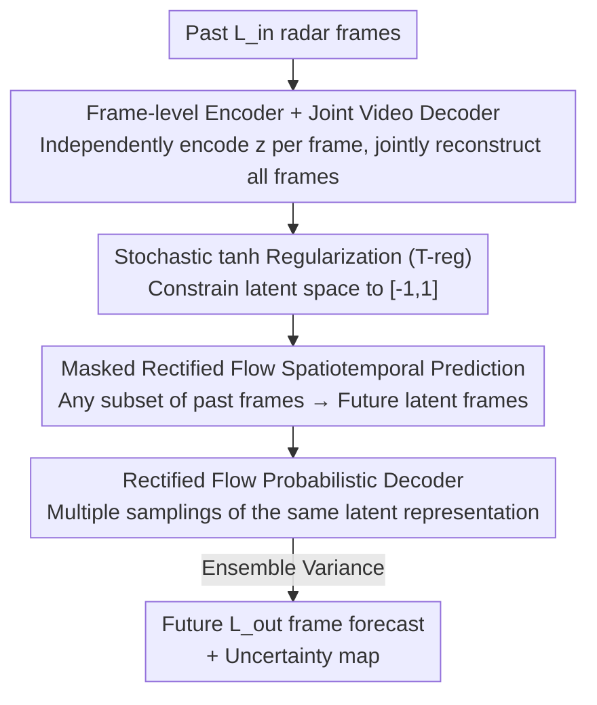

# Probabilistic Precipitation Nowcasting with Rectified Flow Transformers

**Conference**: CVPR 2026  
**arXiv**: [2605.31204](https://arxiv.org/abs/2605.31204)  
**Code**: https://github.com/CompVis/weather-rf (Available)  
**Area**: Time-series Forecasting / Diffusion Models / Weather Nowcasting  
**Keywords**: Precipitation Nowcasting, Rectified Flow, Probabilistic Compression, Uncertainty Quantification, Spatiotemporal Transformer

## TL;DR
This work proposes FREUD—a framework utilizing a Rectified Flow Transformer as a "compressed first stage." It employs a frame-level encoder to independently encode each frame and a joint video decoder to reconstruct all frames simultaneously, replacing deterministic decoding with probabilistic decoding to quantify uncertainty during the compression stage. Combined with a latent-space rectified flow nowcasting model, it achieves SOTA CRPS (0.0190) and SSIM on the SEVIR precipitation nowcasting benchmark.

## Background & Motivation
**Background**: Precipitation nowcasting (short-term high-resolution forecasting from 30 minutes to several hours) is safety-critical for extreme weather. Numerical Weather Prediction (NWP) based on physical simulations is too slow, making data-driven deep learning methods more efficient. Among these, diffusion/flow models have become the current SOTA (e.g., CasCast, PreDiff) due to their strong probabilistic foundations, ability to output "sharp and diverse" forecasts, and natural characterization of uncertainty through sample variance.

**Limitations of Prior Work**: To handle the ultra-high dimensionality of meteorological data, these diffusion models generally adopt a "two-stage" design—first using a **deterministic autoencoder** to compress data into a latent space, and then performing generation within that space. however, this compression is "ill-posed" for weather forecasting: ① Compression is inherently lossy; subtle errors invisible in images may correspond to massive offsets in precipitation, directly damaging reliability in safety-critical scenarios. ② Training such autoencoders requires balancing weights between KL regularization, perceptual loss, and adversarial loss; the adversarial component can reintroduce training instability, mode collapse, and suppress "subtle but critical" details of extreme events. ③ The decoder is deterministic during inference, **entirely failing to quantify uncertainty during the decoding process**.

**Key Challenge**: The "deterministic compression" of the first stage discards decoding uncertainty, which is precisely what nowcasting needs most—under extreme weather, the same latent representation may correspond to multiple plausible pixel-level realizations. This "decoding variance" is itself a valuable early-warning signal. Furthermore, existing methods' conditional windows are either fixed (failing with missing frames) or autoregressive (accumulating errors), lacking robustness to missing or corrupted frames.

**Goal**: To design a simple, scalable first stage capable of quantifying uncertainty during compression, while enabling a latent-space forecasting model that supports variable-length, missing-frame-robust conditional inputs.

**Key Insight**: Replace the "deterministic decoder" of the first stage with a **Rectified Flow decoder**. Since decoding is essentially sampling pixels from a latent representation, making it a probabilistic generative process allows for multiple samplings of the same latent representation to estimate aleatoric uncertainty via ensemble variance. Additionally, the entire first stage is trained with a simple flow matching loss, eliminating the need for perceptual or adversarial losses.

**Core Idea**: Replace "deterministic two-stage compression" with a "frame-level encoding + joint decoding probabilistic rectified flow first stage (FREUD)," shifting uncertainty quantification forward to the compression stage, and layering masked rectified flow latent-space forecasting to produce accurate and calibratable precipitation nowcasting.

## Method

### Overall Architecture
Task Setting: Given $L_{in}$ past frames of precipitation maps (VIL radar), predict $L_{out}$ future frames (13 frames $\to$ 12 frames in experiments, i.e., 65 min $\to$ 60 min). Since precipitation is chaotic and cannot be modeled deterministically, the authors treat it as probabilistic spatiotemporal prediction, sampling the future from the conditional distribution $p(\mathbf{x}^{out}\mid\mathbf{c})$.

The entire pipeline is a classic "two-stage generation," but both stages are built on Rectified Flow:

1. **First Stage: FREUD (Compression + Probabilistic Decoding)**: A frame-level Transformer encoder independently encodes each frame into a latent representation $z$; a hierarchical rectified flow video decoder jointly decodes all latent frames back to pixels. Crucially, the decoder is **probabilistic**; multiple samplings of the same latent representation yield a set of reconstructions whose variance represents aleatoric uncertainty.
2. **Second Stage: Latent Space Model (LSM)**: A Rectified Flow Transformer is trained in the FREUD latent space, using masked diffusion forcing to learn "inferring the future from any subset of past frames." During inference, past observations are encoded into conditional latent frames, and future positions are filled with Gaussian noise latent frames for the latent flow model to denoise, which are then mapped back to pixels by the FREUD decoder to obtain the forecast.

Both stages support ensembling: latent-space resampling provides a "forecasting ensemble," while using different noise initializations during the decoding stage provides a "decoding ensemble," both of which jointly characterize predictive uncertainty.

### Key Designs

**1. Frame-level Encoder + Joint Video Decoder: Asymmetric structure for robustness and temporal consistency**

Pure frame-wise compression encodes each frame independently, inherently robust to missing/corrupted frames, supporting incremental updates as new frames arrive, and preventing information leakage from future frames to past frames (maintaining the causal structure required for forecasting). However, its drawback is inter-frame flickering and temporal inconsistency. While sequence-level encoders offer good temporal quality, they leak future information and are unsuitable for forecasting. The authors' solution is **frame-level encoding and joint decoding**: the encoder is a lightweight Transformer processing frames independently; the decoder is a Transformer-based video decoder that **jointly reconstructs all frames at once** to ensure temporal consistency. The decoder leverages the hierarchical structure of an Hourglass Diffusion Transformer, using pixel-unshuffle/pixel-shuffle to progressively decrease/increase spatial resolution to manage the attention overhead of large video tensors. It incorporates the encoder's latent representations via **channel concatenation** at the bottleneck. Efficiency is further enhanced using spatiotemporal decoupled attention (alternating spatial and temporal attention per block) + neighborhood attention in high-resolution layers. This asymmetric design combines the engineering robustness of frame-level processing with the temporal coherence of joint decoding.

**2. Probabilistic Rectified Flow Decoder: Replacing deterministic decoding with a samplable generative process to quantify decoding uncertainty**

This is the central shift of the paper. Traditional first-stage decoders are deterministic, meaning one latent representation only yields one fixed pixel result during inference, failing to express "how uncertain the decoding itself is." FREUD trains the decoder as a rectified flow model: Rectified Flow transports prior noise $\mathbf{x}_0\sim\mathcal{N}(0,I)$ to data $\mathbf{x}_1$ via linear interpolation $\mathbf{x}_i=\alpha_i\mathbf{x}_1+\sigma_i\mathbf{x}_0$ (with $\alpha_i=i, \sigma_i=1-i$), where the network learns to predict the velocity field $\mathbf{v}_\theta(\mathbf{x}_i,i)$. During inference, the same latent representation paired with different noise initializations can resolve multiple plausible pixel-level realizations. Treating the atmosphere as $\mathbf{x}^{out}=\mathcal{F}(\mathbf{c})+\eta$ (deterministic dynamics + irreducible noise), the authors prove that the sample variance of $N$ independent ensemble members $\mathrm{Var}(\tilde{\mathbf{x}}^{out})$ converges to the aleatoric uncertainty $\mathrm{Var}(\eta)$ as $N\to\infty$. Experiments confirm that this decoding variance is strongly linearly correlated with precipitation intensity ($r=0.97$ for the T-reg variant): variance is small in light rain areas and large in heavy rain/chaotic areas, reliably covering the ground truth—providing meaningful local uncertainty precisely in high-impact areas where warnings are most needed.

**3. Stochastic Tanh Regularization (T-reg): Constraining latent space to be bounded and smooth without extra loss or architecture changes**

Latent space generation requires the latent space to be smooth and well-structured. Existing approaches rely on a small KL regularization to pull the latent distribution toward a standard normal, but KL reg requires weight tuning (strong KL improves regularization but hurts reconstruction fidelity) and architectural changes (the encoder must predict means and standard deviations for each dimension). The authors propose T-reg as a simpler alternative: the encoder output is passed through a tanh function to constrain latent values to $[-1,1]$, followed by small Gaussian perturbations:

$$\tilde{\mathbf{z}}^t = \tanh(\mathrm{Enc}_\theta(\mathbf{x}^t)) + \sigma\epsilon,\quad \epsilon\sim\mathcal{N}(0,\sigma I)$$

This stochastic perturbation forces "neighboring latent representations to decode into similar pixel videos," thereby encouraging smoothness and robustness to small latent perturbations. Unlike KL regularization, T-reg is **purely an architectural constraint rather than an additional loss term**, requiring no weight tuning. Ablations show that T-reg latent spaces are more compact and dense, leading to better CRPS/SSIM in downstream forecasting.

**4. Masked Rectified Flow Spatiotemporal Prediction: Supporting arbitrary conditional lengths and robustness to missing frames**

Since the FREUD encoder tolerates missing frames, the latent space forecasting model must also support variable-length conditions. The authors adopt the masked diffusion forcing paradigm from RaMViD: a video of length $T=L_{in}+L_{out}$ is randomly partitioned into a set of conditional frames $C$ and generative frames $G$. Noise is only added to frames in $G$, and the loss is calculated only on noisy frames. For each sample, the number of conditional frames $|C|=k$ is uniformly sampled from $\{1,\dots,K\}$ (where $K<T$ is the maximum conditional frames), teaching the model to "predict using any subset of past information." Consequently, the model maintains strong forecasting skill during inference even with only two past observations. Simultaneously, completely unconditional samples ($C=\varnothing$) are trained with probability $p_U$ to support classifier-free guidance (CFG). ⚠️ Note: The authors found that CFG systematically inflates predicted precipitation; improvements in localization metrics might stem from this "global shift" rather than better modeling, suggesting CFG has flaws for nowcasting.

### Loss & Training
- **First Stage**: The encoder and decoder are **jointly** trained with a rectified flow loss, without perceptual or adversarial losses. With T-reg and a linear schedule, the loss simplifies to $\mathcal{L}=\lVert\mathbf{v}_\theta(\mathbf{x}_i,i)-(\mathbf{x}_1-\mathbf{x}_0)\rVert^2$ (where $\mathbf{x}_1$ is data and $\mathbf{x}_0\sim\mathcal{N}(0,I)$). A simple outlier penalty was added during early training (refer to the original appendix for details, ⚠️ subject to the original text).
- **Second Stage**: Trained in the FREUD latent space with a masked rectified flow loss (only on noisy frames), with randomized conditional frame counts and probabilistic unconditional training to support variable conditions and CFG.
- **Configuration**: $L_{in}=13$, $L_{out}=12$; 10 forecasting ensemble members by default; latent models available in S/B/L sizes (44M / 141M / 473M).

## Key Experimental Results

### Main Results
SEVIR Benchmark: 20,393 (extreme) weather events collected from 2017–2019, each covering 384×384 km for 4 hours. VIL (Vertically Integrated Liquid from NEXRAD radar) has a resolution of 1 km spatially and 5 min temporally.

**Precipitation Nowcasting Comparison (SEVIR, baselines from CasCast)**:

| Method | CRPS↓ | SSIM↑ | HSS↑ | CSI↑ |
|------|-------|-------|------|------|
| EarthFormer (NeurIPS'22) | 0.0251 | 0.7756 | 0.5411 | 0.4310 |
| PreDiff (NeurIPS'23) | 0.0202 | 0.7648 | 0.4914 | 0.3875 |
| CasCast (ICML'24) | 0.0202 | 0.7797 | **0.5602**| **0.4401** |
| **Ours + LSM-L** | **0.0190** | 0.7841 | 0.5011 | 0.3864 |
| **Ours + CFG** | 0.0192 | **0.7937** | 0.5537 | 0.4277 |

- This work improves CRPS by +5.94% and SSIM by +1.80% compared to CasCast (noting that improvements on SEVIR are usually marginal: CasCast's CRPS improvement over PreDiff was nearly 0%).
- Without deterministic priors, HSS/CSI are slightly lower than CasCast; with CFG, localization metrics become competitive (HSS/CSI close to CasCast), though the authors question this improvement (CFG inflates global precipitation).

**First Stage Reconstruction Quality (Tab.1, partial)**:

| Model | Ens. | RMSE↓ | SSIM↑ | PSNR↑ | dMAE↓ |
|------|------|-------|-------|-------|-------|
| CasCast AE | – | 0.022 | 0.976 | 39.153 | 0.012 |
| FREUD (unreg.) | 10 | 0.023 | 0.987 | 38.915 | 0.012 |
| FREUD (KL-reg.) | 10 | 0.022 | 0.987 | 39.029 | 0.011 |
| **FREUD (T-reg.)** | 1 | 0.019 | 0.998 | 40.224 | 0.011 |
| **FREUD (T-reg.)** | 10 | **0.018** | **0.999** | **41.085** | **0.010** |

Where **dMAE** = MAE of discrete time derivatives (characterizing temporal smoothness/consistency, lower is better); **Var** = variance among ensemble members (characterizing global predictive uncertainty).

- Efficiency: FREUD has fewer parameters and FLOPs than the CasCast autoencoder, with 96% faster encoding and 68% faster decoding (5 NFE)—accelerating latent model training and supporting rapid forecast updates at runtime.
- Calibration: Reliability Index RI = 0.135±0.01, significantly better than CasCast's 0.312±0.01; the rank histogram is flatter (CasCast's is U-shaped, indicating overconfidence).

### Ablation Study

| Config | Key Metric | Description |
|------|---------|------|
| Joint vs Frame-wise DiffAE | dMAE -33% | Joint decoding significantly improves temporal consistency and eliminates flickering. |
| T-reg latent (B-LSM) | CRPS 0.0196 / SSIM 0.7828 | Best downstream CRPS and SSIM. |
| KL-reg latent | CRPS 0.0201 / SSIM 0.7790 | Second best. |
| unreg latent | CRPS 0.0222 / SSIM 0.7630 | Worst. |
| Det. Prior i=0.2 | CRPS 0.0198 / HSS 0.5714 / CSI 0.4444 | Zero-shot injection of Earthformer prior improves localization but hurts coverage. |

Model Scaling (Tab.3): LSM-S 44M (CRPS 0.0200) $\to$ LSM-B 141M (0.0196) $\to$ LSM-L 473M (0.0190). All three sizes outperform the CRPS of CasCast (309M, 0.0202), and the smallest model remains competitive with very few parameters.

### Key Findings
- **Joint decoding is the primary driver of temporal consistency**: Compared to frame-wise DiffAE, FREUD reduces dMAE by 33%, quantitatively proving that "jointly reconstructing all frames at once" eliminates flickering.
- **T-reg wins in both reconstruction and downstream tasks**: It provides the best reconstruction (SSIM 0.999) and the most meaningful uncertainty (intensity-variance correlation $r=0.97$), while yielding optimal downstream CRPS/SSIM. However, it slightly lags for localization metrics (HSS/CSI) compared to unreg/KL-reg, showing a trade-off between "good distribution coverage" and "precise point localization."
- **Deterministic priors are a double-edged sword**: Zero-shot injection of Earthformer predictions can improve localization (if the prior is correct) but collapses the distribution and hurts coverage (worse CRPS). The noise level $i$ controls trust in the prior.
- **CFG may be harmful to nowcasting**: CFG systematically increases predicted precipitation; "improvements" in localization metrics may just reflect a global shift rather than better modeling.

## Highlights & Insights
- **Shifting uncertainty quantification to the compression stage**: Previous two-stage methods only used ensembling in the generation stage, discarding decoding uncertainty. By using a probabilistic rectified flow decoder, the variance of multiple decodings from the same latent becomes a natural estimate of aleatoric uncertainty, which correlates strongly with intensity—automatically providing higher uncertainty in dangerous heavy rain areas.
- **T-reg is a clean trick**: Replacing KL regularization with `tanh + Gaussian perturbation` transforms "regularization" from a loss term requiring weight tuning into a zero-hyperparameter architectural constraint. It achieves boundedness, smoothness, and generatability simultaneously and is transferable to any autoencoder requiring a regularized latent space.
- **Asymmetric "Independent Encoding, Joint Decoding" Design**: Decoupling the engineering robustness of frame-level encoding (missing frame tolerance, incremental updates) from the temporal consistency of joint decoding creates a clear, reusable video compression paradigm.
- **Removing perceptual/adversarial losses is beneficial**: Training the first stage solely with flow matching loss results in more stable training, lower compute requirements, and sharper reconstructions, suggesting that adversarial/perceptual losses may be detrimental in domains like meteorology where "detail is signal."

## Limitations & Future Work
- The authors discuss "Remaining Limitations and Potential Social Impact" in the appendix (⚠️ subject to the original text).
- **The Coverage-Localization trade-off remains**: T-reg/pure generative modes lead in CRPS and SSIM but lag behind CasCast in HSS/CSI (point localization), requiring deterministic priors or CFG to compensate, both of which have side effects.
- **CFG is judged flawed by the authors**: Default results show weak localization without CFG, but CFG introduces systematic bias. The "correct guidance mechanism" for nowcasting remains an open question.
- **Evaluation concentrated on SEVIR**: While the appendix includes MeteoNet experiments (⚠️ subject to the original text), main conclusions are based on a single region/radar product (VIL). Cross-regional/cross-sensor generalization needs further validation.
- Future Ideas: Explicitly incorporate decoding uncertainty into forecasting training objectives, or design guidance mechanisms that do not bias precipitation amounts to balance coverage and localization.

## Related Work & Insights
- **vs CasCast / PreDiff (Two-stage diffusion nowcasting)**: These use **deterministic** autoencoders and train with KL+perceptual+adversarial losses, making it impossible to quantify decoding uncertainty. This work uses a probabilistic rectified flow first stage and only flow matching loss, simplifying training while providing better CRPS and calibration.
- **vs NowcastNet / GAN-based methods**: GANs suffer from training instability and mode collapse, making it hard to cover long-tail extreme events. The rectified flow first stage is stable and naturally probabilistic.
- **vs Concurrent DiffAE video compressors**: This work unlocks scalability with a hierarchical Transformer architecture, introduces the T-reg regularization, and specializes for forecasting (removing perceptual loss, independent frame encoding, evaluating reconstruction uncertainty).
- **vs RaMViD (Masked diffusion forcing)**: Borrowing the masked training paradigm for variable-length conditions but applying it to latent-space rectified flow forecasting for "missing-frame-robust nowcasting."

## Rating
- Novelty: ⭐⭐⭐⭐⭐ Leveraging a probabilistic rectified flow decoder as the first stage to shift uncertainty quantification forward is a clean idea that addresses safe-critical nowcasting pain points.
- Experimental Thoroughness: ⭐⭐⭐⭐ Comprehensive reconstruction/forecasting/calibration/scaling/ablation on SEVIR, but focused on a single benchmark with slightly weaker localization metrics.
- Writing Quality: ⭐⭐⭐⭐⭐ Motivation is clearly derived, with honest discussions of the trade-offs regarding CFG and deterministic priors.
- Value: ⭐⭐⭐⭐⭐ Provides a calibratable, scalable, pure data-driven solution for safety-critical precipitation nowcasting; components like T-reg are highly transferable.

<!-- RELATED:START -->

## Related Papers

- [\[ICLR 2026\] FlowCast: Advancing Precipitation Nowcasting with Conditional Flow Matching](../../ICLR2026/image_generation/flowcast_advancing_precipitation_nowcasting_with_conditional_flow_matching.md)
- [\[CVPR 2026\] NAMI: Efficient Image Generation via Bridged Progressive Rectified Flow Transformers](nami_efficient_image_generation_via_bridged_progressive_rectified_flow_transform.md)
- [\[CVPR 2026\] RecTok: Reconstruction Distillation along Rectified Flow](rectok_reconstruction_distillation_along_rectified_flow.md)
- [\[CVPR 2026\] CaReFlow: Cyclic Adaptive Rectified Flow for Multimodal Fusion](careflow_cyclic_adaptive_rectified_flow_for_multimodal_fusion.md)
- [\[CVPR 2026\] Region-Adaptive Sampling for Diffusion Transformers](region-adaptive_sampling_for_diffusion_transformers.md)

<!-- RELATED:END -->
