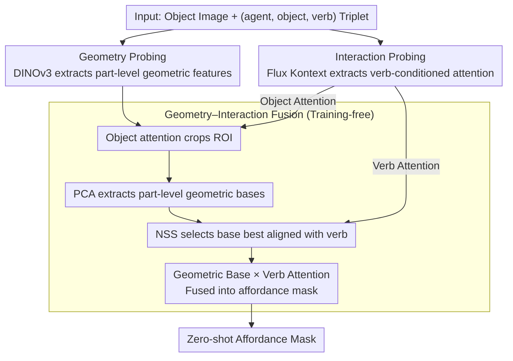

# Probing and Bridging Geometry–Interaction Cues for Affordance Reasoning in Vision Foundation Models

**Conference**: CVPR 2026  
**arXiv**: [2602.20501](https://arxiv.org/abs/2602.20501)  
**Code**: [https://github.com/Probing-and-Bridging-Affordance](https://github.com/Probing-and-Bridging-Affordance) (To be released)  
**Area**: Image Generation  
**Keywords**: Affordance Reasoning, Vision Foundation Models, Geometry Awareness, Interaction Priors, Zero-shot Fusion

## TL;DR
This work systematically probes affordance capabilities within Vision Foundation Models (VFMs). It discovers that DINO encodes part-level geometric structures while Flux encodes verb-conditioned interaction priors. By fusing both in a training-free manner, the authors achieve zero-shot affordance estimation competitive with weakly supervised methods.

## Background & Motivation

**Background**: Visual affordance describes how objects can be manipulated, serving as a bridge between visual perception and embodied actions. Current methods follow three main paradigms: fully supervised (learning geometric patterns from pixel annotations), weakly supervised (inferring from human-object interactions), and open-vocabulary (generalizing via text-image alignment).

**Limitations of Prior Work**: Fully supervised methods rely on dense annotations and have poor generalization; weakly supervised methods are spatially imprecise; open-vocabulary methods rely on semantic associations rather than genuine interaction understanding. These three paradigms emphasize different cues and lack a unified perspective to answer "What are the core capabilities of a visual system for understanding affordance?".

**Key Challenge**: Affordance is not an intrinsic property of an object but a possibility for interaction between an agent and the environment. Existing methods treat geometry (object structure) and interaction (how actions affect the structure) in isolation, lacking a systematic study of the complementarity between these two dimensions.

**Key Insight**: Vision Foundation Models (VFMs), through large-scale pre-training, have internalized rich visual knowledge and can serve as a unified "lens" to directly probe core affordance capabilities. Test hypothesis: Geometry awareness + interaction awareness = fundamental components of affordance understanding.

**Core Idea**: A dual-dimensional framework is proposed to extract priors from DINO (geometric part prototypes) and Flux (verb-conditioned cross-attention). Through training-free fusion, zero-shot affordance estimation is achieved, proving that these two dimensions are composable foundational capabilities.

## Method

### Overall Architecture
Rather than asking "how to build a better affordance segmenter," this paper addresses a more fundamental question: what capabilities do visual systems rely on to understand affordance? The authors hypothesize that the combination of "geometry awareness" and "interaction awareness" constitutes the basic components of affordance understanding. They use VFMs as a "lens" to probe these components. The research follows three steps: first, probing the geometric dimension independently to confirm that stronger geometric perception leads to better affordance segmentation; second, probing the interaction dimension to discover that verb-conditioned spatial attention in generative models serves as an implicit interaction prior; and finally, bridging the two in a training-free manner—using DINOv3 for geometric prototypes and Flux Kontext for interaction maps—to achieve zero-shot affordance estimation without training any parameters.

### Key Designs

**1. Geometry Probing: Proving "Strong Geometry = Better Affordance Segmentation" and analyzing DINO's geometric priors**

The first half of affordance is object structure—one must recognize functional parts like "handles," "rims," or "blades" before knowing how to use them. Using the Probing3D protocol to perform linear probing on 6 VFMs, the results show that models with stronger geometric perception (DINOv2 being most typical) achieve higher affordance segmentation mIoU. Crucially, feeding internal depth/normal information from Metric3Dv2 into semantic models like CLIP or SigLIP significantly boosts mIoU, whereas DINOv2 shows almost no gain—indicating its geometric priors are already embedded in its weights. Further PCA visualization reveals that the DINO family uniquely organizes scenes into part-level structures where functional components are clearly separated. However, this geometric prior is not "pure": the authors identify "semantic assimilation," where circular structures are activated in isolation (pure geometric response) but suppressed when placed in a context other than a cup (semantic suppression). This coupling necessitates the use of PCA during fusion.

**2. Interaction Probing: Extracting "Verb-conditioned" interaction priors from Generative Model Cross-Attention**

The second half of affordance is interaction—for the same cup, "hold" focuses on the handle while "drink" focuses on the rim. Geometry alone cannot distinguish where an action falls. Analyzing Flux.1-dev's text-image cross-attention reveals that verb tokens (hold, cut, drink, support) consistently focus on contact regions, while noun tokens focus on entities. This separable pattern suggests generative models internalize verb-conditioned interaction knowledge. To extract this prior stably, the authors use Flux Kontext to build a controlled image editing framework: given a (agent, object, verb) triplet (e.g., "add a hand to hold the knife"), the verb's cross-attention map is retrieved during generation. Notably, even if the generated image itself fails, these attention maps maintain spatial consistency, proving the priors originate from internal representations rather than output pixels.

**3. Geometry–Interaction Fusion: Training-free bridging of priors into affordance masks**

Since geometry identifies "functional parts" and interaction identifies "where the action falls," aligning and overlaying them should yield a precise affordance mask without training. The process involves four steps: first, cropping the ROI on DINOv3 feature maps using Flux Kontext's object attention; second, performing PCA on the ROI features to obtain part-level geometric bases; third, using NSS (Normalized Scanpath Saliency) to select the geometric base best aligned with the Flux verb attention; and finally, fusing the selected base with the verb attention. PCA is essential here: because of DINO’s geometry-semantic coupling, raw features would introduce semantic noise, whereas PCA extracts pure geometric prototypes closer to "shape centers."

### Loss & Training
The approach is entirely training-free, requiring no affordance annotations or fine-tuning. Both DINOv3 and Flux are used with frozen pre-trained weights.

## Key Experimental Results

### Main Results (AGD20K)

| Method | Supervision | KLD↓ | SIM↑ | NSS↑ |
|------|---------|------|------|------|
| AffordanceLLM | Fully Supervised | 1.463 | 0.377 | 1.070 |
| LOCATE | Weakly Supervised | 1.405 | 0.372 | 1.157 |
| Cross-View-AG | Weakly Supervised | 1.787 | 0.285 | 0.829 |
| Ours (Interaction Only) | Training-Free | 1.825 | 0.271 | 1.050 |
| **Ours (Interaction × Geometry)** | **Training-Free** | **1.493** | **0.326** | **1.090** |

### Geometry Probing (UMD Linear Probe mIoU)

| Model | Architecture | Supervision | mIoU (Base) | mIoU (+Depth/Normal) |
|------|------|------|-------------|-------------------|
| DINOv2 | ViT-B/14 | SSL | Highest | Almost no gain |
| CLIP | ViT-B/16 | VLM | Medium | Significant gain |
| SAM | ViT-B/16 | Seg. | Low | Medium gain |
| StableDiffusion | UNet | Gen. | Lowest | Gain observed |

### Key Findings
- **Significant Fusion Gains**: Combining geometry and interaction reduced KLD from 1.825 to 1.493 and increased SIM from 0.271 to 0.326 compared to interaction alone, indicating geometric priors suppress unreasonable regions.
- **Zero-shot performance approaches Weak Supervision**: The training-free method even slightly outperformed the weakly supervised Cross-View-AG on the NSS metric (1.090 vs 0.829) and approached AffordanceLLM (1.070).
- **Invariance to Generation Quality**: Verb attention remains consistent even when generation fails, confirming interaction priors are intrinsic model knowledge.

## Highlights & Insights
- The **dual-dimensional framework** provides theoretical depth by systematically decomposing affordance into "geometry" and "interaction," verifying their complementarity and composability.
- **Extracting interaction priors from generative models** is a novel perspective; previously, Flux cross-attention had not been utilized for affordance estimation, opening a new direction for generative models as knowledge sources.
- The experimental design for the **"semantic assimilation"** of DINO—comparing cosine similarities across contexts—cleverly isolates geometric versus semantic contributions.
- The method represents a **model-agnostic compositional paradigm**: any strong geometric model and any generative model encoding interaction priors can be interchanged.

## Limitations & Future Work
- **Primitive Quality**: Noun-conditioned attention maps can be noisy, and unstable generation outputs affect the quality of extracted interaction priors.
- **Shallow Fusion**: The current strategy utilizes only NSS selection and linear fusion, representing an open-loop signal combination without iterative refinement.
- Dependency on Flux Kontext means performance may degrade for abstract verbs or non-contact interactions.
- **Video Models Unexplored**: Video models naturally understand 3D scene geometry and interaction dynamics; they could provide both priors simultaneously.
- The PCA-based geometric prototype selection is relatively simple; complex object structures may require hierarchical decomposition.

## Related Work & Insights
- **vs LOCATE / Cross-View-AG** (Weakly supervised): These require human-object interaction training data; Ours is completely training-free but achieves competitive performance.
- **vs AffordanceLLM** (Fully supervised): Ours is close in NSS but lags in KLD (1.493 vs 1.463), suggesting room for improvement in mask precision.
- **vs Affordance-R1** (Post-training): That method uses RL but has a significantly higher KLD (9.730) than this training-free solution, suggesting RL might overfit on this task.
- **vs GroundingDINO / MaskCLIP / EVF-SAM**: These models perform global semantic matching but fail to locate functional regions; Flux's verb attention shows clear advantages in fine-grained interaction localization.

## Rating
- Novelty: ⭐⭐⭐⭐⭐ First work to systematically probe VFM affordance capabilities; the dual-dimensional framework is pioneering.
- Experimental Thoroughness: ⭐⭐⭐⭐ Probe designs are ingenious, though fusion evaluation is primarily centered on AGD20K.
- Writing Quality: ⭐⭐⭐⭐⭐ Highly logical flow from hypothesis to probing to fusion.
- Value: ⭐⭐⭐⭐ Provides a fresh perspective on VFM understanding, though practical applications require more robust fusion strategies.

<!-- RELATED:START -->

## Related Papers

- [\[CVPR 2026\] Vision Foundation Models Can Be Good Tokenizers for Latent Diffusion Models](vision_foundation_models_can_be_good_tokenizers_for_latent_diffusion_models.md)
- [\[CVPR 2026\] SPREAD: Spatial-Physical REasoning via geometry Aware Diffusion](spread_spatial-physical_reasoning_via_geometry_aware_diffusion.md)
- [\[CVPR 2026\] VFM-VAE: Vision Foundation Models Can Be Good Tokenizers for Latent Diffusion Models](vfm-vae_vision_foundation_models_can_be_good_tokenizers_for_latent_diffusion_mod.md)
- [\[CVPR 2026\] Cinematic Audio Source Separation Using Visual Cues](cinematic_audio_source_separation_using_visual_cues.md)
- [\[NeurIPS 2025\] DEXTER: Diffusion-Guided EXplanations with TExtual Reasoning for Vision Models](../../NeurIPS2025/image_generation/dexter_diffusion-guided_explanations_with_textual_reasoning_for_vision_models.md)

<!-- RELATED:END -->
