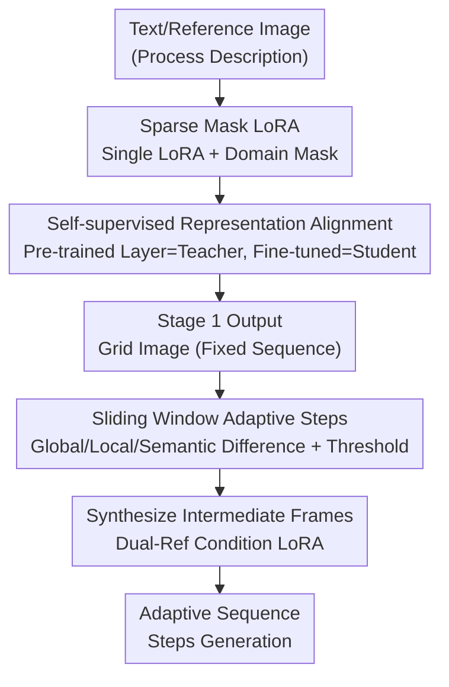

# ProcessMaker: A Generalized Process Visualization Framework with Adaptive Sequence Steps on Diffusion Transformers

**Conference**: CVPR 2026  
**Paper**: [CVF Open Access](https://openaccess.thecvf.com/content/CVPR2026/html/Xu_ProcessMaker_A_Generalized_Process_Visualization_Framework_with_Adaptive_Sequence_Steps_CVPR_2026_paper.html)  
**Code**: https://github.com/Molly260/ProcessMaker  
**Area**: Diffusion Models / Image Generation  
**Keywords**: procedural sequence generation, Diffusion Transformer, LoRA sparse mask, representation alignment, adaptive steps

## TL;DR
ProcessMaker implements cross-domain procedural sequence generation on Flux.1 (DiT) using "sparse mask LoRA + self-supervised representation alignment." It employs a sliding window to adaptively add or remove steps based on frame differences. By training only 7.3% of the parameters, it outperforms MakeAnything in alignment and coherence across 21 domains.

## Background & Motivation
**Background**: Procedural sequence generation aims to render the evolution of processes such as "painting, cooking, crafting, or product design" into a series of intermediate state diagrams for tutorials, manuals, and industrial design. With the advent of text-to-image diffusion models, these intermediate frames can be generated given a process description.

**Limitations of Prior Work**: Existing methods are largely domain-specific—CookingDiffusion and CoCook handle only cooking, while ProcessPainter and PaintsAlter focus exclusively on painting. To cover multiple domains, frameworks like MakeAnything require a set of expert networks (asymmetric LoRA) for each domain. This leads to three specific issues: (1) **Poor generalization to unseen domains**: Training on a single domain overfits to that domain's logic and visual complexity, resulting in illogical frames for unseen processes; (2) **Parameter redundancy**: Fine-tuning multiple expert modules for multiple domains incurs high computational costs; (3) **Fixed step counts**: A given text prompt can only produce a fixed number of frames, wasting frames for simple processes and missing critical steps for complex ones, leading to sequences that are either redundant or jumpy.

**Key Challenge**: There is a tension between "multi-domain coverage" and "parameter efficiency + generalization." While stacking expert networks increases coverage, it introduces redundancy and fails to generalize. Meanwhile, fixed step counts treat "process complexity"—an inherently adaptive variable—as a constant.

**Goal**: This paper aims to develop a lightweight framework that simultaneously addresses multi-domain generalization, parameter efficiency (without multiple expert networks), and adaptive step counts based on process complexity.

**Key Insight**: Pre-trained DiTs (like Flux.1) possess strong inherent generalization capabilities. Instead of training multiple experts, one should: (a) Use pre-trained representations from specific DiT layers as "teachers" to constrain fine-tuning; (b) Replace domain-specific LoRAs with a single LoRA using different domain masks; and (c) Use a sliding window to add or remove frames based on inter-frame differences after generation.

**Core Idea**: Squeeze the inherent generalization capability of pre-trained DiTs using "masked single LoRA + self-supervised representation alignment" for cross-domain generation, followed by "frame-difference-driven sliding windows" for adaptive steps.

## Method

### Overall Architecture
ProcessMaker is built upon Flux.1 (a DiT using flow matching). The pipeline consists of two stages. **Stage 1 (Multi-domain Generalization)**: Sparse masks are introduced into LoRA fine-tuning to allow a single LoRA to serve multiple domains. Simultaneously, self-supervised representation alignment anchors the fine-tuned intermediate representations to the pre-trained ones to maintain generalization with fewer parameters. Stage 1 outputs a "grid image" containing the full sequence. **Stage 2 (Adaptive Steps)**: The grid image is decomposed into a frame sequence $F=\{f_1,\dots,f_n\}$. A sliding window compares adjacent frames for global, local, and semantic differences using adaptive thresholds. Intermediate frames are interpolated where differences are too large and redundant frames are removed where differences are too small. Interpolated frames are synthesized using a LoRA conditioned on two reference frames.

### Key Designs

**1. Sparse Mask LoRA: Replacing Multiple Experts with One LoRA + Domain Masks**

This addresses the issue of parameter redundancy and cross-domain interference. Unlike MakeAnything, which shares a matrix $A$ and assigns a task-specific $B$ to each domain (inflating parameters), ProcessMaker uses **one** LoRA but learns a row-level mask $m_{\ell,c}\in\mathbb{R}^d$ for each domain to control which rows are active. For the $\ell$-th DiT block, the masked update is:

$$\Delta W^{(c)}_\ell = (G(m_{\ell,c}) \odot B_\ell) A_\ell,$$

where $G(\cdot)$ broadcasts the mask by column and $\odot$ denotes the Hadamard product. The final weight is $W^{(c)}_\ell = W_\ell + \frac{\alpha_\ell}{r_\ell}\Delta W^{(c)}_\ell$. Crucially, it was observed that the **last 70% of masking parameters have low domain correlation**. Thus, the last 70% of each domain mask is set to 0 and the first 30% to 1. This ensures domains share most capacity while differentiating only in the top 30%, reducing parameters and interference. For unseen domains, the mask is **removed entirely**, relying on the model's raw generalization.

**2. Self-supervised Representation Alignment: Anchoring Fine-tuning to Pre-trained DiT**

This prevents overfitting to training domains and maintains generalization for unseen processes. Instead of external labels, it uses the pre-trained Flux.1 representations for self-supervision. Specifically, across a set of DiT blocks $L$ (layers 4/9/14/19/29 covering MM-DiT and Single-DiT), the **pre-trained representation** $h^T_\ell(z)$ acts as the teacher and the **fine-tuned representation** $h^S_\ell(z)$ as the student:

$$L_{sup} = \sum_{\ell\in L} W^{(c)}_\ell\, D\big(h^T_\ell(z), h^S_\ell(z)\big),$$

where $D = d_{cos}(h^T_\ell, h^S_\ell) + \gamma\,\|h^T_\ell - h^S_\ell\|_2^2$ combines cosine distance (for semantic direction) and MSE (for texture values). This is combined with the flow matching loss $L_{main}$ to form $L_{stage1}=L_{main}+\lambda(t)L_{sup}$, where $\lambda(t)=\lambda_0 s(t)$ modulates supervision intensity over diffusion time $t$. This "pins" fine-tuned representations to robust pre-trained inductive biases.

**3. Sliding Window Adaptive Steps: Step Insertion/Deletion via Multi-modal Differences**

This addresses the "fixed steps" problem. After Stage 1 produces an $n$-frame sequence, Stage 2 uses a sliding window (stride $s=1$) to evaluate adjacent frame pairs based on: global visual difference $\Delta_{glob}(i,j)=1-\langle v_i,v_j\rangle$ (CLIP image vectors), local visual difference $\Delta_{loc}(i,j)=\frac{1}{|P_i|}\sum_{p\in P_i}\min_{q\in P_j}\|p-q\|_2$ (DINO patch tokens), and semantic difference $\Delta_{sem}(i,j)=1-\langle u_i,u_j\rangle$ (CLIP text embeddings). These are weighted:

$$\hat\Delta_{ij} = \alpha\Delta_{glob} + (1-\alpha-\beta)\Delta_{loc} + \beta\Delta_{sem}$$

Adaptive thresholds based on the sequence mean $\mu$ and standard deviation $\sigma$ are used: $\tau_{add}=\mu+k_1\sigma$ for **inserting** frames at jumps and $\tau_{del}=\mu-k_2\sigma$ for **deleting** redundant frames. Insertion is handled by a LoRA conditioned on dual reference frames $c^1_I,c^2_I$, with $L_{stage2}=\mathbb{E}\big[\|v_\Theta(z,t,c^1_I,c^2_I,c_T)-u_t(z|\epsilon)\|^2\big]$.

### Loss & Training
Both stages utilize the CAME optimizer, 1024×1024 resolution, LoRA rank 64, learning rate $1\times10^{-4}$, and batch size 1 on 8 A6000 GPUs. Stage 1 loss is $L_{stage1}=L_{main}+\lambda(t)L_{sup}$ ($\lambda_0=0.5, \gamma=0.1$).

## Key Experimental Results

The MakeAnything dataset (24,000+ sequences, 21 domains) was used. Metrics include CLIP Score (Align), GPT-4o sequence coherence (Coh), and a 100-person user study.

### Main Results
Comparison across 21 domains against Flux.1 and MakeAnything (Selected):

| Domain | Metrics | Flux.1 | MakeAnything | ProcessMaker |
|------|------|--------|--------------|--------------|
| Oil Painting | Align / Coh | 30.27 / 4.00 | 37.30 / 4.95 | **37.32 / 5.00** |
| LEGO | Align / Coh | 30.15 / 2.55 | 34.40 / 4.90 | **34.53 / 5.00** |
| Pencil Sketch| Align / Coh | 30.28 / 4.05 | 34.44 / 4.50 | **35.39 / 4.70** |
| Emoji | Align / Coh | 27.62 / 2.75 | 34.20 / 3.60 | **34.82 / 3.90** |
| Clay Sculpture| Align / Coh| 31.66 / 3.50 | 35.25 / 4.50 | **35.85 / 4.55** |

ProcessMaker achieved the **highest alignment across all 21 domains**. Comparison with domain-specific experts (Table 2):

| Domain | Expert Model | Expert Align/Coh | ProcessMaker Align/Coh |
|------|---------|----------------|------------------------|
| Painting | ProcessPainter | 26.43 / 4.85 | **34.47 / 4.85** |
| Icon | LayerTracer | 31.43 / 3.55 | **31.59 / 3.90** |
| Cook | CoCook | 32.28 / 4.15 | **34.47 / 4.50** |

The unified framework outperforms specialized models.

### Ablation Study
Ablation on Fabric Toys (Table 3):

| Stage | Configuration | Align | Coh | Trainable Param |
|------|------|-------|-----|-----------|
| Stage 1 | Base Model (MakeAnything) | 32.83 | 4.60 | 4.19B |
| Stage 1 | + LoRA Masks | 33.03 | 4.65 | 306.32M |
| Stage 1 | + RA (Rep. Alignment) | 32.89 | 4.65 | - |
| Stage 2 | ProcessMaker (Full) | 33.61 | 4.95 | 306.32M |
| Stage 2 | w/o $\Delta_{glob}$ | 33.29 | 4.80 | - |
| Stage 2 | w/o $\Delta_{loc}$ | 33.55 | 4.70 | - |
| Stage 2 | w/o $\Delta_{sem}$ | 32.90 | 4.95 | - |

### Key Findings
- **Sparse Mask LoRA reduces parameters**: Trainable parameters dropped from 4.19B to 306.32M (approx. 92.7% reduction) while improving metrics. Only 7.3% of parameters are needed to exceed SOTA.
- **Representation Alignment improves logic**: Adding RA significantly boosts Coh while marginally improving Align, proving it regulates inter-step transition logic.
- **Each difference metric is essential**: Removing visual differences ($\Delta_{glob}, \Delta_{loc}$) degrades alignment and consistency, while removing $\Delta_{sem}$ primarily impacts alignment.
- User studies confirmed ProcessMaker leads in Alignment, Coherence, and Usability across both seen and unseen domains.

## Highlights & Insights
- **Unified LoRA Masking**: Replacing multiple experts with a single masked LoRA (modifying only the top 30%) prevents MoE parameter explosion and cross-domain interference.
- **Pre-trained Guidance**: Using frozen backbone intermediate layers as students' teachers is a low-cost regularization to prevent "catastrophic forgetting" of generalization.
- **Decoupling Generation from Steps**: Generating a fixed grid first and then adaptively resizing the sequence via sliding windows makes step count control explainable and tunable.

## Limitations & Future Work
- Grid images constrain the resolution of individual sub-frames; future work might integrate super-resolution.
- Unseen domains rely purely on text and zero-shot generalization; plans include adding control via reference images, sketches, or short videos.
- ⚠️ Note: Stage 2 interpolation depends on the quality of Stage 1 grids. If a frame in the grid is fundamentally incorrect, the sliding window can only interpolate between errors.
- Weights $\alpha, \beta$ and coefficients $k_1, k_2$ are manually set; their sensitivity and cross-domain consistency were not fully investigated.

## Related Work & Insights
- **vs MakeAnything**: MakeAnything uses asymmetric LoRA (shared A, unique B), which is redundant and generalizes poorly. ProcessMaker uses a single masked LoRA with only 7.3% of the parameters and handles unseen domains better.
- **vs Domain Experts**: Specialized models for painting/cooking are matched or outperformed by this unified framework.
- **vs Video Generation**: Video models are coherent but struggle with full-process coverage and high compute costs; ProcessMaker's grid-to-sequence approach is more efficient for process visualization.

## Rating
- Novelty: ⭐⭐⭐⭐ The combination of sparse masking, representation alignment, and frame-difference-driven sliding windows is novel for procedural generation.
- Experimental Thoroughness: ⭐⭐⭐⭐ Comprehensive evaluation across 21 domains and comparison with experts; however, sensitivity analysis for hyperparameters is lacking.
- Writing Quality: ⭐⭐⭐⭐ Clear two-stage structure and well-formulated equations.
- Value: ⭐⭐⭐⭐ High practical value for tutorials and design, achieving SOTA performance with minimal parameters.

## Related Papers

- [\[CVPR 2026\] Region-Adaptive Sampling for Diffusion Transformers](region-adaptive_sampling_for_diffusion_transformers.md)
- [\[CVPR 2026\] ThinkGen: Generalized Thinking for Visual Generation](thinkgen_generalized_thinking_for_visual_generation.md)
- [\[CVPR 2026\] TAP: A Token-Adaptive Predictor Framework for Training-Free Diffusion Acceleration](tap_a_token-adaptive_predictor_framework_for_training-free_diffusion_acceleratio.md)
- [\[CVPR 2026\] SpotEdit: Selective Region Editing in Diffusion Transformers](spotedit_selective_region_editing_in_diffusion_transformers.md)
- [\[CVPR 2026\] PixelDiT: Pixel Diffusion Transformers for Image Generation](pixeldit_pixel_diffusion_transformers_for_image_generation.md)

<!-- RELATED:END -->

<!-- RELATED:START -->

## Related Papers

- [\[CVPR 2026\] Region-Adaptive Sampling for Diffusion Transformers](region-adaptive_sampling_for_diffusion_transformers.md)
- [\[CVPR 2026\] ResCa: Residual Caching for Diffusion Transformers Acceleration](resca_residual_caching_for_diffusion_transformers_acceleration.md)
- [\[CVPR 2026\] UniVerse: A Unified Modulation Framework for Segmentation-Free, Disentangled Multi-Concept Personalization](universe_a_unified_modulation_framework_for_segmentation-free_disentangled_multi.md)
- [\[CVPR 2026\] ViStoryBench: Comprehensive Benchmark Suite for Story Visualization](vistorybench_comprehensive_benchmark_suite_for_story_visualization.md)
- [\[CVPR 2026\] GeoRK2: Geometry-Guided Runge-Kutta Integration for Diffusion Transformer Acceleration](geork2_geometry-guided_runge-kutta_integration_for_diffusion_transformer_acceler.md)

<!-- RELATED:END -->
