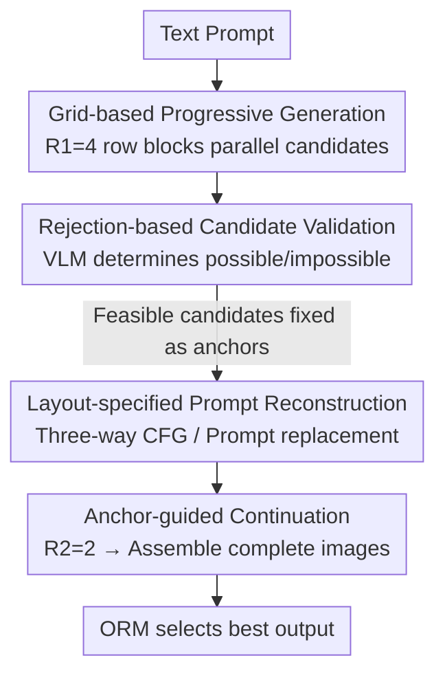

# Progress by Pieces: Test-Time Scaling for Autoregressive Image Generation

**Conference**: CVPR 2026  
**Paper**: [CVF Open Access](https://openaccess.thecvf.com/content/CVPR2026/html/Park_Progress_by_Pieces_Test-Time_Scaling_for_Autoregressive_Image_Generation_CVPR_2026_paper.html)  
**Code**: https://grid-ar.github.io (Project Page)  
**Area**: Image Generation / Autoregressive Generation / Test-Time Scaling  
**Keywords**: Visual Autoregressive, Test-Time Scaling, Grid-based Progressive Generation, Prompt Reconstruction, Compositional T2I  

## TL;DR
GridAR proposes a **training-free test-time scaling** framework for visual autoregressive (AR) models. By partitioning the canvas into row blocks, generating multiple partial candidates in parallel, and pruning incorrect trajectories early, combined with "layout-specified prompt reconstruction" to provide a global blueprint for subsequent decoding, it outperforms Best-of-N (N=8) by 14.4% on T2I-CompBench++ using only N=4 while saving 25.6% compute.

## Background & Motivation
**Background**: Visual autoregressive models (LlamaGen, Janus-Pro, Emu3, etc.) encode images into VQ token sequences and decode them via raster scanning (next-token prediction), much like LLMs. These models have become competitive with diffusion models like DALL·E 3 and SD3 in text-to-image generation. In the LLM domain, "scaling test-time compute for better results" (CoT, Best-of-N + Reward Models) has been proven highly effective. Naturally, the question arises: how can test-time scaling be brought to visual AR?

**Limitations of Prior Work**: Directly applying Best-of-N to visual AR is inefficient. First, early token errors in AR are almost irrecoverable—for instance, if a prompt specifies "four bags" but the model already draws five handles, subsequent token-by-token generation cannot fix it, yet the incorrect trajectory still **consumes the compute of a full image**. Second, during raster-scan generation, the model **lacks a global blueprint of the canvas**: if the prompt is "eight bears" and the model draws the first bear so large it fills the top half, it often omits the remaining bears in the bottom half to maintain visual plausibility. Consequently, even with many Best-of-N samples, few candidates align well with the prompt.

**Key Challenge**: The gains from test-time scaling come from "exploring more in meaningful directions," but the sequential nature of AR wastes compute on failed trajectories and results in candidates deviating from the prompt due to a lack of a blueprint—simply increasing sampling does not automatically translate into better candidates.

**Goal**: Without **any additional training**, focus test-time compute on **areas worth exploring** and provide a feasible global layout for row-by-row decoding, thereby extracting the best output from AR models within a fixed or reduced sampling budget.

**Key Insight**: The authors draw inspiration from tree-search inference in LLMs—since AR grows row-by-row, "exploration" should also be row-based. By generating multiple partial candidates in parallel for the same canvas position, pruning incorrect ones early, and fixing correct ones as anchors to guide subsequent steps, compute is directed toward promising continuations from the start. Furthermore, row-by-row decoding naturally produces intermediate images (e.g., "top half finished"), which can be used to infer a feasible layout.

**Core Idea**: Transform Best-of-N into a **segmented, prunable search** using "grid-based progressive generation + rejection validation," supplemented by a global blueprint through "layout-specified prompt reconstruction" inferred from partial images.

## Method

### Overall Architecture
GridAR takes a text prompt as input and outputs an image that better follows instructions. The process involves "drawing the image in segments, filtering during generation, and rewriting the prompt mid-way to supplement the blueprint." Specifically, the canvas is divided into horizontal row blocks. In the first stage, $R_1$ row blocks are used to generate $R_1$ "top-quarter" candidates in parallel. A VLM verifier determines row-by-row which candidates are already unlikely to satisfy the prompt (e.g., color binding errors, exceeded object counts), prunes them, and fixes feasible ones as anchors. In the second stage ($R_2$ row blocks), generation continues from these anchors, followed by another validation, eventually forming several complete images. The Output Reward Model (ORM) then selects the best. The paper uses $(R_1, R_2) = (4, 2)$, where two initial canvases correspond to $N=8$. Parallel to this, "layout-specified prompt reconstruction" is performed during verification to feed rewritten prompts back into subsequent decoding via three-way CFG or prompt substitution.

### Key Designs

**1. Grid-based Progressive Generation: Transforming Best-of-N into Prunable Segmented Search**

This design addresses the issue of compute wasted on failed trajectories. The canvas $x\in\{1,\dots,K\}^{h\times w}$ is partitioned into $R_1=4$ contiguous row blocks $x=[x^{(1)};\dots;x^{(4)}]$, each containing $L=\frac{h}{4}\cdot w$ tokens. The model **independently** generates four candidates for the same top-quarter position $p_\phi(x^{(r)}\mid c_T)=\prod_{n=1}^{L}p_\phi(x^{(r)}_n\mid x^{(r)}_{<n},c_T)$ (Prompt KV caches are computed once and reused for all four rows to save compute). A single decoding forward pass can resolve the grid canvas $I_{\text{grid}}=D_{VQ}(x_q)$ containing four candidates. After validation, feasible candidates are fixed as anchors $x_{\text{anchor}}$, and the second stage continues in an $R_2=2$ grid with the top half locked and the bottom half autoregressively extended $p_\phi(x^{(i)}_{\text{gen}}\mid x^{(i)}_{\text{anchor}},c_T)$, finally forming four full images. This "glimpse-and-grow" approach ensures compute is directed toward promising continuations, while the **total token count remains equal to standard Best-of-N (N=4)** (excluding verification overhead), resulting in higher exploration efficiency within the same budget.

**2. Rejection-based Candidate Validation: Pruning Only "Impossible" Trajectories**

To address the issue of incomplete information in partial views where premature selection might "kill" good candidates, GridAR uses a zero-shot VLM verifier $V_\psi$ to perform a **one-time** row-by-row judgment $y^{(r)}\in\{\texttt{possible},\texttt{impossible}\}$ for the four candidates. It only rejects those that clearly violate the prompt (color binding errors, count exceeded), **retaining all others**. Rejected candidates are randomly replaced by a feasible one (e.g., if $x^{(2)}$ is rejected, then $x_{\text{anchor}}=[x^{(1)},x^{(4)},x^{(3)},x^{(4)}]$). The authors intentionally avoid top-k selection like beam search because a missing object might simply "not have been drawn yet" in the partial view. Top-k would prematurely discard many potentially feasible candidates, harming diversity. This "rather over-include than over-exclude" strategy is key to maintaining diversity during progressive search.

**3. Layout-specified Prompt Reconstruction: Supplementing a Global Blueprint**

Segmented search alone is insufficient—even if the top anchor is well-chosen, the subsequent decoding might duplicate already drawn objects or omit required ones because the AR model lacks a global blueprint. A pilot study (Janus-Pro-7B) showed that for prompts where $N=1$ failed but the top part was correct, repeatedly re-sampling the bottom half with the original prompt yielded slow success rate improvements. However, **mid-way rewriting of the prompt into a specific layout** (e.g., changing "eight bears" to "three bears on top, five bears on bottom" after three are drawn) significantly boosted the success rate. Thus, while the verifier evaluates candidates, it also infers a feasible layout from the observed partial images and rewrites the prompt. Two injection methods are provided: (i) **Three-way CFG**: Given logit offsets for unconditional/original/reconstructed prompts as $d_{o,i}=l^{(o)}_i-l^{(u)}_i$ and $d_{r,i}=l^{(r)}_i-l^{(u)}_i$, the layout direction is **orthogonalized** against the original direction $\tilde d_{r,i}=d_{r,i}-\frac{\langle d_{r,i},d_{o,i}\rangle}{\lVert d_{o,i}\rVert^2}d_{o,i}$, resulting in $l^{\text{sample}}_i=l^{(o)}_i+s_o\,d_{o,i}+s_r\,\tilde d_{r,i}$, ensuring layout signals do not interfere with the original prompt guidance strength. (ii) **Prompt Replacement**: Replacing the condition for subsequent decoding with the reconstructed prompt (standard CFG), which is more compute-efficient but provides a coarser signal. This step compensates for the structural lack of a blueprint in AR.

### Loss & Training
GridAR is a **purely test-time, training-free** framework that does not modify or fine-tune the base AR model. All gains come from inference-stage scheduling. Implementation utilizes GPT-4.1 as the verifier $V_\psi$ and Qwen2.5-VL as the ORM. Base models include Janus-Pro-7B / LlamaGen (T2I) and EditAR (Editing). CFG scales are set to $s_o=5$ (Janus-Pro) / $6.5$ (LlamaGen), with $s_r=s_o$ for reconstructed prompts. Three-way CFG is the default for T2I, while prompt replacement is default for editing.

## Key Experimental Results

### Main Results
On T2I-CompBench++ (2400 compositional prompts across 8 dimensions), GridAR improves average scores for Janus-Pro and LlamaGen by **17.5% and 4.9%** respectively at the same $N$. Crucially, on Janus-Pro, GridAR (N=4) outperforms Best-of-N (N=8) by 14.4% while saving 25.6% compute. The following table highlights dimensions capturing "compositional correctness" (metrics: BLIP-VQA / UniDet / 3-in-1, higher is better):

| Dimension | Janus-Pro | +BoN (N=8) | +GridAR (N=4) | +GridAR (N=8) |
|-----------|-----------|------------|----------------|----------------|
| Color | 0.5388 | 0.7235 | 0.8050 | **0.8172** |
| Shape | 0.3476 | 0.4177 | 0.6014 | **0.6174** |
| Texture | 0.4357 | 0.5600 | 0.7268 | **0.7408** |
| 2D Spatial | 0.1607 | 0.2430 | 0.2833 | **0.3214** |
| Numeracy | 0.4467 | 0.5068 | 0.5684 | **0.5932** |

On GenEval (500+ prompts, binary compositional correctness), where most dimensions are saturated at 0.90+, authors report three unsaturated dimensions and overall scores:

| Method | Counting | Position | Color Attr. | Overall |
|------|----------|----------|-------------|---------|
| Janus-Pro | 0.59 | 0.77 | 0.65 | 0.79 |
| + BoN (N=8) | 0.76 | 0.86 | 0.72 | 0.86 |
| + GridAR (N=8) | **0.79** | **0.92** | **0.73** | **0.88** |

On image editing (PIE-Bench, 700 images using EditAR), GridAR achieves **14.5% higher semantic retention** compared to baselines with larger $N$, showing a better trade-off between instruction following (CLIP similarity) and source retention (DINO distance / Background MSE).

### Ablation Study
The paper analyzes verifier robustness, prompt reconstruction strategies, human evaluation, and rejection rates. The comparison between the two prompt injection methods shows:

| Configuration | Features | Trade-offs |
|------|------|------|
| Three-way CFG (Default T2I) | Injects orthogonalized layout direction into logits | Finer signal, better T2I performance |
| Prompt Replacement (Default Editing) | Replaces condition directly via standard CFG | More compute-efficient, sufficient for editing |
| Rejection Validation vs. Top-k | Prunes only impossible, retains diversity | Avoids premature candidate loss in partial views |

### Key Findings
- **Compute efficiency is the core advantage**: GridAR (N=4) outperforming Best-of-N (N=8) demonstrates that "segmented pruning + blueprint completion" provides gains far exceeding simple sampling increases.
- **Synergy with stronger backbones**: Gains on Janus-Pro (17.5%) are significantly larger than on LlamaGen (4.9%), as stronger models better follow layout instructions.
- **Blueprint lack is a genuine bottleneck**: The pilot study shows that success rates rise slowly when strictly adhering to the original prompt, but jump when using explicit layouts—validating the necessity of prompt reconstruction.

## Highlights & Insights
- **Adapting LLM "Tree Search" to row-based "Glimpse-and-Grow"**: By naturally defining search segments via the spatial structure of the canvas, incorrect trajectories are pruned in the first segment—a key migration of test-time scaling to visual AR.
- **"Reject but don't rank" is counter-intuitive but correct**: Given incomplete information in partial views, objects might simply be yet-to-be-drawn; preserving diversity while pruning clear violations handles information incompleteness gracefully.
- **Leveraging intermediate products (partial images) to guide generation**: Rather than treating "half-finished" images as by-products, they are used as clues to infer layouts, which are then injected via orthogonalized three-way CFG.
- **Fully training-free**: All gains are achieved through inference-time scheduling, allowing integration with any existing AR backbone with low deployment cost.

## Limitations & Future Work
- **Dependency on strong external verifiers/ORMs** (GPT-4.1, Qwen2.5-VL): Pruning and reconstruction quality depend on the verifier; zero-shot accuracy is a source of error and deployment increases latency/cost.
- **Fixed grid-partition $(R_1, R_2) = (4, 2)$**: This empirical trade-off might not be optimal for all resolutions or object densities (alternative configurations are analyzed in Appendix).
- **Backbone layout-following capability**: Gains are limited for weaker AR models (LlamaGen); the framework extracts potential from strong models rather than fixing fundamental weaknesses of weak ones.
- **Focus on layout-sensitive prompts**: Primarily targets compositional/counting/spatial prompts; improvements on saturated dimensions like texture are marginal.

## Related Work & Insights
- **vs. Best-of-N**: BoN repeats full image sampling, wasting compute on failed trajectories without a blueprint. GridAR improves candidate pool quality by using segmented prunable search and mid-way blueprinting.
- **vs. LLM-style token-wise CoT/RL**: These do not reflect the spatial characteristics of image AR. GridAR leverages canvas row structures and partial image clues specifically for vision.
- **vs. Explicit Planners**: Comparison in Section 4.4 shows "dynamically inferring layout from partial images" is superior to pre-specifying layouts with a planner, as the former is grounded in actual intermediate results.

## Rating
- Novelty: ⭐⭐⭐⭐⭐ Well-designed adaptation of test-time scaling for visual AR (row-based pruning + inferred blueprinting + orthogonalized CFG).
- Experimental Thoroughness: ⭐⭐⭐⭐ Covers T2I and editing across multiple backbones; pilot study is convincing, though some ablations are relegated to the Appendix.
- Writing Quality: ⭐⭐⭐⭐ Clear motivation-observation-method chain; pilot studies are highly persuasive.
- Value: ⭐⭐⭐⭐⭐ Training-free, plug-and-play, significantly improves compositional generation quality within fixed budgets.

<!-- RELATED:START -->

## Related Papers

- [\[CVPR 2026\] From Scale to Speed: Adaptive Test-Time Scaling for Image Editing](from_scale_to_speed_adaptive_test-time_scaling_for_image_editing.md)
- [\[CVPR 2026\] Rethinking Prompt Design for Inference-time Scaling in Text-to-Visual Generation](rethinking_prompt_design_for_inference-time_scaling_in_text-to-visual_generation.md)
- [\[CVPR 2026\] Test-Time Alignment of Text-to-Image Diffusion Models via Null-Text Embedding Optimisation](test-time_alignment_of_text-to-image_diffusion_models_via_null-text_embedding_op.md)
- [\[CVPR 2026\] VibeToken: Scaling 1D Image Tokenizers and Autoregressive Models for Dynamic Resolution Generations](vibetoken_scaling_1d_image_tokenizers_and_autoregressive_models_for_dynamic_reso.md)
- [\[CVPR 2026\] Test-Time Instance-Specific Parameter Composition: A New Paradigm for Adaptive Generative Modeling](test-time_instance-specific_parameter_composition_a_new_paradigm_for_adaptive_ge.md)

<!-- RELATED:END -->
