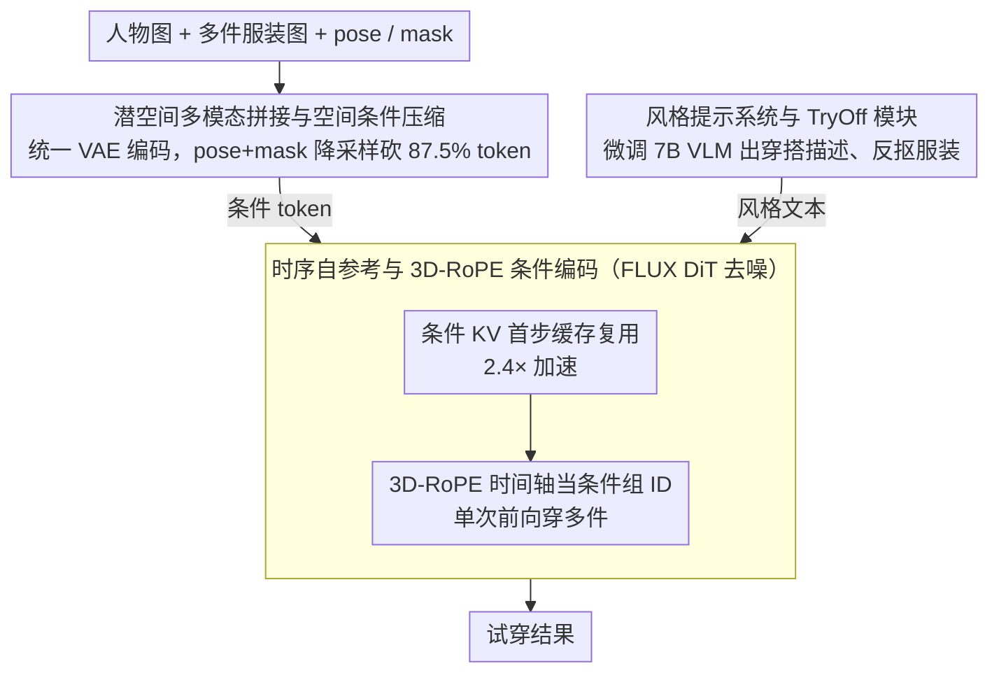

# PROMO: Promptable Outfitting for Efficient High-Fidelity Virtual Try-On

**Conference**: CVPR 2026  
**arXiv**: [2603.11675](https://arxiv.org/abs/2603.11675)  
**Code**: None (Xiaohongshu Team)  
**Area**: Image Generation / Virtual Try-On  
**Keywords**: Virtual Try-On, Flow Matching DiT, Multi-condition Generation, Temporal Self-Reference, Outfit Style Control  

## TL;DR
PROMO is based on the FLUX Flow Matching DiT backbone. Through latent space multimodal condition concatenation, temporal self-reference KV caching, 3D-RoPE grouped conditions, and a fine-tuned VLM style prompt system, it achieves high-fidelity and efficient multi-garment virtual try-on without the need for a traditional reference network. The inference speed is 2.4x faster than the non-accelerated version, and it outperforms existing VTON and general image editing methods on VITON-HD and DressCode.

## Background & Motivation
Virtual Try-On (VTON) is a core capability for e-commerce, helping consumers obtain reliable outfit references online and reducing return rates. Current mainstream methods suffer from three types of problems: (1) Early warping methods (TPS, appearance flow) perform poorly under occlusion and large deformations; (2) GAN methods struggle to preserve fine garment details and natural human geometry; (3) Diffusion model methods, while significantly improving realism, generally rely on Reference Networks to encode garment features—such as IDM-VTON, OOTDiffusion, and FitDiT, which use an entire extra network. This leads to doubled parameters, complex initialization/interaction logic, and slow inference. Furthermore, existing methods mostly ignore outfit style control (e.g., whether a shirt is tucked in or out) or rely on closed-source VLMs (e.g., PromptDresser using GPT-4o) to generate style descriptions.

## Core Problem
How to achieve high-fidelity multi-garment virtual try-on without using a reference network? Specific sub-problems include: (1) How to efficiently inject multiple heterogeneous conditions (person image, multiple garments, pose, mask) without bloating the computational cost? (2) How to utilize the structure of Flow Matching DiT to achieve inference acceleration? (3) How to achieve controllable outfit styles (e.g., "front-tuck", "slim-fit", etc.)?

## Method

### Overall Architecture
PROMO is built on the FLUX.1-dev (Flow Matching DiT) backbone and employs LoRA (rank=128, 580M trainable parameters) for fine-tuning. The overall pipeline: given a person image $I_P$, garment images $\{I_{G_i}\}$, and optional style text $T_{style}$, the model generates a new image $I_{new}$ wearing the target garments. The condition injection method is **latent space multimodal concatenation**: the masked person image, various garment images, and merged pose+mask conditions are respectively encoded into the latent space through a unified VAE and then concatenated into a condition token sequence. These are fed into the DiT alongside denoising latents $z_t$ and text embeddings. Different conditions use different resolutions based on information density (garments and person use original resolution, while pose+mask are downsampled to 25%), avoiding the requirement in methods like IC-LoRA for all concatenated images to have a uniform resolution.

### Key Designs

**1. Temporal Self-Reference and 3D-RoPE Conditional Encoding: Removing the reference network for single-forward multi-garment try-on**

Addressing the pain points of doubled parameters and slow inference in reference networks, PROMO leverages a key observation: conditional tokens (each garment image $C_i$) remain semantically static throughout the denoising process, rendering recalculation at every step unnecessary. Thus, it calculates and caches the Key-Value pairs of the condition tokens only during the first timestep. Subsequent steps only compute the Query for the denoising latent $z_t$ and style text $T_{style}$ to reuse this cache, reducing inference time from 22.2s to 9.2s (2.4x acceleration). Attention visibility is also differentiated: $z_t$ and $T_{style}$ have global visibility, while various garment tokens $C_i$ are invisible to each other and only perform self-attention to prevent crosstalk between different garment conditions.

Beyond caching, the model must determine "which garment goes where on the body." PROMO repurposes the time dimension of RoPE as an "identity label" for condition groups: the time encoding for the denoising latent is set to 0, spatial conditions are set to $i$, and garment conditions are set to $(i, x, y+\Delta)$. Without adding extra parameters, the model interprets condition groupings from positional encodings, completing multi-garment try-on in a single forward pass. This avoids the cumulative errors of iterative methods that overlay garments one by one. Since grouping relies on positional encoding rather than fixed input slots, the model generalizes from single-garment training to multi-garment inference.

**2. Latent Space Multimodal Concatenation and Spatial Condition Compression: Unified encoding of heterogeneous conditions with 87.5% token reduction**

Following the goal of not bloating computation, the challenge lies in how person images, multiple garments, poses, and masks—all with different modalities and resolutions—can be fitted into the same DiT. PROMO encodes the masked person image and each garment image into the latent space using the same VAE and concatenates them into a condition token sequence. It allocates different resolutions based on information density: garments and person images retain original resolution, while structural information like pose+mask is downsampled. Specifically, the pose is pasted onto the agnostic mask image and then downsampled 2x overall, compressing $2N$ tokens into $N/4$, an 87.5% reduction in condition tokens. This step bypasses the "uniform resolution for all concatenated images" constraint of IC-LoRA-style methods, reducing attention computation with negligible information loss.

The body parsing mask serves a secondary purpose: region-aware loss weighting. Weights are set to $1+\lambda$ for body regions and $1-\lambda$ for the background ($\lambda = 0.5$), directing gradients toward garment details rather than background pixels.

**3. Style Prompt System and TryOff Module: Managing outfit style control with a self-trained small VLM**

While previous designs address fidelity and efficiency, this component enhances controllability. Existing methods either ignore outfit style or rely on closed-source GPT-4o models (like PromptDresser), which are often restricted to single garments. PROMO instead trains a small VLM: it uses Qwen2.5-VL-72B to label a small amount of data, which is then strictly filtered to fine-tune a Qwen2.5-VL-7B model. This model outputs structured outfit descriptions using Pydantic's OpenAPI JSON schema to constrain the output format. Interestingly, the 7B model proved more accurate than the 72B version because it was trained only on filtered, high-quality data. The accompanying TryOff module extracts garment regions from model images, supporting training on unpaired data and covering scenarios where independent flat lay garment images are unavailable.

### Loss & Training
- Flow Matching objective + region-aware weighting: $\mathcal{L} = \mathbb{E}_{t,z_0,\epsilon}[\mathbf{W} \odot \|\mathbf{v} - \mathbf{v}_\theta(z_t, t, \mathbf{c})\|^2]$
- Weighted loss design for downsampled parsing masks: To compensate for detail loss during 16x downsampling, a weighting scheme is utilized for parsing regions to maintain discriminative power.
- Uses Prodigy optimizer (adaptive learning rate, default lr=1), 16×H800 GPUs, effective batch size of 16, and 90K training steps.
- Training data includes VITON-HD + DressCode training sets at 1024×768 resolution.

## Key Experimental Results

| Dataset | Metric | PROMO | Any2AnyTryon | OOTDiffusion | CatVTON | Gain |
|--------|------|-------|--------------|--------------|---------|------|
| VITON-HD (paired) | SSIM↑ | 0.8913 | 0.9107 | 0.8883 | 0.8944 | Second |
| VITON-HD (paired) | LPIPS↓ | 0.0887 | 0.1208 | 0.0800 | 0.1600 | Second |
| VITON-HD (paired) | FID↓ | 3.3103 | 3.0828 | 3.6623 | 6.5372 | Second |
| VITON-HD (paired) | KID↓ | 0.4902 | 1.0565 | 0.8550 | 3.9591 | **Best** |
| VITON-HD (unpaired) | FID↓ | 4.7393 | 5.5404 | 7.0463 | 8.4567 | **Best** |
| VITON-HD (unpaired) | KID↓ | 0.4992 | 1.5258 | 2.7910 | 4.4897 | **Best** |
| DressCode (paired) | LPIPS↓ | 0.1111 | 0.1569 | 0.1905 | 0.1882 | **Best** |

**vs. General Image Editing Models**: PROMO comprehensively outperforms Seedream 4.0, Qwen-Image-Edit, and Nanobanana (Gemini 2.5-Flash-Image) on VITON-HD and DressCode. General editing models exhibit obvious color inconsistencies and artifacts in VTON tasks.

**User Study (In-The-Wild)**: 13 persons × 40 garments = 520 groups, evaluated by 9 annotators:

| Method | Texture Consistency | Body Consistency | Style Consistency | Color Consistency | Overall Excellence Rate |
|------|----------|----------|----------|----------|------------|
| PROMO | 93.65% | **94.62%** | **96.92%** | 97.88% | **84.42%** |
| Huiwa | **94.42%** | 88.85% | 94.80% | **99.04%** | 78.85% |
| Kling | 87.12% | 93.46% | 79.87% | 96.53% | 60.19% |
| Douyin | 96.73% | 79.04% | 85.19% | 95.77% | 61.54% |

### Ablation Study
- **3D-RoPE**: Removing this caused all metrics to drop significantly (FID 3.31→6.73, KID 0.49→1.72); the model failed to distinguish condition groups, resulting in mis-wearing and artifacts. This is the most critical component.
- **Style Prompts**: Removal increased FID from 3.31 to 3.72 and KID from 0.49 to 0.89, proving text guidance improves quality and provides style controllability.
- **Region-Aware Loss**: Removal increased unpaired KID from 0.50 to 0.95, particularly in complex background scenes.
- **Temporal Self-Reference**: Inference time dropped from 22.2s to 9.2s (2.4x speedup) with almost no change in SSIM/LPIPS/FID, proving the KV cache is nearly lossless.
- **Spatial Condition Merging**: Inference time dropped from 11.1s to 9.2s (1.2x speedup) without significant changes in quality metrics, validating the approach to reducing token counts.

## Highlights & Insights
- **Engineering philosophy of "subtraction"**: By eliminating reference networks, explicit warping, and closed-source VLMs, every design choice simplifies the system while improving performance. The idea of replacing reference networks with KV caching is highly ingenious.
- **Clever use of 3D-RoPE**: Redefining the RoPE time axis as a condition group ID enables zero-parameter multi-condition grouping and supports generalization from single-garment training to multi-garment inference.
- **Practical paradigm for VLM distillation**: The "large model labeling → strict filtering → small model fine-tuning" workflow produced a 7B model more accurate than the 72B predecessor. this pattern is widely reusable.
- **Comprehensive commercial-grade evaluation**: Evaluations extend beyond academic benchmarks to user studies comparing against commercial products like Huiwa, Kling, and Douyin, where PROMO leads with an 84.42% excellence rate.

## Limitations & Future Work
- **Paired SSIM/LPIPS are not optimal**: In paired settings, SSIM is slightly lower than Any2AnyTryon, indicating room for improvement in pixel-level reconstruction accuracy.
- **Reliance on human parsing and DensePose**: The preprocessing pipeline remains heavy, requiring segmentation and pose estimation models; end-to-end simplification is a future direction.
- **Limited to public benchmark evaluation**: While the paper mentions a self-collected in-the-wild dataset, it has not been released.
- **Quality assurance for multi-garment inference**: While 3D-RoPE enables single-to-multi generalization, the interaction between multiple garments (e.g., coordination between top and bottom) was not directly optimized during training.
- **LoRA fine-tuning constraints**: Relying solely on LoRA may limit the model's ability to adapt to VTON-specific distributions; full-parameter fine-tuning might further enhance performance.

## Related Work & Insights
- **vs. FitDiT**: Both are DiT-based VTON methods, but FitDiT uses a dual-network architecture (Main DiT + Reference DiT), whereas PROMO avoids the reference network through temporal self-reference, resulting in fewer parameters and faster inference.
- **vs. IDM-VTON/OOTDiffusion**: These use UNet + Reference Network architectures; PROMO significantly leads in LPIPS on DressCode (0.111 vs. 0.190), demonstrating the advantage of the DiT backbone.
- **vs. CatVTON**: Both use concatenation-based condition injection, but CatVTON requires uniform resolution in image space concatenation, while PROMO allows different resolutions in latent space concatenation.
- **vs. PromptDresser**: Both offer style control, but PromptDresser relies on GPT-4o (closed-source, expensive, single-garment only), whereas PROMO’s self-trained 7B VLM is more efficient and accurate.
- **vs. General Editing Models (Seedream/Qwen/Gemini)**: General models suffer from color inconsistency and heavy detail loss in VTON tasks, leaving dedicated VTON models with a clear advantage.

## Rating
- Novelty: ⭐⭐⭐⭐ The application of temporal self-reference on DiT, 3D-RoPE grouping, and VLM distillation for styling are innovative combinations of existing techniques.
- Experimental Thoroughness: ⭐⭐⭐⭐⭐ Comprehensive evaluation across VITON-HD, DressCode, and In-The-Wild datasets, with comparisons against VTON methods, general editing models, and commercial products.
- Writing Quality: ⭐⭐⭐⭐ System design is clearly explained with rich diagrams, though some mathematical notation could be more compact.
- Value: ⭐⭐⭐⭐ An industrially-oriented practical framework with several technical designs transferable to other conditional generation tasks.

<!-- RELATED:START -->

## Related Papers

- [\[CVPR 2026\] Garments2Look: A Multi-Reference Dataset for High-Fidelity Outfit-Level Virtual Try-On with Clothing and Accessories](garments2look_a_multi-reference_dataset_for_high-fidelity_outfit-level_virtual_t.md)
- [\[CVPR 2026\] High-Fidelity Virtual Try-On beyond Paired Data Scarcity via Diffusion-based Cycle-Consistent Learning](high-fidelity_virtual_try-on_beyond_paired_data_scarcity_via_diffusion-based_cyc.md)
- [\[CVPR 2025\] Shining Yourself: High-Fidelity Ornaments Virtual Try-on with Diffusion Model](../../CVPR2025/image_generation/shining_yourself_high-fidelity_ornaments_virtual_try-on_with_diffusion_model.md)
- [\[CVPR 2026\] FEAT: Fashion Editing and Try-On from Any Design](feat_fashion_editing_and_try-on_from_any_design.md)
- [\[CVPR 2026\] DiT360: High-Fidelity Panoramic Image Generation via Hybrid Training](dit360_high-fidelity_panoramic_image_generation_via_hybrid_training.md)

<!-- RELATED:END -->
