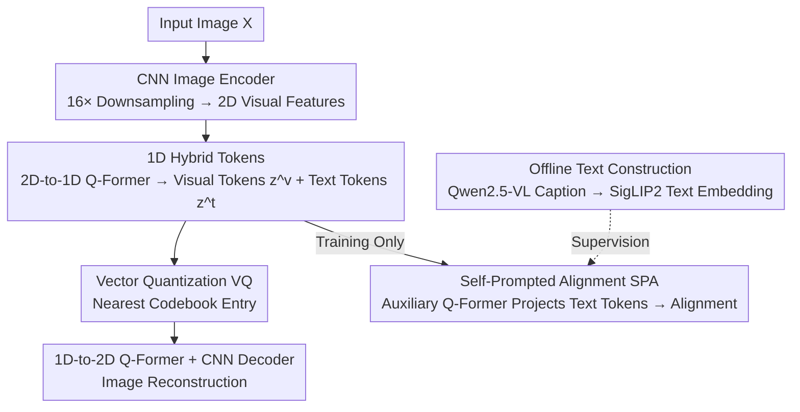

# Prompt Yourself: Awakening Textual Semantics in 1D Visual Tokenizers

**Conference**: CVPR 2026  
**Paper**: [CVF Open Access](https://openaccess.thecvf.com/content/CVPR2026/html/Wang_Prompt_Yourself_Awakening_Textual_Semantics_in_1D_Visual_Tokenizers_CVPR_2026_paper.html)  
**Code**: No repository link provided  
**Area**: Image Generation  
**Keywords**: 1D visual tokenizer, hybrid tokens, self-prompted alignment, image reconstruction, image generation

## TL;DR
VLTok functionally splits 1D visual token sequences into "visual tokens + text tokens." During training, Self-Prompted Alignment (SPA) distills fine-grained semantics from a pretrained text encoder into text tokens; during inference, the text encoder is discarded to maintain a vision-only workflow. On ImageNet, VLTok reduces rFID by 11.1% and gFID by 18.7% compared to GigaTok with the same parameter count.

## Background & Motivation
**Background**: Visual tokenizers compress images into discrete latent codes, serving as the cornerstone of image reconstruction and generation. Traditional 2D tokenizers preserve a grid where each token corresponds to a fixed patch; 1D tokenizers like TiTok discard the spatial grid entirely, encoding images into a short 1D token sequence with more compact semantics and fewer tokens.

**Limitations of Prior Work**: 1D representations lose local spatial priors, making it difficult to preserve fine-grained content. Figure 1 in the paper shows that FlexTok (an enhanced TiTok) produces factual errors such as "incorrect counts, unrealistic faces, mixed animal features, wrong poses, and missing objects." Existing remedies either stack model parameters (GigaTok pushes parameters to the billion level) or dynamically add tokens (ALIT, FlexTok), which are merely "surface-level mitigations" that significantly increase training/inference budgets without solving the **fundamental issue** of detail loss in 1D tokens.

**Key Challenge**: The compactness of 1D comes from discarding spatial priors, yet fine-grained fidelity precisely requires such information. Simply scaling models or adding tokens results in diminishing returns within the same visual channel (e.g., GigaTok expanded from 622M to 2.9B, but rFID improved by only 0.02).

**Goal**: Inject fine-grained textual semantics into the tokenizer to recover content lost in 1D encoding without breaking the "vision-only, lightweight" framework or introducing external text and text encoders during inference.

**Key Insight**: The authors observe that 1D tokenizers model images as "text-like sequences." This sequential structure naturally allows joint encoding of "how the image looks (visual)" and "what the image expresses (textual semantics)" within the same sequence. Existing text-injection methods either force external text during inference (TexTok/TA-TiTok) or perform global coarse alignment on 2D grids (VILA-U/UniTok via token pooling), neither of which are suitable for 1D fine-grained alignment.

**Core Idea**: Propose **1D hybrid tokens**, where part of the sequence consists of visual tokens and the other part consists of text tokens. Text tokens are generated directly from the image itself (self-prompted), aligned to pretrained text encoder embeddings during training, and require no external text during inference.

## Method

### Overall Architecture
VLTok follows the CNN-Transformer hybrid architecture of GigaTok. The key modification is functionally splitting the 1D token sequence into a visual subsequence $z^v$ and a text subsequence $z^t$. Forward flow: The CNN image encoder downsamples the image by $16\times$ to obtain 2D visual features; the 2D-to-1D Q-Former encodes the flattened 2D features along with visual/textual queries into hybrid 1D tokens; the vector quantizer quantizes each token to the nearest code in the codebook; the 1D-to-2D Q-Former decoder restores the quantized hybrid tokens into 2D features; finally, the CNN image decoder reconstructs the image. During training, a Self-Prompted Alignment (SPA) branch is attached: an auxiliary Q-Former projects text tokens into the embedding space of a pretrained text encoder (SigLIP2 by default), supervised by offline-generated image caption embeddings. During inference, only the forward backbone is executed; the SPA branch and text encoder are entirely discarded.

### Key Designs

**1. 1D Hybrid Tokens: Functionally Splitting the Sequence**

To address the issue where 1D tokens lose details and scaling is ineffective, the authors split the queries of the 2D-to-1D Q-Former into $N^v$ visual queries and $N^t$ text queries. Given image features $f^{2d}=E(X)$, the flattened 2D features are concatenated with both types of queries and fed into the encoder to obtain hybrid tokens: $z^v\perp z^t=E_{1d}(q^v\perp q^t\perp f^{2d})$, where $z^v\in\mathbb{R}^{N^v\times d}$, $z^t\in\mathbb{R}^{N^t\times d}$, and $\perp$ denotes token-level concatenation. Both segments pass through the same VQ: $\hat{z}_i=Q(z_i)=c_j,\ j=\arg\min_k\lVert z_i-c_k\rVert_2$, and then through the 1D-to-2D decoder for reconstruction. The key is that visual tokens focus on "how the image looks," while text tokens specifically capture linguistic cues about "what the image expresses" to correct content bias in pure visual representations—all within the same 1D sequence without increasing architectural complexity. Defaults are $N^v=224, N^t=32$ for 256 tokens and $N^v=96, N^t=32$ for 128 tokens.

**2. Self-Prompted Alignment (SPA): Fine-grained Distillation with Zero Inference Overhead**

Text tokens alone are insufficient; they need supervision to learn semantics. Conventional image-text contrastive losses using token pooling perform global coarse alignment, which is suboptimal for distilling fine-grained semantics into 1D text tokens. SPA utilizes fine-grained feature distillation: first, a pretrained text encoder $E_T$ (e.g., SigLIP2 or CLIP) encodes paired image captions into target embeddings $e_t=E_T(T)\in\mathbb{R}^{N^e\times D^e}$ offline. During training, an auxiliary Q-Former $E_{aux}$ (with $N^e$ queries $q^{te}$) predicts embeddings from projected 1D text tokens: $\hat{e}_t=E_{aux}(q^{te}\perp z^t)$. The alignment loss is the L2 distance in the embedding space: $L_{sp}=\lVert\hat{e}_t-e_t\rVert_2$. Since text tokens are generated from the image itself (self-prompted), no external text or text encoder is needed during inference, keeping the vision-only workflow intact. SPA is the primary contributor: ablations show it improves rFID from 0.90 to 0.72, gFID from 2.08 to 1.70, and linear probing accuracy from 66.2 to 69.9 (+3.7), validating that self-prompted semantics lead to reduced encoding bias.

**3. Offline Caption Construction and Text Encoder Selection**

SPA requires image-text pairs, but ImageNet-1K lacks captions. The authors use Qwen2.5-VL-7B to automatically generate 2-3 sentence descriptions for ImageNet images. Text embeddings are pre-extracted offline (zero overhead during inference, and auxiliary Q-Former adds only ~2% training FLOPs). Regarding text encoder choice, SigLIP2-so-400m outperformed discriminative models (CLIP-B/16) and generative models (T5-XL, Qwen2.5-VL-7B), indicating that discriminative text encoders provide better fine-grained semantic targets for distillation. Performance is also sensitive to caption quality; stronger multimodal captioners (Qwen2.5-VL > InternVL3-8B > LLaVA-Next-3B) lead to better downstream performance, though differences diminish between high-level models.

### Loss & Training
The total loss is based on GigaTok's standard optimizer loss (image reconstruction, PatchGAN adversarial, VQ reconstruction, and DINOv2 semantic regularization REPA), with the addition of the SPA alignment loss $L_{sp}$ (weighted at 1). The tokenizer is trained for 100 epochs with a batch size of 256. The generation frameworks (MaskGIT-UViT-L 287M / LlamaGen 111M) are trained for 300 epochs with a batch size of 2048 using AdamW, a learning rate of $10^{-4}$, and a cosine schedule. There is a trade-off in the number of text tokens: too many force the model to over-align cross-modality at the expense of visual reconstruction; Figure 4 shows the optimal range is 16-32.

## Key Experimental Results

### Main Results
ImageNet 256×256 Reconstruction and Generation (Lower rFID/gFID is better; ⋆ denotes identical architecture/tokens):

| Method | Params | Tokens | rFID↓ | Generation Framework | gFID↓ |
|------|------|--------|-------|----------|-------|
| TiTok-S | 72M | 128 | 1.71 | MaskGIT-UViT-L | 1.97 |
| GigaTok-B-L⋆ | 622M | 256 | 0.81 | LlamaGen⋆ 111M | 3.26 |
| GigaTok-XL-XXL | 2.9B | 256 | 0.79 | LlamaGen 111M | 3.15 |
| **Ours (VLTok-B-L)** | 622M | 128 | 1.01 | MaskGIT-UViT-L | **1.79** |
| **Ours (VLTok-B-L⋆)** | 622M | 256 | **0.72** | LlamaGen⋆ 111M | 2.65 |

With the same parameters (622M, 256 tokens), VLTok achieves a 0.09 lower rFID than GigaTok-B-L (0.72 vs 0.81, 11.1% improvement), surpassing even the 2.9B parameter GigaTok-XL-XXL (0.79). In generation, 128-token VLTok reduces gFID from TiTok's 1.97 to 1.79 (-0.18) in the MaskGIT framework, and 256-token VLTok reduces gFID from GigaTok's 3.26 to 2.65 (18.7% improvement) in the LlamaGen framework. 256-token VLTok achieves a PSNR of 26.12, outperforming TexTok's 24.38 without requiring external text tokens or a 3B T5 model.

### Ablation Study
SPA Module and Alignment Method (MaskGIT-UViT-L, 256 tokens):

| Configuration | rFID↓ | LPIPS↓ | gFID↓ | Linear Probing Acc↑ |
|------|-------|--------|-------|------|
| w/o SPA | 0.90 | 0.211 | 2.08 | 66.2 |
| w/ SPA (Full) | **0.72** | **0.203** | **1.70** | **69.9** |
| Gain (Δ) | -0.18 | -0.08 | -0.38 | +3.7 |

Comparison of alignment methods (128 tokens, rFID): Pure visual (no alignment) 1.42 → Image-text contrastive (w/ CL) 1.26 → Self-prompted alignment (w/ SPA) **1.01**. SPA reduces rFID by a further 24% relative to CL, demonstrating that fine-grained self-prompted distillation is significantly superior to global contrastive alignment.

### Key Findings
- SPA directly enhances representation capabilities: Linear probing accuracy +3.7 (66.2→69.9) proves that textual semantics are distilled into tokens rather than just improving pixel-level reconstruction.
- Text token count sweet spot: 16-32 is optimal; excessive tokens crowd out visual reconstruction capacity, representing a core trade-off in multimodal tokenization.
- Strong Generalization: Trained only on ImageNet (object-centric), VLTok shows rFID improvements of 23.9%–43.4% on OOD domains like AFHQ and FFHQ, suggesting textual semantics fill gaps that pure visual features cannot.

## Highlights & Insights
- **"Self-Prompting" converts multimodal gains into zero inference overhead**: By generating text tokens from the image itself and discarding the text dependencies during inference, VLTok gains semantic benefits without breaking the vision-only flow.
- **Boosting fidelity without scaling**: Outperforming the 4.7× larger GigaTok-XL-XXL suggests that the bottleneck for 1D tokens is "semantic deficiency in the channel" rather than "insufficient capacity," providing an orthogonal path to scaling laws.
- **Fine-grained distillation > Global contrastive**: Switching from standard contrastive loss to embedding-space L2 distillation (w/ SPA 1.01 vs w/ CL 1.26) clearly indicates that 1D tokenizers require fine-grained signals, a transferable insight for discrete representation learning.

## Limitations & Future Work
- SPA relies on an external multimodal captioner (Qwen2.5-VL-7B) to generate captions offline; quality is susceptible to caption noise or hallucinations.
- Additional costs during training and data construction (caption generation ~1.03s/image, auxiliary Q-Former adds 2% FLOPs).
- Note: Some numerical values in Table 5 / Figure 4 from the source may have minor alignment variations; refer to the original tables for definitive values.

## Related Work & Insights
- **vs TiTok / GigaTok / FlexTok (Pure 1D Visual Tokenizers)**: Prior works scale parameters or dynamically add tokens to mitigate loss. VLTok injects textual semantics into the same structure, performing better with the same parameters.
- **vs TexTok / TA-TiTok (External Text Injection)**: These require external text and heavy text encoders during inference. VLTok keeps the process vision-only via self-prompting and achieves higher PSNR.
- **vs VILA-U / UniTok (2D + Contrastive Alignment)**: These use coarse global alignment on 2D grids which fails to provide effective signals for 1D tokenizers. VLTok performs fine-grained distillation in 1D latent space.

## Rating
- Novelty: ⭐⭐⭐⭐⭐ "1D Hybrid Token + SPA" is a clean, original approach for zero-inference-overhead multimodal semantics.
- Experimental Thoroughness: ⭐⭐⭐⭐ Solid results across reconstruction/generation and OOD generalization, though focused primarily on ImageNet.
- Writing Quality: ⭐⭐⭐⭐ Clear chain of logic from motivation to architecture to ablation.
- Value: ⭐⭐⭐⭐ Points toward "semantic injection" over "parameter scaling" for 1D tokenizers.

<!-- RELATED:START -->

## Related Papers

- [\[CVPR 2026\] VibeToken: Scaling 1D Image Tokenizers and Autoregressive Models for Dynamic Resolution Generations](vibetoken_scaling_1d_image_tokenizers_and_autoregressive_models_for_dynamic_reso.md)
- [\[CVPR 2026\] BioVITA: Biological Dataset, Model, and Benchmark for Visual-Textual-Acoustic Alignment](biovita_biological_dataset_model_and_benchmark_for_visual-textual-acoustic_align.md)
- [\[CVPR 2026\] Thinking-while-Generating: Interleaving Textual Reasoning throughout Visual Generation](thinking-while-generating_interleaving_textual_reasoning_throughout_visual_gener.md)
- [\[CVPR 2026\] Rethinking Prompt Design for Inference-time Scaling in Text-to-Visual Generation](rethinking_prompt_design_for_inference-time_scaling_in_text-to-visual_generation.md)
- [\[ICLR 2026\] Aligning Visual Foundation Encoders to Tokenizers for Diffusion Models](../../ICLR2026/image_generation/aligning_visual_foundation_encoders_to_tokenizers_for_diffusion_models.md)

<!-- RELATED:END -->
