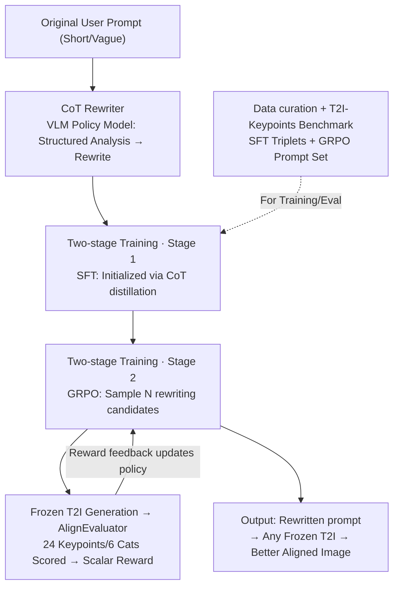

# PromptEnhancer: Taming Your Rewriter for Text-to-Image Generation via Fine-Grained Reward

**Conference**: CVPR 2026  
**Paper**: [CVF Open Access](https://openaccess.thecvf.com/content/CVPR2026/html/Wang_PromptEnhancer_Taming_Your_Rewriter_for_Text-to-Image_Generation_via_Fine_Grained_Reward_CVPR_2026_paper.html)  
**Code**: Project Page https://hunyuanpromptenhancer.github.io  
**Area**: Image Generation / Text-to-Image / RL Alignment  
**Keywords**: Text-to-Image, prompt rewriting, fine-grained reward, GRPO, Chain-of-Thought (CoT)

## TL;DR
To address the issue where T2I models struggle with complex prompts (attribute binding, negation, and compositional reasoning), this paper proposes PromptEnhancer—a model-agnostic rewriting framework that does not modify T2I weights. It initializes a rewriter using CoT data via SFT and then performs policy alignment using GRPO with AlignEvaluator, a specialized reward model scoring 24 fine-grained keypoints. This allows the rewriter to transform short, vague user prompts into structured, detailed descriptions that any frozen T2I can accurately execute, achieving an average improvement of 5.1 points in text-to-image alignment.

## Background & Motivation
**Background**: Large-scale T2I diffusion models can generate high-fidelity images, but outputs rely heavily on prompt quality. In practice, user prompts are often short and vague, leading to failures in capturing constraints like attribute binding, negation, and spatial relationships. Prompt rewriting is seen as a solution.

**Limitations of Prior Work**: Existing rewriting methods lack universality. One type is deeply coupled with specific generators (joint training/adapter), necessitating retraining for different T2Is. Another type relies on coarse-grained rewards (CLIP score, general preference models), which lack corrective power for "fine-grained prompt following" failures—CLIP is insensitive to details and has token length limits.

**Key Challenge**: To make a rewriter both **universal** (plug-and-play with any frozen T2I) and **precise in error correction** (targeting failure modes like attribute binding/negation), a training signal is needed that captures T2I failure patterns and provides interpretable feedback. General LLMs (like GPT-4) lack domain-specific insights into T2I failures, and coarse rewards are insufficiently detailed.

**Goal**: Train an image-generation-decoupled, model-agnostic rewriter to transform under-determined prompts into structured descriptions, aligning the strategy with downstream text-image alignment via T2I-specific fine-grained rewards.

**Key Insight**: Completely **decouple** prompt refinement from image generation—the rewriter modifies the prompt while the T2I remains frozen. The rewriting process uses Chain-of-Thought (CoT) for explicit semantic analysis and disambiguation. The reward system scores based on a taxonomy of T2I failure modes (24 keypoints).

**Core Idea**: Use a "CoT Rewriter + fine-grained reward model AlignEvaluator + two-stage (SFT $\rightarrow$ GRPO) training" to let the rewriter learn to be "faithful to user intent and executable for T2Is" rather than just "writing longer."

## Method

### Overall Architecture
PromptEnhancer consists of three components: **CoT Rewriter** (a VLM-based policy model), **AlignEvaluator** (a reward model scoring image-prompt pairs on 24 keypoints), and a **frozen off-the-shelf T2I model**. The rewriter undergoes two-stage training: Stage 1 uses distilled CoT data for SFT to gain structured analysis capabilities; Stage 2 uses GRPO for policy alignment, where $N$ candidates are sampled, images are generated via the frozen T2I, and AlignEvaluator provides rewards. The data is produced via a multi-stage curation pipeline, accompanied by the T2I-Keypoints-Align benchmark.

### Key Designs

**1. CoT Rewriter: Explicit Structured Reasoning for Rewriting**
Addressing vague prompts and missing constraints, the rewriter (built on a large VLM) generates a Chain-of-Thought instead of a direct long prompt. It identifies key semantic elements, resolves ambiguity, and makes implicit constraints (attributes, layout, interactions) explicit before producing the final prompt. This ensures the output is targeted rather than just a collection of adjectives.

**2. Two-stage Training: SFT Initialization + GRPO Downstream Alignment**
SFT alone produces plausible long prompts but lacks alignment with downstream image generation. Stage 1 (SFT) uses distillation data (triplets of "Prompt $\rightarrow$ CoT $\rightarrow$ Rewritten Prompt") from Gemini-2.5-Pro and DeepSeek-V3 for initialization. Stage 2 (GRPO) aligns the policy with fine-grained preferences: for each prompt $p$, sample $N$ candidates $\{p'_1, \dots, p'_N\}$, generate images $x_i$, and use $r_i = \text{AlignEvaluator}(x_i, p'_i)$ as the reward for GRPO. Ablations (Table 5) show: Baseline 81.0% $\rightarrow$ SFT(w/ CoT) 85.29% $\rightarrow$ GRPO 88.15%.

**3. AlignEvaluator: Fine-grained Reward via 24 T2I Failure Keypoints**
AlignEvaluator moves beyond coarse CLIP scores by decomposing alignment into **6 categories and 24 keypoints**: Linguistic/Grammar (negation, attribute consistency), Visual Attributes (counting, size, expression), Actions & Interactions (contact, status), Relations & Composition (comparison, layout, binding), World Knowledge (counterfactuals), and In-image Text (rendering, layout). Fine-tuned from Qwen2.5-VL-32B-Instruct, it provides a scalar reward by averaging scores across these specific failure modes.

**4. Data Curation & T2I-Keypoints Benchmark**
The SFT pipeline includes: ① User prompt simulation from image captions; ② Gemini-2.5-Pro generation of CoT and candidates; ③ Automated filtering to remove semantic drift (611k samples); ④ Human-in-the-loop selection to yield 485,119 SFT triplets. A separate set of 50k prompts is used for GRPO. The T2I-Keypoints-Align benchmark (6,687 prompts) evaluates both concise intents and long compositional descriptions.

### Loss & Training
SFT phase: Hunyuan-7B-Instruct, LR $1\times10^{-5}$, cosine schedule, 2 epochs, batch size 128. GRPO phase: LR $1\times10^{-6}$, constant schedule, 1 epoch, batch size 64, $N=8$ rollouts, KL coefficient 0.001. Base T2I is Hunyuan-Image 2.1 (frozen).

## Key Experimental Results

### Main Results
Evaluation using Qwen-Image and HY-Image 2.1 against original prompts and BeautifulPrompt (BP).

| Benchmark | Base T2I | Original | +BP | +PE (Ours) |
|------|----------|------|-----|-----|
| GenEval Overall↑ | Qwen-Image | 0.84 | 0.85 | **0.86** |
| GenEval Overall↑ | HY-Image 2.1 | 0.80 | 0.81 | **0.82** |
| CompBench Spatial↑ | Qwen-Image | 0.3222 | 0.1945 | **0.4472** |
| CompBench Color↑ | Qwen-Image | 0.7962 | 0.5899 | **0.8442** |
| CompBench Numeracy↑ | HY-Image 2.1 | 0.6772 | 0.4943 | **0.7434** |

Ours (PE) consistently improves GenEval. Notably, on T2I-CompBench, BP often performs **worse** than original prompts, suggesting "beautifying" prompts can harm composition, whereas fine-grained reward-driven rewriting provides positive gains.

### Ablation Study

| Configuration | Score | Note |
|------|-------|------|
| Baseline (No Rewriting) | 81.0% | Original prompt |
| SFT w/o CoT | 86.0% | SFT only, no CoT |
| SFT w/ CoT | 85.29% | SFT with CoT supervision |
| GRPO (Final) | **88.15%** | CoT-SFT + GRPO |

### Key Findings
- CoT supervision and reward-based optimization (GRPO) are complementary; the value of CoT is fully realized after GRPO.
- Gains are concentrated in "reasoning/composition" categories: Similarity (+17.3), Counterfactuals (+17.2), Counting (+15.0), and Entity Binding (+11.3).
- Coarse rewriters (BP) failing on CompBench confirms that fine-grained rewards are critical for validity, not just prompt length.

## Highlights & Insights
- **Decoupled Architecture**: Since the rewriter is model-agnostic and the T2I is frozen, it serves as a universal plug-and-play module.
- **Interpretable Reward**: Decomposing alignment into a 24-keypoint taxonomy provides a precise signal for optimization and a reusable evaluation framework.
- **SFT-GRPO Synergy**: SFT defines the reasoning form, while GRPO provides the alignment direction, proving to be a clean implementation of the RLHF pipeline for rewriting.

## Limitations & Future Work
- Minor negative transfer in categories like text layout (-0.7) and non-contact interaction (-0.9), potentially due to over-optimization of certain dimensions.
- High reproduction cost due to heavy reliance on strong teacher models (Gemini/DeepSeek) for 480k distilled samples.
- AlignEvaluator's ceiling is limited by its training data (6,687 annotated samples).

## Related Work & Insights
- **vs. Coarse Rewards (CLIP)**: CLIP cannot correct fine-grained failures; Ours uses 24 specific keypoints.
- **vs. Coupled Rewriting**: Coupled methods require retraining per model; Ours is cross-model plug-and-play.
- **vs. Coupled CoT**: Prior methods integrate reasoning into the T2I architecture; Ours keeps it in the rewriting stage for modularity.

## Rating
- Novelty: ⭐⭐⭐⭐
- Experimental Thoroughness: ⭐⭐⭐⭐
- Writing Quality: ⭐⭐⭐⭐
- Value: ⭐⭐⭐⭐⭐

<!-- RELATED:START -->

## Related Papers

- [\[CVPR 2026\] SpatialReward: Verifiable Spatial Reward Modeling for Fine-Grained Spatial Consistency in Text-to-Image Generation](spatialreward_verifiable_spatial_reward_modeling_for_fine-grained_spatial_consis.md)
- [\[CVPR 2026\] CogniEdit: Dense Gradient Flow Optimization for Fine-Grained Image Editing](cogniedit_dense_gradient_flow_optimization_for_fine-grained_image_editing.md)
- [\[CVPR 2026\] Fine-Grained GRPO for Precise Preference Alignment in Flow Models](fine-grained_grpo_for_precise_preference_alignment_in_flow_models.md)
- [\[CVPR 2026\] SkyReels-Text: Fine-Grained Font-Controllable Text Editing for Poster Design](skyreels-text_fine-grained_font-controllable_text_editing_for_poster_design.md)
- [\[CVPR 2026\] Enhancing Spatial Understanding in Image Generation via Reward Modeling](enhancing_spatial_understanding_in_image_generation_via_reward_modeling.md)

<!-- RELATED:END -->
