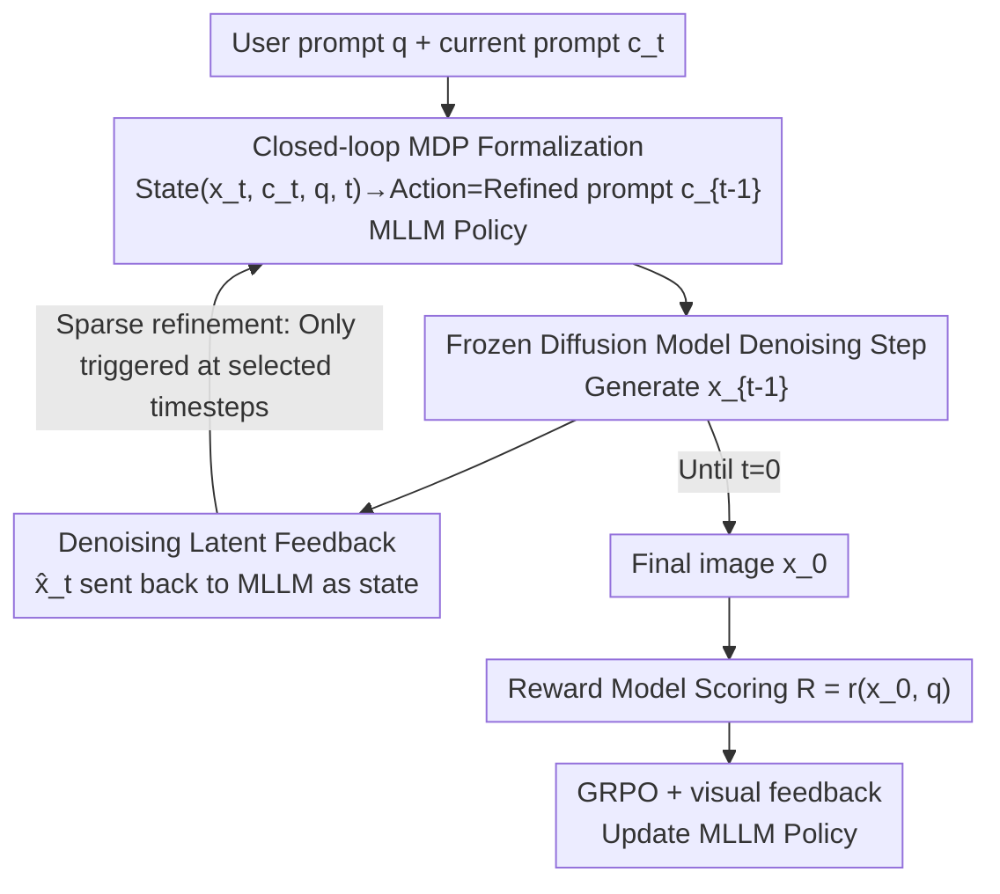

# PromptLoop: Plug-and-Play Prompt Refinement via Latent Feedback for Diffusion Model Alignment

**Conference**: CVPR 2026  
**Paper**: [CVF Open Access](https://openaccess.thecvf.com/content/CVPR2026/html/Lee_PromptLoop_Plug-and-Play_Prompt_Refinement_via_Latent_Feedback_for_Diffusion_Model_CVPR_2026_paper.html)  
**Code**: To be confirmed  
**Area**: Diffusion Models / Reward Alignment / Reinforcement Learning  
**Keywords**: Diffusion Model Alignment, prompt refinement, closed-loop RL, latent feedback, MLLM policy  

## TL;DR
PromptLoop utilizes a multimodal large language model (MLLM) trained via Reinforcement Learning (RL) as a policy to **step-by-step** read intermediate latent variables and iteratively rewrite prompts during the diffusion sampling process. This allows a "prompt refinement only, no weight modification" alignment approach to achieve a closed-loop structure isomorphic to direct fine-tuning of diffusion model weights, thereby improving reward alignment, enhancing cross-model generalization, and suppressing reward hacking in a plug-and-play manner, with an inference overhead increase of only approximately 20%.

## Background & Motivation
**Background**: Preference alignment for diffusion models follows two mainstream paths. One involves direct RL fine-tuning of diffusion model weights (e.g., DDPO, Diffusion-DPO, ReFL), using PPO/DPO to inject rewards such as aesthetics, safety, and human preference into model parameters. The other involves prompt refinement, where an LLM/MLLM rewrites the user prompt, sometimes with the refiner itself trained via RL.

**Limitations of Prior Work**: Direct weight modification methods suffer from poor generalization (fine-tuning on one model often fails when switching to another backbone), lack composability (difficult to stack multiple enhancements), and are prone to reward hacking and over-optimization. Existing prompt refinement methods, while preserving advantages like cross-model compatibility and orthogonal composability, are almost entirely **feed-forward**: they generate a refined prompt once and use it for the entire sampling trajectory, failing to exploit the sequential evolution intrinsic to diffusion denoising.

**Key Challenge**: The effectiveness of RL for diffusion models stems from its operation within a **closed-loop feedback** system—each denoising step generates $x_{t-1}$ conditioned on the current latent $x_t$, allowing parameters to interact continuously with intermediate states. In contrast, feed-forward prompt refinement is open-loop: the action (prompt modification) occurs only once, oblivious to how intermediate latents evolve. This represents a fundamental structural gap between prompt-based and weight-based alignment routes.

**Goal**: To equip prompt refinement with a closed-loop feedback structure isomorphic to Diffusion RL without modifying the diffusion model weights, while retaining modularity, generalization, and composability.

**Key Insight**: Since the essence of Diffusion RL is "state = intermediate latent, action = next denoising step," prompt refinement can be reformulated as a Markov Decision Process (MDP) where the state includes intermediate latents and the action is the "refined prompt." An MLLM policy can then read latents at each (or some) denoising step and inject new prompts into subsequent steps.

**Core Idea**: Replace the feed-forward "single-shot refinement" with a closed-loop strategy of "step-by-step latent reading and prompt refinement," bringing prompt-level alignment functional performance closer to weight-level fine-tuning.

## Method

### Overall Architecture
PromptLoop treats the entire reverse diffusion sampling process as a $T$-step MDP. At each step, the state consists of the current latent, the current prompt, the original user query, and the timestep $s_t=(x_t,c_t,q,t)$. The action is the refined prompt $a_t=c_{t-1}$ output by the MLLM policy $\pi_\theta$. A frozen diffusion model uses the new prompt to transition the latent to $x_{t-1}$, continuing until $t=0$ to obtain the final image $x_0$, which receives a terminal reward $R=r(x_0,q)$ from a reward model. Both the diffusion and reward models are treated as black boxes without gradient backpropagation; the MLLM policy is updated via GRPO using observed rewards. Consequently, "prompt modification" is integrated into a closed-loop with intermediate feedback, similar to "weight modification."

### Key Designs

**1. Closed-loop MDP Formalization: Structuring prompt refinement to be isomorphic with Diffusion RL**

Addressing the core pain point that feed-forward prompt refinement cannot see intermediate latents and is disconnected from weight-level RL, PromptLoop defines the reverse diffusion process as an MDP: state $s_t=(x_t,c_t,q,t)$, action $a_t=c_{t-1}$ sampled from MLLM policy $\pi_\theta(\cdot\mid s_t)$, and transition via a frozen diffusion model $x_{t-1}=f(x_t,z_t,c_{t-1},t)$. In comparison, Diffusion RL that trains weights uses state $(x_t,q,t)$ and action $x_{t-1}$. The primary difference is that Diffusion RL lets the diffusion model act as both policy and environment, whereas PromptLoop uses the MLLM as the policy and the diffusion model as the environment. This timestep-aware closed loop allows prompt-level actions to functionally approximate weight-level control while remaining plug-and-play, composable, and more robust to reward hacking—due to the discrete and abstract nature of prompts providing a buffer between reward optimization and parameter updates.

**2. Denoising Latent Feedback: Using $\hat{x}_t$ closer to the data manifold as MLLM input**

Feeding noisy latents $x_t$ directly to an MLLM provides weak semantics, as MLLMs cannot interpret unstructured noise. Ours converts the noisy latent into a denoised estimate $\hat{x}_t=\frac{1}{\sqrt{\bar\alpha_t}}\big(x_{t+1}-\sqrt{1-\bar\alpha_t}\,\hat\epsilon_\theta(x_{t+1},c_t,t)\big)$, which is closer to the true image manifold. This provides semantically meaningful visual feedback for the policy, allowing the MLLM to judge where the current generation is deviating and how the prompt should be adjusted. This step is the source of "visual feedback" in the loop; ablations show that visual feedback during training significantly raises the target reward without degrading other metrics and helps mitigate reward hacking.

**3. Sparse Refinement Strategy: Refining only at a few timesteps to minimize overhead**

The primary cost of a closed loop is invoking the MLLM at every denoising step, which is prohibitive regarding VRAM and time. PromptLoop restricts refinement to a sparse set of timesteps $R\subseteq\{1,\dots,T\}$ with size $|R|=N_R$: the policy triggers only at these steps, and the refined prompt is used until the next refinement step. During training, $R$ is sampled uniformly at random; during inference, it is selected deterministically at equal intervals—allowing the policy to generalize to **any number** of refinement steps. Furthermore, the authors found that visual feedback is not strictly necessary during inference: once the policy learns the environment's transition dynamics, it can generate prompts for all timesteps **in advance** in a single pass. This allows the diffusion process to proceed without interruption, ensuring easy integration like feed-forward methods while retaining the alignment gains of closed-loop RL. With a default of 5 refinement steps, inference time increases only from 15s/img to 18s/img ($\times 1.23$).

**4. GRPO Optimization + Black-box Rewards: Group-normalized advantages for reward-driven training**

Since the diffusion and reward models are black boxes without available gradients, the policy is updated solely based on observed rewards. Ours employs token-level GRPO: sampling $G$ outputs for the same prompt and using group-normalized advantages $A_i=\frac{r_i-\mathrm{mean}(\{r_j\})}{\mathrm{std}(\{r_j\})}$ instead of standard PPO advantage estimation. Combined with a clipped surrogate objective and KL penalty, this reduces variance and stabilizes training. Each episode samples initial prompts from a prompt dataset for online on-policy training. This design enables stable convergence even with sparse signals from terminal rewards.

### Loss & Training
Training utilizes GRPO (a group-normalized variant of PPO), with the objective being a clipped surrogate plus a KL penalty: $L_{\text{PPO}}(\theta)=\mathbb{E}_t[\min(\rho_t\hat{A}_t,\ \mathrm{clip}(\rho_t,1-\epsilon,1+\epsilon)\hat{A}_t)]-\lambda\,\mathrm{KL}[\pi_{\theta_{old}}\Vert\pi_\theta]$, where the importance ratio is $\rho_t=\pi_\theta(a_t\mid s_t)/\pi_{\theta_{old}}(a_t\mid s_t)$ and advantages use group-normalized rewards. The MLLM is fine-tuned using LoRA, while the diffusion and reward models remain frozen with black-box access. The refinement step set $R$ is randomized during training and fixed via equal intervals during inference. Rewards can be switched arbitrarily (ImageReward, Aesthetics, Safety, Human Preference, or a combination).

## Key Experimental Results

> Metric Descriptions: **ImageReward** is a common neural reward for human preference/prompt alignment; **HPSv2** is the Human Preference Score; **Aesthetics** is an aesthetic scoring model; **MLLM Score** is an alignment score from an MLLM; **GenEval** measures object-centric prompt alignment (higher is better).

### Main Results
Single reward alignment (ImageReward, A100, prompts from Pick-a-Pic v2): PromptLoop can be stacked on various backbones and existing alignment methods in a plug-and-play manner, pushing nearly all metrics higher.

| Training Setting | Method | ImageReward | HPSv2 | Aesthetics | MLLM Score |
|----------|------|-------------|-------|------------|------------|
| SDXL & IR | SDXL (Original) | 0.7244 | 0.2805 | 6.073 | 0.735 |
| SDXL & IR | + RePrompt | 1.0148 | 0.2796 | 6.518 | 0.763 |
| SDXL & IR | **+ PromptLoop** | **1.0948** | **0.2807** | **6.583** | **0.764** |
| SDXL & IR | SDXL + Diffusion-DPO | 0.9921 | 0.2868 | 6.015 | 0.731 |
| SDXL & IR | + PromptLoop (Orthogonal) | **1.2898** | **0.2862** | **6.491** | **0.763** |
| SD1.5 & IR | SD1.5 + DDPO | 0.6051 | 0.2726 | 5.562 | 0.693 |
| SD1.5 & IR | + PromptLoop (Orthogonal) | **0.9842** | **0.2742** | **5.926** | **0.726** |

It is observed that PromptLoop can independently increase the ImageReward of original SDXL from 0.72 to 1.09, and can also be orthogonally stacked on Diffusion-DPO / DDPO for further gains (e.g., 0.99→1.29 on DPO), confirming its position as an enhancement rather than a replacement for existing methods. Under combined rewards (SDXL-turbo, RePrompt-style multi-reward), ImageReward was pulled from 0.78 to 0.85, with simultaneous improvements in GenEval and HPSv2, generalizing to diffusion backbones unseen during training.

### Ablation Study
Single reward (ImageReward) + SD1.5, components added sequentially:

| Configuration | ImageReward | HPSv2 | MLLM Score | Description |
|------|-------------|-------|------------|------|
| SD1.5 | 0.0816 | 0.2678 | 0.675 | Original Baseline |
| + policy model (no training) | -0.2315 | 0.2617 | 0.681 | MLLM refinement via system prompt only, causing performance drop |
| + GRPO training | 0.4344 | 0.2684 | 0.722 | Significant improvement after training the policy |
| + multi-step refinement (5 steps) | 0.4912 | 0.2690 | 0.724 | Multiple refinements within a single trajectory further improve performance |
| + Visual Feedback | **0.6320** | **0.2701** | **0.725** | Visual feedback during training significantly boosts target reward and mitigates reward hacking |

Inference Overhead (A100×1, batch=8):

| Refinement Steps | Inference Time (s/img) | Relative Time |
|----------|------------------|----------|
| 0 (Original SDXL) | 15.00 | 1.00 |
| 1 | 15.73 | 1.05 |
| 3 | 16.95 | 1.13 |
| 5 | 18.43 | 1.23 |

### Key Findings
- **Non-trained MLLM refinement results in a performance drop** (-0.2315), indicating the value is not in "using a stronger model to rewrite prompts" but in training the policy into the closed-loop dynamics via GRPO—performance returns to 0.43 immediately after training.
- **Visual feedback is the key piece of the isomorphic MDP**: without it, gains from increasing refinement steps represent a diminishing return; its presence creates the closed-loop structure mirroring Diffusion RL.
- **Increasing refinement steps does not increase diffusion sampling steps**, yet simultaneously raises rewards and other metrics, suggesting gains come from "progressive prompt correction" rather than longer sampling.
- **Qualitative analysis reveals reward hacking**: while methods like ReFL inflate ImageReward scores through mechanisms resembling reward hacking (unseen by metrics like HPS/Aesthetics), PromptLoop provides more stable qualitative results, suggesting robustness against over-optimization.

## Highlights & Insights
- **Isomorphism between "Prompt Refinement" and "Weight Modification"**: Upgrading feed-forward prompt refinement to a closed-loop MDP aligns prompt-level alignment structurally with Diffusion RL. This explains why prompt-based routes previously underperformed compared to weight-based routes (lack of feedback loop) and provides a specific recipe to bridge this gap.
- **Training with feedback, Inference without**: Once the policy learns environment dynamics, inference can pre-calculate prompts for all timesteps, avoiding sampling interruptions. This "training in closed-loop, inference in open-loop" approach captures RL benefits with the ease of feed-forward integration.
- **Plug-and-Play + Orthogonal Composability**: The MLLM policy size is fixed, requiring no retraining when switching backbones, and can be layered on top of existing alignment methods like DPO/DDPO/NPNet.
- **Sparse Refinement Generalization**: Training with randomized refinement steps allows a single policy to generalize to any number of steps during inference, a technique transferable to other tasks requiring variable-step inference.

## Limitations & Future Work
- **VRAM/Compute Costs of Closed Loop**: During training, the MLLM and diffusion model must reside in VRAM simultaneously with per-step MLLM calls. Although sparse refinement mitigates this, training costs remain higher than pure feed-forward refinement.
- **Reward Quality Ceiling**: The method essentially optimizes for a given reward; if the reward model itself is biased (e.g., ImageReward is hackable), PromptLoop suppresses over-optimization but cannot fix errors inherent to the reward model. ⚠️ Mitigation of reward hacking is primarily shown via qualitative images, lacking quantitative metrics.
- **Assumptions for Inference without Visual Feedback**: Pre-calculating prompts relies on the "policy having learned environmental transition dynamics," the robustness of which for OOD prompts or unseen backbones is not fully quantified.
- **Controllability of MLLM Refinement**: There is a lack of specialized fidelity evaluation regarding how much prompts deviate from original user intent after repeated refinement.

## Related Work & Insights
- **vs Diffusion RL (DDPO / Diffusion-DPO / ReFL)**: These methods directly train weights, suffering from poor generalization and reward hacking. PromptLoop achieves an isomorphic structure through prompt modification alone, allowing for orthogonal enhancement of these methods.
- **vs Feed-forward Prompt Refinement (RePrompt / Qwen2.5-VL)**: These produce a single prompt for the entire process without intermediate latent feedback. PromptLoop yields systematically superior alignment by reading latents and refining prompts step-by-step.
- **vs External Iterative Feedback Refinement**: Those methods place feedback after full sampling or in external loops. PromptLoop embeds refinement directly into a single diffusion sampling pass, enabling fine-grained adaptive control and higher efficiency.

## Rating
- Novelty: ⭐⭐⭐⭐⭐ The perspective of "prompt refinement = closed-loop MDP isomorphic to Diffusion RL" is clear and highly explanatory.
- Experimental Thoroughness: ⭐⭐⭐⭐ Covers multiple backbones, rewards, orthogonality, generalization, and overhead, though reward hacking mitigation is somewhat qualitative.
- Writing Quality: ⭐⭐⭐⭐ Motivation and isomorphic relationships are explained thoroughly with clear diagrams.
- Value: ⭐⭐⭐⭐ High utility for diffusion alignment due to its plug-and-play nature, low overhead, and composability.

<!-- RELATED:START -->

## Related Papers

- [\[CVPR 2026\] DA-VAE: Plug-in Latent Compression for Diffusion via Detail Alignment](da-vae_plug-in_latent_compression_for_diffusion_via_detail_alignment.md)
- [\[CVPR 2026\] RAISE: Requirement-Adaptive Evolutionary Refinement for Training-Free Text-to-Image Alignment](raise_requirement-adaptive_evolutionary_refinement_for_training-free_text-to-ima.md)
- [\[ICLR 2026\] RNE: plug-and-play diffusion inference-time control and energy-based training](../../ICLR2026/image_generation/rne_plug-and-play_diffusion_inference-time_control_and_energy-based_training.md)
- [\[ICCV 2025\] Trans-Adapter: A Plug-and-Play Framework for Transparent Image Inpainting](../../ICCV2025/image_generation/trans-adapter_a_plug-and-play_framework_for_transparent_image_inpainting.md)
- [\[CVPR 2026\] SpeeDiff: Scalable Pixel-Anchored End-to-End Latent Diffusion Model](speediff_scalable_pixel-anchored_end-to-end_latent_diffusion_model.md)

<!-- RELATED:END -->
