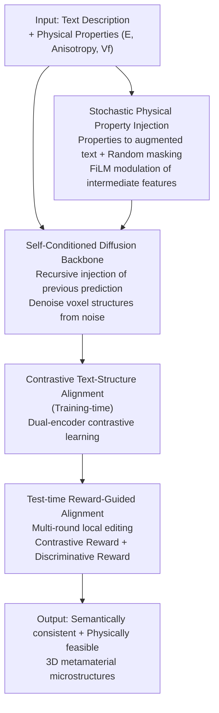

# Property-Informed Diffusion-Based Text-to-Microstructure Generation

**Conference**: CVPR 2026  
**Paper**: [CVF Open Access](https://openaccess.thecvf.com/content/CVPR2026/html/Dai_Property-Informed_Diffusion-Based_Text-to-Microstructure_Generation_CVPR_2026_paper.html)  
**Code**: https://github.com/hongsong-wang/PropDiff-TMG  
**Area**: Diffusion Models  
**Keywords**: Text-to-microstructure generation, Metamaterial inverse design, Self-conditioned diffusion, Cross-modal alignment, Test-time reward guidance  

## TL;DR
PropDiff-TMG utilizes a self-conditioned 3D diffusion model to directly generate 3D metamaterial microstructures from natural language descriptions (augmented with physical quantities such as Young's modulus, anisotropy, and volume fraction). A dual-alignment mechanism—comprising "contrastive alignment during training + reward-guided alignment during testing"—ensures the generated structures are both semantically consistent and physically feasible. On the Geometries 2000 dataset, it reduces FID from 72.08 to 70.81, improves CLIP score from 0.56 to 0.69, and decreases CD from 0.093 to 0.040.

## Background & Motivation
**Background**: The macroscopic properties of metamaterials are primarily determined by their internal microstructures rather than the material selection itself. Given a set of target physical properties, deriving the corresponding microstructure (inverse design) is a core task in materials science. Traditional approaches rely on numerical methods like phase-field modeling and topology optimization. Recently, data-driven generative models (e.g., diffusion models conditioned on mechanical properties) have begun accelerating the exploration of vast design spaces.

**Limitations of Prior Work**: Traditional numerical methods are interpretable and physics-compliant but depend heavily on domain experts, hand-crafted design spaces, and computationally expensive iterative solvers. Existing deep learning methods enable data-driven design but mostly require expert-defined conditions or parameter controls (structured numerical conditions), making it difficult for non-expert users to express requirements directly. Few text-driven works (e.g., Txt2Microstruct-Net) exist; they are either not end-to-end (generating 2D representations followed by 3D post-processing) or use simple MLPs to align text with 3D voxels, resulting in poor alignment and requiring multi-stage training.

**Key Challenge**: There is a conflict between the need for accessibility (using natural language as a rich, interactive interface) and rigid constraints (generated microstructures must be semantically accurate and physically manufacturable/functional). Balancing text semantics and physical feasibility is difficult, especially given the semantic shift of general language models when dealing with specialized material domain terminology.

**Goal**: Develop a fully automatic, robust, and generalizable framework that takes text inputs (optionally augmented with physical properties) to generate high-quality 3D metamaterial microstructures end-to-end, ensuring both semantic consistency and physical rationality.

**Key Insight**: Quantitative physical properties are treated as augmented text conditions and fed into the diffusion model alongside semantic descriptions. This unified text interface carries both semantic and physical constraints. Alignment is then added at both the training and testing stages to correct the domain shift of general language models and steer generation results toward high-reward regions.

**Core Idea**: Self-conditioned diffusion handles stable voxel microstructure generation from text; FiLM provides fine-grained modulation via stochastic physical property injection; and a dual-alignment strategy—contrastive alignment (training) + reward-guided alignment (testing)—secures both semantic and physical consistency.

## Method

### Overall Architecture
PropDiff-TMG represents each 3D microstructure as a voxel grid. The pipeline consists of three stages: first, **self-conditioned diffusion** generates microstructures from semantic text; second, **stochastic physical property injection** translates quantitative metrics like Young's modulus into augmented text, modulating intermediate features via FiLM; finally, a **dual-alignment strategy**—training-time contrastive text-structure alignment and test-time reward-guided alignment—tightens semantic and physical consistency. The first two stages determine "how to generate," while the third stage determines "whether the generation is correct/optimal."

### Key Designs

**1. Self-Conditioned Diffusion Backbone: Looking at current noise and previous predictions**

Based on DDPM, the forward process adds noise to clean samples $x_0$ via $x_t = \sqrt{\gamma_t}\, x_0 + \sqrt{1-\gamma_t}\,\epsilon$ (where $\epsilon \sim \mathcal{N}(0, I)$ and $\gamma_t$ smooths from 1 to 0). The reverse process uses a U-Net-like 3D network to reconstruct $x_0$ from $x_t$. To improve reconstruction quality and stability over simple denoising, **self-conditioning** is employed: the model's prediction from the previous step $\hat{x}'_0$ is fed back as an auxiliary input, allowing the network to refine estimates using context beyond the current noise:

$$\hat{x}_0 = f(x_t,\ \hat{x}'_0,\ t,\ z^d_i)$$

During training, $\hat{x}'_0 = f(x_t, 0, t, z^d_i)$ is set to the previous prediction with a 50% probability and zeroed otherwise. This stochastic zeroing prevents over-reliance on previous outputs and suppresses error accumulation. The text condition $z^d_i$ is encoded by a pretrained text encoder, combined with sinusoidal time embeddings, and injected via classifier-free guidance. The training objective is the reconstruction loss $L_{con} = \mathbb{E}_{\epsilon,t}\,\|\hat{x}_0 - x_0\|_2^2$.

**2. Stochastic Physical Property Injection: Turning numerical values into model conditions**

Semantic text alone lacks precise control over mechanical properties. Quantitative properties—Young's modulus $E$, isotropy index $I$, and volume fraction $V_f$—are formatted as descriptive text and concatenated with semantic description $T$ to form augmented conditions $\tilde{T} = \{T, E, I, V_f\}$. This ensures structures $x \sim G(\tilde{T})$ adhere to specified physical targets. **Random masking** is key: during training, each property $p \in \{E, I, V_f\}$ is independently retained with probability $r_p$, enabling the model to learn from both full and partial specifications, thus handling cases with or without physical constraints at inference. Injection utilizes **FiLM** (feature-wise linear modulation) for affine transformations on feature tensors $F$:

$$F' = \gamma \cdot F + \beta$$

where $\gamma, \beta$ are generated from linear projections of text embeddings $e$. Additionally, a regression network $R$ is trained to estimate properties $\hat{P} = R(X)$ from generated structures to quantify compliance.

**3. Contrastive Text-Structure Alignment: Correcting semantic shift in the materials domain**

General language models often fail to grasp material terminology, leading to a representation mismatch between text and 3D structures. During training, two independent encoders—a text encoder $f_\theta$ (encoding $d_i$ to $z^d_i$) and a visual encoder $g_\phi$ (encoding $x_i$ to $z^x_i$)—perform contrastive learning in a shared embedding space. Cross-modal similarity logits are calculated as $S_{i,j} = \langle z^d_i, z^x_j\rangle/\tau$. Instead of hard labels, **soft targets** are constructed using intramodal similarity matrices $S^{dd}_{i,j} = \langle z^d_i, z^d_j\rangle$ and $S^{xx}_{i,j} = \langle z^x_i, z^x_j\rangle$. The target distribution is defined as $T_{i,j} = \mathrm{softmax}\big(2(S^{dd}_{i,j} + S^{xx}_{i,j})/\tau\big)$. The alignment loss uses bidirectional soft-label cross-entropy:

$$L_{align} = \frac{1}{2N}\big(L_{forward} + L_{backward}\big)$$

This forces cross-modal similarities to match the average intramodal similarity patterns, encouraging the alignment to inherit the structural relationships inherent in each modality.

**4. Test-time Reward-Guided Alignment: Pushing structures toward high rewards without retraining**

To enhance semantic relevance and structural fidelity without additional training, **reward-guided sampling** is used at inference. Starting from an initial diffusion sample, each round involves sampling multiple candidates, performing local edits, evaluating them via reward feedback, and retaining the best edit. Soft resampling then selects the next input from a reward-weighted pool. The reward combines two normalized components: the **contrastive reward** $\tilde{R}^c$ (cosine similarity between text and structure embeddings) for semantic consistency, and the **discriminative reward** $\tilde{R}^d$ (from a 3D CNN discriminator trained to distinguish real from fake structures) for structural rationality. The final score is:

$$R_{i,k} = \tilde{R}^c_{i,k} + w \cdot \tilde{R}^d_{i,k}$$

where $w$ is a weight hyperparameter. Both terms are normalized within the batch to align scales.

## Key Experimental Results

### Main Results
Datasets: **Geometries 2000** (2000 text-structure pairs) and the newly constructed **GenText-Microstruct** (~14,000 training, 2,000 evaluation; text generated by GPT based on properties and manually verified). Evaluation metrics: Accuracy, FID, CLIP score, Chamfer Distance (CD), and R².

Comparison on Geometries 2000 (Table 1):

| Method | Accuracy ↑ | FID ↓ | CLIP ↑ | CD ↓ | R²(Phi/E/Ani) ↑ |
|------|-----------|-------|--------|------|------------------|
| Txt2Microstruct-Net | 0.8695 | 72.08 | 0.5599 | 0.0932 | 0.773 / 0.795 / 0.771 |
| Baseline (Text→Diffusion) | 0.8959 | 186.54 | 0.5856 | 0.0694 | 0.849 / 0.772 / 0.886 |
| **PropDiff-TMG (Ours)** | **0.9100** | **70.81** | **0.6936** | **0.0395** | **0.961 / 0.928 / 0.956** |

Physical Property Error (Table 2, lower is better):

| Method | Young's Modulus ↓ | Anisotropy ↓ | Vol. Fraction ↓ |
|------|-----------|-----------|-----------|
| Txt2Microstruct-Net | 0.0118 | 0.0163 | 0.0348 |
| **PropDiff-TMG (Ours)** | 0.0175 | **0.0106** | **0.0103** |

PropDiff-TMG leads across nearly all metrics; however, the Young's modulus error is higher (0.0175) than Txt2Microstruct-Net (0.0118)—a trade-off not fully detailed by the authors.

### Ablation Study
Ablation on Geometries 2000 (Table 4):

| Configuration | FID ↓ | CLIP ↑ | CD ↓ | Notes |
|------|-------|--------|------|------|
| Full model | 70.81 | 0.6936 | 0.0395 | Complete model |
| w/o Physical Conditions | 105.35 | 0.6816 | 0.0651 | FID/CD significantly worsen |
| w/o Contrastive Alignment | 264.63 | 0.5161 | 0.0579 | FID surges to 264 |
| w/o Reward Alignment | 81.68 | 0.6078 | 0.0412 | CLIP drops to 0.61 |
| w/o Discriminative Reward | 73.51 | 0.7038 | 0.0396 | CLIP slightly higher but FID rises |
| w/o Normalization | 77.52 | 0.7189 | 0.0394 | FID rises to 77.5 |

### Key Findings
- **Contrastive alignment is critical**: Removing it causes FID to surge and CLIP to drop significantly, indicating that correcting semantic shift is vital for consistency.
- **Physical conditions help even when absent at inference**: Models trained with physical properties produce better structures even when no physical values are provided during testing, indicating that physical information helps the model learn more rational representations.
- **Reward synergy**: Contrastive rewards primarily manage semantics, while discriminative rewards improve structural realism (FID). Normalization is essential to balance these scales.
- **FEA Validation**: Finite Element Analysis (ABAQUS) on generated auxetic metamaterials shows valid negative Poisson's ratio behavior across x/y directions, confirming physical feasibility through mechanical simulation.

## Highlights & Insights
- **Numerical values as augmented text**: Treating physical constants as text within the prompt with random masking enables a unified interface that handles both semantic and quantitative constraints flexibly.
- **Dual-stage alignment**: Combining representation-space correction (training) with sampling-stage refinement (inference) provides a robust, decoupled solution for high-fidelity generation.
- **Soft-target contrastive loss**: Utilizing intramodal similarity to guide cross-modal alignment respects the inherent structure of each modality, proving more stable for small-scale material datasets.

## Limitations & Future Work
- **Young's modulus error**: The increased error relative to Txt2Microstruct-Net suggests control over this specific property remains a weakness.
- **Moderate performance gains**: The improvement in FID (72.08 to 70.81) over previous work is incremental; the main advantages lie in CLIP/CD/R².
- **Simulation artifacts**: FEA indicates some structural distortions and stress-strain fluctuations, likely due to small defects in generated structures, suggesting room for improvement in manufacturability.
- **Voxel resolution**: The limited resolution of voxel grids and the use of GPT-generated training text may constrain the diversity and quality of the results.

## Related Work & Insights
- **vs. Txt2Microstruct-Net**: While the previous work used VAEs with MLP-based latent alignment, this work employs end-to-end self-conditioned diffusion and dual-stage alignment, achieving superior FID/CLIP/CD scores.
- **vs. Property-conditional Inverse Design**: Unlike methods relying on expert numerical inputs, this work uses a natural language interface, significantly lowering the barrier for non-expert users.
- **vs. General Text-to-3D**: While general 3D generation focuses on visual fidelity, this task requires mechanical functional constraints; the use of discriminative rewards specifically for structural rationality distinguishes this approach.

## Rating
- Novelty: ⭐⭐⭐⭐ First end-to-end text-to-3D microstructure generation; unified text/property prompt strategy is innovative.
- Experimental Thoroughness: ⭐⭐⭐⭐ Comprehensive metrics and FEA validation, though comparison with more general 3D baselines is limited.
- Writing Quality: ⭐⭐⭐⭐ Clear framework and honest self-assessment.
- Value: ⭐⭐⭐⭐ Effectively introduces language interfaces to metamaterial design, lowering the barrier to entry.

<!-- RELATED:START -->

## Related Papers

- [\[CVPR 2026\] FabricGen: Microstructure-Aware Woven Fabric Generation](fabricgen_microstructure-aware_woven_fabric_generation.md)
- [\[ICML 2026\] WISE: A World Knowledge-Informed Semantic Evaluation for Text-to-Image Generation](../../ICML2026/image_generation/wise_a_world_knowledge-informed_semantic_evaluation_for_text-to-image_generation.md)
- [\[CVPR 2026\] WiseEdit: Benchmarking Cognition- and Creativity-Informed Image Editing](wiseedit_benchmarking_cognition-_and_creativity-informed_image_editing.md)
- [\[ICML 2026\] Latent Diffusion Pretraining for Crystal Property Prediction](../../ICML2026/image_generation/latent_diffusion_pretraining_for_crystal_property_prediction.md)
- [\[CVPR 2026\] Agentic Retoucher for Text-To-Image Generation](agentic_retoucher_for_texttoimage_generation.md)

<!-- RELATED:END -->
