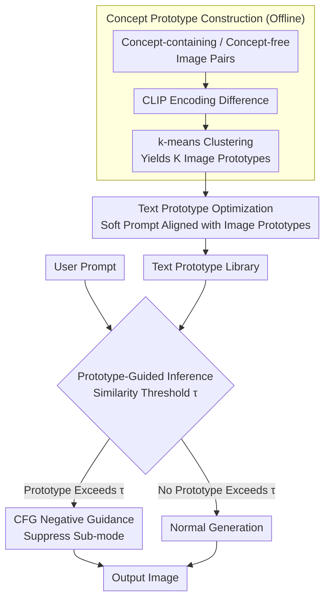

# Prototype-Guided Concept Erasure in Diffusion Models

**Conference**: CVPR 2026  
**arXiv**: [2603.08271](https://arxiv.org/abs/2603.08271)  
**Code**: [https://github.com/Cocteau-23/Prototype-Guided-Concept-Erasure](https://github.com/Cocteau-23/Prototype-Guided-Concept-Erasure)  
**Area**: Image Generation  
**Keywords**: Concept Erasure, Diffusion Model Safety, NSFW Content Filtering, Prototype Learning, Training-free Inference

## TL;DR
Addressing the difficulty of thoroughly erasing broad concepts (e.g., violence, pornography) in diffusion models, this paper proposes a training-free erasure method based on concept prototypes. It extracts image prototypes by clustering concept difference directions in the CLIP embedding space, transfers them to the text prototype space via optimization, and selects the best-matching prototype during inference as a negative guidance signal for classifier-free guidance-style concept suppression.

## Background & Motivation

**Background**: Text-to-Image (T2I) models (e.g., Stable Diffusion) trained on large-scale web data inevitably learn unsafe concepts (pornography, violence, copyright, etc.). Concept erasure methods are categorized into training-based (modifying model weights, e.g., ESD, RECE, MACE) and training-free (inference-time intervention, e.g., SLD, Safree, AdaVD).

**Limitations of Prior Work**: Existing methods perform well on **narrow concepts** (specific entities like Pikachu or Elon Musk) but face performance degradation on **broad concepts** (e.g., "violence," "pornography"). This occurs because broad concepts encompass diverse visual forms—violence can manifest as blood, gunfights, or riots—which cannot be covered by a single direction or uniform signal.

**Key Challenge**: Prior methods implicitly assume that broad and narrow concepts share identical distributional characteristics, modeling them with single or uniform signals. While feasible for low-variance narrow concepts, this fails for high-variance, multi-faceted broad concepts, suppressing only the most salient instantiations (e.g., blood in violence) while missing other semantic patterns (gunfights, riots).

**Key Insight**: Inspired by the observation that generative models organize semantics into structured low-dimensional neighborhoods rather than random distributions, instances of a target concept in the embedding space should aggregate in several compact regions. The centroids obtained through clustering can serve as "concept prototypes," each capturing a distinct salient mode of the concept.

**Core Idea**: By contrasting CLIP embeddings of generated images with and without the target concept, the method clusters the differences to obtain image-space concept prototypes. These are then transferred to the text space via cosine similarity optimization. During inference, the most relevant prototype is selected as negative guidance to precisely suppress various sub-modes of the concept.

## Method

### Overall Architecture
The paper addresses the difficulty of thoroughly erasing broad concepts that contain multiple visual forms. The approach first generates "concept-containing / concept-free" image pairs for the target concept offline, extracts the "concept-only" directions in CLIP space, and clusters them into several prototypes. These image-space prototypes are translated into text prototypes that can be fed into the diffusion model. During inference, the prototype that best fits the user prompt is selected as negative guidance to suppress the corresponding concept sub-mode. The entire process does not modify the weights of the diffusion model, making it a training-free intervention.

### Key Designs

**1. Concept Prototype Construction: Decomposing "Broad Concepts" into Sub-modes via Clustering**

The difficulty with broad concepts lies in their high variance—"violence" can involve blood, gunfights, or riots. A single direction only suppresses the most salient form (blood), leaving others untouched. This design generates $M$ concept-containing and $M$ concept-free images for $N$ prompts. After CLIP encoding, it calculates the differences $\mathcal{Z}_{\text{diff}} = \{z_{i,j} - z_{i,k}^{-}\}$. Crucially, the concept contrastive prompts only remove the concept keyword while retaining other descriptions (e.g., removing "nude" but keeping environment and lighting). Thus, the difference direction points only to the concept rather than contextual variations. Applying k-means to these difference vectors yields $K$ image prototypes $\{p_{\mathbf{I}}^{(k)}\}_{k=1}^K$, each corresponding to a semantic sub-mode. $K$ is set based on concept variance: $K=16$ for broad concepts (e.g., violence), $K=1$ for artistic styles, and $K=2$ for IPs.

**2. Text Prototype Optimization: Translating Image Directions into Negative Conditions**

Since image prototypes reside in the CLIP image space and cannot directly condition the diffusion model, a cross-modal transfer is required. Each text prototype $p_{\mathbf{T}}^{(k)} \in \mathbb{R}^{L \times d}$ is a learnable soft prompt. The CLIP text encoder is frozen while only the prompt is updated to maximize the cosine similarity between its encoded EoT token embedding and the corresponding image prototype:

$$\max_{p_{\mathbf{T}}^{(k)}} \frac{\langle p_{\mathbf{I}}^{(k)}, \mathcal{E}(p_{\mathbf{T}}^{(k)}) \rangle}{\|p_{\mathbf{I}}^{(k)}\| \, \|\mathcal{E}(p_{\mathbf{T}}^{(k)})\|}$$

Optimization is performed for 2000 steps with a learning rate of 5e-2. Leveraging CLIP’s aligned image-text space, tuning only this prompt segment completes the transfer from image prototypes to text prototypes without touching the diffusion model.

**3. Prototype-Guided Inference: Adaptive Selection for Negative Guidance**

During inference, the cosine similarity between the user prompt embedding and each prototype is calculated. The prototype $p_{\mathbf{T}}^{(k^*)}$ with the highest similarity that exceeds a threshold $\tau$ is selected and used as a negative guidance term in classifier-free guidance:

$$\tilde{\epsilon}_{\theta}(z_t, c) = \epsilon_{\theta}(z_t) + \alpha(\epsilon_{\theta}(z_t, c) - \epsilon_{\theta}(z_t)) - \beta(\epsilon_{\theta}(z_t, p_{\mathbf{T}}^{(k^*)}) - \epsilon_{\theta}(z_t))$$

The threshold $\tau$ acts as a critical switch: if no prototype exceeds the threshold (the prompt is irrelevant to the concept), no negative guidance is applied, and the quality of normal generation is unaffected. For multi-concept erasure, prototypes from all concepts are merged into a unified library for matching.

### Example: Erasing "Violence"
In the offline phase, 400 prompt pairs are created for "violence," generating 4 images per pair. CLIP differences are clustered into 16 prototypes representing sub-modes like blood, gunfights, or riots, and each is optimized into a text prototype. When a prompt like "a street protest turning violent" is input, its similarity with the "riot" prototype is highest and exceeds $\tau$. Only this prototype is used for negative guidance to suppress the riot visuals, while the other 15 prototypes remain inactive. For "a sunny street," all similarities are below $\tau$, no prototypes are triggered, and output quality remains normal. This allows a single prototype library to accurately target different concept sub-modes based on the prompt.

### Loss & Training
- Base Model: SD v1.4, DDIM 30 steps, guidance scale 7.5.
- Data Preparation: 400 prompt pairs per malicious concept, 100 pairs per artistic style/IP, generating 4 images per pair with fixed seeds.
- Text prototype optimization: 2000 steps, completely training-free (no modification to diffusion model weights).

## Key Experimental Results

### Main Results (I2P Dataset, Q16 Detection Rate↓)

| Method | Type | Overall↓ | Nudity↓ | Violence↓ | Self-harm↓ |
|------|------|-------|-------|-------|-------|
| SD v1.4 | Baseline | 35.6% | 54.5% | 40.1% | 35.5% |
| ESD | Training | 12.2% | 16.4% | 6.3% | 11.1% |
| TRCE | Training | 5.7% | 1.7% | 6.2% | 5.0% |
| Safree | Free | 8.8% | 5.3% | 9.6% | 7.2% |
| **Ours** | **Free** | **5.2%** | **1.7%** | **5.8%** | **3.8%** |

### Adversarial Robustness

| Method | Ring-a-Bell↓ | P4D↓ | UnDiff↓ | FID↓ |
|------|-------------|------|---------|------|
| SD v1.4 | 71.3% | 91.3% | 63.8% | - |
| TRCE | 6.7% | 2.0% | 7.7% | 48.7 |
| Safree | 22.4% | 38.0% | 28.2% | 36.3 |
| **Ours** | **6.7%** | **14.5%** | **13.3%** | 45.1 |

### Key Findings
- Achieved an overall detection rate of **5.2%** on I2P, the lowest among all tested methods (vs. TRCE at 5.7%), with consistent performance across all 7 sub-categories.
- Competitiveness in adversarial scenarios despite not being specifically designed for them—matching TRCE on Ring-a-Bell (6.7%) and significantly outperforming Safree on P4D, though trailing TRCE (14.5% vs. 2.0%).
- **Strong cross-model generalization**: Outperformed Safree on SDXL and SD 3.5; P4D metrics on SD 3.5 dropped from 0.27 (Safree) to 0.09.
- FID is slightly higher than Safree (45.1 vs. 36.3), indicating that multi-prototype negative guidance may slightly affect generation diversity.

## Highlights & Insights
- **Multi-prototype modeling of broad concepts** is the core innovation—avoiding the oversimplification of broad concepts as a single direction and instead capturing semantic sub-modes via k-means in the embedding difference space.
- **Concept contrastive prompt design** is ingenious—by removing only target conceptual words while keeping the context, it ensures difference directions purely reflect the concept rather than contextual shifts.
- **Cross-modal transfer** (image prototype → text prototype) leverages CLIP’s aligned space, requiring only soft prompt optimization without modifying the diffusion model.
- Completely training-free and compatible with multiple models (SD1.4/SDXL/SD3.5), making it deployment-friendly.

## Limitations & Future Work
- **Adversarial robustness is not the primary optimization goal**: Performance under P4D attacks is notably weaker than TRCE; could be enhanced with adversarial training.
- The number of prototypes $K$ requires manual setting (16 for broad, 1 for narrow), lacking an automatic determination mechanism.
- The choice of threshold $\tau$ affects the trade-off between over-erasure and under-erasure, requiring careful tuning.
- Generating concept contrastive prompts relies on LLMs, which may be imprecise for certain ambiguous concept boundaries.
- The slightly higher FID indicates that negative guidance may partially impact image diversity and quality.

## Related Work & Insights
- **vs. Safree**: Safree projects text embeddings to move away from toxic subspaces; this work uses multi-prototype negative guidance—the latter is more comprehensive for broad concepts (5.2% vs. 8.8% overall).
- **vs. TRCE**: TRCE is training-based, modifying cross-attention weights; this work is training-free. The former is stronger in adversarial attacks (P4D) but requires model modification.
- **vs. AdaVD**: AdaVD performs value decomposition projection in cross-attention; this work uses negative guidance at the CFG level—these approaches are orthogonal and potentially complementary.

## Rating
- Novelty: ⭐⭐⭐⭐ The multi-prototype approach for broad concepts is novel and intuitive; the contrastive difference + clustering pipeline is cleverly designed.
- Experimental Thoroughness: ⭐⭐⭐⭐ Comprehensive coverage across I2P, three adversarial benchmarks, and cross-model generalization.
- Writing Quality: ⭐⭐⭐⭐ Motivations are clearly articulated; the multi-modal examples of broad concepts in Fig.2 are persuasive.
- Value: ⭐⭐⭐⭐ Highly practical for T2I safety, with training-free characteristics favoring deployment.

<!-- RELATED:START -->

## Related Papers

- [\[CVPR 2026\] Neighbor-Aware Localized Concept Erasure in Text-to-Image Diffusion Models](neighbor-aware_localized_concept_erasure_in_text-to-image_diffusion_models.md)
- [\[CVPR 2026\] GrOCE: Graph-Guided Online Concept Erasure for Text-to-Image Diffusion Models](groce_graph-guided_online_concept_erasure_for_text-to-image_diffusion_models.md)
- [\[CVPR 2026\] Closed-Form Concept Erasure via Double Projections](closed-form_concept_erasure_via_double_projections.md)
- [\[CVPR 2026\] Erasing Thousands of Concepts: Towards Scalable and Practical Concept Erasure for Text-to-Image Diffusion Models](erasing_thousands_of_concepts_towards_scalable_and_practical_concept_erasure_for.md)
- [\[AAAI 2026\] Mass Concept Erasure in Diffusion Models with Concept Hierarchy](../../AAAI2026/image_generation/mass_concept_erasure_in_diffusion_models_with_concept_hierarchy.md)

<!-- RELATED:END -->
