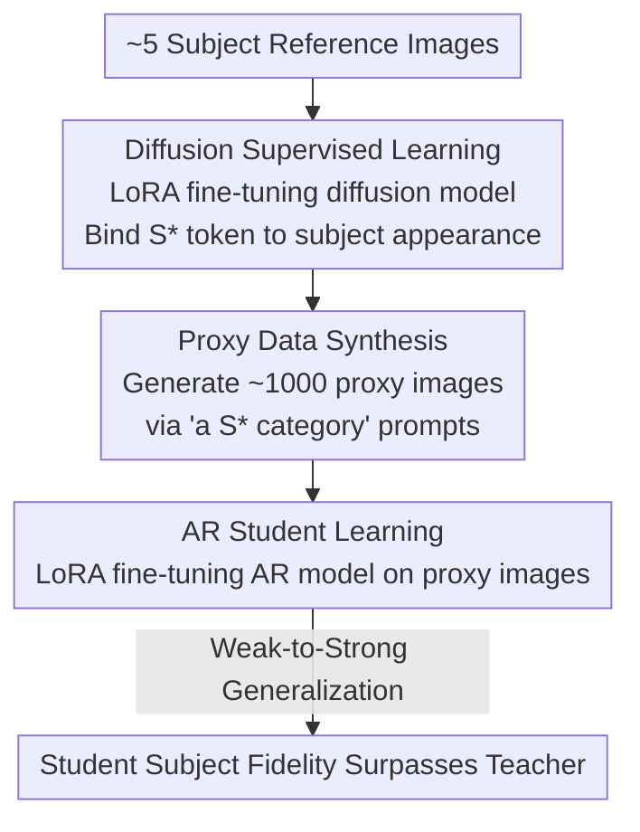

# Proxy-Tuning: Tailoring Multimodal Autoregressive Models for Subject-Driven Image Generation

**Conference**: CVPR 2026  
**Paper**: [CVF Open Access](https://openaccess.thecvf.com/content/CVPR2026/html/Wu_Proxy-Tuning_Tailoring_Multimodal_Autoregressive_Models_for_Subject-Driven_Image_Generation_CVPR_2026_paper.html)  
**Code**: To be confirmed  
**Area**: Image Generation / Multimodal Autoregressive / Subject Customization  
**Keywords**: Subject-driven generation, Autoregressive models, Weak-to-strong generalization, Proxy-tuning, DreamBooth

## TL;DR
To address the issues of "unfaithful appearance" and "semantic loss" when directly applying DreamBooth-style fine-tuning to multimodal Autoregressive (AR) models, this paper proposes Proxy-Tuning: a weaker diffusion model first learns the subject from a few reference images and synthesizes batch proxy data to supervise the AR student model. The results show the student surpasses the teacher in subject fidelity, revealing a "weak-to-strong generalization" phenomenon in image generation.

## Background & Motivation
**Background**: Subject-driven generation requires models to learn the appearance of a specific subject (e.g., a specific dog or backpack) from a few reference images and place it into new scenes based on text prompts. This field is dominated by diffusion models, where DreamBooth has matured by binding subjects to special tokens (e.g., `S*`) with prior preservation loss. Meanwhile, next-token prediction-based multimodal AR models (e.g., LlamaGen, Lumina-mGPT, Emu3) have become competitive with large diffusion models in general text-to-image generation.

**Limitations of Prior Work**: Directly applying AR models to subject-driven tasks often results in failure. The authors tested two conventional routes: Parameter-Efficient Fine-Tuning (LoRA) and end-to-end full fine-tuning. LoRA maintains semantic consistency but fails to capture specific subject appearance, while end-to-end tuning fails both, yielding low subject fidelity and severely damaging the original semantic following capabilities of the AR model. In Table 1, the end-to-end Lumina-mGPT achieves a CLIP-I of only 0.6974 and DINO of 0.5338, significantly lower than diffusion baselines.

**Key Challenge**: The root cause lies in the autoregressive nature of AR models. They generate images token-by-token via sequential prediction, where each token is highly dependent on preceding ones. Consequently, they are extremely sensitive to parameter perturbations under few-shot fine-tuning with only a few images—minor deviations in token prediction propagate and amplify along the generation sequence. In contrast, the parallel denoising process of diffusion models is more robust to few-shot tuning.

**Goal**: To enable AR models to learn specific subject appearances and seamlessly combine them with text without destroying their original semantic understanding capabilities.

**Key Insight**: Since directly feeding few-shot real images to AR models causes collapse, the AR model should not face the "few-shot" scenario directly. Instead, a diffusion model, which is more stable under few-shot conditions, is used to learn the subject first and then synthesize a large amount of proxy data to "feed" the AR model.

**Core Idea**: Utilize a relatively weak diffusion model as a "proxy teacher" to synthesize proxy training data to supervise a stronger AR student—termed Proxy-Tuning. This leads to the discovery of the weak-to-strong generalization phenomenon where the AR student outperforms the teacher.

## Method

### Overall Architecture
Proxy-Tuning decomposes "subject-driven AR fine-tuning" into a three-stage serial pipeline: first, a diffusion model learns the subject via LoRA on approximately 5 reference images (Diffusion Supervised Learning); then, it synthesizes roughly 1000 proxy images using the template `a S* {category}` (Proxy Data Synthesis); finally, the AR student is fine-tuned on this proxy data via LoRA (AR Student Learning). Crucially, the AR model never directly interacts with the 5 scarce real images; it faces a diverse proxy data distribution expanded by the diffusion teacher, bypassing AR's few-shot vulnerability. After completion, a counter-intuitive result is observed: the student consistently exceeds its diffusion teacher in subject fidelity (CLIP-I / DINO).

### Key Designs

**1. Diffusion Supervised Learning: Using Few-shot Stable Diffusion as a "Proxy Teacher"**

While direct few-shot tuning on AR models fails, the same scenario is not problematic for diffusion models. Thus, the difficult "few-shot learning" task is outsourced. Specifically, a diffusion model (SDXL, SD3, SD3.5, or FLUX) is fine-tuned using LoRA on ~5 images, following the DreamBooth paradigm to bind the subject to a predefined token `S*`. The goal is to obtain a teacher that "knows how to draw the subject" to provide a source for data synthesis. The authors used various diffusion models with different architectures and parameter scales (e.g., U-Net-based SDXL, DiT-based SD3/SD3.5/FLUX, 2B to 12B) to verify that the method is insensitive to the choice of teacher.

**2. Proxy Data Synthesis: Expanding Scarce Images into Diverse Proxy Data**

The vulnerability of AR to few-shot learning stems from the sequential amplification of token prediction errors when training samples are scarce. To solve this, the fine-tuned diffusion teacher generates a diverse dataset (~1000 images) using `a S* {category}` prompts. This step differs from "traditional data augmentation": ablations show that geometric augmentations (flipping, $\pm 5^\circ$ rotation, 0.9–1.0 cropping) only provide surface-level transformations, leading to overfitting and poor semantic editability. In contrast, teacher-synthesized proxy images provide rich, context-level semantic variations, allowing the AR model to leverage its pre-trained semantic knowledge.

**3. AR Student Learning and Weak-to-Strong Generalization: Why the Student Surpasses the Teacher**

The third step involves fine-tuning the AR student on proxy data using LoRA. The counter-intuitive result is that the student consistently outperforms the teacher in CLIP-I / DINO metrics (e.g., an SDXL teacher with CLIP-I 0.8002 results in a Lumina-mGPT student with 0.8074, and DINO rises from 0.7272 to 0.7834). The authors characterize this as weak-to-strong generalization. The proposed mechanism is: the AR model encodes subjects into discrete token distributions consisting of a "main distribution" representing local appearance and a "secondary distribution" of bias tokens introduced by the teacher. Next-token prediction training encourages the AR model to fit the main distribution and filter out bias tokens, resulting in a cleaner representation. In contrast, applying Proxy-Tuning to a diffusion student leads to a decrease in performance (Table 4), indicating that weak-to-strong generalization is unique to AR models due to their discrete tokenization and sequential filtering properties.

### Loss & Training
LoRA parameter-efficient fine-tuning is used throughout. Diffusion teachers include SDXL (U-Net, 2.6B), SD3 Medium (DiT, 2B), SD3.5 Large (DiT, 8B), and FLUX.1[dev] (DiT, 12B). AR students include LlamaGen-XL (0.775B) and Lumina-mGPT FP-SFT@768 (7B). Evaluation uses 9 subjects from the DreamBooth dataset, with 25 prompts per subject and 4 images per prompt (225 total test images).

## Key Experimental Results

### Main Results
Subject fidelity is measured by CLIP-I (CLIP image embedding cosine similarity) and DINO (ViT-S/16 embedding similarity); prompt adherence is measured by CLIP-T.

| Teacher | Model | CLIP-I | CLIP-T | DINO |
|---------|-------|--------|--------|------|
| — | LlamaGen (Direct LoRA) | 0.6752 | 0.2956 | 0.5088 |
| SDXL | SDXL Teacher | 0.8002 | 0.3225 | 0.7272 |
| SDXL | Lumina-mGPT w/ Proxy-Tuning | 0.8074 | 0.3118 | 0.7834 |
| SDXL | LlamaGen w/ Proxy-Tuning | 0.8152 | 0.2772 | 0.7436 |
| SD3 | Lumina-mGPT w/ Proxy-Tuning | 0.7977 | 0.3167 | 0.7551 |

Directly fine-tuned AR students (CLIP-I ≈0.67) fail to learn the subject. After Proxy-Tuning, CLIP-I and DINO scores consistently exceed the corresponding diffusion teachers across all tested teacher models.

### Ablation Study
| Configuration | Key Observation | Description |
|---------------|-----------------|-------------|
| Direct LoRA on AR | CLIP-I≈0.67, DINO≈0.45 | Fails to learn subject appearance, though semantics remain. |
| Direct End-to-end on AR | CLIP-I 0.6974, DINO 0.5338 | Both subject and semantic capabilities collapse. |
| Proxy-Tuning (Full) | CLIP-I 0.80+, Surpasses Teacher | Good subject fidelity and semantic editability. |
| Proxy-Tuning on Diffusion Student | CLIP-I/DINO Generally ↓ | Weak-to-strong generalization does not occur. |
| Geometric Augmentation | Overfitting, poor editability | Simple transforms cannot replace diverse proxy data. |
| Proxy Image Count Reduction | Performance remains stable | Robust to the number of synthesized images. |

Multi-subject experiments (Table 5) show that a single AR student can learn multiple subjects simultaneously, maintaining fidelity comparable to specialized single-subject diffusion teachers, whereas diffusion students exhibit subject confusion.

### Key Findings
- **Weak-to-strong generalization is AR-specific**: Proxy-Tuning applied to diffusion students results in performance degradation (Table 4), proving the benefit stems from AR's discrete token fitting/filtering rather than the proxy data itself.
- **CLIP-T underestimates Proxy-Tuning**: User studies (Table 6) show Proxy-Tuned AR models achieve a prompt fidelity of 4.52, higher than direct AR tuning (2.98) and diffusion methods, indicating a gap between CLIP-T and human judgment.
- **AR scales better for multi-subject composition**: A single model can learn multiple subjects while maintaining distinct identities, whereas diffusion often requires separate instances for each.

## Highlights & Insights
- Transforms the "AR cannot learn from few-shot" weakness into a strategy: using a few-shot-stable model as a data amplifier. The approach is clean, plug-and-play, and does not modify the AR backbone.
- The most significant insight is the weak-to-strong generalization: students surpassing teachers. The paper provides an interpretable mechanism (main vs. bias distribution) rather than just reporting SOTA numbers.
- Reverse control experiments (diffusion students not showing the effect) isolate the AR architecture as the source of the gain.
- The "weak model supervising strong model with strong model surpassing" paradigm has potential for other AR multimodal tasks (video, controllable generation).

## Limitations & Future Work
- **Metric Distortion**: CLIP-T systematically underestimates prompt compliance for AR, requiring user studies for correction; reliable evaluation metrics for AR subject generation are lacking.
- **Cost**: The three-stage pipeline introduces extra costs for diffusion teacher training and the synthesis of thousands of proxy images compared to single-model tuning.
- **Mechanism Depth**: The explanation (main/bias tokens) is primarily qualitative; quantitative evidence at the token distribution level is limited. 
- **Scale**: Evaluation is limited to 9 subjects; systematic boundaries for complex scenes or large-scale multi-subject scenarios remain to be fully characterized.

## Related Work & Insights
- **vs. DreamBooth/DisenBooth/NeTI**: Traditional methods fine-tune diffusion models directly; this paper shows such paradigms fail on AR and instead uses diffusion as a teacher to avoid giving AR few-shot data.
- **vs. IP-Adapter/PhotoMaker**: Tuning-free methods use image encoders for zero-shot injection; this paper follows a tuning-based route tailored for AR architectures.
- **vs. NLP Weak-to-Strong Generalization**: This work migrates the concept from NLP to multimodal AR image generation, providing architecture-specific evidence.

## Rating
- **Novelty**: ⭐⭐⭐⭐⭐ First to demonstrate weak-to-strong generalization in multimodal AR image generation with specific architecture controls.
- **Experimental Thoroughness**: ⭐⭐⭐⭐ Covers 4 teachers × 2 students + multi-subject + user studies, though subject scale is small.
- **Writing Quality**: ⭐⭐⭐⭐ Clear chain of motivation-analysis-method; mechanism explanation is qualitative.
- **Value**: ⭐⭐⭐⭐ The "amplification via weak-model supervision" paradigm has high transfer potential.

<!-- RELATED:START -->

## Related Papers

- [\[CVPR 2026\] FlowFixer: Towards Detail-Preserving Subject-Driven Generation](flowfixer_towards_detail-preserving_subject-driven_generation.md)
- [\[CVPR 2026\] Scone: Bridging Composition and Distinction in Subject-Driven Image Generation via Unified Understanding-Generation Modeling](scone_bridging_composition_and_distinction_in_subject-driven_image_generation_vi.md)
- [\[CVPR 2026\] Beyond Patches: Global-aware Autoregressive Model for Multimodal Few-Shot Font Generation](beyond_patches_global-aware_autoregressive_model_for_multimodal_few-shot_font_ge.md)
- [\[CVPR 2026\] Disentangling to Re-couple: Resolving the Similarity-Controllability Paradox in Subject-Driven Text-to-Image Generation](disentangling_to_re-couple_resolving_the_similarity-controllability_paradox_in_s.md)
- [\[ACL 2026\] Multimodal Large Language Models for Multi-Subject In-Context Image Generation](../../ACL2026/image_generation/multimodal_large_language_models_for_multi-subject_in-context_image_generation.md)

<!-- RELATED:END -->
