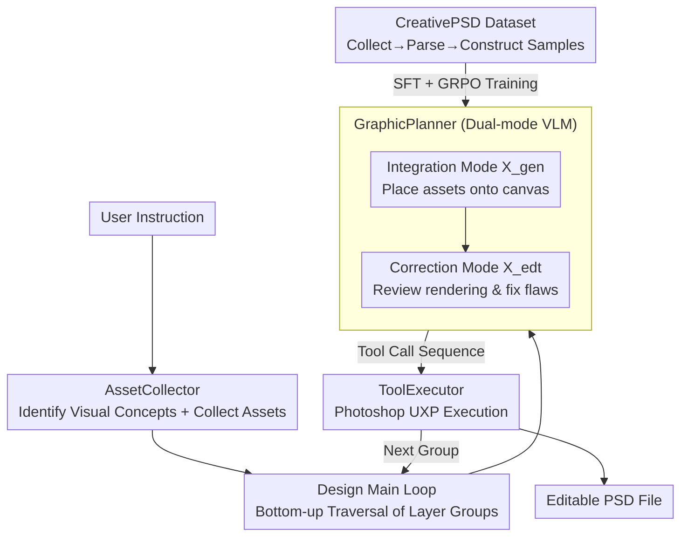

# PSDesigner: Automated Graphic Design with a Human-Like Creative Workflow

**Conference**: CVPR 2026  
**arXiv**: [2603.25738](https://arxiv.org/abs/2603.25738)  
**Code**: [https://henghuiding.com/PSDesigner/](https://henghuiding.com/PSDesigner/)  
**Area**: Image Generation / Automated Design  
**Keywords**: Automated Graphic Design, PSD File Manipulation, Tool Calling, Reinforcement Learning, Creative Workflow

## TL;DR

This paper proposes PSDesigner, an automated graphic design system that simulates the creative workflow of human designers. By coordinating three modules—AssetCollector (resource collection), GraphicPlanner (planning tool calls), and ToolExecutor (executing PSD operations)—and training on CreativePSD, the first design dataset in PSD format, the model learns professional design processes and directly generates editable PSD design files.

## Background & Motivation

1.  **Background**: Graphic design is crucial in e-commerce and advertising. Existing automation methods fall into two categories: (a) Text-to-Image models (FLUX, Glyph-Byt5, etc.) generating design images; (b) MLLM-driven methods (LaDeCo, COLE, etc.) directly generating editable design files in JSON format.

2.  **Limitations of Prior Work**: Images generated by text-to-image methods are non-editable and have inaccurate text rendering (especially Chinese); MLLM methods group layers by predefined categories (underlay/text) to predict all attributes at once, which is unintuitive and limits design flexibility.

3.  **Key Challenge**: Current methods significantly simplify professional design workflows—(a) grouping by category is less intuitive than grouping by visual concepts; (b) predicting all layer attributes at once lacks the flexibility of progressive design; (c) they can only handle simple layer hierarchies and limited attribute types, far from product-grade design.

4.  **Goal**: To build an automated design system that simulates human designer workflows, capable of handling complex PSD layer hierarchies (averaging 48.35 layers), supporting diverse layer types and 60+ attributes, and generating professional-grade editable PSD files.

5.  **Key Insight**: By observing the workflow of human designers—first collecting thematic resources, then iteratively integrating them based on visual concept groups, and inspecting/repairing defects after each integration step—this process is formalized as a tool-calling prediction problem for VLMs.

6.  **Core Idea**: Modeling graphic design as a sequence prediction of VLM tool calls, utilizing SFT and GRPO to train the model to perform iterative resource integration and defect repair operations.

## Method

### Overall Architecture

The core problem PSDesigner addresses is enabling a model to construct professional editable PSD files step-by-step from a single user instruction, similar to a human designer, rather than generating a non-editable image or a flat JSON. The design process is divided into three sequential roles. First, the **AssetCollector** interprets instructions to identify "visual concepts" (e.g., main product, title text, background atmosphere in a promotional poster) and gathers or generates corresponding image and text materials for each concept. This is followed by the main design loop: the model traverses the nested layer hierarchy bottom-up. For each group, the **GraphicPlanner** first employs an integration mode ($\mathcal{X}_{gen}$) to place materials onto the canvas—determining position, size, and style—then switches to a correction mode ($\mathcal{X}_{edt}$) to review the rendering, identify flaws, and apply fixes. Each step predicts a sequence of tool calls rather than pixels. Finally, the **ToolExecutor** sends these calls to actual Photoshop software for execution via UXP, resulting in real layers and effects. Reformulating "drawing" as "predicting tool-calling sequences" allows the system to output editable files while leveraging the full capabilities of professional software.

### Key Designs

**1. CreativePSD Dataset: Enabling Iterative Design through Professional Workflows**

Human design workflows are difficult to replicate because no dataset has recorded how a professional PSD is constructed layer by layer. Existing datasets like CGL, Crello, and Design39K average only 4-5 layers and 2 layer types with limited attributes. CreativePSD fills this gap in three stages: first, high-quality PSD files are collected from the web and paid sources, with professional annotators grouping layers by visual concepts; second, these PSDs are parsed to extract raw assets, layer metadata, and intermediate rendering results; third, this information is reconstructed into training samples for two modes. Each sample is a triplet $(a, \mathcal{C}, x)$, representing assets, observations, and tool-call sequences. The $\mathcal{X}_{gen}$ mode teaches material integration, while the $\mathcal{X}_{edt}$ mode teaches flaw detection and repair. The final dataset contains 10,454 samples, averaging 48.35 layers, 5 layer types, and 60+ attributes, matching the complexity of real-world product design.

**2. GraphicPlanner: Separating Integration and Correction via Dual-mode VLM**

Integration and correction both involve predicting tool calls but are fundamentally different tasks: the former creates positions and styles from scratch, while the latter performs local adjustments on existing visuals. Training these with a single set of parameters causes task interference. GraphicPlanner, based on Qwen2.5-VL-7B, injects mode-specific LoRA modules to isolate these tasks. The $\mathcal{X}_{gen}$ mode receives assets $a$ and observations $(M, R)$—layer metadata plus current rendering—to output integration calls. The $\mathcal{X}_{edt}$ mode receives $(M, R, G)$, adding the pre-group rendering $G$ as a reference to identify what went wrong after integration. Training follows two steps: SFT to learn basic tool-to-parameter mapping, followed by GRPO reinforcement learning to refine parameter precision. Design is highly sensitive to values—a few pixels of offset or a few degrees of rotation can ruin the aesthetic; GRPO rewards directly compare generated calls with ground truth to optimize this precision.

**3. ToolExecutor: Handling Complex Attributes via Direct PSD Manipulation**

To transform tool-calling predictions into design files, the ToolExecutor uses the Adobe UXP framework. It encapsulates 70+ Photoshop operations into callable tools via JavaScript APIs, covering image/text insertion, layer adjustments, effects like inner glow and shadows, blending modes, and clipping masks. Crucially, it operates on native PSDs rather than simplified JSONs. While JSON only expresses flat layers, product-grade design relies on complex nesting, effect layering, and blending modes inherent to PSD, which are fully preserved by direct Photoshop integration.

### Main Results

User Intent to Design (VLM Score, max 10):

| Method | Quality | Layout | Relevance | Harmony | Innovation | Editable |
|------|------|------|--------|--------|--------|--------|
| **PSDesigner** | 7.62 | **8.68** | 7.78 | 8.02 | **8.45** | ✓ PSD |
| CanvaGPT | **8.52** | 8.15 | 4.72 | 7.21 | 7.52 | ✓ |
| FLUX | 8.18 | 6.88 | 6.92 | 6.82 | 6.95 | ✗ |
| PosterCraft | 7.95 | 8.35 | **8.42** | **8.05** | 5.87 | ✗ |
| OpenCOLE | 5.12 | 3.66 | 5.25 | 6.68 | 6.08 | Partial |

Design Composition on Crello-v5 (VLM Score):

| Method | Quality | Layout | Harmony | Innovation |
|------|------|------|--------|--------|
| **Ours** | **7.85** | **7.43** | 6.77 | **6.94** |
| LaDeCo | 5.95 | 6.03 | **7.22** | 5.75 |
| Ground Truth | 8.13 | 9.18 | 8.90 | 7.12 |

### Loss & Training

Standard auto-regressive cross-entropy loss is used during the SFT phase. In the GRPO reinforcement learning phase, a specific reward function $r$ is designed to compare the tool names, parameter names, and parameter values of the generated outputs against ground truth. SFT training involves 15,000 steps ($\mathcal{X}_{gen}$) / 12,000 steps ($\mathcal{X}_{edt}$), with batch=64, lr=2e-4, and LoRA rank=32. GRPO training utilizes 6,000 steps with a group size of 8, using 4,000 PSD files.

## Key Experimental Results

### Ablation Study

| Configuration | Quality | Layout | Harmony | Innovation |
|------|------|------|--------|--------|
| Full model (Crello) | **7.85** | **7.43** | **6.77** | **6.94** |
| w/o $\mathcal{X}_{edt}$ | 6.05 | 5.88 | 5.90 | 6.75 |
| w/o Layer Info M | 6.25 | 6.10 | 6.18 | 6.02 |
| w/o RL (GRPO) | 6.38 | 6.00 | 6.35 | 6.20 |
| Full model (PSD) | **6.28** | **6.15** | **7.02** | **6.88** |
| w/o $\mathcal{X}_{edt}$ (PSD) | 5.32 | 5.15 | 6.22 | 6.05 |

### Key Findings

- Removing the $\mathcal{X}_{edt}$ mode (defect correction) has the most significant impact on quality and layout (dropping 1.80 and 1.55 points on Crello, respectively), proving that iterative repair is critical to design quality.
- Removing layer information $M$ prevents the model from perceiving other elements in the same group, leading to a significant drop in layout and harmony.
- GRPO reinforcement learning is essential for precisely predicting tool-call parameter values; without it, layout scores drop by 1.43 points.
- PSDesigner is the only system capable of simultaneously generating editable PSD files and accurately rendering Chinese text.

## Highlights & Insights

- **Anthropomorphic Workflow Design**: Decomposing the design process into an iterative "Collect → Integrate → Repair" cycle aligns perfectly with human designer cognition. This problem-decomposition approach is transferable to other multi-step creative tasks like PPT creation or video editing.
- **CreativePSD Dataset**: As the first design training dataset in PSD format (averaging 48 layers and 60+ attributes), it greatly expands the complexity levels automated design systems can handle. The three-stage pipeline (Collect → Parse → Construct) serves as a reusable methodology.
- **GRPO for Tool-Call Refinement**: Applying RL to enhance the precision of tool-calling parameters is a clever design, as SFT only learns approximate parameter distributions while GRPO reward signals directly optimize the match between output and ground truth.

## Limitations & Future Work

- Evaluation relies heavily on VLM scoring and user studies, lacking more objective quantitative metrics like layer attribute prediction accuracy.
- AssetCollector is dependent on the quality of external image search/generation models; failures in resource collection cascade into design quality issues.
- Currently supports only static design, with no involvement in dynamic or interactive design (e.g., webpages, animations).
- Dataset size (10,454 samples) is still small compared to LLM training data, potentially limiting generalization.
- Deep coupling with Photoshop (UXP API) restricts extensibility to other design tools.

## Related Work & Insights

- **vs LaDeCo**: LaDeCo groups by predefined categories (image/text) and predicts all layer attributes of the same type at once, failing to handle complex hierarchies. PSDesigner groups by visual concepts and integrates iteratively, outperforming in quality by 1.9 points on Crello.
- **vs COLE/OpenCOLE**: COLE builds multiple task-specific model pipelines, but its editability is limited (mostly single image + text layers). PSDesigner uses a unified VLM-driven tool-calling approach supporting full PSD hierarchies.
- **vs T2I (FLUX/PosterCraft)**: These methods generate high visual quality but non-editable raster images, often failing on Chinese or complex text rendering.

## Rating

- Novelty: ⭐⭐⭐⭐ First application of the VLM tool-calling paradigm to PSD-level automated design; CreativePSD is a pioneering dataset.
- Experimental Thoroughness: ⭐⭐⭐⭐ Comparison with multiple methods and comprehensive ablation studies, though lacking some objective tool-calling accuracy metrics.
- Writing Quality: ⭐⭐⭐⭐ Clear motivation and intuitive comparisons between human workflows and PSDesigner.
- Value: ⭐⭐⭐⭐ Significant advancement for automated design, demonstrating the potential of VLM + tool calling in creative tasks.

<!-- RELATED:START -->

## Related Papers

- [\[ICLR 2026\] CreatiDesign: A Unified Multi-Conditional Diffusion Transformer for Creative Graphic Design](../../ICLR2026/image_generation/creatidesign_a_unified_multi-conditional_diffusion_transformer_for_creative_grap.md)
- [\[CVPR 2026\] CREval: An Automated Interpretable Evaluation for Creative Image Manipulation under Complex Instructions](creval_an_automated_interpretable_evaluation_for_creative_image_manipulation_und.md)
- [\[CVPR 2026\] PosterReward: Unlocking Accurate Evaluation for High-Quality Graphic Design Generation](posterreward_unlocking_accurate_evaluation_for_high-quality_graphic_design_gener.md)
- [\[CVPR 2026\] ShowTable: Unlocking Creative Table Visualization with Collaborative Reflection and Refinement](showtable_unlocking_creative_table_visualization_with_collaborative_reflection_a.md)
- [\[CVPR 2026\] Ar2Can: An Architect and an Artist Leveraging a Canvas for Multi-Human Generation](ar2can_an_architect_and_an_artist_leveraging_a_canvas_for_multi-human_generation.md)

<!-- RELATED:END -->
