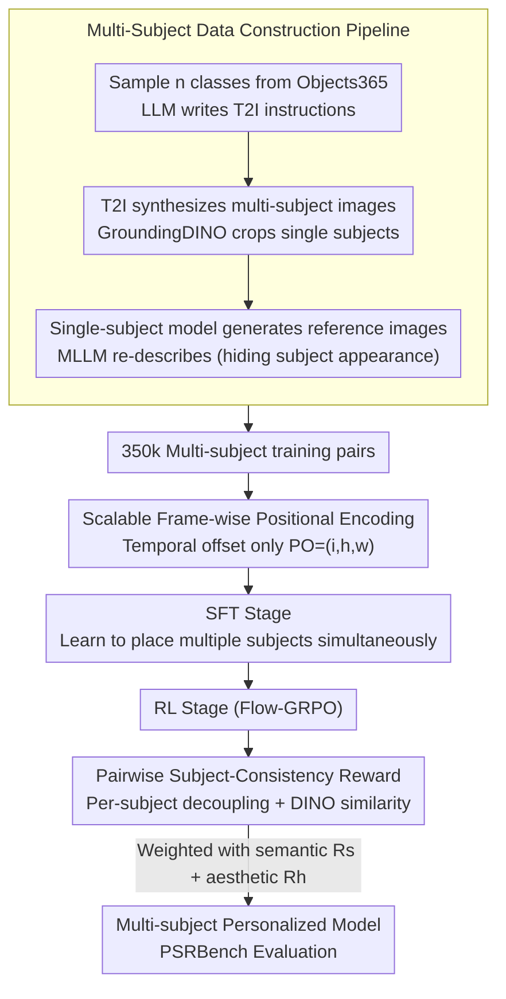

# PSR: Scaling Multi-Subject Personalized Image Generation with Pairwise Subject-Consistency Rewards

**Conference**: CVPR 2026  
**arXiv**: [2512.01236](https://arxiv.org/abs/2512.01236)  
**Code**: [https://github.com/wang-shulei/PSR](https://github.com/wang-shulei/PSR)  
**Area**: Diffusion Models / Personalized Generation  
**Keywords**: Multi-subject personalized generation, subject consistency, reinforcement learning, pairwise rewards, positional encoding

## TL;DR
To address poor subject consistency and insufficient text compliance in multi-subject personalized image generation, this paper proposes a scalable multi-subject data construction pipeline and Pairwise Subject-Consistency Rewards (PSR). Through a two-stage training process (SFT + RL), the method comprehensively outperforms existing SOTA on the self-constructed PSRBench.

## Background & Motivation

1. **Background**: Single-subject personalized generation models (e.g., FLUX.1 Kontext, Qwen-Image-Edit) have demonstrated excellent capabilities in generating images that maintain subject consistency in new scenarios based on reference images.
2. **Limitations of Prior Work**: When scaling to multi-subject scenarios, existing models face two major challenges: (a) poor subject consistency—generated subjects are dissimilar to reference subjects or some subjects are lost; (b) poor text compliance—failure to correctly bind attributes, such as generating swapped attributes when prompted with "dog wearing a chef hat, cat wearing a scarf."
3. **Key Challenge**: The root causes are twofold: a lack of high-quality multi-subject training datasets (existing datasets like OmniGen's X2I-subject-driven focus mainly on faces with low consistency for general objects) and a lack of fine-grained post-training strategies (SFT optimizes only at the global image level, failing to guarantee individual subject consistency).
4. **Goal**: (1) How to construct high-quality multi-subject training data at scale? (2) How to achieve fine-grained subject-level alignment during training? (3) How to comprehensively evaluate multi-subject personalized generation?
5. **Key Insight**: Utilize existing powerful single-subject personalized models (e.g., FLUX.1 Kontext) to "reverse-construct" multi-subject data and achieve fine-grained subject-level alignment via a pairwise reward mechanism in reinforcement learning.
6. **Core Idea**: High-quality multi-subject data construction via single-subject models + Pairwise Subject-Consistency Reward (PSR) post-training to achieve scalable high-quality multi-subject personalized generation.

## Method

### Overall Architecture
The two persistent problems in multi-subject personalized generation—subject leakage (generated cats/dogs not resembling references or missing entirely) and incorrect attribute binding (swapping hats and scarves)—are essentially due to the lack of data and subject-level supervision. PSR addresses this by first borrowing a strong single-subject model to reverse-engineer 350,000 pairs of multi-subject training data, followed by two-stage training. SFT teaches the model to "place multiple subjects simultaneously," while the RL stage uses a reward that scores subjects individually to refine consistency. Finally, PSRBench is used to measure subject consistency, semantic alignment, and aesthetics.

### Key Designs

**1. Scalable Multi-Subject Data Construction Pipeline: Reversing "solved single-subject personalization" into multi-subject data**

Directly generating paired multi-subject data using T2I models (as in UNO) results in poor consistency. However, existing single-subject personalized models (like FLUX.1 Kontext) excel at "preserving one subject." The pipeline reverses this capability in two steps. Image phase: Sample $n$ classes from the Objects365 pool, have an LLM write a T2I instruction, synthesize a multi-subject image $I_{out}$ using a T2I model, detect and crop each subject into $I_{crop}$ using GroundingDINO, and finally have a single-subject personalized model generate a new reference image $I_{ref}$—ensuring high consistency between the reference and target. Instruction phase: Define seven task types (attributes, background, action, position, complex scenes, three-subject, four-subject) and use an MLLM to re-describe the target image while intentionally omitting physical descriptions of the subjects. This forces the model to attend to reference images rather than text shortcuts. A "re-editing" step further enhances attribute and action diversity.

**2. Scalable Frame-wise Positional Encoding: Allowing single-subject models to consume multiple references without spatial bias**

Single-subject models typically recognize only one reference image. To feed multiple images, a position must be assigned to the latent tokens of each. Methods like UNO add offsets in the $h/w$ spatial dimensions, which inadvertently injects spatial priors (e.g., "the second image is on the right"). This interferes when text specifies "cat on the left, dog on the right," and offsets accumulate as more subjects are added, deviating from the pre-trained distribution. PSR offsets only in the temporal (frame) dimension while keeping spatial dimensions fixed: the $i$-th reference image uses $PO_i = (i, h, w)$. This informs the model "which image this is" without dictating "where it should be placed," returning spatial control to the text. Training samples 2/3/4 reference images with probabilities 0.9/0.05/0.05 to naturally support varying subject counts.

**3. Pairwise Subject-Consistency Reward (PSR): Decomposing "global similarity" into "per-subject similarity" in RL**

SFT optimizes only at the whole-image level, failing to detect if one of several subjects is inconsistent. The PSR reward in the RL stage follows a "decouple then compare" approach: an open-vocabulary detector extracts each subject $I_{dec}^i = g(I_{out}, c_i)$ from the generated image $I_{out}$ based on class $c_i$, performs the same for the reference image to obtain $I_{gt}^i$, and calculates the average DINO feature similarity:

$$R_{PSR} = \frac{1}{N}\sum_{i=1}^{N} f(I_{dec}^i, I_{gt}^i)$$

This places supervision directly on individual subjects. To prevent the model from "copy-pasting" reference subjects to game the reward, the total reward is weighted with an MLLM semantic alignment reward $R_s$ and an HPSv3 aesthetic preference reward $R_h$:

$$R = w_1 R_{PSR} + w_2 R_s + w_3 R_h$$

This balance ensures identity consistency without sacrificing text compliance or image quality. The RL is optimized using the Flow-GRPO framework.

### Loss & Training
- Phase 1 (SFT): Learning rate 1e-4, LoRA rank 512, trained at 512×512 resolution.
- Phase 2 (RL): Learning rate 1e-5, LoRA rank 64, GRPO group size 6, reward weights $w_1=0.4, w_2=0.4, w_3=0.2$, sampled and trained on 28 original diffusion steps.

## Key Experimental Results

### Main Results
PSRBench includes 7 subsets, evaluated across three dimensions: Subject Consistency (SC), Aesthetic Preference (HPS), and Semantic Alignment (SA).

| Model | SC Overall | HPS Overall | SA Overall |
|------|-----------|-------------|------------|
| FLUX.1 Kontext | 0.497 | 0.870 | 0.583 |
| UNO | 0.523 | 1.009 | 0.667 |
| OmniGen2 | 0.587 | 1.020 | 0.758 |
| XVerse | 0.587 | 0.893 | 0.669 |
| Ours-SFT | 0.559 | 0.794 | 0.712 |
| **Ours (PSR)** | **0.673** | **1.124** | **0.783** |

### Ablation Study
Comparison of Positional Encoding strategies (Semantic Alignment scores):

| Method | 2-subjects | 3-subjects | 4-subjects | Position |
|------|-----------|-----------|-----------|----------|
| w/ h-w offset | 0.929 | 0.831 | 0.808 | 0.469 |
| w/ w offset | 0.915 | 0.824 | 0.777 | 0.459 |
| w/ h offset | 0.925 | 0.840 | 0.805 | 0.437 |
| **w/ ours (frame)** | **0.922** | **0.870** | **0.821** | **0.508** |

### Key Findings
- The introduction of the PSR reward significantly improved subject consistency from 0.559 (SFT) to 0.673, a 20.4% increase, with notable gains in the Three/Four-subject subsets (0.615/0.571 vs previous best 0.552/0.508).
- While aesthetic scores dropped during SFT due to lower resolution training (1024→512), the PSR RL stage effectively recovered and exceeded the original model's performance.
- Frame-wise PE outperformed the runner-up by 0.39 in the Position subset, indicating that other encoding methods introduce fixed spatial layout biases.
- User studies show PSR achieved the highest ratings across all three dimensions (SC 0.92, SA 0.80, HPS 0.82).

## Highlights & Insights
- **Clever Closed-loop Data Construction**: Using the T2I → detection/cropping → single-subject personalization flow creates a loop that transforms "solved single-subject" capabilities into tools for "multi-subject data synthesis." This strategy is highly transferable to other tasks lacking paired data.
- **Subject Decoupling + Pairwise Rewards**: Using a detector in RL to decompose the global image into subject-level reward signals is more precise than global feature comparison and can be applied to any generation task requiring fine-grained alignment.
- **Subtraction Logic in Positional Encoding**: Removing $h/w$ offsets proved superior by avoiding unnecessary spatial priors.

## Limitations & Future Work
- Training resolution is limited to 512×512, restricting fine detail quality.
- Identity preservation for small-scale subjects remains challenging (acknowledged failure cases).
- Reward quality is dependent on detector accuracy; detection failures introduce noisy reward signals.
- Currently validated only on FLUX.1 Kontext; transferability to other architectures (DiT, U-Net) remains unexplored.

## Related Work & Insights
- **vs UNO**: UNO uses T2I models to directly generate diptychs, resulting in low consistency; PSR uses single-subject models for higher quality data. UNO's $h/w$ offsets introduce spatial bias, whereas PSR uses temporal frame offsets.
- **vs OmniGen2**: OmniGen2 is competitive in text compliance but lags significantly in subject consistency compared to PSR, showing that SFT alone struggles to satisfy both simultaneously.
- **vs Flow-GRPO/DanceGRPO**: While these apply RL for general T2I improvements, PSR is the first to apply RL to multi-subject personalization with subject-level reward design.

## Rating
- Novelty: ⭐⭐⭐⭐ Clever data pipeline and PSR reward, though the SFT+RL framework is standard.
- Experimental Thoroughness: ⭐⭐⭐⭐⭐ Comprehensive evaluation on self-built benchmark, thorough ablations, and human studies.
- Writing Quality: ⭐⭐⭐⭐ Clear structure and rich visualizations.
- Value: ⭐⭐⭐⭐ Provides a complete data + training + evaluation solution for multi-subject personalization.

<!-- RELATED:START -->

## Related Papers

- [\[ICLR 2026\] MOSAIC: Multi-Subject Personalized Generation via Correspondence-Aware Alignment and Disentanglement](../../ICLR2026/image_generation/mosaic_multi-subject_personalized_generation_via_correspondence-aware_alignment_.md)
- [\[CVPR 2026\] Scaling Multi-Identity Consistency for Image Customization via Multi-to-Multi Matching Paradigm](scaling_multi-identity_consistency_for_image_customization_via_multi-to-multi_ma.md)
- [\[CVPR 2026\] Self-Corrected Image Generation with Explainable Latent Rewards](self-corrected_image_generation_with_explainable_latent_rewards.md)
- [\[CVPR 2026\] FlowFixer: Towards Detail-Preserving Subject-Driven Generation](flowfixer_towards_detail-preserving_subject-driven_generation.md)
- [\[ACL 2026\] Multimodal Large Language Models for Multi-Subject In-Context Image Generation](../../ACL2026/image_generation/multimodal_large_language_models_for_multi-subject_in-context_image_generation.md)

<!-- RELATED:END -->
