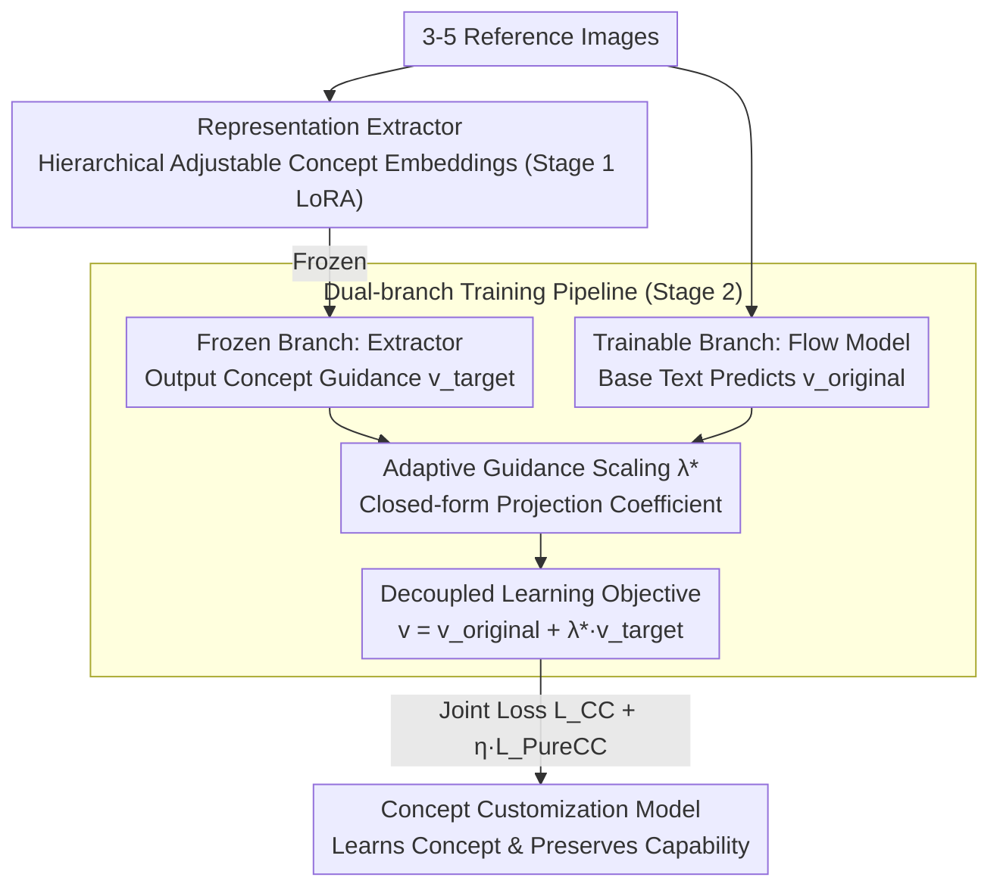

# PureCC: Pure Learning for Text-to-Image Concept Customization

**Conference**: CVPR 2026  
**arXiv**: [2603.07561](https://arxiv.org/abs/2603.07561)  
**Code**: [https://github.com/lzc-sg/PureCC](https://github.com/lzc-sg/PureCC)  
**Area**: Image Generation  
**Keywords**: Concept Customization, Diffusion Model Fine-tuning, Implicit Guidance, Model Preservation, Adaptive Scaling

## TL;DR
The PureCC method is proposed to achieve high-fidelity concept customization while minimizing the impact on the original model's behavior and capacity. This is accomplished by decoupling the learning objective into "target concept implicit guidance" and "original condition prediction," utilizing a dual-branch training pipeline (frozen representation extractor + trainable flow model) and an adaptive guidance scaling factor $\lambda^{\star}$.

## Background & Motivation

**Background**: Concept customization uses 3-5 reference images to enable T2I models to learn personalized concepts (subjects, styles, etc.). Mainstream approaches are divided into Tuning-free (e.g., DreamO, UNO, which encode and inject reference image features) and Tuning-based (e.g., DreamBooth full-parameter fine-tuning, LoRA low-rank fine-tuning).

**Limitations of Prior Work**: Existing methods focus on high fidelity and multi-concept customization but overlook two critical issues:
   - **Destruction of Original Behavior**: After learning "[V] dog," non-target elements (background, style, lighting) are unintentionally altered because redundant information in the limited reference images cannot be decoupled from the target concept.
   - **Degradation of Original Capability**: Fine-tuned models suffer from decreased text-following ability and image quality. KL divergence visualization shows significant distribution drift.

**Key Challenge**: Current methods treat all linguistic-visual knowledge in the customization set as the learning source. However, with only 3-5 reference images, the model cannot distinguish between the target concept and redundant background information. Furthermore, the learning objective lacks explicit consideration for the original model, leading to distribution drift during concept learning.

**Key Insight**: Inspiration is drawn from the implicit guidance form of Classifier-Free Guidance (CFG). CFG views conditional generation as "unconditional prediction + implicit conditional guidance." Analogously, concept customization can be viewed as "original conditional prediction + implicit target concept guidance." This decoupled form naturally supports maintaining the original model while learning concepts.

**Core Idea**: $v_t^{PureCC} = v_t^{original} + \lambda^{\star} \cdot v_t^{target}$, where the original prediction is provided by a trainable model (preserving original capabilities), the target guidance is provided by a frozen extractor (pure concept representation), and $\lambda^{\star}$ is adaptively balanced via projection error.

## Method

### Overall Architecture
PureCC aims to achieve two goals that typically conflict: learning target concepts from 3-5 images without degrading the original model's text-following, image quality, or unrelated elements. It treats concept customization as a split between "original prediction + concept increment" inspired by CFG, combined with a coefficient $\lambda^{\star}$ that adjusts automatically during training. Based on the flow-based SD 3.5-M, the training follows a two-stage pipeline: first, a **representation extractor** is trained independently on the customization set to yield pure concept guidance; second, this extractor is frozen while a trainable flow model handles the "original prediction" branch, with both optimized jointly. This ensures concept guidance and original capabilities are separated into two models to prevent mutual contamination.

### Key Designs

**1. Representation Extractor: Distilling target concepts into pure guidance**

Since reference images are scarce, target concepts are entangled with redundant information like background and lighting. PureCC addresses this in Stage 1 by fine-tuning a pre-trained flow model $v_t^{\theta_1}$ using LoRA to specialized in "understanding the concept." Instead of simple [V] token replacement, **Hierarchical Adjustable Concept Embeddings** $\{\mathbf{Y}_{tar}^l\}_{l=1}^L$ are introduced—each Transformer layer uses independent learnable embeddings to replace [V]. This allows shallow and deep layers to capture details across different scales (texture, shape, etc.), storing richer concept information than a shared embedding. This stage uses standard CFM loss $\mathcal{L}_{CC}^{Rep}$, producing an extractor that provides clean concept guidance.

**2. Decoupled Learning Objective: Splitting the velocity field into original prediction and concept delta**

CFG treats conditional generation as "unconditional prediction + implicit conditional guidance." PureCC applies this to the training phase: concept customization is formulated as "original conditional prediction + implicit target concept guidance." The complete velocity field is decoupled as:

$$v_t^{PureCC} = v_t^{\theta_2}(x_t \mid y_{base}) + \lambda^{\star} \cdot [\,v_t^{\theta_1}(x_t \mid y_{tar}) - v_t^{\theta_1}(x_t \mid \emptyset)\,]$$

The first term $v_t^{original} = v_t^{\theta_2}(x_t \mid y_{base})$ uses Base Text (without [V]) and is provided by the trainable model, representing the original predictive capacity. The second term $v_t^{target} = \mathbf{R}(y_{tar})$ is the prediction difference of the frozen extractor under Target Text vs. null condition, representing a pure concept representation bias. By combining these via addition rather than full parameter overwriting, original capabilities are inherently preserved in the first term, with the concept layered as an increment. This is the fundamental reason for suppressed distribution drift.

**3. Adaptive Guidance Scaling $\lambda^{\star}$: Automatically adjusting concept increment weight**

Determining the weight of the concept increment is difficult: heavy weighting early on contaminates the original model, while light weighting later hinders concept learning. PureCC avoids manual tuning by defining $\lambda^{\star}$ as the projection coefficient of the currently learned concept direction from the trainable model onto the frozen model's concept guidance:

$$\lambda^{\star} = \frac{\langle \mathbf{R}(y_{complete}, y_{base}),\, \mathbf{R}(y_{tar}) \rangle}{\|\mathbf{R}(y_{tar})\|^2}$$

This is a closed-form solution without extra hyperparameters. Intuitively, in early training, the trainable model has not yet learned the concept direction, making the two representations nearly orthogonal (projection near zero), thus $\lambda^{\star}$ is automatically lowered to prevent original distribution disturbance. In later stages, directions align, the projection increases, and $\lambda^{\star}$ rises to reinforce concept learning.

**4. Dual-branch Training Pipeline: Frozen branch for concept, trainable branch for capability**

Stage 2 integrates these designs into a dual-branch pipeline. The frozen branch is the representation extractor $v_t^{\theta_1}$ from Stage 1, which outputs $v_t^{target}$ without updates. The trainable branch is another pre-trained flow model $v_t^{\theta_2}$ responsible for the original prediction. The optimization objective is a joint loss:

$$\mathcal{L}_{PCC} = \mathcal{L}_{CC} + \eta \cdot \mathcal{L}_{PureCC}$$

where $\mathcal{L}_{PureCC}$ pulls the complete prediction toward the decoupled objective, and $\mathcal{L}_{CC}$ preserves the original generation prior of the velocity field. The training cost is approximately twice that of a single-branch model due to running two flow model forwards.

### Loss & Training
Base model: SD 3.5-M, LoRA rank=4, learning rate 1e-4. Training data includes 14 concepts from DreamBooth and 16 self-built concepts (instances and styles). Evaluation uses DreamBenchPCC (DreamBench extended with 12 style concepts).

## Key Experimental Results

### Main Results (DreamBenchPCC, Instance Concepts)

| Method | ΔCLIP-T↑ | ΔHPSv2.1↑ | Seg-Cons↑ | CLIP-I↑ | DINO↑ |
|------|----------|-----------|-----------|---------|-------|
| DreamBooth | -4.81 | -2.17 | 18.38 | 0.63 | 0.62 |
| Mix-of-Show | -2.71 | -1.08 | 15.72 | 0.72 | 0.61 |
| CIFC | -1.93 | -1.62 | 13.23 | 0.78 | 0.65 |
| DreamO (Tuning-free) | - | - | - | 0.71 | 0.67 |
| **Ours (PureCC)** | **-0.31** | **+0.10** | **69.37** | **0.81** | **0.73** |

### Ablation Study

| Strategy | ΔCLIP-T↑ | ΔHPSv2.1↑ | Seg-Cons↑ | CLIP-I↑ | DINO↑ |
|------|----------|-----------|-----------|---------|-------|
| $\mathcal{L}_{CC}$ (Baseline) | -4.52 | -2.01 | 23.74 | 0.65 | 0.66 |
| Merged Training | -1.17 | -0.34 | - | - | - |
| **Ours (PureCC Full)** | **-0.31** | **+0.10** | **69.37** | **0.81** | **0.73** |

### Key Findings
- **Seg-Cons metric is the most prominent advantage**: PureCC achieves 69.37, significantly outperforming the second-best (DreamBooth+EWC at 26.37), indicating excellent original behavior preservation.
- **ΔCLIP-T is near zero** (-0.31 vs. DreamBooth's -4.81), showing text-following capability is virtually intact.
- **HPSv2.1 shows positive growth** (+0.10), suggesting image quality improves after customization.
- **Concept fidelity is state-of-the-art** (CLIP-I 0.81, DINO 0.73), proving preservation does not sacrifice fidelity.
- **Semantic entanglement is avoided** in multi-concept customization (e.g., color pollution between [V1] man and [V2] sunglasses).

## Highlights & Insights
- The **Decoupled Learning Objective** design is elegant—extending the CFG formulation to the training phase to reframe concept customization as "original prediction + concept increment."
- The **Adaptive $\lambda^{\star}$** closed-form solution is refined—automatically reflecting learning progress without manual hyperparameter scheduling.
- **Hierarchical Adjustable Concept Embeddings** provide an effective enhancement to standard Textual Inversion, capturing multi-scale features across Transformer layers.
- The work systematically defines and evaluates "behavior preservation" (Seg-Cons metric), filling a gap in the evaluation framework.

## Limitations & Future Work
- The dual-branch pipeline requires two flow model forward passes, making training costs roughly 2x higher than single-branch methods.
- Hierarchical embeddings increase parameter count and training complexity; performance in extreme few-shot scenarios (1-2 images) remains to be verified.
- Validation was primarily on SD 3.5-M; adaptation to other architectures (like DiT-based FLUX) is unexplored.
- Adaptive $\lambda^{\star}$ relies on the quality of representation alignment between branches; insufficient extractor training may affect scaling accuracy.
- Only static image generation was evaluated; temporal consistency in video customization was not discussed.

## Related Work & Insights
- **vs. DreamBooth**: DreamBooth full-parameter fine-tuning causes severe distribution drift (ΔCLIP-T -4.81), whereas PureCC's decoupled objective + dual-branch limits it to -0.31.
- **vs. CIFC**: CIFC uses cross-attention feature constraints for model preservation, while PureCC separates components directly in the velocity field space, which is more fundamental.
- **vs. DreamO/UNO** (Tuning-free): These methods lack the concept fidelity (DINO 0.67/0.62) of PureCC (0.73) and struggle with multi-concept composition.

## Rating
- Novelty: ⭐⭐⭐⭐⭐ Decoupling objective derivation naturally extends CFG to training with a closed-form adaptive scaling; the logic is novel and theoretically sound.
- Experimental Thoroughness: ⭐⭐⭐⭐ Includes quantitative preservation metrics, multi-concept, and style-instance evaluations, though limited to a single base model.
- Writing Quality: ⭐⭐⭐⭐ Clear derivation and intuitive pipeline diagrams, though some symbol definitions could be further streamlined.
- Value: ⭐⭐⭐⭐⭐ Systematically addresses original model preservation in concept customization, highly valuable for practical applications (e.g., continuous multi-concept customization without degradation).

<!-- RELATED:START -->

## Related Papers

- [\[CVPR 2026\] CoLoGen: Progressive Learning of Concept-Localization Duality for Unified Image Generation](cologen_progressive_learning_of_concept-localization_duality_for_unified_image_g.md)
- [\[CVPR 2026\] Beyond Text Prompts: Precise Concept Erasure through Text–Image Collaboration](beyond_text_prompts_precise_concept_erasure_through_text-image_collaboration.md)
- [\[CVPR 2026\] Neighbor-Aware Localized Concept Erasure in Text-to-Image Diffusion Models](neighbor-aware_localized_concept_erasure_in_text-to-image_diffusion_models.md)
- [\[CVPR 2026\] PositionIC: Unified Position and Identity Consistency for Image Customization](positionic_unified_position_and_identity_consistency_for_image_customization.md)
- [\[CVPR 2026\] Erasing Thousands of Concepts: Towards Scalable and Practical Concept Erasure for Text-to-Image Diffusion Models](erasing_thousands_of_concepts_towards_scalable_and_practical_concept_erasure_for.md)

<!-- RELATED:END -->
