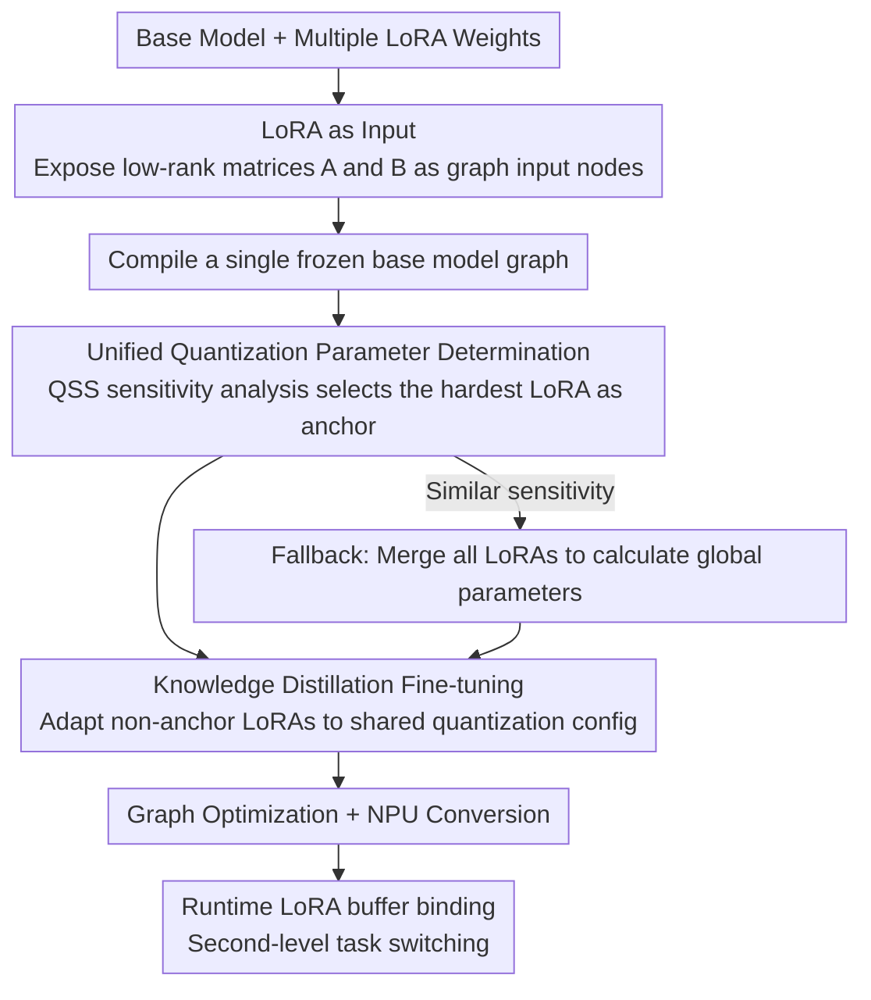

# Quantization with Unified Adaptive Distillation to enable multi-LoRA based one-for-all Generative Vision Models on edge

**Conference**: CVPR 2026  
**arXiv**: [2603.29535](https://arxiv.org/abs/2603.29535)  
**Code**: None  
**Area**: Image Generation  
**Keywords**: LoRA Quantization, Edge Deployment, Knowledge Distillation, Diffusion Models, Runtime Task Switching

## TL;DR

This paper proposes the QUAD framework, which treats LoRA weights as runtime inputs instead of compiling them into the model graph. Combined with a distillation fine-tuning strategy that shares quantization parameters across multiple LoRAs, it enables a single compiled model to dynamically switch between multiple GenAI tasks on mobile NPUs, achieving 6x memory compression and 4x latency improvement.

## Background & Motivation

1. **Background**: GenAI features on smartphones (image editing, object removal, text-guided transformation, etc.) are increasing, typically based on diffusion models (such as Stable Diffusion 1.5) using LoRA for task-specific adaptation.

2. **Limitations of Prior Work**: The current mobile deployment workflow involves **compiling each LoRA individually**—merging LoRA weights into the base model before quantization and compilation. This leads to independent model binary files for each task. N tasks = N base model copies + N compiled graphs, causing linear growth in ROM usage.

3. **Key Challenge**: Different LoRAs trained independently have distinct weight distributions, leading to inconsistent quantization parameters (scale and zero-point). They cannot share a single static quantization inference graph. Consequently, on hardware like NPUs with fixed quantization parameters, each LoRA must be compiled separately, preventing runtime switching.

4. **Goal**: Design a unified deployment framework that: (a) shares quantization parameters across multiple LoRAs; (b) supports dynamic runtime injection of LoRA weights (without recompilation); (c) maintains generation quality under low-precision inference.

5. **Key Insight**: Change the model graph construction—shifting LoRA weights from compile-time embedding to runtime input tensors—and then use knowledge distillation fine-tuning to adapt all LoRAs to a unified quantization configuration.

6. **Core Idea**: LoRA as Input + Shared quantization parameters based on sensitivity analysis + Knowledge distillation fine-tuning = Single-graph multi-task edge deployment.

## Method

### Overall Architecture

This paper addresses the deployment challenge of running multiple GenAI tasks on a single phone without storing a separate model for each. Traditional methods merge LoRA into the base model before quantization and compilation, leading to storage expansion linear to the number of tasks. The QUAD pipeline revolves around "letting multiple LoRAs share the same compiled base model graph": first, LoRA weights are changed from compile-time embedding to runtime inputs to compile a frozen base model graph; next, a set of shared quantization parameters is determined for all LoRAs, and knowledge distillation fine-tuning is used to ensure each LoRA maintains quality under this configuration; finally, graph optimization and NPU format conversion are performed. At deployment, the system only needs to load and bind the LoRA buffer for the corresponding task at runtime for second-level switching.

### Key Designs

**1. LoRA as Input: Transforming LoRA from "Part of the Model" to "Model Input"**

The pain point is that once LoRA weights are compiled into the model graph, every task change necessitates recompilation and a new base model copy. QUAD rewrites the architecture: for every LoRA-enhanced linear layer $y = Wx + \alpha A(Bx)$, the low-rank matrices $A$ and $B$ are exposed as additional input nodes in the model graph rather than fixed weights. Thus, only one frozen base model binary is generated during compilation. During inference, different tasks place their respective LoRA weights in RAM as buffers and bind them to these input nodes via a lightweight API. The fundamental difference from traditional schemes is like switching from "static linking" to "dynamic linking"—the bulky base model is stored only once. The benefit scales with the number of tasks: for 10 LoRAs (~120MB each) and a 1.4GB base model, traditional merge+compile requires 15GB, while QUAD requires only 2.6GB, a ~6x compression.

**2. Unified Quantization Parameter Determination: Using Sensitivity Analysis to Select a "Hardest" LoRA as Anchor**

While LoRA as Input solves the graph structure issue, NPUs require fixed quantization scales and zero-points. Since independently trained LoRAs have different distributions, direct sharing causes accuracy collapse for some tasks. QUAD calculates a Quantization Sensitivity Score (QSS) for each LoRA to measure the output deviation after quantization:

$$QSS = \mathbb{E}_x\big[D\big(f(x;w)\,\|\,f(x;\tilde{w})\big)\big]$$

where $D$ is the JS divergence, and $f(x;w)$ and $f(x;\tilde{w})$ are the outputs of the full-precision and quantized models, respectively. The LoRA with the highest QSS (most sensitive) is selected as the anchor, and its quantization parameters are used as the global shared parameters. This follows a "bottleneck" logic: prioritize the hardest task, and let others adapt via distillation. If sensitivities are similar, a fallback strategy (Unified-LoRA) calculates global parameters by merging all LoRA distributions.

**3. Knowledge Distillation Fine-tuning: Adapting Non-anchor LoRAs to Shared Quantization Config**

Selecting shared parameters is insufficient—applying anchor parameters to other LoRAs directly causes accuracy collapse (FID jumps from 5.53 to 599 in INT8). QUAD uses knowledge distillation to "pull" these LoRAs back: a QuantSim model is constructed where the target LoRA weights are PTQ-encoded using the anchor's parameters. The full-precision model acts as the teacher and the QuantSim model as the student. The optimization goal is to minimize the reconstruction loss between their outputs, plus the original LVM training objective (e.g., DDPM denoising loss). Through iterative optimization, LoRA weights adjust their distribution to be well-represented by the shared quantization parameters while maintaining task performance. This adapts the LoRA to fixed hardware constraints.

### Loss & Training

Loss = teacher-student output reconstruction loss + original LVM training objective (e.g., DDPM denoising loss). Quantization configuration is W8A16 (Weight INT8, Activation INT16). Experiments show that further compressing activations to INT8 leads to significant quality degradation (FID increases from 12.2 to 599 under W8A8).

## Key Experimental Results

### Main Results

Comparison of FP32 vs. INT8 quantization accuracy:

| Use Case | Metric | Value |
|------|------|-----|
| Prompt guided transform | $sim_d$ (Cosine sim. direction) | 0.9428 |
| Prompt guided transform | $sim_{image}$ (Semantic sim.) | 0.881 |
| Prompt guided transform | Structure loss | 0.045 |
| Object Removal (After QUAD) | FID | 5.5287 |
| Object Removal | SSIM | 0.94 |
| Object Removal | PSNR | 33.04 |

On-device KPIs (SD1.5 1.1B model):

| Metric | Qualcomm (GS25) | LSI (GS25) | MediaTek (Tab S11) |
|------|-----------------|------------|-------------------|
| E2E Latency (8 steps) | 8826ms / 3723ms | 12456ms / 4217ms | 15682ms / 5528ms |
| Shared Model ROM | 1375MB | 1125MB | 1177MB |
| LoRA ROM | 119MB | 134MB / 104MB | 31MB / 87MB |
| Peak RAM | 1739MB | 1259MB | 1590MB |

4-Task Deployment (SD1.5 0.7B model, GS25, OLSS 8 steps):

| Use Case | UNet Exec (ms) | E2E (ms) | LoRA ROM (MB) |
|------|-------------|-----------|-------------|
| Text-to-Image | 48 | 1052 | N/A |
| Sketch-to-Image | 48 | 1527 | 77 |
| Sticker Gen | 48 | 1080 | 77 |
| Portrait Studio | 51 | 1874 | 77 |

### Ablation Study

Mixed-precision quantization comparison (Prompt guided transform):

| Config (W8A8:W8A16) | FID | LPIPS | PSNR | SSIM |
|-------------------|-----|-------|------|------|
| 0:100 (Full W8A16) | **12.23** | **0.1083** | **32.71** | **0.9808** |
| 40:60 | 13.05 | 0.1086 | 32.68 | 0.9806 |
| 80:20 | 14.28 | 0.1125 | 31.41 | 0.9777 |
| 100:0 (Full W8A8) | 599.07 | 0.699 | 5.44 | 0.2324 |

### Key Findings

- **LoRA weights have low quantization sensitivity**: INT8 quantization of LoRA only results in a 1.5x ROM reduction with minimal accuracy loss, indicating simple value distributions in low-rank matrices.
- **Activation quantization is the bottleneck**: In full W8A8, FID explodes to 599. W8A16 is currently the optimal configuration point.
- **Memory benefits scale linearly with task count**: While gains are limited for 2 tasks, 10 tasks show a reduction from 15GB to 2.6GB (6x compression).
- **Extremely low runtime switching latency**: Switching LoRA only requires loading 100-200MB buffers, which is ~1.5s faster than reloading a whole 1-2GB model.
- The solution is effective across Qualcomm, LSI, and MediaTek chips, demonstrating hardware agnosticism.

## Highlights & Insights

- **Paradigm shift with "LoRA as Input"**: Treating LoRA as a model input instead of a weight component fundamentally changes multi-task deployment. This mirrors the transition from static to dynamic linking in software engineering.
- **Anchor selection via QSS**: Using sensitivity analysis to select a global baseline ensures the most challenging tasks do not collapse. This "bottleneck" strategy is valuable for system design.
- **OTA Scalability**: New LoRAs can be pushed to devices via OTA and used immediately without updating the base model, aligning with app store update logic.

## Limitations & Future Work

- Verified only on SD 1.5 (1.1B and 0.7B); scalability to larger models (SDXL/Flux) is unknown.
- Accuracy collapse in W8A8 limits further latency and memory optimization; advanced activation quantization is needed.
- Distillation fine-tuning must be performed independently for each non-anchor LoRA, leading to linear training costs as LoRA count increases.
- Evaluations rely on FID/SSIM; lack of subjective human perception quality assessments.
- Compatibility with open-source LoRA ecosystems (e.g., Civitai) was not verified.

## Related Work & Insights

- **vs. QLoRA/QaLoRA**: These focus on efficiency during the training phase and do not address multi-LoRA switching during deployment.
- **vs. MobileDiffusion**: Focuses on reducing diffusion inference costs but assumes a static model graph, lacking support for runtime task switching.
- **vs. Traditional merge+compile**: Traditional methods cause linear memory growth. QUAD achieves near-constant storage overhead relative to the number of tasks by sharing the base model.

## Rating

- Novelty: ⭐⭐⭐⭐
- Experimental Thoroughness: ⭐⭐⭐⭐
- Writing Quality: ⭐⭐⭐⭐
- Value: ⭐⭐⭐⭐⭐

<!-- RELATED:START -->

## Related Papers

- [\[CVPR 2026\] All-in-One Slider for Attribute Manipulation in Diffusion Models](all_in_one_slider_attribute_manipulation.md)
- [\[CVPR 2026\] MapReduce LoRA: Advancing the Pareto Front in Multi-Preference Optimization for Generative Models](mapreduce_lora_advancing_the_pareto_front_in_multi-preference_optimization_for_g.md)
- [\[CVPR 2026\] VOSR: A Vision-Only Generative Model for Image Super-Resolution](vosr_a_vision_only_generative_model_for_image_super_resolution.md)
- [\[CVPR 2026\] Language-Free Generative Editing from One Visual Example](language-free_generative_editing_from_one_visual_example.md)
- [\[CVPR 2026\] ChimeraLoRA: Multi-Head LoRA-Guided Synthetic Datasets](chimeralora_multi-head_lora-guided_synthetic_datasets.md)

<!-- RELATED:END -->
