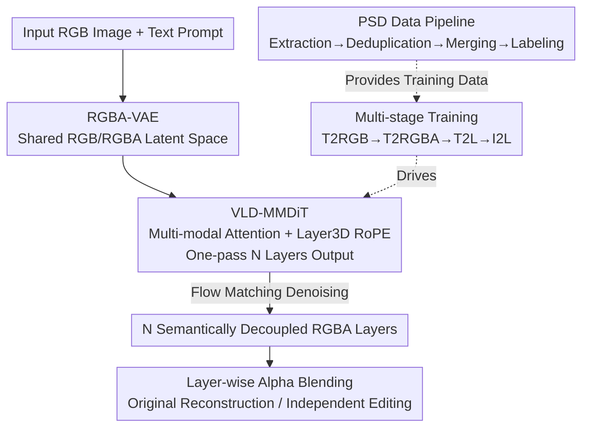

# Qwen-Image-Layered: Towards Inherent Editability via Layer Decomposition

**Conference**: CVPR 2026  
**Paper**: [CVF Open Access](https://openaccess.thecvf.com/content/CVPR2026/html/Yin_Qwen-Image-Layered_Towards_Inherent_Editability_via_Layer_Decomposition_CVPR_2026_paper.html)  
**Code**: https://github.com/QwenLM/Qwen-Image-Layered  
**Area**: Image Generation  
**Keywords**: Layer Decomposition, RGBA, Consistent Editing, Diffusion Models, MMDiT

## TL;DR
This work decomposes a single RGB image into multiple semantically decoupled RGBA layers end-to-end. Each layer can be independently edited without affecting other content, fundamentally solving semantic drift and geometric misalignment in raster image editing. The decomposition quality significantly exceeds previous recursive methods.

## Background & Motivation
**Background**: Current image editing mainstream follows two categories. One is global editing (e.g., Qwen-Image-Edit), which resamples the entire image in the latent space for style transfer or expression modification. The other is mask-guided local editing (e.g., DiffEdit), which estimates a mask and only operates within its boundaries.

**Limitations of Prior Work**: Global editing is limited by the stochasticity of probabilistic generation, causing unchanged regions to vary, leading to **semantic drift** (unintended changes in identity) and **geometric misalignment** (shifts in object position/scale). Local editing struggles with the masks themselves—occlusions and soft boundaries (hair, semi-transparency) lead to blurred "regions to be modified," making accurate masking difficult and failing to preserve consistency.

**Key Challenge**: The authors argue the root cause is not model design or data engineering, but the **image representation itself**. Traditional raster images are "flat and entangled"—all visual content is compressed into one canvas, with semantics and geometry tightly coupled. Consequently, any edit propagates through this entangled pixel space, making consistency naturally hard to maintain.

**Key Insight**: Professional design software (Photoshop) never uses a flat canvas but utilizes **layers**—editing one layer does not touch others. The authors apply this intuition to generative models: representing an image as a stack of semantically decomposed RGBA layers allows edits to act only on the target layer, physically isolated from other content. Semantic drift and geometric misalignment are "eliminated at the representation level." Furthermore, layer representation natively supports high-fidelity basic operations like scaling, translation, and color adjustment.

**Core Idea**: Training an end-to-end diffusion model to decompose a single RGB image directly into a **variable number** of semantically decoupled RGBA layers (rather than previous foreground/background pairs or recursive inference), exchanging decoupled representation for "inherent, self-consistent" editability.

## Method

### Overall Architecture
The model, denoted as Qwen-Image-Layered, is built upon Qwen-Image. Given an input RGB image $I \in \mathbb{R}^{H\times W\times 3}$, it outputs $N$ RGBA layers $L \in \mathbb{R}^{N\times H\times W\times 4}$. Each layer $L_i=[RGB_i;\alpha_i]$ contains color and an alpha mask. The original image can be losslessly reconstructed by alpha-blending these layers:

$$C_0 = 0,\quad C_i = \alpha_i \cdot RGB_i + (1-\alpha_i)\cdot C_{i-1},\quad I = C_N$$

To enable the "one image $\rightarrow$ variable RGBA layers" pipeline, the authors modified Qwen-Image in three ways: ① An **RGBA-VAE** capable of encoding both RGB and RGBA to place inputs and outputs in the same latent space, eliminating distribution gaps; ② A **VLD-MMDiT** (Variable Layer Decomposition MMDiT) that outputs an arbitrary number of layers at once using a "layer dimension" RoPE, avoiding recursion; ③ A **multi-stage, multi-task training** strategy to gradually adapt a pre-trained T2I model into a layer decomposer. Additionally, due to the scarcity of high-quality layered data, a **data pipeline** was built to extract and label layers from real PSD files.

### Key Designs

**1. RGBA-VAE: Shared Latent Space for Input RGB and Output RGBA**

Previous decomposers (e.g., LayerDecomp) used independent VAEs for RGB inputs and RGBA outputs, creating a gap between distribution latents. This forced models to simultaneously decompose and align across distributions. This work expands the first convolutional layer of the Qwen-Image VAE encoder and the last layer of the decoder from 3 channels to 4 (inspired by AlphaVAE). A single VAE handles both RGB and RGBA—for RGB images, the alpha channel is set to 1.

Crucially, initialization must not destroy RGB reconstruction capabilities: pre-trained RGB VAE weights are copied to the first three channels, the fourth channel weights are zeroed, and the corresponding decoder bias is set to 1, i.e., $W^0_E[:,3,:,:,:]=0$, $W^l_D[3,:,:,:,:]=0$, $b^l_D[3]=1$. This ensures the initial state is equivalent to the original RGB VAE. Training uses reconstruction, perceptual, and regularization losses. After training, the input RGB and each output RGBA layer reside in the same latent space and are encoded independently. Ablations show this improved Alpha soft IoU from 0.58 to 0.65.

**2. VLD-MMDiT + Layer3D RoPE: One-pass Variable Layer Output, No Recursion**

Prior methods often split only foreground/background, requiring recursive "peel and inpaint" steps that accumulate errors. VLD-MMDiT aims for **arbitrary $N$ layer output in a single forward pass**. It treats the target RGBA layer latents $x_0=E(L)$ as the denoising target, utilizing Flow Matching/Rectified Flow: $x_t = t x_0 + (1-t)x_1$, $v_t = x_0 - x_1$, and the model $v_\theta(x_t,t,z_I,h)$ is conditioned on the input image latent $z_I$ and text $h$, optimized via $\mathcal{L}=\mathbb{E}\|v_\theta(x_t,t,z_I,h)-v_t\|^2$. Instead of manual layer-wise attention designs, text, input image, and noise layers are concatenated as a single sequence for multi-modal attention to model interactions.

To support variable layer counts, **Layer3D RoPE** is introduced. Building on Qwen-Image's MSRoPE, it adds a **layer dimension**. Latent $x_t$ layer indices increment from 0, while the condition $z_I$ is set to -1. This explicitly distinguishes the "condition image" from "target layers" and allows the architecture to remain compatible with tasks like text-to-multi-layer. Ablations show that without Layer3D RoPE, the model fails to distinguish layers, leading to degraded performance (RGB L1 worsens from 0.19 to 0.28).

**3. Multi-stage Multi-task Training: Gradual Adaptation of T2I Models**

Fine-tuning a pre-trained T2I model directly for decomposition is difficult. The authors designed a three-stage strategy: **Stage 1** (Text-to-RGB $\rightarrow$ Text-to-RGBA) switches to RGBA-VAE and jointly trains RGB and RGBA generation to learn transparency; **Stage 2** (→ Text-to-Multi-RGBA) introduces multi-layer tasks and activates the layer dimension, training the model to predict both the final composite and transparency layers simultaneously (Qwen-Image-Layered-T2L); **Stage 3** (→ Image-to-Multi-RGBA) adds the image input condition to achieve the final I2L decomposition capability. The stages involve 500K / 400K / 400K steps respectively. This strategy provided the largest gain, pushing Alpha soft IoU from 0.65 to 0.87.

### Loss & Training
VAE involves reconstruction, perceptual, and regularization losses. The diffusion backbone uses Flow Matching velocity regression MSE. Optimized with Adam, learning rate $1\times10^{-5}$, maximum layers set to 20, totaling 1.3M steps.

## Key Experimental Results

### Main Results
On the Crello dataset, following the LayerD evaluation protocol (using order-aware DTW to align layer sequences and allowing neighbor merging to handle ambiguity), Image-to-Multi-RGBA performance is reported. Metrics include RGB L1 (weighted by GT alpha, lower is better) and Alpha soft IoU (higher is better). Table for "Merge 0 Layers" (strictest):

| Method | RGB L1 ↓ | Alpha soft IoU ↑ |
|------|----------|------------------|
| VLM Base + Hi-SAM | 0.1197 | 0.5596 |
| Yolo Base + Hi-SAM | 0.0962 | 0.5697 |
| LayerD | 0.0709 | 0.7520 |
| **Qwen-Image-Layered-I2L** | **0.0594** | **0.8705** |

Alpha soft IoU increased from LayerD's 0.752 to 0.871, showing a significant advantage in alpha channel fidelity.

For RGBA image reconstruction (AIM-500 dataset), RGBA-VAE also outperforms current alpha VAEs:

| Model | Backbone | PSNR ↑ | SSIM ↑ | rFID ↓ | LPIPS ↓ |
|------|------|--------|--------|--------|---------|
| LayerDiffuse | SDXL | 32.09 | 0.944 | 17.70 | 0.0418 |
| AlphaVAE | FLUX | 36.94 | 0.974 | 11.79 | 0.0283 |
| **RGBA-VAE** | Qwen-Image | **38.83** | **0.980** | **5.31** | **0.0123** |

### Ablation Study
Components added sequentially on Crello (L=Layer3D RoPE, R=RGBA-VAE, M=Multi-stage Training), "Merge 0" results:

| Config | L | R | M | RGB L1 ↓ | Alpha soft IoU ↑ |
|------|---|---|---|----------|------------------|
| w/o L,R,M | ✗ | ✗ | ✗ | 0.2809 | 0.3725 |
| w/o R,M | ✓ | ✗ | ✗ | 0.1894 | 0.5844 |
| w/o M | ✓ | ✓ | ✗ | 0.1649 | 0.6504 |
| **Full** | ✓ | ✓ | ✓ | **0.0594** | **0.8705** |

### Key Findings
- **All components are essential**: Layer3D RoPE is the "switch" for multi-layer support; without it, the model cannot differentiate layers (RGB L1 degrades to 0.28). RGBA-VAE eliminates the distribution gap, pushing IoU from 0.58 to 0.65. Multi-stage training is the primary contributor, lifting IoU from 0.65 to 0.87.
- **End-to-End vs. Recursive**: Unlike LayerD's recursive "peel and inpaint" approach, this one-pass forward method avoids error propagation and inpainting artifacts.
- **Downstream Editing Consistency**: Compared to Qwen-Image-Edit-2509, operations like scaling/repositioning are difficult for global editing models (introducing pixel-level drift), whereas layer representation handles them naturally by modifying only the target layer.

## Highlights & Insights
- **Consistency as a Representation Property**: Instead of forcing consistency via loss or sampling, changing the representation to decoupled layers makes "unintended changes physically impossible." This paradigm shift is applicable to other entangled tasks like video or 3D editing.
- **Variable Output via Extra RoPE Dimension**: Treating "layers" as a position dimension and using -1 for conditions is a clever trick, allowing MMDiT to support variable-length output without architectural changes.
- **Data Mining from PSD Files**: Parsing real Photoshop documents using psd-tools, filtering layers, and labeling with Qwen2.5-VL bypasses the scarcity of high-quality layered data with a reproducible approach.

## Limitations & Future Work
- Strong dependence on large-scale real PSD data; the max layer count is capped at 20—performance in scenarios with extreme layers or complex transparency stacking remains to be fully explored. ⚠️
- Evaluations are focused on Crello / AIM-500, with fine-tuning on Crello to minimize distribution shifts; decomposition robustness across domains (natural photos, complex occlusions) requires more validation.
- The 1.3M step training on a large Qwen-Image backbone entails high costs. User control over "how many layers to split and how" remains limited.

## Related Work & Insights
- **vs. LayerD / Accordion (Recursive)**: These methods peel the topmost foreground and inpaint the background recursively, leading to error accumulation and artifacts. Ours is end-to-end with higher fidelity.
- **vs. LayerDecomp (Dual VAE)**: Uses separate VAEs for input/output, creating a distribution gap. Ours uses a unified RGBA-VAE.
- **vs. Qwen-Image-Edit-2509 (Global Editing)**: Same backbone, but global editing fails to preserve unedited regions during resampling. Ours ensures consistency via layer isolation.
- **vs. LayerDiffusion / LayerDiff / ART (Multi-layer Generation)**: These focus on generation via specific attentions or layouts. This work focuses on "decomposing existing images" and can back-convert AI-generated raster images into layers.

## Rating
- Novelty: ⭐⭐⭐⭐⭐ Resolving consistency through end-to-end variable layer RGBA decomposition is a paradigm innovation.
- Experimental Thoroughness: ⭐⭐⭐⭐ Covers decomposition, reconstruction, and ablation, though cross-domain large-layer testing is limited.
- Writing Quality: ⭐⭐⭐⭐⭐ Clear motivation, well-aligned designs and ablations, self-consistent logic.
- Value: ⭐⭐⭐⭐⭐ Establishes a new paradigm for consistent editing with open-sourced code and high potential.

<!-- RELATED:START -->

## Related Papers

- [\[CVPR 2026\] From Inpainting to Layer Decomposition: Repurposing Generative Inpainting Models for Image Layer Decomposition](from_inpainting_to_layer_decomposition_repurposing_generative_inpainting_models_.md)
- [\[CVPR 2026\] Cycle-Consistent Tuning for Layered Image Decomposition](cycle-consistent_tuning_for_layered_image_decomposition.md)
- [\[ICLR 2026\] Referring Layer Decomposition](../../ICLR2026/image_generation/referring_layer_decomposition.md)
- [\[CVPR 2025\] Generative Image Layer Decomposition with Visual Effects](../../CVPR2025/image_generation/generative_image_layer_decomposition_with_visual_effects.md)
- [\[CVPR 2025\] Improving Editability in Image Generation with Layer-wise Memory](../../CVPR2025/image_generation/improving_editability_in_image_generation_with_layer-wise_memory.md)

<!-- RELATED:END -->
