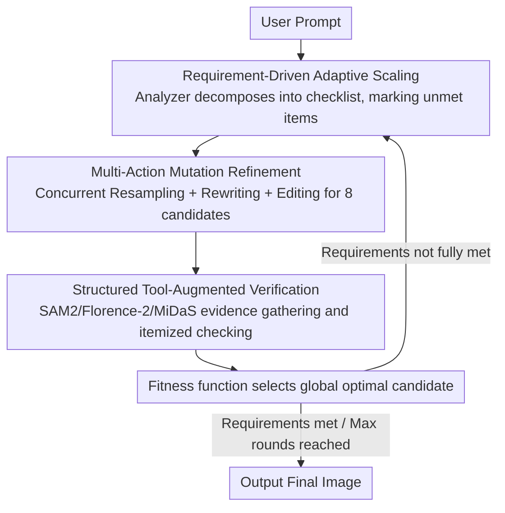

# RAISE: Requirement-Adaptive Evolutionary Refinement for Training-Free Text-to-Image Alignment

**Conference**: CVPR 2026  
**arXiv**: [2603.00483](https://arxiv.org/abs/2603.00483)  
**Code**: [https://github.com/LiyaoJiang1998/RAISE](https://github.com/LiyaoJiang1998/RAISE)  
**Area**: Image Generation  
**Keywords**: Inference-time scaling, Text-to-image alignment, Evolutionary optimization, Requirement-driven, Multi-agent

## TL;DR
This paper proposes the RAISE framework, which models T2I generation as a requirement-driven adaptive evolutionary process. By decomposing prompts into structured checklists via a requirement analyzer, the framework concurrently evolves candidate populations through multi-action mutations (prompt rewriting, noise resampling, and instruction editing). It then employs tool-augmented visual verification to eliminate candidates that fail to meet requirements in each round. This achieves adaptive inference-time scaling—reaching a SOTA score of 0.94 on GenEval while reducing generated samples by 30-40% and VLM calls by 80% compared to reflection fine-tuning baselines.

## Background & Motivation

**Background**: Although T2I diffusion models can generate realistic images, their fidelity to complex prompts (multiple objects, spatial relationships, attribute binding) remains insufficient. Inference-time scaling has emerged as a promising direction, improving alignment by allocating additional computation during inference through noise-level scaling (e.g., random search for optimal initial noise) or prompt-level scaling (e.g., rewriting prompts with VLMs).

**Limitations of Prior Work**:
   - **Training-free methods** (e.g., TIR, T2I-Copilot): These rely on fixed iteration budgets or thresholds, failing to adapt to the varying difficulty of different prompts. Performance often plateaus or degrades during multiple rounds of refinement, and methods like T2I-Copilot explore limited space by selecting only a single action per round.
   - **Training-based methods** (e.g., Reflect-DiT, ReflectionFlow): These require large-scale reflection datasets and joint fine-tuning of diffusion models and VLMs, resulting in high costs, over-fitting to reflection paths, and poor transferability to new foundation models.
   - All existing methods lack the ability to analyze "which specific requirements are unmet" from the prompt itself.

**Key Challenge**: Current methods either use fixed computation allocation (wasted on simple prompts, insufficient for complex ones) or rely on training (model-locked, high cost), failing to use "requirement fulfillment" as the driving signal for computation allocation.

**Key Insight**: T2I generation is analogized to the "requirement analysis → implementation → verification" workflow in software engineering. User prompts are first decomposed into a verifiable requirement checklist; each round identifies unmet items and allocates computation specifically to address them, stopping once all requirements are satisfied.

**Core Idea**: A requirement-driven adaptive evolutionary framework where multi-agents (Analyzer, Rewriter, Verifier) collaborate. It concurrently generates candidate populations via multi-action mutations, provides granular feedback through tool-augmented structured verification, and adapts computational effort to semantic complexity.

## Method

### Overall Architecture
RAISE treats training-free T2I alignment like a software engineering process: decomposing user prompts into a "requirement checklist" and iteratively performing "implementation-verification" until requirements are met. The system consists of three agents sharing a VLM backbone (Mistral-Small-3.2): the **Analyzer** parses prompts into a checklist $\mathcal{R}_i$ (distinguishing satisfied $\mathcal{R}_i^+$ and unsatisfied $\mathcal{R}_i^-$), accompanied by binary verification questions $Q_i$ and a continuation decision $d_i^{analyzer}$; the **Rewriter** generates new prompts or editing instructions for unmet items; and the **Verifier** answers verification questions after gathering evidence using visual tools.

The workflow of a single round is as follows: the Analyzer updates the checklist based on the best image from the previous round and its feedback; the Rewriter and noise sampler concurrently generate a batch of candidate images; the Verifier checks each item and selects the global optimum using a fitness function. If requirements are met, the process terminates; otherwise, the best image is carried into the next round. Crucially, the number of rounds and specific modifications adaptively follow the "remaining unmet requirements."

### Key Designs

**1. Requirement-Driven Adaptive Scaling: Allocating computation based on "remaining requirements" rather than fixed iterations**

Prior training-free methods (TIR, T2I-Copilot) use fixed budgets or thresholds, wasting computation on simple prompts while failing on complex ones. RAISE reverses this: at the start of each round, the Analyzer receives the user prompt, the previous best candidate, and its verification feedback. It outputs an updated checklist. Iteration terminates when the Analyzer determines major requirements are met ($d_{i}^{analyzer}$), the Verifier confirms all items are satisfied, or the maximum rounds $K_{max}=4$ are reached. This allows simple prompts to converge in 1-2 rounds while complex prompts automatically receive more iterations. The fundamental shift is moving the allocation signal from a "global alignment score" to "itemized requirement fulfillment."

**2. Multi-Action Mutation Refinement: Concurrent execution of complementary improvements to expand the search space**

Unlike T2I-Copilot, which selects a single action per round, RAISE generates $n_i = 8$ candidates concurrently using three complementary mutation actions: **Resampling** keeps the original prompt $x_{user}$ but changes the random noise $\epsilon \sim \mathcal{N}(0,I)$ to explore spatial layouts; **Prompt Rewriting** task the Rewriter to modify semantics based on $\mathcal{R}_i^-$ and generates candidates with new noise; and **Instruction Editing** generates three types of instructions based on the previous best image—a "top edit" for the most critical unmet item, a "random edit," and a "comprehensive edit" for all unmet items, executed via Flux Kontext. Actions are scheduled by stage: early stages ($i \leq K_{min}$) use generative mutations (resampling + rewriting) for broad exploration, while later stages ($i > K_{min}$) switch to rewriting + editing for targeted refinement.

**3. Structured Tool-Augmented Verification: Providing "hard evidence" to the VLM to mitigate visual hallucinations**

Directly asking a VLM if an image meets requirements often leads to hallucinations, especially regarding counting and spatial relations. RAISE first converts the image into structured evidence using visual tools: Grounded SAM 2 + Florence-2 for detection and description, and MiDaS for depth estimation, resulting in:

$$G_{i,j} = (caption,\ \{(label_k,\ bbox_k,\ depth_k)\},\ image\_size)$$

This includes a description, labels/bounding boxes/depth for each object, and image dimensions. The Verifier provides this evidence along with verification questions $Q_i$ to the VLM, which outputs (question, yes/no answer, explanation) triples. Finally, an NVILA-Lite-2B-Verifier calculates alignment scores to select the global optimum. Bounding boxes provide objective evidence for presence/count/occlusion, and depth provides anchors for foreground/background relations, making VLM reasoning verifiable rather than intuitive.

## Method (Extended)

### A Full Example: Generating "Two cats sitting above a blue box"

Assume the prompt is "two cats sitting above a blue box." In Round 1, the Analyzer decomposes this into three requirements: counting (exactly two cats), spatial (cats above the box), and color (blue box). Since it is an early stage ($i \leq K_{min}=2$), generative mutations are used, and 8 candidates are produced via resampling and rewriting. The Verifier counts cats via Grounded SAM 2, judges the "above" relation via bboxes and depth, and checks color via descriptions. It finds most candidates have the correct count and color, but the "above" relation is generally missing, so $\mathcal{R}_i^- = \{\text{spatial relation}\}$.

In Round 2, the Analyzer updates the checklist and enters the later stage, switching to rewriting + editing. Based on the previous best image, it generates a "top edit" instruction to fix the spatial relation, executed by Flux Kontext. The Verifier confirms one candidate now satisfies all three requirements, triggering termination. The NVILA fitness function selects it as the final output. The prompt required only 2 rounds (~16 samples), far lower than the fixed 32-sample budget of ReflectionFlow.

### Implementation Details
- Generator: FLUX.1-dev (28 steps); Editor: FLUX.1-Kontext-dev
- VLM Backbone: Mistral-Small-3.2-24B, orchestrated via LangGraph, local inference via Ollama
- Fitness Function: NVILA-Lite-2B-Verifier
- $K_{max}=4, K_{min}=2$

## Key Experimental Results

### Main Results (GenEval)

| Method | Type | Samples | VLM Calls | Overall | Two Obj | Counting | Colors | Position | Attr Bind |
|------|------|--------|---------|------|---------|----------|--------|----------|-----------|
| FLUX.1-dev | Baseline | 1 | 0 | 0.67 | 0.81 | 0.75 | 0.80 | 0.21 | 0.48 |
| ReflectionFlow | Train | 32 | 64 | 0.91 | 0.98 | 0.89 | 0.95 | 0.89 | 0.75 |
| Qwen-Image-RL | UMM | 1 | 1 | 0.91 | 0.95 | 0.93 | 0.92 | 0.87 | 0.83 |
| T2I-Copilot | Free | 11.3 | 22.6 | 0.74 | 0.91 | 0.68 | 0.86 | 0.55 | 0.46 |
| **Ours (RAISE)** | **Free** | **18.6** | **7.3** | **0.94** | **1.00** | **0.95** | **0.98** | **0.83** | **0.87** |

### DrawBench Comparison

| Method | Samples | VLM Calls | VQAScore↑ | ImageReward↑ | HPSv2↑ |
|------|--------|---------|-----------|-------------|--------|
| FLUX.1-dev | 1 | 0 | 0.778 | 1.06 | 0.298 |
| ReflectionFlow (32) | 32 | 64 | 0.844 | 1.10 | 0.302 |
| T2I-Copilot | 11.2 | 22.3 | 0.820 | 0.94 | 0.298 |
| **Ours (RAISE)** | **21.2** | **8.6** | **0.885** | **1.15** | **0.305** |

### Key Findings
- **Overall GenEval score of 0.94** outperforms all methods, including Unified Multimodal Models (UMM) like Qwen-Image-RL (0.91) and GPT Image 1 (0.84) that require large-scale pre-training.
- **Significant efficiency gains**: RAISE reduces samples by 41.9% (18.6 vs 32) and VLM calls by 88.6% (7.3 vs 64) compared to ReflectionFlow.
- **Perfect scores in Two Object (100%) and Colors (98%)** demonstrate the strong guarantee provided by requirement verification for basic alignment.
- **Adaptive characteristics**: Average samples are 18.6 on GenEval vs 21.2 on DrawBench—more complex reasoning prompts automatically receive more computation.
- **Pareto frontier improvement**: Unlike baselines that plateau early, RAISE continues to improve as the sample budget increases.

## Highlights & Insights
- **Requirement-driven adaptive computation allocation** is the core innovation—moving prompt understanding from "global scoring" to an "itemized checklist" makes feedback actionable.
- **Multi-action concurrent mutation** significantly expands the search space—resampling for layout, rewriting for semantics, and editing for details are complementary and parallel.
- **Tool-augmented verification** resolves VLM hallucination issues in visual judgment by using detection and depth tools to anchor reasoning with "hard evidence."
- **Evolutionary framework applicability**: The framework is model-agnostic; FLUX can be replaced by any T2I model, demonstrating high generality.

## Limitations & Future Work
- The cap of 8 candidates × 4 rounds (32 images) may still be insufficient for extremely complex prompts.
- Performance relies on the VLM's (Mistral-Small-3.2) analysis and verification capabilities; reasoning errors can propagate.
- Currently lacks support for constraints beyond text descriptions (e.g., sketch guidance, reference styles).
- Instruction editing depends on Flux Kontext; large-scale modifications (e.g., complete composition changes) may be limited.
- Computational overhead remains relatively high (~20 images + ~8 VLM calls per prompt), making real-time application challenging.

## Related Work & Insights
- **vs T2I-Copilot**: While both are training-free, T2I-Copilot uses single-action rounds and fixed threshold stopping (0.74), whereas RAISE uses concurrent multi-actions and requirement adaptation (0.94).
- **vs ReflectionFlow**: RAISE outperforms methods requiring million-scale reflection datasets and fine-tuning (0.94 vs 0.91) while being several times more efficient.
- **vs Noise Scaling**: Simple noise search (0.85) reaches a ceiling that RAISE's semantic-level refinement successfully breaks.

## Rating
- Novelty: ⭐⭐⭐⭐⭐ Modeling T2I alignment as a requirement-driven evolutionary process is highly novel.
- Experimental Thoroughness: ⭐⭐⭐⭐⭐ Comprehensive evaluation across multiple benchmarks, efficiency analysis, and Pareto frontiers.
- Writing Quality: ⭐⭐⭐⭐ Clear framework diagrams and rigorous formulation, though notation is dense.
- Value: ⭐⭐⭐⭐⭐ SOTA results, training-free, and model-agnostic; high practical value for T2I inference optimization.

<!-- RELATED:START -->

## Related Papers

- [\[CVPR 2026\] DTG-Restore: Training-Free Diffusion Refinement for Generative Video Super-Resolution](dtg-restore_training-free_diffusion_refinement_for_generative_video_super-resolu.md)
- [\[CVPR 2026\] TAP: A Token-Adaptive Predictor Framework for Training-Free Diffusion Acceleration](tap_a_token-adaptive_predictor_framework_for_training-free_diffusion_acceleratio.md)
- [\[CVPR 2026\] PromptLoop: Plug-and-Play Prompt Refinement via Latent Feedback for Diffusion Model Alignment](promptloop_plug-and-play_prompt_refinement_via_latent_feedback_for_diffusion_mod.md)
- [\[CVPR 2026\] WISER: Wider Search, Deeper Thinking, and Adaptive Fusion for Training-Free Zero-Shot Composed Image Retrieval](wiser_wider_search_deeper_thinking_and_adaptive_fusion_for_training-free_zero-sh.md)
- [\[CVPR 2026\] PG-VTON: Single-Pass Training-Free Virtual Try-On via Patch-Guided Reference Alignment](pg-vton_single-pass_training-free_virtual_try-on_via_patch-guided_reference_alig.md)

<!-- RELATED:END -->
## Related Papers

- [\[CVPR 2026\] TAP: A Token-Adaptive Predictor Framework for Training-Free Diffusion Acceleration](tap_a_token-adaptive_predictor_framework_for_training-free_diffusion_acceleratio.md)
- [\[CVPR 2026\] WISER: Wider Search, Deeper Thinking, and Adaptive Fusion for Training-Free Zero-Shot Composed Image Retrieval](wiser_wider_search_deeper_thinking_and_adaptive_fusion_for_training-free_zero-sh.md)
- [\[CVPR 2026\] PromptLoop: Plug-and-Play Prompt Refinement via Latent Feedback for Diffusion Model Alignment](promptloop_plug-and-play_prompt_refinement_via_latent_feedback_for_diffusion_mod.md)
- [\[CVPR 2026\] Efficient and Training-Free Single-Image Diffusion Models](efficient_and_training-free_single-image_diffusion_models.md)
- [\[ICML 2026\] AdaEraser: Training-Free Object Removal via Adaptive Attention Suppression](../../ICML2026/image_generation/adaeraser_training-free_object_removal_via_adaptive_attention_suppression.md)

<!-- RELATED:END -->
