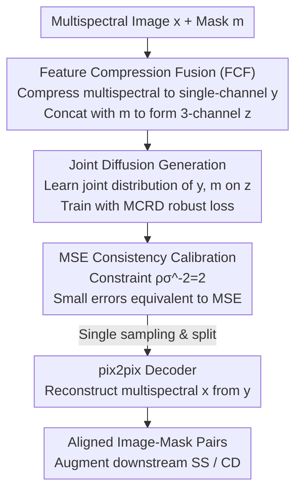

# RDF-MIG: A Robust Diffusion Framework for Masked Image Generation to Augment Semantic Segmentation and Change Detection

**Conference**: CVPR 2026  
**Paper**: [CVF Open Access](https://openaccess.thecvf.com/content/CVPR2026/html/Cao_RDF-MIG_A_Robust_Diffusion_Framework_for_Masked_Image_Generation_to_CVPR_2026_paper.html)  
**Code**: To be confirmed  
**Area**: Image Generation / Diffusion Models / Remote Sensing Data Augmentation  
**Keywords**: Masked image generation, robust diffusion loss, correntropy, multispectral remote sensing, change detection

## TL;DR
To address the scarcity of annotations for semantic segmentation (SS) and change detection (CD) in remote sensing—compounded by the task-specific nature of existing generation methods, lack of multispectral support, and sensitivity to noisy samples—this paper proposes RDF-MIG. By utilizing Feature Compression Fusion (FCF), multispectral images and masks are integrated into a three-channel tensor for joint diffusion generation. Concurrently, a robust MCRD loss based on correntropy combined with MSE consistency calibration is employed to suppress heavy-tailed noise. This single framework synthesizes aligned image-mask pairs for both SS and CD tasks, enhancing downstream performance.

## Background & Motivation
**Background**: Semantic segmentation and change detection are core technologies in remote sensing (RS) image analysis. Both rely on large-scale pixel-level annotations. However, high-resolution satellite imagery is expensive to acquire, manual labeling is labor-intensive, and many datasets are restricted due to security or policy reasons. Synthesizing annotated data with generative models to expand training sets has become a robust alternative to traditional data augmentation.

**Limitations of Prior Work**: Existing RS generation methods suffer from "single-task isolation": segmentation-oriented methods (e.g., SatSynth, SegDiff) cannot generate change masks; change detection-oriented methods (e.g., ChangeAnywhere, Changen) either rely on semantic masks for each temporal phase (making them incompatible with datasets like LEVIR-CD+ that only provide bi-temporal images and change masks) or use copy-paste methods that only modify local areas, resulting in low diversity. Even ChangeDiff, which removes mask dependency, only serves CD and cannot perform SS. More generally, these methods almost exclusively generate RGB images, failing to utilize multispectral information, and emphasize image-mask synthesis strategies while neglecting the impact of noisy samples during training, thus lacking robustness.

**Key Challenge**: When jointly generating images and masks, alignment errors and label noise induce heavy-tailed residuals. The default MSE training objective of diffusion models is extremely sensitive to large errors—large errors contribute massive gradients that push weights in the wrong direction. Common robust alternatives (L1/Huber) are gentler than MSE but remain insufficient under heavy-tailed or non-Gaussian noise, sometimes even leading to incorrect updates. Therefore, the core difficulty lies in "jointly generating aligned image-mask pairs while remaining robust to noise."

**Goal**: (1) To develop a single framework supporting image-mask pair generation for both SS and CD, where CD no longer requires per-phase semantic masks; (2) To support multispectral generation; (3) To design a diffusion loss robust to heavy-tailed noise while maintaining MSE-level precision on clean samples.

**Key Insight**: Modeling the "image feature + mask" as a joint distribution allows a single reverse diffusion process to sample both simultaneously. The noise issue is addressed via the correntropy criterion from information theory, using kernelized information potential instead of moment constraints to adaptively suppress outlier gradients.

**Core Idea**: FCF compresses multispectral images and masks into a three-channel tensor fed into an RGB-pretrained diffusion model for joint generation. The MCRD loss with MSE consistency calibration ensures that training is equivalent to MSE on clean samples but automatically attenuates gradients on heavy-tailed noise.

## Method

### Overall Architecture
The pipeline of RDF-MIG is as follows: The input multispectral RS image $x \in \mathbb{R}^{H\times W\times a}$ and its mask $m$ are first processed by FCF, which weights the multispectral channels into a structure-preserving single-channel feature $y$. Then, $y$ and the mask $m$ are concatenated along the channel dimension to form a three-channel tensor $z \in \mathbb{R}^{H\times W\times 3}$. The diffusion model learns the joint distribution of $(y,m)$ on $z$, trained with the MCRD robust loss. During inference, a single diffusion sampling step yields $\tilde z$, which is split back into $(\tilde y, \tilde m)$. A pix2pix decoder then reconstructs the multispectral image $\tilde x$ from the feature $\tilde y$, ultimately producing strictly aligned image-mask pairs $(\tilde x, \tilde m)$ to augment downstream SS/CD tasks. The three-channel design is a critical engineering point—it allows the framework to reuse and fine-tune large RGB-pretrained diffusion models (LDM/SD).

### Key Designs

**1. Feature Compression Fusion (FCF): Packing Multispectral + Mask into Three Channels to Reuse RGB Priors**

The bottleneck is: to let the diffusion model jointly sample images and masks, directly concatenating multispectral images ($a$ channels) and masks in pixel space expands the channel dimension and breaks compatibility with RGB-pretrained models. FCF uses two steps: first, it performs channel-wise weighted compression on $a$ bands to obtain a structure-preserving single-channel feature map $y(i,j)=\sum_{k=1}^{a} w_k \cdot x_k(i,j)$, where $\sum_k w_k = 1$ (implemented with uniform weights $w_k = 1/a$). Second, $y$ is concatenated with mask $m$ (Concat operator $A\oplus B$) to form a three-channel tensor $z$. For CD, bi-temporal images $x_A, x_B$ are compressed into $y_A, y_B$ and concatenated with the change mask $m_{cd}$ to form $z$. For SS, the multispectral image is split into RGB and other spectra for separate encoding before concatenation with the segmentation mask. This three-channel structure matches the input of RGB-pretrained diffusion models, allowing direct fine-tuning of models like LDM while encoding both multispectral information and masks into the diffusion learning objective. FCF is agnostic to the specific diffusion model (DDPM/LDM/DDIM) and task, handling only the organization of inputs.

**2. MCRD Loss: Using Correntropy to Adaptively Suppress Heavy-Tailed Noise Gradients**

The default MSE objective $\min \mathbb{E}\,\|f_\theta(x_t,t)-\varepsilon\|^2$ is sensitive to large errors, and L1/Huber cannot handle heavy tails effectively. Starting from the correntropy criterion, this paper replaces moment penalties with kernelized information potential, defining the MCRD loss as $\text{Loss}_{MCRD}(x)=\mathbb{E}[\rho(1-\exp(-x^2/2\sigma^2))]$, where $\exp(-x^2/2\sigma^2)$ is the correntropy term, $\sigma$ is the kernel width, and $\rho$ is a scaling parameter. Applied to step-wise noise prediction, the training objective becomes $\min \mathbb{E}[\rho(1-\exp(-\|f_\theta(x_t,t)-\varepsilon\|^2/2\sigma^2))]$, which yields a gradient with an exponential weighting factor $\rho\sigma^{-2}\exp(-e^2/2\sigma^2)$ (where $e=f_\theta(x_t,t)-\varepsilon$ is the error). The merit of this factor is: when the error is small, it is nearly constant, behaving like MSE; when the error is large, the exponential term decays toward zero, strongly down-weighting the gradient. Under intense noise, it even "stops the current update," preventing outliers from pushing weights in the wrong direction. The authors demonstrate that MCRD matches MSE for normal errors and automatically attenuates gradients under noise, marking the first adaptation of correntropy to diffusion training.

**3. MSE Consistency Calibration: A Closed-Form Constraint for Accuracy and Ease of Tuning**

Introducing new losses often requires retuning hyperparameters. By performing a Taylor expansion on the MCRD gradient as $e\to 0$, we get $g_{mcrd,\theta}=\mathbb{E}[\rho\sigma^{-2}(e-\frac{e^3}{2\sigma^2}+o(e^3))\frac{\partial e}{\partial \theta}]$. Comparing this to the MSE gradient $g_{mse,\theta}=\mathbb{E}[2e\frac{\partial e}{\partial \theta}]$, aligning the first-order terms requires the constraint $\rho\sigma^{-2}=2$. Under this constraint, $g_{mcrd,\theta}\approx g_{mse,\theta}$ for small errors, maintaining MSE-level precision on clean samples while down-weighting outliers. Practically, established hyperparameters from MSE training can be reused, leaving only the kernel width $\sigma$ to be tuned. The authors provide a theoretical basis for selecting $\sigma$: based on second-derivative analysis, given a slope tolerance $\beta\in(0,1)$ such that $\frac{3e_{max}^2}{2\sigma^2}\le\beta$, the kernel width rule is $\sigma\ge e_{max}\sqrt{3/2\beta}$. They note that the gradient increases until $e=\sigma$ and decreases rapidly in the interval $[\sigma,\sqrt{3}\sigma]$. By reparameterizing $\rho=2\sigma^2$, the hyperparameter set converges to just $\sigma$.

**4. pix2pix Decoder: Reconstructing Multispectral Images from Single-Channel Features**

Since FCF maintains pixel-level alignment between image and mask during encoding, the decoding stage utilizes a pix2pix framework to reconstruct the multispectral image $\tilde x$ from the low-dimensional feature $\tilde y$. The decoder consists of a U-Net generator $G$ (decoding $y\in\mathbb{R}^{H\times W\times 1}$ to $\tilde x\in\mathbb{R}^{H\times W\times a}$) and a PatchGAN discriminator $D$ (judging local realism to guide details/textures/boundaries). The discriminator minimizes $L_D=-\mathbb{E}_{y,x}[\log D(y,x)]-\mathbb{E}_y[\log(1-D(y,G(y)))]$, and the generator minimizes a conditional GAN loss plus an L1 reconstruction term $L_G=-\mathbb{E}_y[\log D(y,G(y))]+\lambda\mathbb{E}_{y,x}[\|x-G(y)\|_1]$, where $\lambda$ balances perceptual quality and reconstruction accuracy. This step bridges the gap between "diffusion generation in compressed feature space" and the final "multispectral image" output.

## Loss & Training
The diffusion backbone utilizes DDPM, with data cropped to $128\times128$ for training. The learning rate is set to 1e-4 with a batch size of 20. SS models are trained for 300 epochs on Hi-CNA and 600 epochs on WHU Building; CD models are trained for 1000 epochs on both Hi-CNA and LEVIR-CD+. FCF uses uniform spectral weights $w_k=1/a$. MCRD parameters are $\sigma=0.2$ and $\rho=0.08$; Huber loss uses $\delta=0.2$ to trigger robustness at a similar error magnitude. Other settings remain consistent with MSE. All generation methods synthesize data at twice the size of the original training set.

## Key Experimental Results

### Main Results
The evaluation method "indirectly assesses quality": downstream SS (U-Net / Seg-Net) and CD (SNU-Net / STANet) models are trained using synthetic data from each method. Downstream IoU, F1, and Recall are measured (higher values indicate better synthetic data); downstream models are trained solely on synthetic data.

| Method | Hi-CNA(SS) U-Net IoU | Hi-CNA(CD) SNU-Net IoU | LEVIR-CD+ SNU-Net IoU | Applicable Task |
|------|------|------|------|------|
| SatSynth | 41.57 | — | — | SS Only |
| ChangeDiff | — | 44.77 | 45.81 | CD Only |
| Changen | — | 31.82 | — | CD Only (Needs Semantic Mask) |
| Ours | 44.13 | 50.00 | 48.26 | SS + CD |
| Ours+NIR | 45.20 | 51.07 | — | SS + CD (Multispectral) |

RDF-MIG is the only method in the table that applies to both SS and CD tasks without requiring extra semantic masks for CD. It achieved the highest downstream performance across the board. The introduction of NIR multispectral information further improved results on Hi-CNA (SS IoU 44.13→45.20, CD IoU 50.00→51.07).

### Ablation Study
Synthetic image quality (lower FID/sFID is better) and the impact of different losses on downstream tasks:

| Configuration | Hi-CNA(SS) FID↓ | WHU Building FID↓ | Hi-CNA(CD) FID↓ |
|------|------|------|------|
| Ours(MSE) | 35.23 | 47.16 | 36.01 |
| Ours(MCRD) | 27.38 | 17.05 | 29.85 |
| SatSynth | 33.61 | 45.07 | — |
| ChangeDiff | — | — | 32.15 |

Downstream performance (IoU) of RDF-MIG trained with different losses:

| Loss | Hi-CNA(SS) U-Net | WHU(SS) U-Net | Hi-CNA(CD) SNU-Net |
|------|------|------|------|
| MSE | 42.28 | 40.59 | 45.62 |
| Huber | 42.97 | 41.01 | 46.31 |
| MCRD | 44.13 | 41.88 | 50.00 |

### Key Findings
- **MCRD loss is the primary driver of quality**: Replacing MSE with MCRD reduced Hi-CNA(SS) FID from 35.23 to 27.38 and WHU Building FID from 47.16 to 17.05. Downstream IoU consistently outperformed MSE and Huber (most notably on CD with SNU-Net: 45.62→50.00).
- **Robustness hierarchy**: MCRD > Huber > MSE holds consistently across SS and CD, confirming that correntropy suppresses heavy-tailed noise more effectively than L1 or Huber.
- **Multispectral benefits**: Ours+NIR outperformed the RGB-only version in downstream tasks, proving that FCF effectively leverages multispectral information.
- **Misleading FID in copy-paste**: Methods like Changen show deceptively low FID (7.98 on Hi-CNA CD) but limited downstream gains. This because they only modify local areas; low FID does not necessarily mean the samples are useful for training.

## Highlights & Insights
- **Unified Modeling**: Transformed "task-isolated" RS generation into "joint distribution modeling." The three-channel FCF design accommodates image features and masks simultaneously while reusing RGB model priors, solving multi-tasking, multispectral support, and pre-training reuse at once.
- **MSE Consistency Calibration**: The closed-form constraint $\rho\sigma^{-2}=2$ allows the new loss to equal MSE for small errors while automatically down-weighting outliers. This provides robustness without increasing the hyperparameter tuning burden, even allowing the inheritance of parameters from established MSE models.
- **Theoretical Guidance**: The kernel width $\sigma$ is selected via the rule $\sigma\ge e_{max}\sqrt{3/2\beta}$, turning "hyperparameter black magic" into an interpretable engineering knob. This level of explainability is rare in robust loss literature.
- **Transferability**: The approach of using correntropy instead of moment penalties to combat heavy tails can be migrated to other joint generation or noisy alignment scenarios (e.g., medical image-mask synthesis).

## Limitations & Future Work
- **Resolution Constraints**: To ensure fair comparisons, models were trained at $128\times128$. Higher resolutions require external super-resolution modules (which introduce confounding variables); the framework's native high-resolution capability is not fully verified.
- **Sampling Speed**: The backbone is DDPM, which remains slow. Efficiency has not been systemically validated on faster samplers like LDM or DDIM.
- **Spectral Weighting**: FCF uses uniform weights $w_k=1/a$. Learnable band weights were not explored, which might fail to capture the discriminative power of specific spectral bands.
- **Domain Generalization**: Evaluation focused on RS SS/CD; generalization to other domains (e.g., natural or medical images) remains to be tested.

## Related Work & Insights
- **vs. SatSynth / SegDiff (Segmentation Generation)**: These only jointly generate RGB images and segmentation masks; they cannot handle change detection or multispectral data. RDF-MIG covers both SS and CD within one framework.
- **vs. Changen / ChangeAnywhere (Change Detection Generation)**: These rely on copy-paste local editing and require semantic masks for each phase. They cannot utilize datasets with only bi-temporal images and change masks. RDF-MIG generates aligned pairs directly without extra masks.
- **vs. ChangeDiff**: ChangeDiff removes dependency on semantic masks but only serves CD; its FID gains rely on fine-tuning SD. RDF-MIG handles both SS and CD and outperforms ChangeDiff in FID/sFID when using MCRD.
- **vs. L1/Huber Robust Diffusion Loss**: These merely "cap" gradients for large errors but still update in the wrong direction under heavy tails. MCRD adaptively decays outlier gradients to zero under intense noise, offering stronger robustness while maintaining MSE consistency.

## Rating
- **Novelty**: ⭐⭐⭐⭐ First adaptation of correntropy for diffusion training + 3-channel FCF for unified multispectral generation.
- **Experimental Thoroughness**: ⭐⭐⭐⭐ 3 datasets × SS/CD × multiple downstream models + loss ablation, though resolution and backbone are limited.
- **Writing Quality**: ⭐⭐⭐⭐ Loss derivations and kernel width rules are clear, though notation is dense.
- **Value**: ⭐⭐⭐⭐ Practical data augmentation solution for label-scarce RS scenarios; robust loss logic is highly transferable.

<!-- RELATED:START -->

## Related Papers

- [\[CVPR 2026\] Semantic Scale Space: A Framework for Controllable Image Abstraction](semantic_scale_space_a_framework_for_controllable_image_abstraction.md)
- [\[CVPR 2026\] UniVerse: A Unified Modulation Framework for Segmentation-Free, Disentangled Multi-Concept Personalization](universe_a_unified_modulation_framework_for_segmentation-free_disentangled_multi.md)
- [\[CVPR 2026\] OpenDPR: Open-Vocabulary Change Detection via Vision-Centric Diffusion-Guided Prototype Retrieval for Remote Sensing Imagery](opendpr_open-vocabulary_change_detection_via_vision-centric_diffusion-guided_pro.md)
- [\[CVPR 2026\] MaskFocus: Focusing Policy Optimization on Critical Steps for Masked Image Generation](maskfocus_focusing_policy_optimization_on_critical_steps_for_masked_image_genera.md)
- [\[CVPR 2026\] MRT: Masked Region Transformer for Layered Image Generation and Editing at Scale](mrt_masked_region_transformer_for_layered_image_generation_and_editing_at_scale.md)

<!-- RELATED:END -->
