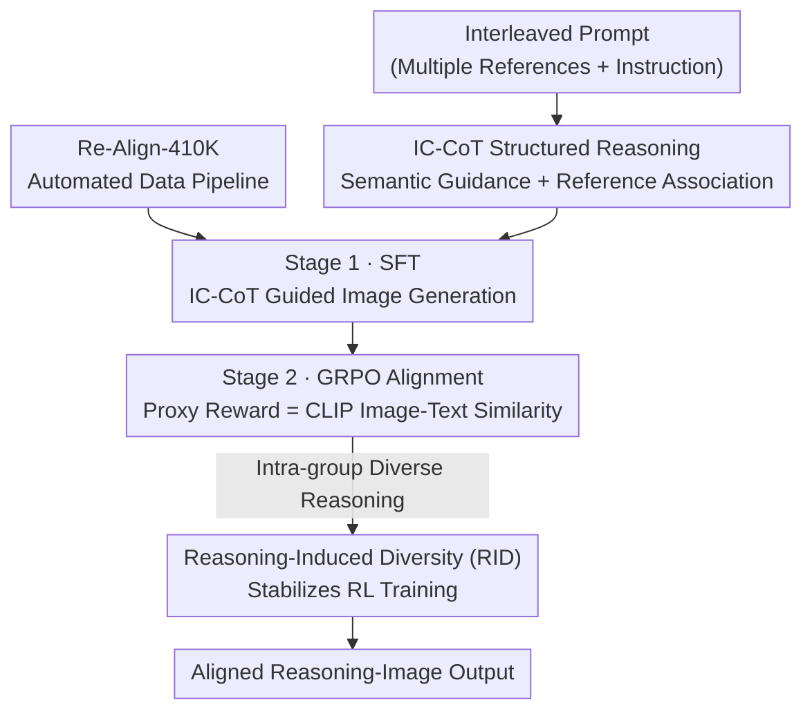

# Re-Align: Structured Reasoning-guided Alignment for In-Context Image Generation and Editing

**Conference**: CVPR 2026  
**Paper**: [CVF Open Access](https://openaccess.thecvf.com/content/CVPR2026/html/He_Re-Align_Structured_Reasoning-guided_Alignment_for_In-Context_Image_Generation_and_Editing_CVPR_2026_paper.html)  
**Code**: Project Page https://hrz2000.github.io/realign  
**Area**: Diffusion Models / Image Generation / Multimodal VLM  
**Keywords**: Interleaved Image-Text Generation, Structured Reasoning, Chain-of-Thought, GRPO, Reasoning-Generation Alignment

## TL;DR
Addressing the "misalignment" in unified multimodal models where reasoning capability fails to guide image generation, Re-Align utilizes structured In-Context Chain-of-Thought (decomposed into semantic guidance and reference association) to reduce complex interleaved tasks into text-to-image generation. By applying GRPO reinforcement learning with a CLIP similarity-based proxy reward, it achieves state-of-the-art results on OmniContext and DreamOmni2Bench among comparable models.

## Background & Motivation
**Background**: In-Context Image Generation and Editing (ICGE) allows users to express visual concepts such as "replace the hat in the first image with the cup in the second image" using multiple reference images plus an instruction. Recent unified multimodal models (e.g., BAGEL), possessing both understanding and generation capabilities, are expected to handle such tasks.

**Limitations of Prior Work**: The authors observe a "misalignment" phenomenon: while models like BAGEL can reason logically, the generated images fail to match their own reasoning. The powerful understanding/reasoning capabilities are not effectively propagated to downstream image generation. Furthermore, reasoning mechanisms effective for text-to-image or single-image editing often fail in multi-image interleaved ICGE scenarios.

**Key Challenge**: Complex interleaved prompts require both "precise understanding" and "faithful execution." Unstructured, long-form reasoning (prompt-expansion style) is often verbose and leads to reference confusion among multiple images, preventing the model from capturing a clear generation target.

**Goal**: (1) Design a reasoning paradigm for ICGE that truly guides generation; (2) Enable optimization of reasoning-generation consistency; (3) Construct a high-quality dataset with reasoning annotations.

**Key Insight**: Instead of allowing the model to write free-form reasoning, reasoning should be **structured and decoupled**. One part provides a clear textual target for generation (semantic guidance), while the other clarifies the role of each reference image (reference association), eliminating ambiguity at its source.

**Core Idea**: Use structured In-Context Chain-of-Thought to reduce "interleaved generation" to "text-to-image generation," then use GRPO reinforcement learning with a proxy reward measuring "reasoning text ↔ generated image" alignment to bridge understanding and generation.

## Method

### Overall Architecture
Re-Align is built upon the unified multimodal base BAGEL. Given an interleaved prompt $P$ (multiple reference images + a visual instruction), the model sequentially generates structured reasoning text IC-CoT, denoted as $R=\{r_1,\dots,r_M\}$, followed by the image $I$. Reasoning follows standard language modeling objectives $L_{\text{cot}}(\theta)=\sum_i \log p_\theta(r_i\mid P, r_{<i})$; image generation follows the Rectified Flow matching objective $L_{\text{img}}(\theta)=\mathbb{E}\big[\lVert v - v_\theta(x_t,t,P,R)\rVert^2\big]$, where $x_t=(1-t)x_0+tx_1$ and $v=x_1-x_0$.

The methodology involves a **two-stage training process and a data pipeline**: first, Supervised Fine-Tuning (SFT) on data with IC-CoT annotations to teach the model to generate images guided by IC-CoT; second, Reasoning-Generation Alignment (RGA) using GRPO, where the reward signal is the CLIP similarity between the target caption extracted from the reasoning and the generated image. To address low sample diversity in ICGE that destabilizes RL, a Reasoning-Induced Diversity (RID) strategy is employed. All training data originates from the automated Re-Align-410K pipeline.

### Key Designs

**1. IC-CoT Structured Reasoning: Decoupling ICGE into "Semantic Target + Reference Role"**

To address the disconnect between reasoning and generation, IC-CoT explicitly splits the reasoning process into two complementary parts. **Semantic Guidance** uses `<out_caption>...</out_caption>` to predict the caption of the resulting image—providing a clear textual target that effectively reduces the complex interleaved task to **text-to-image generation**, which is compatible with both "instructive" and "descriptive" inputs. **Reference Association** uses `<relation_i>...</relation_i>` to specify the role of each $i$-th reference image, resolving ambiguity caused by vague user expressions like "put them together." Compared to BAGEL's prompt-expansion, IC-CoT is a **compact structured representation** that reduces ambiguity, training/inference overhead, and allows for precise element extraction during alignment.

**2. Re-Align-410K Automated Data Construction Pipeline: High-Quality ICGE Data with Reasoning**

ICGE data is scarce, so the authors built a pipeline to produce 410k samples with IC-CoT annotations. The process involves: (a) **Sampling reference images** from character/object/scene pools based on task type; (b) **Adaptive instruction generation** using Gemini 2.5 (guiding the MLLM to focus on secondary visual details to increase complexity); (c) Generating structured IC-CoT text via MLLM—**intentionally withholding the target image** to prevent visual leakage and focus on multi-image relationships; (d) Synthesizing target images with GPT-4o; (e) **Multi-dimensional filtering**: removing ~20% of samples based on low CLIP similarity between IC-CoT captions and target images, aesthetic scores, and OmniContextScore for instruction following.

**3. Proxy Reward for ICGE: Aligning Reasoning and Generation via CLIP Similarity**

Designing a reward model for diverse ICGE tasks is expensive. The authors utilize a **proxy reward** that measures the alignment between the "reasoning context ↔ generated image." Since IC-CoT is structured, a predicted caption $c$ can be **stably extracted** from `<out_caption>`. The reward is the cosine similarity $s(x,c)=\dfrac{E(x)^\top T(c)}{\lVert E(x)\rVert\cdot\lVert T(c)\rVert}$ using CLIP image ($E$) and text ($T$) encoders. This reward, combined with GRPO (which omits the value network to save memory), forces the generation to align with the "understood target."

**4. Reasoning-Induced Diversity (RID): Revitalizing Reward Variance via Diverse Reasoning**

The explicit visual concepts in ICGE prompts impose strong constraints, leading to collapsed reward variance within groups during RL; even minor fluctuations can be disproportionately amplified after normalization. Unlike prior work that increases SDE noise (which degrades quality), RID generates **different IC-CoT reasoning chains** for each sample in a group. These diverse reasoning trajectories naturally produce diverse outputs, increasing reward variance in a controlled manner to provide informative signals for stable GRPO training.

### Loss & Training
Two stages: **Stage 1 SFT** trained on 64 H20 GPUs for 100,000 steps at a learning rate of $5\times10^{-6}$, using a mix of data with and without IC-CoT for flexibility. **Stage 2 RGA** trained for only 200 steps with a group size of 32 at $1\times10^{-6}$. The authors state this is sufficient for convergence while avoiding reward hacking. Defaulting to $1024\times1024$ resolution with 50 denoising steps.

## Key Experimental Results

### Main Results
Benchmarks: OmniContext (interleaved generation) and DreamOmni2Bench (generation + editing). Metrics: GPT-4o as an automatic judge for Prompt Following (PF), Subject Consistency (SC), and Overall (geometric mean).

OmniContext Scores (higher is better):

| Model | SINGLE Char. | MULTIPLE Char. | SCENE Char. | Average↑ |
|------|------|------|------|------|
| BAGEL | 5.48 | 5.17 | 4.07 | 5.73 |
| OmniGen2 | 8.05 | 7.11 | 6.38 | 7.18 |
| Qwen-Image-Edit-2509 | 8.35 | 7.65 | 5.16 | 7.69 |
| DreamOmni2 | 7.36 | 6.10 | 5.20 | 6.31 |
| **Ours (Re-Align)** | 8.25 | **8.25** | **8.21** | **8.21** |

Re-Align achieves the highest average score (8.21) among comparable models, particularly excelling in the more difficult MULTIPLE and SCENE subtasks.

DreamOmni2Bench Overall Scores (selection):

| Model | Add | Replace | Global | Local | Generation |
|------|------|------|------|------|------|
| OmniGen2 | 7.52 | 5.60 | 6.88 | 2.99 | 4.99 |
| Echo-4o | 8.51 | 4.51 | 5.16 | 2.41 | 6.59 |
| DreamOmni2* | 6.87 | 7.05 | 7.76 | 5.44 | 6.56 |
| **Ours (Re-Align)** | **9.27** | **8.61** | **7.85** | **6.35** | **7.24** |

Re-Align outperforms DreamOmni2 across editing subcategories and generation tasks.

### Ablation Study
Ablation of training stages and strategies (OmniContext subset; CLIPout measures consistency between generated image and ground truth caption):

| SFT | RGA | RID | PF↑ | SC↑ | Overall↑ | CLIPout↑ |
|-----|-----|-----|-----|-----|----------|----------|
| ✗ | ✗ | ✗ | 6.92 | 5.47 | 5.80 | 32.44 |
| ✓ | ✗ | ✗ | 7.51 | 6.46 | 6.77 | 33.32 |
| ✓ | ✓ | ✗ | 7.46 | 6.54 | 6.80 | 33.50 |
| ✓ | ✓ | ✓ | **7.61** | **6.57** | **6.89** | **33.90** |

Human evaluation (GSB) for reasoning paradigm: IC-CoT achieves a **20%** net win rate against "w/o CoT" and a **16.25%** net win rate against BagelCoT (unstructured reasoning).

### Key Findings
- **SFT is the primary factor for improvement**: Transitioning from no reasoning to IC-CoT-guided SFT increases Overall score from 5.80 to 6.77, confirming that structured reasoning makes learning easier.
- **RGA requires RID to be effective**: Adding RGA alone slightly decreases PF (7.51 to 7.46) due to insufficient diversity. Combining RGA with RID improves all metrics beyond SFT.
- **Structured Reasoning > Free-form Reasoning**: IC-CoT's structured focus on semantic targets and reference roles is more effective at guiding generation than unstructured long-form reasoning.

## Highlights & Insights
- **Reducing ICGE to Text-to-Image**: Projecting complex multimodal conditions into a clear textual `<out_caption>` is a practical simplification applicable to any "complex condition" task.
- **Structure for Extractability**: IC-CoT is designed for downstream alignment, allowing stable extraction of captions for CLIP-based rewards.
- **Proxy Rewards bypass expensive RM**: Using CLIP similarity avoids the cost of training a specialized reward model for multi-task ICGE.
- **RID via Diverse Reasoning**: Increasing variance through reasoning chains rather than SDE noise stabilizes GRPO without sacrificing image quality.

## Limitations & Future Work
- Model scale and data volume are limited compared to industrial models like GPT-4o.
- IC-CoT is currently text-based; incorporating Visual Chain-of-Thought (visual CoT) is a future direction.
- Proxy rewards depend on CLIP's alignment quality; RGA sensitivity implies reward design could still be more robust.
- The pipeline relies heavily on closed-source models for instruction and image generation.

## Related Work & Insights
- **vs BAGEL**: Enhances BAGEL by replacing unstructured reasoning with structured IC-CoT + RGA to bridge the "reasoning-generation gap."
- **vs OmniGen2 / DreamOmni2**: While OmniGen2 focuses on MLLM hidden states and DreamOmni2 uses separate parameters for editing, Re-Align's reasoning-guided approach proves superior on complex interleaved benchmarks.
- **vs FlowGRPO / DanceGRPO**: While they apply GRPO to text-to-image/video, Re-Align extends it to ICGE with specific proxy rewards and diversity strategies.

## Rating
- Novelty: ⭐⭐⭐⭐ The combination of structured IC-CoT, proxy rewards, and RID specifically addresses the reasoning-generation gap in ICGE.
- Experimental Thoroughness: ⭐⭐⭐⭐ Extensive benchmarking and ablations, though direct comparisons with proprietary models under equal conditions are naturally limited.
- Writing Quality: ⭐⭐⭐⭐ Clear motivation, well-decoupled methodology, and informative visualizations.
- Value: ⭐⭐⭐⭐ Provides a reusable paradigm for ensuring reasoning effectively serves generation in unified models alongside open-source data strategies.

<!-- RELATED:START -->

<!-- Add related papers here if necessary -->

<!-- RELATED:END -->

## Related Papers

- [\[CVPR 2026\] ReasonEdit: Towards Reasoning-Enhanced Image Editing Models](reasonedit_towards_reasoning-enhanced_image_editing_models.md)
- [\[CVPR 2026\] Disentangling to Re-couple: Resolving the Similarity-Controllability Paradox in Subject-Driven Text-to-Image Generation](disentangling_to_re-couple_resolving_the_similarity-controllability_paradox_in_s.md)
- [\[CVPR 2026\] Align Images Before You Generate](align_images_before_you_generate.md)
- [\[CVPR 2026\] Thinking-while-Generating: Interleaving Textual Reasoning throughout Visual Generation](thinking-while-generating_interleaving_textual_reasoning_throughout_visual_gener.md)
- [\[CVPR 2026\] LumiX: Structured and Coherent Text-to-Intrinsic Generation](lumix_structured_and_coherent_text-to-intrinsic_generation.md)

<!-- RELATED:END -->
