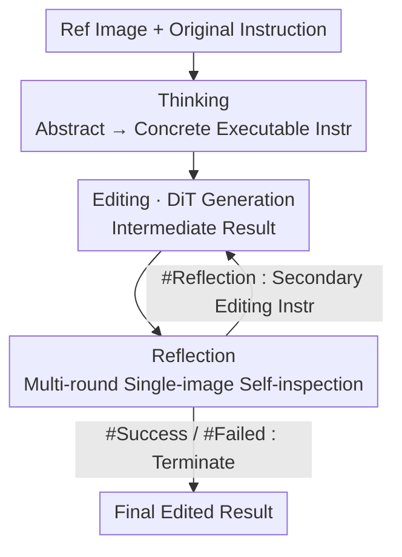

# ReasonEdit: Towards Reasoning-Enhanced Image Editing Models

**Conference**: CVPR 2026  
**Paper**: [CVF Open Access](https://openaccess.thecvf.com/content/CVPR2026/html/Yin_ReasonEdit_Towards_Reasoning-Enhanced_Image_Editing_Models_CVPR_2026_paper.html)  
**Code**: https://github.com/stepfun-ai/Step1X-Edit  
**Area**: Diffusion Models / Image Editing / Multimodal VLM  
**Keywords**: Instruction-based Image Editing, Reasoning Enhancement, Think-Edit-Reflect, Test-time Scaling, Multi-stage Training

## TL;DR
Existing instruction editing models based on "MLLM Encoder + Diffusion Decoder" often freeze the MLLM, leaving its reasoning capabilities underutilized. ReasonEdit unlocks the MLLM's "Thinking" (translating abstract instructions into concrete executable steps) and "Reflection" (multi-round self-inspection and deciding when to stop) through joint optimization. This forms a thinking–editing–reflection closed loop, delivering consistent performance gains across ImgEdit, GEdit, and Kris benchmarks on both Step1X-Edit and Qwen-Image-Edit backbones.

## Background & Motivation
**Background**: Instruction-based image editing has evolved from early mask-based methods (BrushNet, PowerPaint) to instruction-driven paradigms (InstructPix2Pix, OmniGen). Recently, the mainstream has shifted toward multimodal frameworks combining "MLLM Encoder + Diffusion Decoder" (Step1X-Edit, Qwen-Image-Edit), where the MLLM encodes both the reference image and the instruction.

**Limitations of Prior Work**: These SOTA systems **freeze the MLLM encoder during training**, resulting in weak visual reasoning capabilities. They struggle with complex or abstract instructions (e.g., "simulate potassium deficiency symptoms" or "make desert modernization appear effective"). Crucially, the freezing prevents them from benefiting from **test-time scaling**, a paradigm proven effective in LLMs.

**Key Challenge**: While reasoning enhancement has been explored in text-to-image generation (e.g., BAGEL’s thinking, OmniGen2’s reflection, various CoT), it remains **largely unexplored in image editing**. The fundamental difficulty lies in the fact that MLLMs suffer from severe hallucinations during "paired image understanding," making it hard to capture differences between the reference and edited images or to generate appropriate correction instructions.

**Goal**: (1) Enable the MLLM to decompose abstract instructions into clear executable steps; (2) Allow the model to scrutinize its editing results, auto-correct errors, and decide when to stop; (3) Design data and training paradigms to stably train these two capabilities.

**Key Insight**: Reconstruct the hallucination-prone "paired image understanding (original vs. edited)" into **multiple cascaded single-image understanding tasks**, which are more reliable and make reflection robust.

**Core Idea**: Unlock (rather than freeze) the MLLM's reasoning capabilities and perform **joint optimization** with the diffusion decoder. This natively supports the thinking–editing–reflection workflow, clarifying vague instructions and correcting erroneous edits.

## Method

### Overall Architecture
ReasonEdit consists of two main components: an **MLLM as the Reasoner** (responsible for Thinking and Reflection) and a **DiT as the Generator** (responsible for image output). The authors utilize Step1X-Edit and Qwen-Image-Edit as bases (both using Qwen2.5VL-7B-Instruct for text embedding + a DiT diffusion head), resulting in two variants: ReasonEdit-S and ReasonEdit-Q.

During inference, the components operate in a closed loop: **Thinking** first translates the original (abstract/colloquial) instruction into a concrete executable instruction → **Editing (DiT Generation)** produces an intermediate result → **Reflection** performs multi-round single-image self-inspection, yielding one of three conclusions (Success `#Success`, Refinement `#Reflection` + secondary instruction, or Failure `#Failed`). If refinement is needed, the process returns to the editing phase with the new instruction, iterating until success or failure is determined. The training employs a **multi-stage strategy** to progressively fuse "understanding" and "generation" tasks.

### Key Designs

**1. Thinking Mechanism: Translating abstract instructions into standardized executable commands**

Addressing the limitation where frozen MLLMs fail at abstract/colloquial instructions, Thinking uses **Thinking Pairs** (abstract → concrete instruction pairs) for training. Each pair maps a vague request to a set of precise, standardized instructions. For example, "potassium deficiency symptoms in leaves" → "render leaves yellow and make leaf tips appear scorched." Complex requests are **logically decomposed into a cascaded sequence**. Data construction involves a "classification → labeling → verification" process using advanced VLMs: instructions are classified as "clear" or "abstract/complex," followed by bidirectional labeling and rigorous verification. From a pool of 500k image-text pairs, **200k** high-quality pairs were filtered.

**2. Reflection Mechanism: Reconstructing paired understanding into single-image self-inspection**

To combat hallucinations in double-image comparison, Reflection utilizes **Reflection Triples** ⟨Input Image, Generated Image, Target Image⟩ to model chain editing. A **multi-round single-image reflection pipeline** is designed: first, a "target image description" is generated based on the input and instruction as a faithful blueprint; then, a quantitative evaluation provides consistency scores and reasons (detecting conflicts, omissions, or hallucinations); finally, a decision is made between **Success** (`#Success`), **Refinement** (`#Reflection` with a secondary instruction), or **Failure** (`#Failed`). The model also scores the generated image to **decide the termination round**. The dataset includes **180k** valid entries, with a Success:Reflection:Failure ratio of approximately **3:1:1**.

**3. Multi-stage Training: Three-step progressive fusion**

To avoid conflicts between understanding and generation during early joint training, the process is divided into three focused stages. **① Reasoning Learning Phase**: LoRA training on MLLM attention layers only (DiT frozen) using standard NTP loss $L_{\text{NTP}}=\mathbb{E}\big[-\sum_{k} \log p_\theta(t_k\mid t_{<k})\big]$. **② Editing Learning Phase**: Freezing the MLLM and training the DiT only with Flow Matching loss $L_{\text{FM}}$, mixed with **large-scale T2I data** to benefit from broader knowledge. **③ Unified Fine-tuning Phase**: Jointly fine-tuning the MLLM and DiT with $L_{\text{joint}}=L_{\text{FM}}+\omega_{\text{NTP}}\cdot L_{\text{NTP}}$ ($\omega_{\text{NTP}}=0.1$). This progressive approach simplifies learning objectives and ensures smoother convergence.

### Loss & Training
The three stages are: Stage ① training for 50,000 steps on 32 H800 GPUs with a learning rate of $1\times10^{-4}$; Stage ② expanded to 128 GPUs for 28,000 steps with a learning rate of $1\times10^{-5}$ using 14.4M T2I and 2.4M editing samples; Stage ③ for 12,000 steps with a learning rate of $6\times10^{-6}$ and $\omega_{\text{NTP}}=0.1$. The method uses FlexAttention and packed data formats to support mixed understanding/generation training.

## Key Experimental Results

### Main Results
Evaluation benchmarks: GEdit-Bench and ImgEdit-Bench for basic editing, and KRIS-Bench for abstract reasoning. Metrics are automatically scored via VIEScore/GPT-4.1/GPT-4o:

| Model | GEdit Overall | KRIS Overall | ImgEdit Overall |
|------|------|------|------|
| Step1X-Edit v1.1 (S-Base) | 6.97 | 51.59 | 3.90 |
| ReasonEdit-S (base) | 7.24 | 56.33 | 4.22 |
| ReasonEdit-S (thinking) | 7.36 (+1.7%) | 58.64 (+4.1%) | 4.18 |
| **ReasonEdit-S (thinking+reflection)** | **7.58 (+4.7%)** | **60.93 (+8.2%)** | **4.40 (+4.3%)** |
| Qwen-Image-Edit (Q-Base) | 7.56 | 56.15 | 4.27 |
| ReasonEdit-Q (base) | 7.51 | 58.05 | 4.24 |
| ReasonEdit-Q (thinking) | 7.61 (+1.3%) | 60.81 (+4.8%) | 4.27 |
| **ReasonEdit-Q (thinking+reflection)** | **7.77 (+3.4%)** | **61.57 (+6.1%)** | **4.36 (+2.8%)** |

> Percentages in parentheses represent relative gains over the respective base configurations. ReasonEdit-Q achieves the highest Overall scores among open-source models on GEdit and KRIS.

### Ablation Study
Multi-stage training ablation (KRIS-Bench Overall, based on ReasonEdit-S):

| Configuration | KRIS Overall | Description |
|------|------|------|
| Pre-trained Generator (Step1X v1.1) | 51.59 | Baseline |
| + Un-finetuned Qwen Reasoning | 52.41 | Negligible gain (+0.82) |
| + Finetuned Qwen Reasoning | 56.24 | Significant gain from Reasoning phase |
| Base Generator (No Reasoning) | 52.74 | Gain from Editing phase alone |
| Base Generator + Finetuned Qwen Reasoning | 58.29 | Combined Editing + Reasoning |
| **Unified Tuned (ReasonEdit-S)** | **60.93** | Optimal joint fine-tuning |

### Key Findings
- **MLLM must be fine-tuned**: Using a **non-finetuned** Qwen for reasoning yields only a 0.82 gain, whereas the **finetuned** version reaches 56.24, showing that general MLLMs need domain adaptation for image editing.
- **Reflection is the primary contributor**: Thinking alone improves ReasonEdit-S KRIS scores by +4.1%, but adding reflection brings it to **+8.2%**.
- **Unified fine-tuning yields synergistic gains**: The improvement from 58.29 to 60.93 validates that joint training allows understanding and generation to complement each other.
- **Higher gains on complex tasks**: The reasoning mechanism provides moderate gains on GEdit/ImgEdit but significantly boosts performance on the abstract KRIS benchmark.

## Highlights & Insights
- **Reconstructing paired understanding into multi-round single-image tasks**: This is the key trick to mitigate hallucinations. By moving from comparison to "target description → single-image consistency scoring → decision," the task becomes more reliable.
- **Self-terminating criteria**: The three conclusions + final scoring allow the model to **decide when to stop**, preventing error accumulation in multi-step editing.
- **Model Agnostic**: The thinking/reflection framework showed gains on both Step1X-Edit and Qwen-Image-Edit, proving it is a plug-and-play capability enhancement.
- **Multi-stage strategy to prevent conflicts**: Starting with LoRA for reasoning, followed by DiT training, and finally joint fine-tuning is a robust recipe for handling the interference between understanding and generation.

## Limitations & Future Work
- The reasoning gains are **less pronounced on simple benchmarks** (GEdit/ImgEdit), as the mechanism is specifically designed for complex instructions.
- The thinking–editing–reflection cycle is **iterative**, leading to significantly higher inference latency and computational costs than single-pass editing.
- The data pipeline relies heavily on GPT-4.1/advanced VLMs for labeling and scoring, which may introduce observer biases into the training signals.
- Robustness needs further verification as the model self-evaluates, risking "high scores for poorly aligned images."

## Related Work & Insights
- **vs Step1X-Edit / Qwen-Image-Edit**: These bases freeze the MLLM; ReasonEdit unlocks and jointly optimizes them for consistent gains.
- **vs BAGEL / OmniGen2**: While they use thinking or reflection, they focus on **generation**; ReasonEdit adapts these to **editing** with specialized de-hallucination schemes.
- **vs Uni-CoT**: Uni-CoT relies on sequential execution of background knowledge; ReasonEdit shows better generalization across both complex and standard tasks.
- **vs CCA**: CCA uses external agents (Gemini/GPT-4o) for reflection; ReasonEdit internalizes reasoning through end-to-end training.

## Rating
- Novelty: ⭐⭐⭐⭐ Systematically introduces thinking + reflection to image editing with a specialized de-hallucination approach.
- Experimental Thoroughness: ⭐⭐⭐⭐ Comprehensive benchmarks and ablations, though lacks detailed inference overhead analysis.
- Writing Quality: ⭐⭐⭐⭐ Clear motivation and well-defined reflection outcomes.
- Value: ⭐⭐⭐⭐ Provides a plug-and-play reasoning paradigm and data recipe for instruction-based editing.

<!-- RELATED:START -->

## Related Papers

- [\[CVPR 2026\] Re-Align: Structured Reasoning-guided Alignment for In-Context Image Generation and Editing](re-align_structured_reasoning-guided_alignment_for_in-context_image_generation_a.md)
- [\[CVPR 2026\] I2I-Bench: A Comprehensive Benchmark Suite for Image-to-Image Editing Models](i2i-bench_a_comprehensive_benchmark_suite_for_image-to-image_editing_models.md)
- [\[CVPR 2026\] UniVerse: Empower Unified Generation with Reasoning and Knowledge](universe_empower_unified_generation_with_reasoning_and_knowledge.md)
- [\[ICLR 2026\] ChronoEdit: Towards Temporal Reasoning for In-Context Image Editing and World Simulation](../../ICLR2026/image_generation/chronoedit_towards_temporal_reasoning_for_in-context_image_editing_and_world_sim.md)
- [\[CVPR 2026\] Kontinuous Kontext: Continuous Strength Control for Instruction-based Image Editing](kontinuous_kontext_continuous_strength_control_for_instruction-based_image_editi.md)

<!-- RELATED:END -->
