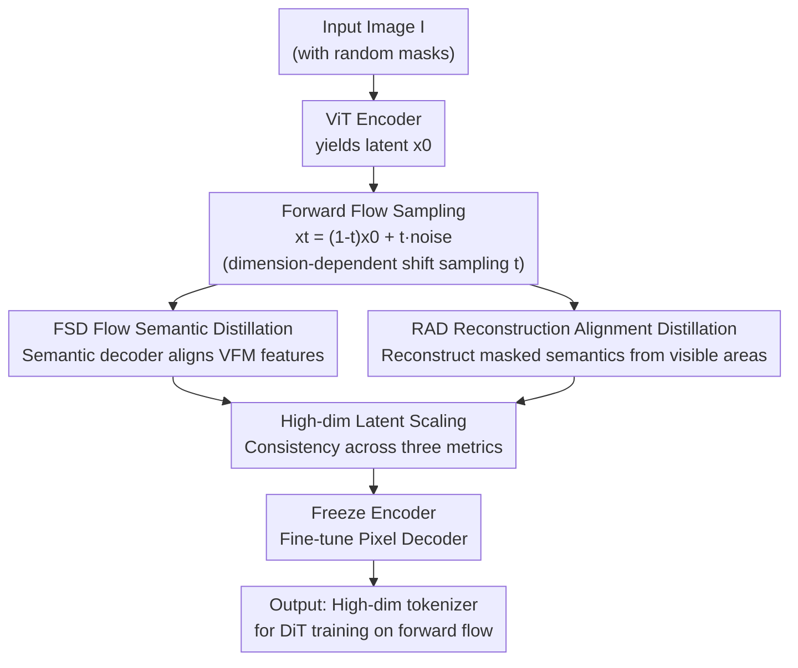

# RecTok: Reconstruction Distillation along Rectified Flow

**Conference**: CVPR 2026  
**Paper**: [CVF Open Access](https://openaccess.thecvf.com/content/CVPR2026/html/Shi_RecTok_Reconstruction_Distillation_along_Rectified_Flow_CVPR_2026_paper.html)  
**Code**: https://shi-qingyu.github.io/rectok.github.io/  
**Area**: Image Generation / Diffusion Models / Visual Tokenizer  
**Keywords**: Visual tokenizer, Flow Matching, Semantic Distillation, High-dimensional latent space, Diffusion models  

## TL;DR
To address the paradox where higher latent dimensions in visual tokenizers lead to poorer generation quality, this paper proposes RecTok. Instead of injecting semantics only into clean latents $x_0$, it performs Flow Semantic Distillation (FSD) and Masked Reconstruction Alignment Distillation (RAD) along the entire forward trajectory $\{x_t\}$ of the rectified flow. This breaks the dimension bottleneck, allowing reconstruction, generation, and discriminative performance to improve consistently with dimensionality. It achieves a SOTA gFID of 1.34 on ImageNet 256 without CFG, with convergence 7.75x faster than previous methods.

## Background & Motivation

**Background**: The standard practice for diffusion generation involves using a visual tokenizer to compress images into a compact latent space, where DiT is trained to reduce computational costs. To simplify diffusion training, latent spaces are typically restricted to low dimensions (e.g., 32). Recent works accelerate convergence and enhance generation by distilling semantics from Visual Foundation Models (VFMs, such as DINOv2/v3) into the latent space.

**Limitations of Prior Work**: ① Low-dimensional latent spaces inherently limit reconstruction fidelity and semantic expressiveness, creating a fundamental trade-off between dimension and generation quality that traps current methods in low dimensions. ② Even with VFM distillation, the generation quality of high-dimensional tokenizers **still lags behind** their low-dimensional counterparts, which is counter-intuitive. ③ RAE wide DiT architectures to accommodate high-dimensional latents for decent generation but suffer in reconstruction due to frozen VFMs, and lack systematic study on how dimension affects reconstruction, generation, and semantics simultaneously.

**Key Challenge**: Previous methods inject semantics into the **unnoised $x_0$**, but DiT actually encounters all states $\{x_t \mid t\in[0,1]\}$ on the forward flow during training. Using linear probes, the authors found that semantic discriminability (linear probing accuracy) of representative tokenizers drops sharply as features propagate along the forward flow. In other words, DiT receives features where semantics are "diluted by noise". The root cause of training difficulties in high dimensions is that semantics are only preserved at $x_0$ but degrade at $x_t$.

**Goal**: To train a high-dimensional visual tokenizer that achieves excellence in reconstruction fidelity, generation quality, and semantic representation, with all three improving consistently as dimensionality increases.

**Key Insight**: Since DiT training occurs along the forward flow, the **entire flow** should maintain semantic discriminative power, rather than optimizing only at $x_0$.

**Core Idea**: Distill VFM semantics into the forward trajectory of the rectified flow (making the training space itself semantically rich) and further reinforce this using masked reconstruction—replacing "injecting semantics at $x_0$" with "semantic consistency along the flow".

## Method

### Overall Architecture
RecTok is a training scheme for ViT encoder-decoder visual tokenizers. An input image is encoded to obtain latent $x_0$, which is then linearly interpolated with Gaussian noise $\epsilon$ to get $x_t=(1-t)x_0+t\epsilon$ on the forward flow. $x_t$ is simultaneously fed into two decoders: a **Semantic Decoder** for VFM feature alignment (FSD) and a **Pixel Decoder** for masked region reconstruction (RAD). After training, the semantic decoder and VFM are discarded; only the encoder and pixel decoder remain for inference, resulting in zero extra overhead. The key is that supervision is applied to **$x_t$ across the entire flow**, ensuring the space where the DiT is trained remains semantically rich, thereby removing the optimization bottleneck for high-dimensional latent spaces.

### Key Designs

**1. FSD (Flow Semantic Distillation): Making every $x_t$ on the forward flow discriminative**

This design directly addresses the pain point where DiT sees noise-diluted $x_t$. Since the forward flow $x_t=(1-t)x_0+t\epsilon$ is independent of the velocity network, any $x_t$ can be obtained via interpolation. A **lightweight semantic decoder** $D_{\text{sem}}$ (a transformer with only 1.5M parameters) extracts semantic features from $x_t$, supervised by the VFM image representation $E_{\text{VFM}}(I)$:

$$\mathcal{L}_{\text{sem}} = 1 - \cos\big(D_{\text{sem}}(x_t),\, E_{\text{VFM}}(I)\big)$$

The decoder is intentionally kept small to "force the encoder to capture rich semantics itself"—if the decoder were too powerful, it would relieve the encoder of the semantic burden. Sampling for $t$ uses a dimension-dependent shift distribution $t=\frac{st'}{1+(s-1)t'}$ with $t'\sim\mathcal{U}(0,1)$ and $s=\sqrt{4096/(r^2d)}$ (where $r,d$ are resolution and dimension) to adapt to high-dimensional redundancy. FSD allows RecTok to achieve higher discriminative accuracy on the flow than its own latent features (linear probing 55.40% vs. 44.35% without FSD).

**2. RAD (Reconstruction Alignment Distillation): Reinforcing semantic consistency via masked reconstruction**

Alignment alone is insufficient. Drawing from Masked Image Modeling (MIM) goals of learning robust representations by predicting unseen patches, RAD introduces a reconstruction objective. Specifically, random masks (mask ratio between -0.1 and 0.4, where negative values indicate no mask) are applied to the input image. Only visible areas are encoded to get $x_0^{\text{vis}}$, and its forward flow $x_t^{\text{vis}}=(1-t)x_0^{\text{vis}}+t\epsilon$ is used by the semantic decoder to reconstruct VFM features of masked regions. $\mathcal{L}_{\text{sem}}$ is applied to both masked and unmasked areas. Ablations show that the "alignment + reconstruction" combination outperforms either alone (gFID 2.27 vs. 2.52 for alignment only / 2.97 for reconstruction only).

**3. High-dimensional Latent Space Scaling: Breaking the old trade-off**

With semantics maintained along the flow, the authors gradually increased the latent dimension from 16 to 128. Surprisingly, reconstruction (rFID/PSNR), generation (gFID/IS), and semantics (linear probing) **all improved consistently** (128-dim vs. 16-dim: L.P. 55.4% vs. 24.1%, gFID 2.27 vs. 2.75). Changing dimensions only affects the ViT linear heads, keeping parameters and computation nearly constant. This contradicts previous findings that higher dimensions are harder to train; the authors hypothesize that a **shared latent space** supporting both low-level reconstruction and high-level semantics emerges at higher dimensions. RecTok is the first work to prove these three goals can scale together.

### Loss & Training
The total loss for the tokenizer follows a standard combination plus the semantic term: $\mathcal{L}=\lambda_{\text{rec}}\mathcal{L}_{\text{rec}}+\lambda_{\text{per}}\mathcal{L}_{\text{per}}+\lambda_{\text{GAN}}\mathcal{L}_{\text{GAN}}+\lambda_{\text{KL}}\mathcal{L}_{\text{KL}}+\lambda_{\text{sem}}\mathcal{L}_{\text{sem}}$, with $\lambda_{\text{rec}}=\lambda_{\text{per}}=\lambda_{\text{sem}}=1,\ \lambda_{\text{adv}}=0.5,\ \lambda_{\text{KL}}=10^{-6}$. The architecture uses ViT-B + RoPE + SwiGLU + RMSNorm, trained for 200 epochs on ImageNet-1K. **Decoder Fine-tuning**: After joint training, the encoder is frozen to preserve semantics, and only the pixel decoder is fine-tuned (disabling FSD/RAD and $\mathcal{L}_{\text{KL}}/\mathcal{L}_{\text{sem}}$) to specifically enhance reconstruction reliability. The DiT uses DiT$_{\text{DH}}$-XL, trained for 800 epochs on ImageNet, with 150-step Euler inference and AutoGuidance.

## Key Experimental Results

### Main Results

ImageNet 256×256 Class-Conditional Generation (without/with guidance, ⚠️ lower gFID is better):

| Method | Epochs | gFID↓ (w/o guidance) | IS↑ | gFID↓ (w/ guidance) |
|------|--------|--------------------|-----|---------------------|
| REPA-E | 800 | 1.83 | 217.3 | 1.26 |
| l-DeTok | 800 | 1.86 | 238.6 | 1.35 |
| RAE | 80 | 2.16 | 214.8 | — |
| **RecTok (Ours)** | 600 | **1.34** | **254.6** | **1.13** |

RecTok achieves a gFID of 1.34 without CFG (current SOTA); with AutoGuidance, it reaches 1.13, matching RAE but with a significantly higher IS, using only 600 epochs (converging approximately 7.75x faster).

Tokenizer Comparison (ImageNet-1K, ⚠️ lower rFID and higher PSNR are better):

| Tokenizer | Params | GFlops | rFID↓ | PSNR↑ | gFID↓ |
|-----------|--------|--------|-------|-------|-------|
| SD-VAE | 84M | 445 | 0.62 | 26.04 | 8.30 |
| VA-VAE | 70M | 310 | 0.28 | 26.30 | 2.17 |
| DeTok | 176M | 44.4 | 0.52 | 23.53 | 1.86 |
| RAE | 395M | 128.9 | 0.57 | 18.98 | 1.51 |
| **RecTok** | 176M | 44.4 | 0.48 | **26.16** | **1.34** |

RecTok has the lowest computational cost among ViT-based tokenizers and the best generation quality, with PSNR far exceeding RAE (26.16 vs 18.98), achieving the best trade-off among reconstruction, generation, and semantics.

### Ablation Study

| Configuration | Key Metrics (gFID↓ / L.P. Acc.) | Description |
|------|------------------------------|------|
| w FSD (Cos Sim) | 2.27 / 55.40 | Full FSD, distillation along flow |
| w/o FSD (Cos Sim) | 3.35 / 44.35 | Alignment at $x_0$ only; drop in generation and discrimination |
| w/o FSD (VF Loss) | 3.91 / 37.52 | Replacing with VA-VAE's VF loss; performs worse |
| RAD: Alignment only (Transformer) | 2.52 / — | Reconstruction removed |
| RAD: Rec. only (Transformer) | 2.97 / — | Alignment removed |
| RAD: Rec. + Alignment (Transformer) | **2.27** / — | Joint objective is best |
| Dim 16 → 128 | gFID 2.75 → 2.27 | Metrics improve consistently with dimension |

### Key Findings
- **FSD is the primary contributor**: Changing semantics from "only at $x_0$" to "along the entire flow" reduced gFID from 3.35 to 2.27 and increased linear probing accuracy from 44.35% to 55.40%, validating the core hypothesis that the DiT training space requires semantic consistency.
- **Reconstruction and alignment are complementary**: Alignment only (2.52) and Reconstruction only (2.97) were outperformed by the joint objective (2.27), and gains did not stem from the transformer architecture itself.
- **Counter-intuitive dimensional scaling**: Increasing from 16 to 128 dimensions improved rFID (0.74→0.65), gFID (2.75→2.27), and L.P. (24.1%→55.4%) across the board, breaking the old trade-off.
- **Dimension-dependent VFM selection**: DINOv2 performs better in lower dimensions (16), while DINOv3 is better in higher dimensions (128). Using both VFMs simultaneously led to degradation.
- **Noise scheduling trade-off**: Uniform sampling yields the best reconstruction but worst generation; shift sampling yields slightly lower reconstruction but the best generation. Since reconstruction can be recovered via decoder fine-tuning, shift is the default.

## Highlights & Insights
- **Crucial perspective shift to "Training Space"**: While previous methods focused on tuning semantics in the latent space $x_0$, RecTok identifies that DiT is actually trained on $\{x_t\}$. Moving supervision to the entire forward flow is a simple yet overlooked shift that unlocks high-dimensional tokenizers.
- **"Inverse incentive" of the lightweight semantic decoder**: Intentionally providing only 1.5M parameters forces the encoder to learn semantics rather than letting the decoder handle it. This "weak decoder forces strong encoder" strategy is transferable to other distillation-based representation learning.
- **First proof of co-directional scaling**: Overturning the "high-dim = hard to train" dogma and providing the "shared latent space" explanation offers directional value for future tokenizer design.
- **Zero inference overhead**: The semantic decoder and VFM are discarded after training, leaving the tokenizer as lightweight as standard ones during deployment.

## Limitations & Future Work
- The authors acknowledge that while decoder fine-tuning is crucial for reconstruction, it was not the main focus, and its interaction with the primary training objective was not explored in depth.
- VFM selection is dimension-sensitive (DINOv2/v3 each excel in different ranges), requiring manual switching rather than a unified solution. ⚠️ Tests stopped at dimension 128; whether improvement continues or saturates beyond this is unknown.
- Future directions: Turning the dimension-dependent shift sampling into a learnable schedule or exploring a universal distillation target for a single VFM across all dimensions to reduce manual tuning.

## Related Work & Insights
- **vs. VA-VAE / DeTok ($x_0$ semantic distillation)**: These inject VFM semantics into the unnoised latent $x_0$, but $x_t$ discriminability drops along the flow. RecTok moves distillation to the entire flow, preventing degradation in high dimensions and leading in linear probing.
- **vs. RAE (Diffusion in VFM high-dim feature space)**: RAE widens DiT to accommodate high dimensions for good generation but suffers in reconstruction (PSNR 18.98) due to frozen VFMs. RecTok allows the encoder to be trainable and reinforces semantics along the flow, excelling in both reconstruction (26.16) and generation (1.34).
- **vs. SVG (Residual encoder for reconstruction)**: SVG augments reconstruction while maintaining VFM semantics but still lags behind SOTA. RecTok leads in reconstruction, generation, and semantics simultaneously via FSD+RAD.

## Rating
- Novelty: ⭐⭐⭐⭐⭐ The "distillation along forward flow" perspective shift + proving co-directional scaling is novel and counter-intuitive.
- Experimental Thoroughness: ⭐⭐⭐⭐ Strong main results and comprehensive ablations (FSD/RAD/Dimension/VFM/Noise), though upper bounds for dimensions and cross-dataset testing are slightly lacking.
- Writing Quality: ⭐⭐⭐⭐⭐ Motivations are clearly derived from the observed drop in linear probing along the flow; logic is clear and well-supported by figures.
- Value: ⭐⭐⭐⭐⭐ Achieves 1.34 gFID SOTA (no CFG), 7.75x faster convergence, and zero inference overhead, providing both practical and directional value for generative tokenizer design.

<!-- RELATED:START -->

## Related Papers

- [\[ICLR 2026\] Flow Along the $K$-Amplitude for Generative Modeling](../../ICLR2026/image_generation/flow_along_the_k-amplitude_for_generative_modeling.md)
- [\[CVPR 2026\] Flow Map Distillation Without Data](flow_map_distillation_without_data.md)
- [\[CVPR 2026\] CaReFlow: Cyclic Adaptive Rectified Flow for Multimodal Fusion](careflow_cyclic_adaptive_rectified_flow_for_multimodal_fusion.md)
- [\[CVPR 2026\] Delta Rectified Flow Sampling for Text-to-Image Editing](delta_rectified_flow_sampling_for_text-to-image_editing.md)
- [\[CVPR 2026\] gQIR: Generative Quanta Image Reconstruction](gqir_generative_quanta_image_reconstruc_tion.md)

<!-- RELATED:END -->
