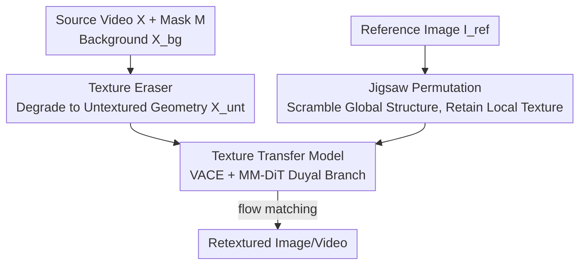

# Refaçade: Editing Object with Given Reference Texture

**Conference**: CVPR 2026  
**Paper**: [CVF Open Access](https://openaccess.thecvf.com/content/CVPR2026/html/Huang_Refacade_Editing_Object_with_Given_Reference_Texture_CVPR_2026_paper.html)  
**Code**: https://github.com/fishZe233/Refacade  
**Area**: Diffusion Models / Image & Video Editing  
**Keywords**: Object Retexturing, Texture-Structure Decoupling, Jigsaw Permutation, Texture Erasure, Video Editing  

## TL;DR
Refaçade extends "object retexturing" (repainting a target object using local textures from a reference image while preserving its original geometry) from images to videos. The core consists of two decoupling strategies: training a "texture eraser" to reduce the source object into an untextured video containing only geometry, and using "jigsaw permutation" to break the reference image into texture fragments without global structure. This achieves precise and controllable texture transfer on both images and videos, outperforming several strong baselines in both quantitative and human evaluations.

## Background & Motivation
**Background**: Diffusion models have matured significantly in image/video editing, ranging from UNet-era SD1.5 and AnimateDiff to DiT-era Flux, Wan2.1, and HunyuanVideo. Various inpainting and instruction-based editing methods have emerged. However, a specific class of editing tasks—**Object Retexturing**—has not been thoroughly addressed. This task involves transferring the surface texture (patterns, colors, materials) of a reference image to a target object while **preserving the target's original shape and geometry** and keeping the surrounding regions unchanged. This paper is the first to extend this task into the video domain.

**Limitations of Prior Work**: A direct approach would be using ControlNet, where structural conditions (Canny, HED, or depth) extracted from the source video lock the geometry, and the reference image provides the texture. However, the authors find this path **entirely ineffective** for the retexturing task due to two decoupling failures:
- **Structural conditions do not fully isolate texture**: Conditions like Canny, HED, depth, and normal maps nominally describe geometry but often retain surface patterns, material boundaries, and color gradients—the very elements that need to be replaced. Consequently, these are preserved as "structure," making it impossible to erase the target object's original texture.
- **Reference images as conditions leak structure**: Feeding the entire reference image into the model causes it to learn not just the texture, but also the shape, pose, and spatial layout of the reference object, which contaminates and distorts the geometry of the target object.

**Key Challenge**: The essence of the retexturing task is to perform two concurrent decouplings: stripping "texture" from the source video to leave only "structure," and stripping "structure" from the reference image to leave only "texture," then recombining the target structure with the reference texture. Existing condition extractors fail to perform cleanly at either end.

**Goal**: Design a set of condition construction methods that achieve thorough texture/structure decoupling at both the source and reference ends, ensuring the model receives only "target pure geometry + reference pure texture."

**Core Idea**: Instead of relying on general-purpose condition extractors, the authors **explicitly construct two clean condition paths**. For the source, a diffusion model is trained to "erase" textures into untextured geometry. For the reference, jigsaw permutation is used to break down global structure, retaining only local texture statistics.

## Method

### Overall Architecture
Refaçade takes a source video $X$, an object mask $M$, a background video $X_{bg}$, and a reference image $I_{ref}$ as inputs, and outputs a video where the target object is retextured. The pipeline follows a "two-way decoupling + one-way recombination" process. On the source side, the **texture eraser** produces an untextured video $X_{unt}$ containing only geometry. On the reference side, **jigsaw permutation** generates scrambled texture guidance. Finally, a texture transfer model fuses the "source geometry + reference texture" into the final result.

The model is built on VACE and utilizes MM-DiT to handle different types of conditions. The condition signals are denoted as:

$$c = \{\, E_{VAE}(\mathrm{Jigsaw}(I_{ref})),\; E_{VAE}(X_{unt}),\; M,\; E_{VAE}(X_{bg}) \,\}$$

The network is trained using flow matching: Let $z_0 = E_{VAE}(X)$ be the target latent, sample $t\sim U(0,1)$, $\varepsilon\sim N(0,I)$, and define the linear interpolation path $z_t = (1-t)z_0 + t\varepsilon$ with the target velocity $v^\star(z_t,t) = \varepsilon - z_0$. The velocity network $v_\theta(z_t,c,t)$ is trained with the following loss:

$$\mathcal{L} = \mathbb{E}_{(z_0,c)}\,\mathbb{E}_{t,\varepsilon}\big[\,\|v_\theta(z_t,c,t) - v^\star(z_t,t)\|_2^2\,\big]$$

The architecture includes two branches: the **control branch** concatenates the latents of the background, untextured video, and mask along the channel dimension for a dedicated condition layer, while the reference image latent uses a separate reference layer (allowing "reference tokens" and "source tokens" to use different parameters but share the same attention). The **main branch** prepends the reference image to the first frame of the noisy latent, with the hidden states of the control blocks added back to the corresponding layers.

### Key Designs

**1. Texture Eraser: Degrading Source Objects to "Geometry-Only" Untextured Videos**

To address the issue where structural conditions fail to isolate textures, the authors move away from Canny, HED, or depth and instead construct an **untextured geometry representation** as a condition. Inspired by 3D meshes—which naturally store geometry (vertices/faces) and appearance (texture coordinates/materials) separately—reconstructing an object as a mesh and rendering it with a plain gray material produces a visual with only geometry and no color or texture. However, per-frame 3D reconstruction in video is too slow for large-scale training. Thus, the authors **distill the "texture erasing" process into a 2D diffusion model**. They train a texture remover to directly learn the mapping from "textured frames → untextured frames," eliminating the need for 3D reconstruction during inference.

Training data is synthesized via 3D rendering: 72,000 object meshes (collected from real video frames and text-to-image models) are rendered twice under identical camera/lighting settings—once with full textures and once with a uniform gray Lambertian material to remove all texture and albedo. Augmented with varied camera trajectories, light intensities, and poses, a total of 576,000 "textured-untextured" video pairs were generated. The eraser is based on VACE, updating only the control blocks and freezing the main branch. To ensure the eraser does not slow down the system, the authors use **DMD distillation** to compress the sampling steps from 50 to 3 while maintaining high-quality untextured output.

**2. Jigsaw Permutation: Breaking Reference Images into Structureless Texture Fragments**

This design prevents the reference image from leaking spatial structure. If the model uses the source video's first frame (with background removed) as a reference during training, the reference and target share the exact same spatial structure. The model would then lazily learn "spatial alignment" instead of "texture transfer," causing failure during inference when reference and target shapes or poses differ.

Jigsaw Permutation bridges this training-inference gap: square patches are cropped from the foreground area of the reference image (patches with >10% background pixels are discarded to maintain texture purity), then **randomly shuffled and flipped** to form a new rectangular layout. A key detail is that the resulting reference mosaic is scaled to the training canvas width, but its height varies freely with the number of patches. Patch sizes range from $16\times16$ to the object's maximum inscribed rectangle. This completely destroys the global contour while preserving local texture statistics at various scales, forcing the model to extract "local patterns" rather than memorizing "global spatial layouts." This ensures stable texture transfer even when there is a significant discrepancy in shape, scale, or pose between the reference and the source.

### Loss & Training
The main model is trained using the flow-matching loss mentioned above in two stages: **Stage-1 Large-scale Pre-training** on ~1.8M WebVid-10M filtered videos + 900k SelfForcing synthetic videos + 800k SD3.5-Large synthetic images for 2 epochs (96×A800, 18k steps, ~120 hours). **Stage-2 High-quality Fine-tuning** on 180k Pexels real videos for 2 epochs (32×A800, 2.8k steps, ~28 hours). Both stages use a constant learning rate of $1\times10^{-5}$, gradient checkpointing, and mixed precision. The texture eraser is trained separately (initialized with VACE, 18k steps, ~38 hours) followed by DMD distillation (300 steps) for 3-step sampling.

## Key Experimental Results

### Main Results (Image UHRSD 988 images + Video Pexels 50 segments)
Background metrics focus on fidelity (MSE/PSNR/SSIM/LPIPS), while foreground metrics measure similarity to the reference texture (CLIP/DINO/DreamSim↑, Foreground LPIPS↓, GLCM↑). Evaluations are supplemented by GPT-5/Gemini scoring and user preferences.

| Dataset | Method | Background PSNR↑ | Foreground CLIP↑ | Foreground DINO↑ | DreamSim↑ | GPT-5↑ | User Pref.↑ |
|---------|--------|----------|----------|----------|-----------|--------|-------------|
| Image   | Flux-Fill | 31.92 | 0.6900 | 0.2091 | 0.7134 | 2.71 | 0.16 |
| Image   | NanoBanana | 27.47 | 0.6981 | 0.2582 | 0.7316 | 2.65 | 0.16 |
| Image   | **Ours(stage2)** | **36.20** | **0.7774** | **0.4516** | **0.8184** | **2.89** | **0.89** |
| Video   | VideoPainter | 32.89 | 0.7130 | 0.1554 | 0.7173 | 1.92 | 0.06 |
| Video   | AnyV2V | 22.77 | 0.7178 | 0.1603 | 0.7253 | 2.21 | 0.09 |
| Video   | **Ours(stage2)** | **36.48** | **0.7524** | **0.3241** | **0.7742** | **2.82** | **0.74** |

On images, stage 2 leads in background reconstruction (PSNR 36.20) and foreground alignment (CLIP 0.7774, DINO 0.4516, DreamSim 0.8184, and lowest Foreground LPIPS 0.6181). For video, it achieves optimal background reconstruction and significantly improves foreground alignment, with temporal stability (EWarp 1.4248) comparable to stage 1 (1.3510). User preference scores show a massive lead (0.74–0.89) over the next best methods (~0.5).

### Ablation Study (Training Pipeline, Table 3)

| Config | Reference Side | Structural Condition | Foreground DINO↑ | Foreground LPIPS↓ | GLCM↑ | GPT-5↑ |
|--------|----------------|----------------------|------------------|-------------------|-------|--------|
| Ab-1   | w/o Jigsaw | Canny | 0.1859 | 0.7674 | 0.7006 | 2.10 |
| Ab-2   | w/ Jigsaw | Canny | 0.1906 | 0.7347 | 0.7297 | 2.42 |
| Ab-3   | w/ Jigsaw | HED | 0.1990 | 0.7484 | 0.7258 | 2.44 |
| Ab-5   | w/ Jigsaw | Depth | 0.1790 | 0.7532 | 0.7608 | 2.21 |
| **Ab-6** | **w/ Jigsaw** | **Untextured** | **0.2622** | **0.6540** | **0.8830** | **2.72** |

### Key Findings
- **Both components are essential**: Comparing Ab-1 (w/o Jigsaw + Canny) and Ab-2 (w/ Jigsaw + Canny), adding jigsaw permutation alone drops foreground LPIPS from 0.7674 to 0.7347 and increases GPT-5 scores from 2.10 to 2.42, proving that breaking reference structure is effective. Replacing the structural condition from Canny/HED/Depth with the eraser's Untextured condition (Ab-6) results in a jump in Foreground DINO from ~0.19 to 0.2622 and GLCM from ~0.73 to 0.8830, indicating that untextured geometry conditions are significantly cleaner than traditional edge/depth maps.
- **The texture eraser is the primary driver of foreground texture transfer**: Residual textures in traditional structural conditions tend to preserve the target's old texture, lowering the alignment with the reference. Switching to pure geometry conditions leads to a holistic leap in foreground metrics.
- **Patch size is critical** (Table 4): Patches that are too small destroy texture statistics, while those that are too large retain structure; the authors performed a sensitivity analysis on patch size to find the optimal trade-off.

## Highlights & Insights
- **"Texture Erasing" distilled into a 2D network**: By using 3D mesh dual-rendering (textured vs. gray) to synthesize paired data and training a diffusion model to "erase" textures directly in 2D space, the authors avoid the massive overhead of per-frame 3D reconstruction. This clever amortization of expensive 3D decoupling into a one-time training phase is transferable to any editing task requiring geometry-only conditions.
- **Jigsaw Permutation as a minimalist yet effective regularizer**: Through simple cropping, shuffling, flipping, and rearranging, this method destroys global structure while preserving local textures, effectively preventing "reference structure leakage" and bridging the distributional gap between training (reference = target first frame) and inference (reference ≠ target).
- **DMD distillation prevents auxiliary modules from slowing down the system**: Compressing the eraser from 50 steps to 3 steps is engineering-wise critical for making "extra condition extractors" practically viable.

## Limitations & Future Work
- The approach relies on high-quality 3D reconstruction (Hunyuan3D) to generate training data for the eraser; object categories with poor reconstruction quality might result in inaccurate untextured conditions. ⚠️ The paper does not fully discuss robustness for challenging objects like thin-shell, transparent, or reflective surfaces.
- Texture transfer essentially only moves "surface appearance" and has limited capability for scenarios requiring changes in material semantics (e.g., changing cloth to metal, which involves changes in lighting/specularity).
- Jigsaw permutation destroys long-range spatial patterns of textures (e.g., stripe direction, logo integrity), which may lead to inaccurate transfer for **textures with global structures** (text, specific patterns)—a trade-off for "breaking structure."

## Related Work & Insights
- **vs ControlNet/General Structural Conditions (Canny/HED/Depth)**: These use general-purpose maps to lock structure but do not cleanly isolate texture. This paper uses a specially trained texture eraser for "pure geometry" conditions, showing a significant lead in foreground similarity in ablations.
- **vs ZeST / Pair Diffusion and appearance editing**: These use the reference image directly as an appearance condition, leading to reference structure leakage. This paper uses jigsaw permutation to scatter global layouts, transferring only local textures.
- **vs VACE / VideoPainter and video editing/inpainting**: This paper builds on VACE but reconfigures a dual-branch condition processing (control layer + reference layer + MM-DiT) for retexturing, systematically addressing "object retexturing" as an independent task in the video domain for the first time.

## Rating
- Novelty: ⭐⭐⭐⭐ First to extend object retexturing to video; the two-way decoupling (eraser + jigsaw) is clear and effective.
- Experimental Thoroughness: ⭐⭐⭐⭐⭐ Dual benchmarks for image/video, over ten strong baselines, three evaluation types (automated + LLM + user), and multiple ablation groups.
- Writing Quality: ⭐⭐⭐⭐ Clear mapping between pain points and solutions; data construction and formulas are well-explained.
- Value: ⭐⭐⭐⭐ Provides a clean "texture-structure decoupling" paradigm; both the eraser and jigsaw permutation components have broad transfer value.

<!-- RELATED:START -->

## Related Papers

- [\[CVPR 2026\] OrionEdit: Bridging Reference and Source Images for Generalized Cross-Image Editing](orionedit_bridging_reference_and_source_images_for_generalized_cross-image_editi.md)
- [\[CVPR 2026\] OneHOI: Unifying Human-Object Interaction Generation and Editing](onehoi_unifying_human-object_interaction_generation_and_editing.md)
- [\[CVPR 2026\] Semantics Lead the Way: Harmonizing Semantic and Texture Modeling with Asynchronous Latent Diffusion](semantics_lead_the_way_harmonizing_semantic_and_texture_modeling_with_asynchrono.md)
- [\[CVPR 2026\] Towards High-resolution and Disentangled Reference-based Sketch Colorization](towards_high-resolution_and_disentangled_reference-based_sketch_colorization.md)
- [\[CVPR 2026\] Object-WIPER: Training-Free Object and Associated Effect Removal in Videos](object-wiper_training-free_object_and_associated_effect_removal_in_videos.md)

<!-- RELATED:END -->
