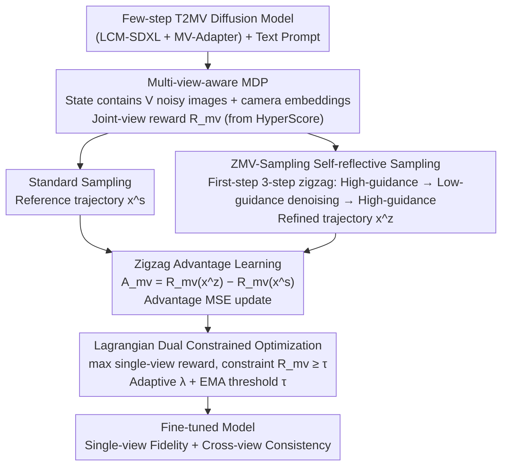

# Refining Few-Step Text-to-Multiview Diffusion via Reinforcement Learning

**Conference**: CVPR2026  
**arXiv**: [2505.20107](https://arxiv.org/abs/2505.20107)  
**Code**: [ZiyiZhang27/MVC-ZigAL](https://github.com/ZiyiZhang27/MVC-ZigAL)  
**Area**: Image Generation  
**Keywords**: Multi-view generation, diffusion models, reinforcement learning fine-tuning, few-step inference, cross-view consistency

## TL;DR

The MVC-ZigAL framework is proposed to enhance single-view fidelity and cross-view consistency of few-step text-to-multiview diffusion models through multi-view-aware MDP modeling, zigzag self-reflective advantage learning, and Lagrangian dual constrained optimization.

## Background & Motivation

1.  **Growing demand for text-to-multiview generation**: T2MV diffusion models need to jointly generate images from multiple viewpoints of the same scene from a single text prompt, which is of great value in scenarios such as 3D content creation.
2.  **Few-step models sacrifice quality for speed**: Few-step backbones like LCM reduce inference steps to under 8, but significantly degrade image fidelity and cross-view consistency.
3.  **Existing RL methods cannot be directly transferred**: Existing RL fine-tuning methods (DPOK, REBEL, etc.) are designed for single-image generation and ignore the coordinated optimization between multiple views.
4.  **Weak learning signals in few-step models**: Samples generated by few-step models generally have low quality and tightly clustered reward values, leading to insufficient learning gradients for standard RL methods.
5.  **Deficiencies in single-view vs. joint-view rewards**: Single-view rewards (PickScore) are fine-grained but ignore cross-view consistency, while joint-view rewards (HyperScore) evaluate the whole but lack view-by-view feedback.
6.  **Weighted summation depends on hyperparameter tuning**: Simply mixing the two types of rewards via weighting is extremely sensitive to weight selection and struggles to stably balance the two optimization objectives.

## Method

### Overall Architecture

**Ours** aims to address the issue where few-step ($\leq 8$ steps) T2MV diffusion models sacrifice single-view fidelity and cross-view consistency for speed, and where existing RL fine-tuning (DPOK, REBEL, etc.) failed to model multi-view coordination and lacked sufficient learning gradients due to tightly clustered rewards. The proposed solution integrates three components: first, reconstructing T2MV denoising into a multi-view-aware MDP that observes all views simultaneously; then, generating an optimized reference trajectory through "self-reflective" ZMV-Sampling to conduct zigzag advantage learning, providing strong learning signals; finally, converting "single-view fidelity" and "cross-view consistency" into a constrained optimization problem via Lagrangian duality to eliminate manual weight tuning.

### Key Designs

**1. Multi-view-aware MDP: Covering all views in rewards and actions rather than independent views**

Single-image RL treats each image as an independent episode, failing to express coordination. MVC-ZigAL reconstructs T2MV denoising into a multi-view MDP: each state $s_t$ contains noisy images and camera embeddings for all $V$ views, the action $a_t$ is the denoising result of all views, and a joint-view reward $\mathcal{R}_{\text{mv}}$ (overall dimension from HyperScore) is introduced. This unified MDP can directly adapt to MV-PG, MV-DPO, and MV-RDL baselines.

**2. ZMV-Sampling + Zigzag Advantage Learning: Creating strong learning signals via structured self-refinement**

Standard RL gradients are weak due to low-quality samples and clustered rewards. ZMV-Sampling performs a three-step zigzag only at the first step ($t=T$): high-guidance denoising $\rightarrow$ low-guidance inverse noising $\rightarrow$ high-guidance denoising again. This relies on the guidance scale difference ($\omega_{\text{high}}$ vs $\omega_{\text{low}}$) to create "self-reflection," where aligned features survive inversion while misaligned ones are suppressed. This is restricted to the first step because early diffusion determines global geometry. Zigzag advantage is defined as $\mathcal{A}_{\text{mv}} = \mathcal{R}_{\text{mv}}(\mathbf{x}^z) - \mathcal{R}_{\text{mv}}(\mathbf{x}^s)$, and the objective minimizes the MSE between the log-likelihood ratio difference and the advantage.

**3. Lagrangian Dual Constrained Optimization: Transforming "Fidelity vs. Consistency" into adaptive constraints**

MVC-ZigAL adopts a constrained form: the primary objective is to maximize the sum of single-view rewards $\sum_v R(\mathbf{x}_0^v, \mathbf{c})$, subject to the constraint that joint-view reward $\geq \tau$. Utilizing Lagrangian duality with multiplier $\lambda$ yields a unified reward $\mathcal{R}_{\text{mvc}} = \frac{R(\mathbf{x}_0^v, \mathbf{c}) + \lambda \cdot \mathcal{R}_{\text{mv}}}{1 + \lambda}$. Two adaptive mechanisms are included: a large step size $\alpha^+$ for rapid tightening when constraints are violated and a small step size $\alpha^-$ for relaxation when satisfied; the threshold $\tau$ is adaptively adjusted using EMA of the current policy's joint reward levels.

### Loss & Training

- The primary learning objective is the MSE of MV-ZigAL advantage (aligning log-likelihood ratio differences with zigzag advantage $\mathcal{A}_{\text{mv}}$).
- Constrained optimization uses Lagrangian duality + adaptive primal-dual updates, where multiplier $\lambda$ uses an adaptive step size based on constraint violations, and threshold $\tau$ is self-paced via EMA.
- Base setup: MV-Adapter + LCM-SDXL, 8 steps, 6 views; ZMV-Sampling increases single-sample inference cost by approximately 3x during training.

## Key Experimental Results

### Main Results (Training set prompts, 8 steps, 6 views)

| Method | HyperScore Overall | PickScore |
|---|---|---|
| Baseline | 7.23 | 0.196 |
| MV-PG | 8.39 | 0.203 |
| MV-DPO | 8.00 | 0.200 |
| MV-RDL | 9.03 | 0.203 |
| **MV-ZigAL** | **9.17** | **0.205** |

### Generalization Results (MATE-3D unseen prompts, 70th epoch)

| Method | HyperScore Overall | PickScore | HPSv2 | ImageReward |
|---|---|---|---|---|
| Baseline | 6.67 | 0.204 | 0.252 | -0.846 |
| MV-ZigAL | 6.95 | 0.205 | 0.254 | -0.770 |
| WS-ZigAL (w=0.5) | 6.83 | 0.217 | 0.270 | 0.183 |
| **MVC-ZigAL (First-Step)** | **7.04** | **0.217** | 0.268 | 0.180 |

### Ablation Study

- **Advantage Learning vs. Policy Gradient**: MVC-ZigAL outperforms MVC-ZigPG (keeping zigzag sampling but using policy gradient) across all metrics.
- **First-step vs. All-step Zigzag**: First-step zigzag is superior in HyperScore (7.04 vs 6.91) without additional inference overhead.
- **Constrained Optimization vs. Weighted Sum**: WS-ZigAL requires precise tuning; MVC-ZigAL consistently outperforms all weighted configurations without manual weights.
- **Adaptive vs. Fixed Threshold**: A fixed threshold of 7.5 is too loose, failing the constraint, while 9.0 is too tight, suppressing single-view optimization; EMA adaptation is optimal.
- **Adaptive vs. Fixed Step Size**: Small fixed steps (0.01) react too slowly, while large steps (0.1) cause $\lambda$ oscillation; the adaptive strategy balances speed and stability.

## Highlights & Insights

- Systematically extends RL fine-tuning to few-step T2MV diffusion models for the first time, proposing a complete multi-view-aware MDP framework.
- The combination of zigzag self-reflection and advantage learning effectively addresses the weak learning signal in few-step models.
- Lagrangian duality + self-paced curriculum eliminates the need for manual weight/threshold tuning, enhancing engineering usability.
- Systematic ablation studies provide quantitative validation for each design decision.

## Limitations & Future Work

- Validated only on MV-Adapter + LCM-SDXL; applicability to other multi-view architectures (e.g., Zero123++, Era3D) remains to be investigated.
- Joint-view rewards rely on HyperScore; the robustness of this evaluator for T2MV generation is worth discussing.
- The training prompt set contains only 45 animal names, limiting diversity; MATE-3D evaluation uses only 160 prompts.
- ZMV-Sampling increases the inference cost of each sample during training by about 3x, introducing significant training overhead.
- Direct integration with downstream tasks like video generation or 3D reconstruction was not explored.

## Related Work & Insights

- **T2I RL Fine-tuning** (DPOK, REBEL, PRDP): Designed for single images without modeling cross-view coordination; MVC-ZigAL's multi-view MDP is the key distinction.
- **Zigzag Diffusion**: The original method targets all-step sampling for single images; **Ours** adapts it to a multi-view first-step schedule as an advantage reference rather than directly improving inference.
- **MV-Adapter / SPAD**: Base architectures for multi-view generation; MVC-ZigAL acts as an orthogonal RL fine-tuning layer.
- **DreamAlign and T2-3D RL**: Uses SDS rendering loops for 3D object optimization; this method optimizes directly at the multi-view image level, offering higher efficiency.

## Rating

- Novelty: ⭐⭐⭐⭐ — Multi-view RL fine-tuning is a novel and meaningful setting; the combination of zigzag advantage learning and Lagrangian constraints is highly original.
- Experimental Thoroughness: ⭐⭐⭐⭐ — Comprehensive ablation, though the scale of training/evaluation prompts is relatively small.
- Writing Quality: ⭐⭐⭐⭐ — Clear derivation of formulas, well-structured, and good alignment with charts.
- Value: ⭐⭐⭐⭐ — Provides a practical and complete framework for RL alignment of few-step multi-view generation.

<!-- RELATED:START -->

## Related Papers

- [\[CVPR 2026\] Flash-DMD: Towards High-Fidelity Few-Step Image Generation with Efficient Distillation and Joint Reinforcement Learning](flash-dmd_towards_high-fidelity_few-step_image_generation_with_efficient_distill.md)
- [\[CVPR 2026\] InverFill: One-Step Inversion for Enhanced Few-Step Diffusion Inpainting](inverfill_one-step_inversion_for_enhanced_few-step_diffusion_inpainting.md)
- [\[ICLR 2026\] RIDER: 3D RNA Inverse Design with Reinforcement Learning-Guided Diffusion](../../ICLR2026/image_generation/rider_3d_rna_inverse_design_with_reinforcement_learning-guided_diffusion.md)
- [\[CVPR 2026\] HiCoGen: Hierarchical Compositional Text-to-Image Generation in Diffusion Models via Reinforcement Learning](hicogen_hierarchical_compositional_text-to-image_generation_in_diffusion_models_.md)
- [\[CVPR 2026\] Few-Step Diffusion Sampling Through Instance-Aware Discretizations](few-step_diffusion_sampling_through_instance-aware_discretizations.md)

<!-- RELATED:END -->
