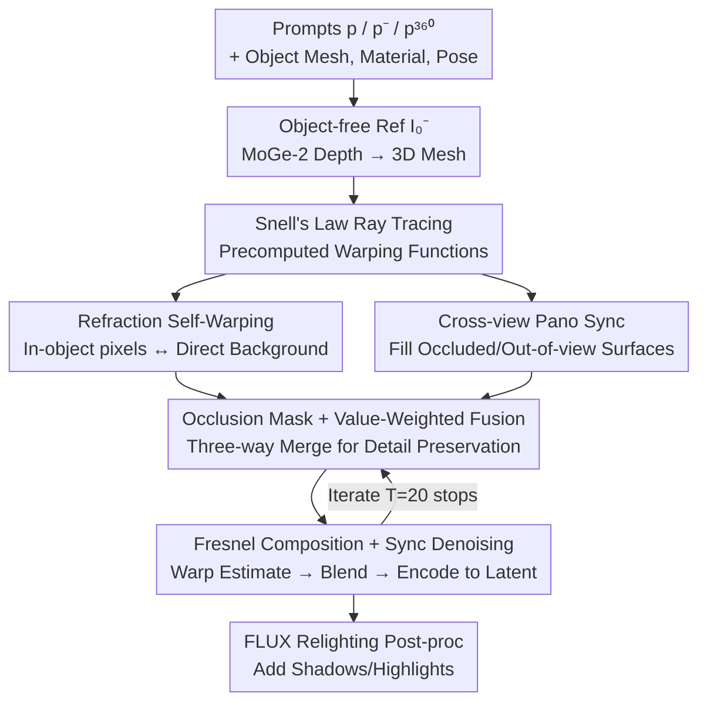

# Refracting Reality: Generating Images with Realistic Transparent Objects

**Conference**: CVPR 2026  
**arXiv**: [2511.17340](https://arxiv.org/abs/2511.17340)  
**Code**: None  
**Area**: Diffusion Models / Image Generation  
**Keywords**: Transparent Object Generation, Refraction, Snell's Law, Cross-view Synchronization, Training-free

## TL;DR
Addressing the long-standing failure of text-to-image models in generating realistic refraction for transparent objects, this paper proposes the training-free Snellcaster. It applies Snell's Law to perform "refraction self-warping" at each step of the FLUX generation trajectory. By utilizing an auxiliary panoramic image centered at the transparent object to fill in surfaces not visible to the camera, it strictly constrains refraction and reflection to physical correctness. Masked PSNR is improved from ~12.7 to 16.5, and LPIPS is reduced from 0.47 to 0.24.

## Background & Motivation
**Background**: Text-to-image models (FLUX, SD3.5, Qwen-Image, etc.) can generate highly realistic shadows, specular highlights, perspective distortions, and texture layouts, often reaching near-photorealistic quality.

**Limitations of Prior Work**: A notable exception is transparent objects—specifically refraction—which are often rendered inaccurately. Models either "hallucinate" the content inside transparent spheres or apply arbitrary low-scale distortions to the background, failing to learn optical laws.

**Key Challenge**: There is a fundamental difference between reflection and refraction. In reflection, the indirectly observed surfaces are typically outside the frame, allowing the model to freely "hallucinate" completions. However, **refraction allows the same surface to be seen both directly and indirectly at the same time**—for example, a cushion on a sofa is imaged directly in the frame and appears (distorted) within a glass sphere. The color of pixels inside the sphere is thus **hard-constrained** by other regions in the frame and cannot be hallucinated. Generative models tend to struggle with this consistency.

**Goal**: Given a text prompt, generate an image containing a single transparent refractive object with physically correct refraction. Two sub-problems must be addressed: (1) ensuring correct pixel colors for refracted areas corresponding to the directly visible background; and (2) reasonably completing surfaces hit by refracted/reflected rays that are invisible to the camera (due to occlusion or being outside the field of view).

**Key Insight**: The authors assume access to the 3D mesh of the object (obtainable via text-to-3D), material properties (refractive index, absorption), and pose. Thus, the refractive light path can be precisely calculated using Snell's Law. The problem shifts from "teaching the model physics" to "directly injecting physical constraints during generation."

**Core Idea**: "Synchronized generation" is applied to refraction. At each denoising step, pixel-to-pixel mappings calculated via Snell's Law are used to warp and blend pixels inside and outside the object, as well as an auxiliary panoramic image, to achieve consistency, forcing refraction to satisfy optical equations.

## Method

### Overall Architecture
The method, named **Snellcaster** (as it casts rays bent by Snell's Law), is entirely training-free and based on the FLUX flow-matching architecture. The workflow involves three synchronized paths:

First, an "object-free" reference image $I_0^-$ is generated using a prompt $p^-$ lacking the transparent object description. Depth is estimated using MoGe-2 ($D^-$) and converted into a 3D mesh, with the transparent object mesh placed on a horizontal plane near the optical axis. Before generation, **all pixel-to-pixel warping functions** (refraction, reflection, panorama mutual projection) are precomputed by ray-tracing this scene geometry and reused throughout the denoising process.

Subsequently, **two images are generated concurrently**: the main branch generates a perspective image $I_0$ based on the full prompt $p$ (including the transparent object); the auxiliary branch generates an equirectangular panoramic image $I_0^{360}$ centered at the transparent object's position using an augmented prompt $p^{360}$. At each denoising step $t$, Euler estimates for clean images $I_{0|t}$ and $I_{0|t}^{360}$ are calculated for both branches. They are warped and blended using the precomputed geometric correspondences. Refraction and reflection are synthesized according to Fresnel equations and encoded back into the latent to drive the next step. Finally, a fine-tuned FLUX Kontext relighting model is used as a post-processor to add shadows and highlights consistent with the scene light source.

### Key Designs

**1. Refraction Self-Warping: Locking In-sphere Pixels to the Background via Snell's Law**

This is the core for ensuring pixels inside the sphere are not hallucinated. The light paths are modeled as piecewise linear functions (constant refractive index). Rays are cast from the perspective camera through each pixel, and the refraction direction is calculated using Snell's Law as they pass through the foreground object mesh:

$$\mathbf{d}_{i+1}=\alpha_i\mathbf{d}_i+\left(\alpha_i\beta_i-\sqrt{\gamma_i}\right)\mathbf{n}(\mathbf{x}_{i+1})$$

where $\alpha_i=\nu_i/\nu_{i+1}$ is the ratio of refractive indices, $\beta_i=-\mathbf{d}_i^\mathsf{T}\mathbf{n}$, and $\gamma_i=1-\alpha_i^2(1-\beta_i^2)$; when $\gamma_i<0$, total internal reflection occurs, and the reflection law is used. Rays are refracted until they hit the background mesh; projecting the intersection back to the image plane yields the self-warping function $\pi^{\text{R}}$, which maps each pixel inside the object to its corresponding background location in $I_0^-$. During generation, the clean object-free image is warped via $\pi^{\text{R}}(I_0^-)$ to obtain "how the background should look through the glass." This converts refraction from "model hallucination" to being "geometry-determined," resulting in physically plausible distortions such as inversions and radial warping.

**2. Cross-view Panoramic Sync: Completing Invisible Surfaces with Auxiliary Panoramas**

Refracted/reflected rays often hit surfaces that are occluded or outside the frame. These pixels lack direct constraints and tend to be inconsistent in free generation. The authors' solution is to launch an auxiliary branch generating a **panorama centered at the transparent object** $I_0^{360}$—which approximates the surrounding scene as seen from the object's surface. During precomputation, rays refracted from the perspective camera hitting the background bounding box are projected onto the panorama to get $\pi^{-1}$, reflection rays are projected to get $\pi^{-\text{R}}$, and direct rays from the pano camera are projected to the perspective plane to get $\pi$. During denoising, these functions warp content between the two views, bringing "out-of-frame" panoramic content into the refraction zone. Ablations show this branch contributes the most, as it is the only source of reasonable information for occluded regions.

**3. Occlusion Masking + Value-Weighted Blending: Merging Three Sources with Detail Preservation**

Each pixel inside the object may have three sources: "direct background refraction $\pi^{\text{R}}(I_0^-)$," "panoramic completion $\pi^{-1}(I_{0|t}^{360})$," and "current perspective estimate $I_{0|t}$." The authors use a fusion operator $\phi$ with occlusion masks:

$$\phi(\mathcal{X},\mathcal{Y},\lambda)=(1-\lambda)\frac{\sum_i M(\mathcal{Y}_i)\odot\mathcal{Y}_i(\mathcal{X}_i)}{\sum_i M(\mathcal{Y}_i)}+\lambda\frac{\sum_i M(\mathcal{Y}_i)\odot|\mathcal{Y}_i(\mathcal{X}_i)|\odot\mathcal{Y}_i(\mathcal{X}_i)}{\sum_i M(\mathcal{Y}_i)\odot|\mathcal{Y}_i(\mathcal{X}_i)|}$$

where $M(\mathcal{Y}_i)$ is the occlusion mask for the $i$-th warping, and $\lambda=0.5$ balances a smooth mean with a detail-preserving value-weighted term (following LookingGlass). All warps use Laplacian pyramids to sample pixels at appropriate resolutions based on scaling, reducing artifacts and aliasing.

**4. Fresnel-Weighted Composition + Synchronized Denoising: View-dependent Mixing and Trajectory Injection**

Transparent objects exhibit both refraction and reflection, with weights varying by angle. The authors warp the panorama into a reflection appearance $I_{0|t}^{\text{R}}=\pi^{-\text{R}}(I_{0|t}^{360})$ and mix refractive and reflective colors in linear color space using Fresnel equations: $\mathbf{c}'=\tfrac{1}{2}(R_p+R_s)(\mathbf{c}^{\text{反}}-\mathbf{c}^{\text{折}})+\mathbf{c}^{\text{折}}$, where $R_p, R_s$ are reflection coefficients. The synchronized clean estimates $\hat I_{0|t}$ and $\hat I_{0|t}^{360}$ are encoded back to latents, and:

$$z_{t-1}=z_t+\frac{\sigma_{t-1}-\sigma_t}{\sigma_t}(z_t-\hat z_{0|t})$$

is used to guide the next denoising step. This "per-step synchronization" rather than "post-hoc patching" is the key to injecting physical constraints into the diffusion process.

## Key Experimental Results

### Main Results
The dataset consists of 10 indoor/outdoor prompts × 5 variants × 6 transparent objects (sphere, cylinder, cone, fox, dog, sculpture) = 300 scene-object combinations. Refraction fidelity is measured using masked PSNR / LPIPS against Blender renders.

| Method | CLIP↑ | ImReward↑ | masked PSNR↑ | masked LPIPS↓ |
|------|-------|-----------|--------------|---------------|
| FLUX-dev | 32.36 | -0.20 | 12.68 | 0.48 |
| FLUX.2-dev | 33.37 | 0.18 | 12.15 | 0.48 |
| Qwen-Image | 32.67 | 0.01 | 12.55 | 0.48 |
| SD 3.5 (Large) | 34.56 | 0.08 | 12.25 | 0.53 |
| FLUX Inpaint | 33.44 | -0.47 | 12.66 | 0.47 |
| **Ours (Snellcaster)** | 32.85 | -0.32 | **16.51** | **0.24** |

Refraction metrics lead significantly: PSNR is nearly 4 dB higher than the best baseline, and LPIPS is almost halved. Meanwhile, CLIP/ImageReward scores remain competitive, showing that imposing physical constraints **does not degrade image quality or text alignment**.

### Ablation Study
Performed across 6 indoor scenes with spherical geometry (before relighting):

| Configuration | MAE↓ | PSNR↑ | LPIPS↓ | CLIP↑ | ImgR↑ | Notes |
|------|------|-------|--------|-------|-------|------|
| Ours (full) | 0.0953 | 18.21 | 0.24 | 34.22 | 0.51 | Full Model |
| w/o reflections | 0.0964 | 18.11 | 0.25 | 34.20 | 0.67 | Minor drop |
| w/o pano sync | 0.0983 | 17.98 | 0.25 | 33.88 | 0.64 | Significant drop |
| w/ relighting | 0.1137 | 17.10 | 0.28 | 34.61 | 0.59 | Add post-proc |

### Key Findings
- **Panoramic synchronization is the most significant contributor**: Removing it causes a larger drop in metrics than removing reflections, as it is the only source of truth for occluded/out-of-frame areas.
- **Relighting is a trade-off between quality and metrics**: Adding relighting decreases pixel-wise metrics (PSNR 18.21 → 17.10) as it introduces shadows/lighting not present in the geometric ground truth, but CLIP scores improve (34.61), indicating better perceptual realism.

## Highlights & Insights
- **Adapting "Synchronized Generation" for Refraction**: While prior works like SyncDiffusion used synchronization for seamless panoramas, this work uses warping functions derived from Snell's Law to enforce hard geometric constraints on in-sphere pixels.
- **Clever Use of Auxiliary Panoramas**: Generating a panorama centered at the object provides a self-consistent source for regions that refraction "sees" but the perspective camera does not.
- **Training-free and Plug-and-play**: The physical constraints are injected into the sampling trajectory without modifying model weights, making it theoretically applicable to any flow-matching/diffusion generator.

## Limitations & Future Work
- **Strong Assumptions**: Limited to single, non-scattering objects with uniform refractive indices. Requires pre-existing 3D meshes and poses.
- **Physical Simplifications**: Absorption, heterogeneous materials, and birefringence (e.g., stained glass, ice) are currently not supported.
- **Dependency on Monocular Depth**: The scene geometry relies on MoGe-2; depth errors propagate directly to refractive warping.
- **Post-hoc Lighting**: Shadows and highlights are added via post-processing rather than native ray-tracing.

## Related Work & Insights
- **vs LookingGlass (Chang et al. 2025)**: Both use Laplacian pyramid warping for synchronization. LookingGlass focuses on mirrors (reflective warping); this work adapts it for refraction and adds panoramic branches for occluded surfaces.
- **vs FLUX Inpainting**: Inpainting hallucinates based on boundaries, often failing to render objects behind the glass (e.g., sofas disappear). Snellcaster ensures these are refracted correctly via Snell's Law.
- **vs MirrorFusion / DiffusionLight**: These works handle reflections where the source can be hallucinated. Refraction is more difficult because the target surface is often simultaneously visible directly in the frame.

## Rating
- Novelty: ⭐⭐⭐⭐⭐ First to treat physical refraction as a core problem in diffusion models using Snell's Law and panoramic sync.
- Experimental Thoroughness: ⭐⭐⭐⭐ 300 combinations across 5 baselines; however, the prompt set (10) and geometry focus (spheres) are relatively narrow.
- Writing Quality: ⭐⭐⭐⭐⭐ Clear derivation of physics and pipeline; honest discussion of assumptions.
- Value: ⭐⭐⭐⭐ Solves a clear failure mode of generative models but requires strong geometric priors.

<!-- RELATED:START -->

## Related Papers

- [\[CVPR 2026\] HiFi-Inpaint: Towards High-Fidelity Reference-Based Inpainting for Generating Detail-Preserving Human-Product Images](hifi-inpaint_towards_high-fidelity_reference-based_inpainting_for_generating_det.md)
- [\[ICML 2026\] Initialization is Half the Battle: Generating Diverse Images from a Guidance Potential Posterior](../../ICML2026/image_generation/initialization_is_half_the_battle_generating_diverse_images_from_a_guidance_pote.md)
- [\[CVPR 2026\] SimLBR: Learning to Detect Fake Images by Learning to Detect Real Images](simlbr_learning_to_detect_fake_images_by_learning_to_detect_real_images.md)
- [\[CVPR 2026\] Beyond Objects: Contextual Synthetic Data Generation for Fine-Grained Classification](beyond_objects_contextual_synthetic_data_generation_for_fine-grained_classificat.md)
- [\[ICML 2025\] Shielded Diffusion: Generating Novel and Diverse Images using Sparse Repellency](../../ICML2025/image_generation/shielded_diffusion_generating_novel_and_diverse_images_using_sparse_repellency.md)

<!-- RELATED:END -->
