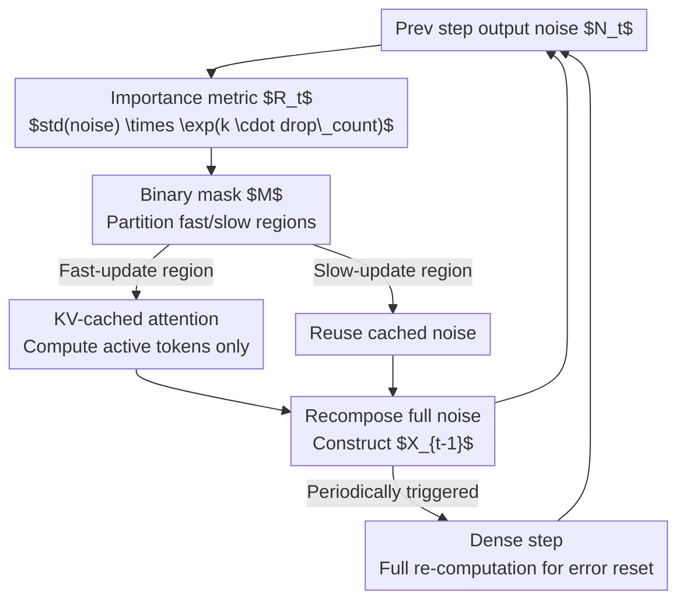

# Region-Adaptive Sampling for Diffusion Transformers

**Conference**: CVPR 2026  
**Paper**: [CVF Open Access](https://openaccess.thecvf.com/content/CVPR2026/html/Liu_Region-Adaptive_Sampling_for_Diffusion_Transformers_CVPR_2026_paper.html)  
**Code**: None  
**Area**: Diffusion Models / Image Generation  
**Keywords**: Diffusion Acceleration, Diffusion Transformer, Region-Adaptive Sampling, KV Caching, Training-free

## TL;DR
RAS is a training-free sampling strategy that identifies "fast-update regions" currently focused on by the model and sends only those into the DiT for denoising. "Slow-update regions" directly reuse noises cached from the previous step. This spatially non-uniform computation allocation achieves 2.36×/2.51× speedups on Stable Diffusion 3 and Lumina-Next-T2I with almost no loss in quality.

## Background & Motivation
**Background**: Diffusion models exhibit strong generation quality, but sampling requires solving SDEs/ODEs step-by-step in reverse time, with each step necessitating a forward pass through a large network. This sequential dependency is the fundamental bottleneck for real-time applications. Current acceleration methods mainly follow two paths: reducing sampling steps (distillation, consistency models, rectified flow) or reusing intermediate features across steps (DeepCache, Δ-DiT).

**Limitations of Prior Work**: Existing methods treat all regions of an image **uniformly**, assigning the same amount of computation regardless of whether a region is a detail-rich foreground subject or a smooth, repetitive background. However, the structural and semantic complexity of different regions varies significantly: foreground details require more refinement steps for high fidelity, while smooth backgrounds can be computed less frequently.

**Key Challenge**: Uniform sampling places "computational efficiency" and "detail preservation" in direct opposition. Accelerating by reducing overall steps sacrifices the critical regions that need fine-grained refinement. The root cause is that **computation is spread uniformly across all tokens rather than being allocated by regional importance**.

**Key Insight**: The authors observe two phenomena (Fig. 4): ① DiTs gradually focus on semantically meaningful regions during sampling; ② these focused regions exhibit strong temporal continuity between adjacent steps. By sorting tokens using a proposed output-noise metric and quantifying the similarity of rankings between steps using NDCG (Fig. 3), they find high continuity. Since a region ignored in one step is likely to remain ignored in the next, it can be skipped. Furthermore, because DiTs use RoPE to inject positional information into embeddings and tokens are spatially independent, they naturally support masking or reordering tokens without breaking positional encodings—a flexibility U-Net lacks.

**Core Idea**: Replace "uniform sampling" with "region-adaptive update ratios." Only tokens in the model's current focus are refreshed, while background regions reuse cached noise, allowing different regions to have different effective sampling steps.

## Method

### Overall Architecture
RAS (Region-Adaptive Sampling) modifies each denoising step from a "full-image forward pass" to "forward pass only for fast-update regions." The pipeline within a single step operates as follows: calculate a region-level importance metric $R_t$ based on the previous step's output noise → generate a binary mask $M$ to partition tokens into fast-update regions (sent to DiT) and slow-update regions (reuse cached noise) → pass only patchified fast tokens through the model to obtain new noise → merge the new noise with cached noise from slow regions into a complete sequence to construct the next input $X_{t-1}$. Since LayerNorm and MLP operate independently per token, incomplete sequences do not affect them; attention, which requires global context, is supplemented with a KV cache for slow regions. Additionally, two scheduling guardrails are used: initial steps use a 100% ratio to establish the global layout, and "dense steps" (full-image re-computation) are periodically inserted to clear accumulated errors.

### Key Designs

**1. Region-Adaptive Selective Update: Allocating computation to currently important regions**

This is the backbone of RAS, addressing the waste of computation on backgrounds that do not require refinement. Specifically, at each step, latent tokens are partitioned into fast and slow update regions using metric $R_t$ to generate a binary mask $M$. Only fast-region tokens are sent to the DiT to predict noise, while slow-region tokens reuse the noise estimate from the previous step. At the end of the step, new outputs for active tokens are **merged** with cached noises for inactive tokens to reconstruct the complete sequence. Significant tokens advance along the newly calculated update direction, while minor tokens maintain their previous trajectories. This is feasible in DiT because RoPE allows token masking without disrupting positions, and LayerNorm/MLP are token-independent. RAS can thus reduce DiT computation proportional to the user-defined sampling ratio and is **orthogonal** to step-reduction methods or Δ-DiT.

**2. Region Selection Metric + Starvation Protection: Identifying subjects and preventing background starvation**

The pipeline requires a criterion for identifying fast-update regions. The authors find that the **standard deviation of predicted noise** effectively distinguishes semantic regions: noise variance in the subject (fast-update) is significantly lower than in the background (slow-update), likely due to uneven information density after adding Gaussian noise. Using std as a metric consistently highlights semantic subjects. However, strictly following importance leads to background tokens being repeatedly skipped, causing blurriness or noise accumulation. To counter this, the authors trace the number of times each token has been dropped ($D$) and use it as an amplification factor to ensure low-importance tokens are periodically "revisited." The patch-level metric is defined as:

$$R_t = \text{mean}_{patch}\big(\text{std}(\hat N_t)\big) \cdot \exp(k \cdot D_{patch})$$

Where $\hat N_t$ is the predicted noise at step $t$, $D_{patch}$ is the skip count for the patch, and $k$ is a coefficient controlling the contrast between regions. A larger $k$ more aggressively "recalls" long-inactive patches. This term combines the "temporal continuity assumption" (important tokens remain important) with "starvation protection."

**3. KV Caching for Attention: Recovering context from skipped tokens**

Selective updates pose a risk: if inactive tokens are ignored during attention, the attention distribution for active tokens is distorted, degrading quality. The solution is a KV cache: complete K and V tensors are cached at each step, and only the parts corresponding to active tokens are updated. Leveraging the smooth evolution of token embeddings between steps, old cache entries for inactive regions remain good approximations. The output for an active token is approximated as:

$$O_a = \text{softmax}\!\left(\frac{Q_a[K_a, \tilde K_i]^\top}{\sqrt{d}}\right)[V_a, \tilde V_i]$$

Where $Q_a, K_a, V_a$ are query/key/value for active tokens, and $\tilde K_i, \tilde V_i$ are cached key/values for inactive tokens. This approximates full attention with minimal overhead.

**4. Scheduling Optimization: Dynamic ratios and dense steps**

Two guardrails manage when to avoid aggressive skipping. First, **Dynamic Sampling Ratios**: adjacency correlation is weak early in diffusion and strengthens as the process stabilizes. Selective sampling too early can destroy the structural skeleton. Thus, the first few steps (e.g., first 4 out of 28) use a 100% ratio. Second, **Error Resetting**: since RAS focuses on persistent regions, ignored regions may accumulate drift from stale denoising directions. The authors periodically insert "dense steps" for full-image re-computation (e.g., at steps 12 and 20 for a 30-step schedule starting RAS at step 4) to correct drifts in inactive regions. Engineering-wise, scatter operations for active tokens are fused into the epilogue of the preceding GeMM kernel (inspired by PIT) to save synchronization and memory overhead.

### Loss & Training
RAS is a **completely training-free** inference-time strategy. It introduces no parameters or fine-tuning and is applied directly to pre-trained DiTs (SD3, Lumina-Next-T2I) based on the `FlowMatchEulerDiscreteScheduler` in the diffusers library.

## Key Experimental Results

### Main Results
Evaluated on MS-COCO (10,000 caption-image pairs), RAS shows Pareto improvements over uniform step-reduction (RFlow) at equivalent or higher throughput (Data from Table 2, COCO Val2014 1024×1024):

| Model | Method | Steps | Sampling Ratio | Image/s↑ | FID↓ | sFID↓ | CLIP↑ |
|-------|--------|-------|----------------|----------|------|-------|-------|
| SD3 | RFlow | 5 | 100% | 1.43 | 39.70 | 22.34 | 29.84 |
| SD3 | RAS | 7 | 25.0% | 1.45 | **31.99** | **21.70** | **30.64** |
| SD3 | RFlow | 4 | 100% | 1.79 | 61.92 | 27.42 | 28.45 |
| SD3 | RAS | 5 | 25.0% | **1.94** | **51.92** | **25.67** | **29.06** |
| Lumina | RFlow | 5 | 100% | 0.69 | 96.53 | 59.26 | 26.03 |
| Lumina | RAS | 7 | 25.0% | **0.70** | **53.93** | **39.80** | **28.85** |

RAS achieves better FID/sFID/CLIP while maintaining higher throughput. SD3 and Lumina-Next-T2I reach up to 2.36× and 2.51× speedups, respectively. A 25% ratio with 30 steps yields 2.25× throughput with only 22.12% FID increase and 0.065% CLIP decrease. VRAM overhead is minimal (Table 3): +6% for SD3 and +4% for Lumina.

### Ablation Study
Table 4 decomposes components on SD3 (10 steps, 12.5% average sampling ratio unless noted):

| Config | FID↓ | sFID↓ | CLIP↑ | Description |
|--------|------|-------|-------|-------------|
| Default | 35.81 | 18.41 | 30.13 | Full Model |
| Static Sampling Freq. | 37.92 | 19.11 | 29.98 | Using a static ratio |
| Random Dropping | 43.19 | 22.23 | 29.65 | Random token dropping (no $R_t$) |
| W/O Error Reset | 46.10 | 24.85 | 30.41 | No dense steps |
| W/O KV Caching (28 steps) | 31.36 | 20.19 | 31.29 | vs Default 24.30 FID |
| W/O Starvation (10 steps) | 39.87 | 19.75 | 29.84 | vs Default 35.81 |

### Key Findings
- **Metric-based identification is critical**: Replacing $R_t$ with random dropping causes FID to jump from 35.81 to 43.19, verifying the "noise std for semantic subject" assumption.
- **Error reset is essential**: Removing dense steps leads to the worst FID (46.10), proving that inactive regions drift and require periodic correction.
- **KV Cache utility depends on steps**: In long schedules (28 steps), removing KV cache increases FID from 24.30 to 31.36; in short schedules (10 steps), the impact is smaller (35.81 vs 32.33), indicating context approximation costs scale with duration.
- **vs Layer-wise Caching**: Compared to DeepCache and Δ-DiT (Fig. 6), RAS maintains better FID/CLIP at higher speedup ratios, suggesting "region-level token selection" is superior for Transformer-based diffusion.
- **User Preference**: In 1,400 votes, 45.21% found RAS comparable to dense inference and 26.50% preferred RAS, while achieving 1.625× (SD3) and 1.561× (Lumina) throughput gains.

## Highlights & Insights
- **Leveraging DiT convergence as a computational lever**: Using noise std to distinguish subject/background provides an "attention map" for free, without extra saliency networks.
- **Orthogonality and composability**: RAS does not overlap with step-reduction or layer-caching methods, making it highly attractive for practical deployment.
- **Elegant starvation protection**: Encoding the recall logic into a single $\exp(k \cdot D)$ term is a clean design that could translate to other "selective update + cache" systems.
- **Engineering integration**: Fusing scatter operations into GeMM epilogues ensures theoretical FLOPs reduction translates into actual latency gains.

## Limitations & Future Work
- **Architectural Dependency**: The method relies on DiT's token independence and RoPE, making it inapplicable to U-Net-based models.
- **Early Step Requirements**: The need for initial full-image steps limits RAS's potential in extreme acceleration scenarios (e.g., < 5 steps).
- **Hyperparameter Sensitivity**: The values for $k$ and dense step positions are empirical; an adaptive selection scheme is currently lacking.
- **Directions for Improvement**: Utilizing attention maps instead of just noise std for $R_t$, and making dense steps trigger-based rather than periodic.

## Related Work & Insights
- **vs Step Reduction (Distillation/RFlow)**: These compress time; RAS compresses space. RAS shows slower quality degradation as ratios decrease compared to direct step reduction.
- **vs Layer-wise Cache (DeepCache/Δ-DiT)**: RAS's token-level granularity proves more effective for Transformers than stage-level feature reuse.
- **Inspiration**: The quantified NDGC analysis of temporal continuity in focused regions serves as a diagnostic tool for state-caching decisions in other diffusion tasks.

## Rating
- Novelty: ⭐⭐⭐⭐⭐ First spatially adaptive computation allocation for diffusion, orthogonal to existing improvements.
- Experimental Thoroughness: ⭐⭐⭐⭐ Strong baseline comparisons and human evaluations, though sensitivity analysis for dense steps is relatively brief.
- Writing Quality: ⭐⭐⭐⭐ Logical flow from observation to method, well-supported by formulas and figures.
- Value: ⭐⭐⭐⭐⭐ Training-free, plug-and-play, achieves >2× speedup with negligible loss.

<!-- RELATED:START -->

## Related Papers

- [\[CVPR 2026\] SpotEdit: Selective Region Editing in Diffusion Transformers](spotedit_selective_region_editing_in_diffusion_transformers.md)
- [\[CVPR 2026\] ProcessMaker: A Generalized Process Visualization Framework with Adaptive Sequence Steps on Diffusion Transformers](processmaker_a_generalized_process_visualization_framework_with_adaptive_sequenc.md)
- [\[CVPR 2026\] Adaptive Spectral Feature Forecasting for Diffusion Sampling Acceleration](adaptive_spectral_feature_forecasting_for_diffusion_sampling_acceleration.md)
- [\[CVPR 2026\] Memory-Efficient Fine-Tuning Diffusion Transformers via Dynamic Patch Sampling and Block Skipping](memory-efficient_fine-tuning_diffusion_transformers_via_dynamic_patch_sampling_a.md)
- [\[CVPR 2026\] Training-free Mixed-Resolution Latent Upsampling for Spatially Accelerated Diffusion Transformers](training-free_mixed-resolution_latent_upsampling_for_spatially_accelerated_diffu.md)

<!-- RELATED:END -->
