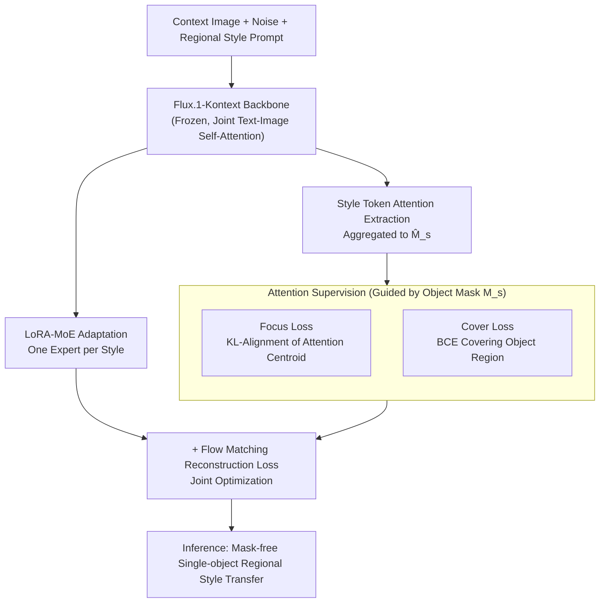

# RegionRoute: Regional Style Transfer with Diffusion Model

**Conference**: CVPR 2026  
**Paper**: [CVF Open Access](https://openaccess.thecvf.com/content/CVPR2026/html/Chen_RegionRoute_Regional_Style_Transfer_with_Diffusion_Model_CVPR_2026_paper.html)  
**Code**: None  
**Area**: Diffusion Models / Image Editing / Style Transfer  
**Keywords**: Regional Style Transfer, Attention Supervision, LoRA-MoE, Regional Style Editing Score, Diffusion Models

## TL;DR
RegionRoute supervises the attention map corresponding to "style words" in the diffusion model using binary masks of target objects during the training stage, binding style tokens with specific object regions. Consequently, it applies style only to a single object **without requiring any masks during inference**, achieving true regional style transfer. Additionally, it proposes the RSE-Score to simultaneously measure "whether the style inside the region is correct" and "whether the area outside the region is preserved."

## Background & Motivation

**Background**: Diffusion-driven style transfer (based on Stable Diffusion / Flux series) can already transfer artistic styles to the entire image with high quality, and instruct-based image editing (InstructPix2Pix, Flux.1-Kontext, Qwen-Image-Edit, etc.) can also edit images according to text instructions.

**Limitations of Prior Work**: However, almost all these methods treat style as a **global feature**, where the style is uniformly applied across the entire image, making it impossible to "only turn this cat into pixel art while keeping other areas unchanged." To perform regional style transfer, prior works often resort to a two-stage approach: first globally stylizing the entire image, and then blending the stylized region back with the original image using a manually provided mask. This pipeline requires precise masks, suffers from visible seams at the blending boundaries, and has poor generalization and low practicality.

**Key Challenge**: The cross/self-attention inside diffusion models inherently learns the spatial correspondence of "text concept $\leftrightarrow$ image region"—the model actually "sees" which part is the target object. However, these attention maps have **never been explicitly guided to bind style concepts with specific objects**. Consequently, even if the localization is correct, global style shift still occurs.

**Goal**: To enable the diffusion model to learn "where the style should be applied" by itself, achieving single-object regional style transfer **without masks or external spatial controls** during inference, and to introduce an evaluation metric capable of quantifying both regional style fidelity and the preservation of unedited areas.

**Key Insight**: Since the model already possesses attention maps, instead of forcing masks during inference, the object masks can be used **during training** to supervise the attention of style tokens, internalizing "style localization" into the weights.

**Core Idea**: Replace "inference masks" with "attention supervision"—aligning the attention distribution of style tokens with the target object mask during training, allowing the model to learn style grounding so that it can automatically localize during inference.

## Method

### Overall Architecture

RegionRoute is built on the pre-trained **Flux.1-Kontext** (a DiT-based diffusion editing model that performs joint self-attention on image and text tokens). The inputs are a context image, a noised input, and a regional style prompt (e.g., "make the man in pixel-art style"), with the goal of reconstructing an image where only the target object is stylized. The entire pipeline performs four operations: ① Extracting the "style token $\rightarrow$ image token" attention slice from the self-attention maps of various DiT layers and aggregating them into a style attention map $\hat{M}_s$; ② Supervising this attention map using the binary mask $M_s$ of the target object, using two complementary objectives, Focus loss and Cover loss, to constrain and fully spread the attention on the object; ③ Equipping each style with an independent lightweight expert using LoRA-MoE, where the backbone is frozen to only learn "where to apply" while the experts learn "how to paint"; ④ Overlaying these two attention supervision losses on top of the standard diffusion noise reconstruction loss as the training objective. During inference, masks are no longer required, and the model automatically localizes the style.

### Key Designs

**1. Attention Extraction and Supervision Signal Construction: Explicitly Extracting "Where the Style Token Looks"**

For the model to be supervised, there must first be a supervisable quantity. Each DiT block in Flux.1-Kontext performs multi-head self-attention on image and text tokens. Given a style phrase in the prompt (e.g., "pixel-art style"), the authors extract the "image query $Q_{\text{img}}$ $\rightarrow$ style token $K_s$" attention slice, and then average it over multiple heads, layers, and style tokens to obtain the aggregated style attention map:

$$\hat{M}_s = \frac{1}{L}\sum_{\ell \in \mathcal{L}} \frac{1}{H}\sum_{h=1}^{H} \frac{1}{|K_s|}\sum_{k\in K_s} A^{(\ell)}_{h}[Q_{\text{img}}, k]$$

where $L$ is the set of layers involved in supervision and $H$ is the number of attention heads. $\hat{M}_s \in \mathbb{R}^{h\times w}$ represents the attention intensity of each spatial token towards the style tokens. The ground-truth mask $M_s$ used for supervision is obtained by downsampling the object segmentation map to the same resolution as the attention map. This step is the prerequisite for all subsequent supervision—it transforms "where the style is applied" from a latent variable hidden in the weights into an explicit heatmap that can be aligned using a mask.

**2. Focus Loss + Cover Loss: One for "Accurate Placement" and One for "Full Coverage"**

Having just an attention map is not enough; the key is what objective to use to constrain it. The authors found that a single objective leads to imbalanced optimization, so they designed two complementary losses. **Focus loss** treats both the predicted attention and the mask as normalized probability distributions and minimizes the KL divergence between them:

$$\mathcal{L}_{\mathrm{focus}} = \sum_{s=1}^{S} \mathrm{KL}\!\Big( \mathrm{softmax}(\hat{M}_s/\tau) \;\Big\|\; \mathrm{norm}(M_s) \Big)$$

where $\mathrm{norm}(Z)=Z/\sum Z$, and $\tau$ controls the sharpness of the attention distribution. This loss handles **global shape alignment**—it forces the attention centroid to fall within the object's region. However, KL alignment has a loophole: the model can collapse the attention to a tiny point inside the object and still make the distribution "shape" look correct. Therefore, they add **Cover loss**, a numerically stable binary cross-entropy applied at the token level:

$$\mathcal{L}_{\mathrm{cover}} = \sum_{s=1}^{S} \mathrm{BCE\_logits}\!\big(\alpha\,\hat{M}_s,\ M_s\big)$$

where $\alpha$ is a contrast scaling factor that amplifies the attention magnitude to strengthen the gradients. It penalizes attention outside the object ($M_s=0$) and rewards attention inside the object ($M_s=1$) token-by-token, forcing the attention to **densely and uniformly cover** the entire object instead of collapsing into a single point. Combined, Focus manages "accurate placement" and Cover manages "full coverage," resulting in spatially consistent style application without leakage or omission. The attention visualization in the paper (Figure 4) also confirms that using either loss in isolation causes the attention to spill over to the surroundings, while only the joint objective cleanly locks onto the target object (such as the motorcycle).

**3. LoRA-MoE Multi-Style Adaptation: Backbone Learns "Where to Apply", Experts Learn "How to Paint"**

To support multiple styles, fine-tuning all styles with a single LoRA would cause mutual interference and degrade style fidelity. Instead, the authors assign an **independent lightweight LoRA expert to each style**, built upon the same shared diffusion backbone. During training, only the expert corresponding to the current style is activated, and the backbone is frozen to preserve the previously learned spatial reasoning capability for attention grounding. During inference, the corresponding expert is selected based on the target style token, allowing plug-and-play capability. This design cleanly decouples responsibilities: the **shared backbone is responsible for "where the style is applied" (spatial localization), while each expert is responsible for "what the style looks like" (rendering method)**. There are three benefits: (i) Parameter efficiency—adding new styles does not require retraining the backbone; (ii) Specialization—each expert learns its unique style pattern; (iii) Stability—the shared backbone ensures consistent spatial alignment across all experts.

### Loss & Training

The total objective overlays two attention supervision terms on top of the standard diffusion noise prediction loss $\mathcal{L}_\epsilon = \|\hat{\epsilon}-\epsilon\|_2^2$:

$$\mathcal{L} = \mathcal{L}_{\epsilon} + \lambda_f\,\mathcal{L}_{\mathrm{focus}} + \lambda_c\,\mathcal{L}_{\mathrm{cover}}$$

Implementation details: Fine-tuning is conducted on Flux.1-Kontext using LoRA-MoE on a single NVIDIA GH200 GPU (120 GB) at $1024\times1024$ resolution with bf16 mixed precision and 8-bit Adam. LoRA rank=4, learning rate is $1\times10^{-4}$, batch size=2, gradient accumulation=4, training for 5000 steps with a constant learning rate and no warmup. Focus/Cover loss weights are set to 0.1 and 0.2, respectively. The training data utilizes the Grounded COCO subset from TokenCompose, randomly sampling 150 image-text pairs. For each image, one target object (with a binary mask) is selected, and a diffusion style transfer model is used to generate the stylized image, which is then blended with the original image to obtain the pseudo-ground truth (pseudo-GT). This covers four styles: pixel art, cyberpunk, expressionism, and line art, totaling 600 training samples (150 per style).

## Regional Style Editing Score (RSE-Score)

Existing metrics (FID, CLIP similarity) only evaluate the global appearance, failing to determine whether the style has **precisely landed on the target region** or whether the unedited areas have been preserved. The authors propose the **RSE-Score**, specifically designed to evaluate single-object regional style transfer, split into two components:

- **Regional Style Matching (RSM, ↑)**: Crop the edited image to the bounding box of the target mask (with a small padding), and use CLIP to compute the similarity between the cropped region and the style text, mapped linearly to $[0,1]$:

$$\text{RSM} = \frac{1}{2}\big(1 + \cos\!\big(f_{\text{img}}(\hat{x}_{\text{crop}}), f_{\text{text}}(s)\big)\big)$$

This evaluates the style only within the edited area, avoiding background interference.

- **Identity Preservation (Out-of-region fidelity, two independent metrics)**: Calculate the **masked LPIPS** (perceptual consistency, ↓) and **masked MSE** (pixel consistency, ↓) over the background region $(1-M)$ to respectively measure the perceptual and pixel-level preservation of unedited areas. These are reported independently to provide a clearer diagnostic perspective.

Combined: RSM measures "whether the style in the edited region is correct", while $\text{LPIPS}_{\text{bg}}$ / $\text{MSE}_{\text{bg}}$ measure "whether the area outside the region is preserved," constituting a comprehensive benchmark for regional style transfer.

## Key Experimental Results

### Main Results

Comparing on three segmentation datasets with pixel-level masks (COCO, Pascal VOC, BIG) (the following shows the COCO data, format: mean):

| Method | RSM ↑ | LPIPSbg ↓ | MSEbg ↓ | Characteristics |
|------|-------|-----------|---------|------|
| Flux.1-Kontext | 0.6126 | 0.4546 | 0.1699 | Strong style but global shift, heavy background destruction |
| Qwen-Image-Edit | 0.6235 | 0.7530 | 0.4398 | Highest RSM but most severe background distortion |
| Style-Editor | 0.6071 | 0.2235 | 0.0093 | Can localize but weak style control, prone to leakage |
| ICEdit | 0.6086 | 0.3512 | 0.1568 | Moderate RSM, unstable regional control |
| AnyEdit | 0.6085 | 0.6895 | 0.2633 | Poor regional control, chaotic output semantics |
| Instruct-Pix2Pix | 0.5978 | 0.1867 | 0.0516 | Good background preservation but weak stylization |
| SD2-Inpainting | 0.6028 | 0.0859 | 0.0039 | Background barely changes but limited stylization capability |
| **RegionRoute (Ours)** | **0.6128** | **0.2103** | **0.0729** | Competitive RSM + significant background preservation, best balance |

Conclusion: Existing methods either favor style fidelity (like Flux/Qwen with high RSM but poor background) or background preservation (like Inpainting with a stable background but weak style), **rarely achieving both**. RegionRoute maintains a competitive RSM while keeping $\text{LPIPS}_{\text{bg}}$ / $\text{MSE}_{\text{bg}}$ extremely low, demonstrating that the editing is both localized and semantically coherent.

VLM Controllability Evaluation (Qwen2.5-VL-7B-Instruct answering four binary questions, COCO data):

| Method | Q1 Object in Target Style ↑ | Q2 Background in Target Style ↓ | Q3 Object in Opposite Style ↓ | Q4 Background in Opposite Style ↓ |
|------|------|------|------|------|
| Qwen-Image-Edit | 0.98 | 0.86 | 0.01 | 0.00 |
| Flux.1-Kontext | 0.63 | 0.44 | 0.08 | 0.06 |
| AnyEdit | 0.50 | 0.41 | 0.57 | 0.47 |
| **RegionRoute** | **0.73** | **0.07** | 0.12 | 0.00 |

While RegionRoute has a high Q1 (successful object stylization), its Q2 (background stylistic contamination) is extremely low (0.07 vs. Qwen's 0.86), indicating minimal style leakage and high semantic reliability. Although Qwen's Q1 reaches 0.98, its Q2 is as high as 0.86—a classic case of global stylization.

### Ablation Study

| Configuration | RSM ↑ | LPIPSbg ↓ | MSEbg ↓ | Explanation (COCO) |
|------|------|----------|--------|------|
| Full（rank=4） | 0.6128 | 0.2103 | 0.0729 | Full model |
| w/o Lcover | 0.6120 | 0.2174 | 0.0730 | Without cover loss, attention collapses easily |
| w/o Lfocus | 0.6127 | 0.2132 | 0.0740 | Without focus loss, localization degrades |
| w/o Double (LoRA added only to Single stream) | 0.6168 | 0.4225 | 0.1409 | RSM slightly increases but background consistency collapses |
| w/o Single (LoRA added only to Double stream) | 0.6190 | 0.5203 | 0.2284 | Same as above, background destruction is more severe |
| Rank=8 | 0.6137 | 0.2007 | 0.0752 | Increased rank, slightly better background consistency |
| Rank=16 | 0.6126 | 0.1876 | 0.0671 | Higher rank yields better background, but rank=4 is sufficient |

### Key Findings

- **The two losses are complementary and both indispensable**: Removing either $\mathcal{L}_{\mathrm{cover}}$ or $\mathcal{L}_{\mathrm{focus}}$ consistently degrades all metrics across the three datasets. Attention visualizations show that using either loss on its own leads to attention spilling over to surroundings, whereas only the joint objective cleanly locks onto the target object.
- **LoRA must be applied to both streams**: When LoRA is only applied to either the Single or Double stream, the RSM actually **slightly increases** (the object looks more "on-style"), but $\text{LPIPS}_{\text{bg}}$ / $\text{MSE}_{\text{bg}}$ substantially worsen. This means the model makes the target region more exaggerated but **loses control over the remaining regions**. This demonstrates that a high RSM does not equate to good editing and must be evaluated alongside background metrics.
- **Low rank is sufficient**: Increasing the rank from 4 to 8 to 16 yields monotonically slightly better metrics, but rank=4 already shows strong adaptation and generalization, validating the effectiveness of LoRA-MoE under highly compact constraints.

## Highlights & Insights
- **Shifting "Inference Masking" to "Training Attention Supervision"**: This is a brilliant shift—since the model already possesses attention maps, aligning the style token's attention with the mask during training completely eliminates the need for masks and external segmentation at inference time, cleanly solving the seam issue of two-stage blending.
- **Complementary Division of Focus + Cover is highly valuable**: KL divergence handles "shape alignment" while BCE handles "dense coverage." This directly targets the subtle failure mode of "using only KL causes attention collapse." This combination of "localization loss + coverage loss" can be transferred to any task requiring attention-to-region alignment (e.g., referring expression generation, local inpainting).
- **Decoupling of "Backbone for Localization, Experts for Rendering"**: LoRA-MoE decouples spatial grounding (shared, stable) from style appearance (expert, plug-and-play). Adding a new style comes with zero cost to the backbone, making it a clean modular design.
- **High RSM $\neq$ Good Editing**: The paper uses ablation studies to expose the evaluation blind spot of "only looking at style similarity." Standard single-stream LoRA causes RSM to increase while the background collapses. Therefore, background fidelity must be reported simultaneously, which is precisely the motivation behind the RSE-Score.

## Limitations & Future Work
- The authors admit that challenges remain for **small, occluded, or semantically ambiguous objects**, which require stronger spatial alignment capabilities.
- It only performs **text-driven** regional style transfer and does not yet support exemplar-based (image-conditioned) style transfer, which the authors leave for future work.
- Our observed limitations: The training only uses 150 images, 4 styles, and 600 pseudo-GT samples, which is relatively small in scale. The pseudo-GT is generated via "global stylization + blending", placing an upper bound on quality dictated by the base style transfer model. Moreover, evaluation is restricted to single-object scenes; the controllability of multi-object/multi-style co-existence within a single image remains unverified.
- Future research directions: Replacing pseudo-GT generation with more grain-level instance-wise stylization, scaling to multi-object/multi-style joint editing, and introducing exemplar-based conditioning should further improve generalization.

## Related Work & Insights
- **vs. Flux.1-Kontext / Qwen-Image-Edit (Global Editors)**: They rely on cross-attention for implicit localization and treat style as a global feature, yielding high RSM but severe background distortion. Ours explicitly supervises attention, sacrificing a small amount of RSM for a significant boost in background preservation, achieving true localization.
- **vs. Two-Stage (Global Stylization + Manual Mask Blending)**: The two-stage pipeline requires precise masks and exhibits boundary seams. RegionRoute requires no masks during inference and has no seams, leading to better generalization.
- **vs. TokenCompose / Attend-and-Excite (Attention Supervision/Modulation)**: TokenCompose supervises cross-attention to bind text tokens to objects, while Attend-and-Excite modulates attention activation to strengthen under-represented regions. RegionRoute follows this line of work but **specifically supervises style tokens** and introduces Cover loss to address collapse, aiming for region-aware style transfer rather than object generation.
- **vs. SD2-Inpainting / Instruct-Pix2Pix (Strong Background Preservation)**: They keep the background almost intact but have limited stylization capability. RegionRoute stylizes more effectively while successfully preserving the background.

## Rating
- Novelty: ⭐⭐⭐⭐ The angle of "attention supervision during training replacing inference masks" for regional style transfer is clear. The complementary Focus/Cover losses and LoRA-MoE decoupling are solid, though each component is not entirely brand-new when viewed individually.
- Experimental Thoroughness: ⭐⭐⭐ The evaluation over three datasets, VLM feedback, and extensive ablation studies is systematic, but the training scale is small (150 images/4 styles) and only tests single-object scenes.
- Writing Quality: ⭐⭐⭐⭐ The logic of motivation-method-metric-experiment flows smoothly, and the attention supervision and evaluation designs are clearly explained.
- Value: ⭐⭐⭐⭐ Mask-free regional style transfer and the accompanying RSE-Score provide practical advancements for controllable image editing. Both the loss combination and evaluation methodology are highly transferable.

<!-- RELATED:START -->

## Related Papers

- [\[CVPR 2026\] Style-GRPO: Semantic-Aware Preference Optimization for Image Style Transfer Guided by Reward Modeling](style-grpo_semantic-aware_preference_optimization_for_image_style_transfer_guide.md)
- [\[ICLR 2026\] CoCoDiff: Correspondence-Consistent Diffusion Model for Fine-grained Style Transfer](../../ICLR2026/image_generation/cocodiff_correspondence-consistent_diffusion_model_for_fine-grained_style_transf.md)
- [\[CVPR 2026\] A Style is Worth One Code: Unlocking Code-to-Style Image Generation with Discrete Style Space](a_style_is_worth_one_code_unlocking_code-to-style_image_generation_with_discrete.md)
- [\[CVPR 2026\] Harmonic Canvas: Inversion-Free Editing for Visually-Guided Music Style Transfer](harmonic_canvas_inversion-free_editing_for_visually-guided_music_style_transfer.md)
- [\[CVPR 2026\] Diffusion-Based Makeup Transfer with Facial Region-Aware Makeup Features](diffusion-based_makeup_transfer_with_facial_region-aware_makeup_features.md)

<!-- RELATED:END -->
