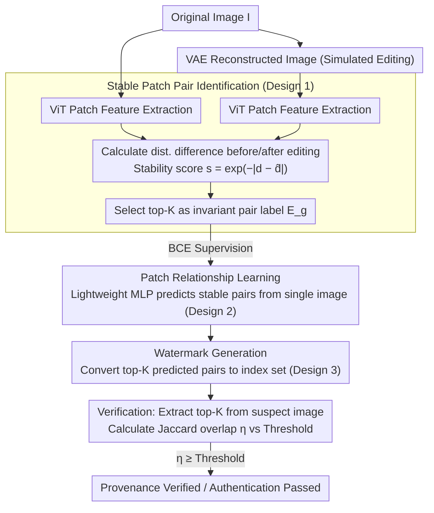

# Rel-Zero: Harnessing Patch-Pair Invariance for Robust Zero-Watermarking Against AI Editing

**Conference**: CVPR 2026  
**arXiv**: [2603.17531](https://arxiv.org/abs/2603.17531)  
**Code**: None  
**Area**: Image Generation  
**Keywords**: Zero-watermarking, Image editing robustness, patch relationship invariance, content authentication, diffusion models

## TL;DR
This paper discovers that the relational distance between image patch pairs remains invariant after AI editing. It leverages this invariance to construct Rel-Zero, a zero-watermarking framework that achieves robust content authentication against various generative edits without modifying the original image.

## Background & Motivation

**Background**: Digital watermarking is a key technology for protecting image copyright and authenticating content authenticity. Existing methods are divided into embedded watermarking (injecting signals into images) and zero-watermarking (extracting feature fingerprints stored in external databases without modifying the image).

**Limitations of Prior Work**: Embedded watermarks (e.g., VINE, RobustWide) must inject strong signals to resist diffusion model editing, which inevitably introduces perceptible distortion and reduces image quality. Zero-watermarking methods maintain perfect image quality but rely on global features (SIFT, absolute feature descriptors of deep classifiers), which are precisely what generative models excel at altering, leading to extremely low robustness.

**Key Challenge**: The trade-off between fidelity and robustness—embedded methods sacrifice quality for robustness, while zero-watermarking maintains quality but suffers from poor robustness. In high-precision fields such as medical imaging and autonomous driving, noise introduced by watermarking can lead to catastrophic consequences.

**Goal**: Achieve high-robustness authentication against generative AI editing without modifying the original image (zero-watermarking).

**Key Insight**: Through large-scale experimental analysis, the authors find that while AI editing significantly changes the pixel values and absolute features of individual patches, the pairwise distance between patches remains surprisingly invariant. $$d_{ij}^{\text{after}} \approx \alpha \cdot d_{ij}^{\text{before}} + \beta$$, where $$\alpha \approx 1, \beta \approx 0, R^2 > 0.95$$.

**Core Idea**: Utilize the editing invariance of patch-pair relational distances as the foundation for zero-watermarking, constructing the watermark as a set of indices for stable patch pairs.

## Method

### Overall Architecture

The starting point of Rel-Zero is a counter-intuitive empirical observation. The authors randomly sampled 10,000 images from UltraEdit and MagicBrush (2,000 deterministic regenerations, 4,000 global edits, 4,000 local edits), divided each image into $N=256$ non-overlapping patches, represented each patch with an RGB mean vector $\{v_i\}_{i=1}^N$, and calculated the L2 distance differences for all $\binom{N}{2}$ patch pairs before and after editing. The result: individual patch pixels and absolute features were modified beyond recognition by AI editing, but the distance differences between patch pairs followed a distribution with near-zero mean and tight spread, without systematic bias. Scatter plots of distances before and after editing yielded a nearly perfect line $d_{ij}^{\text{after}} \approx \alpha \cdot d_{ij}^{\text{before}} + \beta$, with slope $\alpha \approx 1$, intercept $\beta \approx 0$, $R^2 > 0.95$, and Spearman $\rho \approx 1$. In other words, editing merely performs an almost uniform scaling of the relative distances between patches—this is the **near-affine invariance** in feature space.

Why does this happen? On one hand, diffusion editing models are trained with content/structure preservation losses (LPIPS, L1/L2 reconstruction losses), which penalize unnecessary perturbations, making relative relationships across patches a core invariant deliberately maintained by the model. On the other hand, a semantic edit corresponds to a low-dimensional direction in latent space, which, when decoded back into an image, exerts an approximately uniform transformation. When this transformation is approximately affine $v_i' \approx A v_i + b$, then $v_i' - v_j' \approx A(v_i - v_j)$, meaning distances are scaled globally while relative relationships remain untouched. Rel-Zero turns this invariant into a watermark: the pipeline consists of three steps—first using a VAE to simulate editing to create training labels for "which patch pairs are truly stable," then training a lightweight edge predictor to learn to predict stable pairs directly from a single image, and finally selecting the top-K pairs with the highest confidence as the zero-watermark index set. Crucially, inference only requires the network from the second step; feeding in an image outputs the watermark index set without needing a VAE or running an actual edit.

### Key Designs

**1. Stable patch pair identification: Inexpensive editing simulation via VAE to create "invariant pair" labels**

The edge predictor needs to learn "which patch pairs will remain stable after editing," but obtaining supervision signals for every training image by running actual diffusion editing is computationally prohibitive. The authors (inspired by VINE) use reconstructions from a pre-trained VAE to approximate editing. The original image $\mathbf{I}$ and its VAE reconstruction are passed through a ViT to extract patch-level features $\mathcal{F} = \phi_{\text{vit}}(\mathbf{I})$. For each patch pair, the distance difference before and after "editing" is calculated, and a stability score $s_{ij} = \exp(-|d_{ij} - \hat{d}_{ij}|)$ is defined. The top-K pairs with the highest scores are selected as the ground-truth set $\mathcal{E}_g$. The justification is that VAE reconstruction perturbs patch relationships in a manner similar to diffusion editing but is an order of magnitude cheaper. Note that while the analysis used RGB means, the methodology upgrades to ViT high-dimensional features, allowing distance metrics to capture richer semantic relationships.

**2. Patch relationship learning: A lightweight MLP predicting stability from a single image, deliberately avoiding attention**

During verification, only the suspect image is available without its pre-edited counterpart. Thus, one must predict which patch pairs will be stable directly from a single image. The authors pair the $N$ ViT patch features into a fully connected set of pairs $\mathcal{E}$. The input for each pair $(i,j)$ is $\mathbf{f}_i \oplus \mathbf{f}_j \oplus \|\mathbf{f}_i - \mathbf{f}_j\|_2$ (concatenation plus distance), which is fed into an MLP $\psi$ with a sigmoid to get a prediction score $p_{ij} = \sigma(\psi(\mathbf{f}_i \oplus \mathbf{f}_j \oplus \|\mathbf{f}_i - \mathbf{f}_j\|_2))$. Ablations show that replacing the MLP with a Transformer or GAT actually degrades performance (97.43% → 92.11% / 94.45%). This is because the task is essentially distance estimation; key information is hidden in the local distance features of the pair, whereas attention mechanisms mix representations of different patches, erasing the fine distance differences needed for precise discrimination.

**3. Watermark generation and verification: Encoding watermarks as patch-pair index sets using Jaccard overlap**

With the predictor, generating a watermark involves selecting the top-K pairs with the highest confidence $\mathcal{E}_p = \text{Top-K}(\Phi(\phi_{\text{vit}}(\mathbf{I})))$ and storing this index set (rather than absolute values) in an external database. During verification, the top-K pairs $\mathcal{E}_p'$ are extracted from the suspect image, and the Jaccard overlap rate $\eta = |\mathcal{E}_p \cap \mathcal{E}_p'| / K$ is calculated and compared against a threshold calibrated for a target False Positive Rate (FPR=0.1%). For example, if $K=50$ pairs are stored and 46 reappear after editing, $\eta = 0.92$ is significantly above the threshold, establishing provenance. Encoding as index sets rather than absolute features leverages the aforementioned affine invariance—index sets capture relationships and rank-ordering rather than specific values, ensuring that global distance scaling does not affect which pairs rank at the top.

### Loss & Training

The edge predictor is trained using standard Binary Cross-Entropy: $$\mathcal{L}_{BCE} = -\sum_{i \neq j} [y_{ij} \log(\hat{y}_{ij}) + (1-y_{ij})\log(1-\hat{y}_{ij})] / N(N-1)$$, where $y_{ij}=1$ for top-K invariant pairs (positive samples) and $y_{ij}=0$ otherwise (negative samples). The ratio is approximately $K : \binom{N}{2}-K$, which is extremely imbalanced ($K=50$ vs $\sim$19,000 negatives), yet BCE effectively converges in this scenario. Implementation uses ViT-B/16 as a frozen feature extractor, Stable Diffusion v1.4 VAE for training targets, $K=50$ pairs, patch size $16 \times 16$ ($N=196$ for 224×224 images), trained on COCO using an NVIDIA A100.

## Key Experimental Results

### Main Results

| Method | Type | PSNR↑ | Regen | Pix2Pix | Magic | Ultra | CtrlN | Cropout | Scale | Contrast | Bright | Gauss |
|------|------|-------|-------|---------|-------|-------|-------|---------|-------|----------|--------|-------|
| DWT-DCT | Embedded | 40.38 | 0.09 | 0.04 | 0.05 | 0.32 | 0.56 | 10.35 | 6.78 | 30.18 | 51.88 | 12.45 |
| RobustWide | Embedded | 41.93 | 90.41 | 97.23 | 81.97 | 80.45 | 82.11 | 95.31 | 96.45 | 98.93 | 98.89 | 98.12 |
| VINE | Embedded | 37.34 | 99.98 | 97.46 | 94.58 | 99.96 | 93.04 | 54.87 | 76.43 | 98.43 | 97.90 | 98.37 |
| ConZWNet | Zero | ∞ | 0.10 | 0.02 | 0.01 | 5.13 | 2.41 | 98.75 | 97.43 | 96.22 | 96.56 | 98.75 |
| FGPCET | Zero | ∞ | 1.13 | 0.54 | 0.11 | 7.25 | 3.22 | 89.31 | 84.78 | 86.31 | 85.44 | 84.67 |
| **Rel-Zero** | **Ours** | **∞** | **85.13** | **89.65** | **95.63** | **96.55** | **97.43** | **98.45** | **98.57** | **96.45** | **97.93** | **95.12** |

All values are TPR@(0.1% FPR). **Core Findings**:
- Rel-Zero dominates the zero-watermarking category (others have TPR < 10% under generative editing; Rel-Zero reaches 85-97%).
- Outperforms embedded methods like VINE and RobustWide on local editing (Ultra/CtrlN).
- Maintains 98%+ robustness under conventional perturbations because uniform transformations preserve the geometry of patch-pair relationships.
- VINE performs poorly on Cropout (54.87%) and Scaling (76.43%), whereas Rel-Zero is inherently robust.

### Ablation Study

| Model Configuration | TPR@(0.1% FPR) | Description |
|---------|---------------|------|
| Ours (ViT + MLP) | 97.43 | Full model |
| ViT → ResNet-18 | 84.13 | Weak backbone leads to poor feature representation |
| ViT → ResNet-50 | 85.21 | ResNet still lags behind ViT patch-level representation |
| MLP → Transformer+MLP | 92.11 | Attention blurs distance differences |
| MLP → GAT+MLP | 94.45 | GAT has similar issues but slightly better |

### Key Findings
- ViT backbone provides the greatest contribution—ViT naturally produces patch-level features sensitive to relational distance changes.
- Simple MLP outperforms Transformer/GAT—pair prediction is essentially a distance estimation task; attention mechanisms blur fine distance differences.
- Conventional perturbations (noise, scaling, contrast, brightness) are essentially uniform transformations that do not alter relative patch relationships, making Rel-Zero inherently robust.
- Global editing (e.g., Regeneration) remains the biggest challenge as large-scale semantic changes can destroy some patch relationships.

## Highlights & Insights
- **The discovery of patch-pair relational invariance** is highly clever. Statistical analysis of 10,000 images revealed a near-perfect linear relationship ($R^2 > 0.95$) before and after editing, providing a solid theoretical basis for zero-watermarking.
- **Using VAE to simulate diffusion editing** is a smart design—it reduces computational overhead by orders of magnitude while maintaining an approximation of the structural impact of diffusion processes.
- **Encoding watermarks as patch-pair index sets (edge sets)** is a paradigm worth emulating—it can be migrated to video watermarking (spatio-temporal patch pairs) or 3D model watermarking (voxel pair relationships).

## Limitations & Future Work
- **Resolution Constraints**: Training and testing were conducted at 224×224; effectiveness on high-resolution images (e.g., 4K medical imaging) is unverified. Calculating $O(N^2)$ pairs at high resolutions is a challenge.
- **Editing Model Generalization**: Tested on only 5 models; generalization to future powerful editors (e.g., video diffusion or 3D-aware editing) is unknown.
- **Adversarial Safety**: Attackers knowing the patch partitioning, $K$ value, and ViT type could design targeted attacks to break specific patch-pair relationships.
- **Imbalanced Samples**: The $K=50$ vs $\sim$19,000 imbalance under BCE could potentially be addressed with focal loss or adaptive sampling.

## Related Work & Insights
- **vs. VINE/RobustWide (Embedded)**: These use adversarial training to include editing models in optimization, achieving high robustness at the cost of image quality (VINE PSNR only 37.34dB). Rel-Zero maintains perfect fidelity (PSNR=∞) while matching or exceeding performance in local editing and conventional perturbations.
- **vs. ConZWNet/FGPCET (Zero-watermarking)**: Same category but different logic. Previous works rely on absolute descriptors which generative models alter easily (TPR < 10%). Rel-Zero increases robustness by two orders of magnitude by exploiting relational invariance.
- **Related Thinking**: The insight of relational invariance could be migrated to other authentication scenarios—such as utilizing consistency between facial patch relationships for deepfake detection.

## Rating
- Novelty: ⭐⭐⭐⭐ The discovery of patch-pair invariance is insightful.
- Experimental Thoroughness: ⭐⭐⭐⭐ Tested across multiple models with unique analysis, though missing high-res experiments.
- Writing Quality: ⭐⭐⭐⭐⭐ Clear logic from observation to hypothesis to verification.
- Value: ⭐⭐⭐⭐ Provides a new paradigm for zero-watermarking with practical application potential in high-fidelity scenarios.

<!-- RELATED:START -->

## Related Papers

- [\[CVPR 2026\] SPDMark: Selective Parameter Displacement for Robust Video Watermarking](spdmark_selective_parameter_displacement_for_robust_video_watermarking.md)
- [\[ECCV 2024\] Robust-Wide: Robust Watermarking against Instruction-driven Image Editing](../../ECCV2024/image_generation/robust-wide_robust_watermarking_against_instruction-driven_image_editing.md)
- [\[CVPR 2026\] NOVA: Sparse Control, Dense Synthesis for Pair-Free Video Editing](nova_sparse_control_dense_synthesis_for_pair-free_video_editing.md)
- [\[CVPR 2026\] Towards Robust Sequential Decomposition for Complex Image Editing](towards_robust_sequential_decomposition_for_complex_image_editing.md)
- [\[CVPR 2026\] Taming Video Models for 3D and 4D Generation via Zero-Shot Camera Control](taming_video_models_for_3d_and_4d_generation_via_zero-shot_camera_control.md)

<!-- RELATED:END -->
