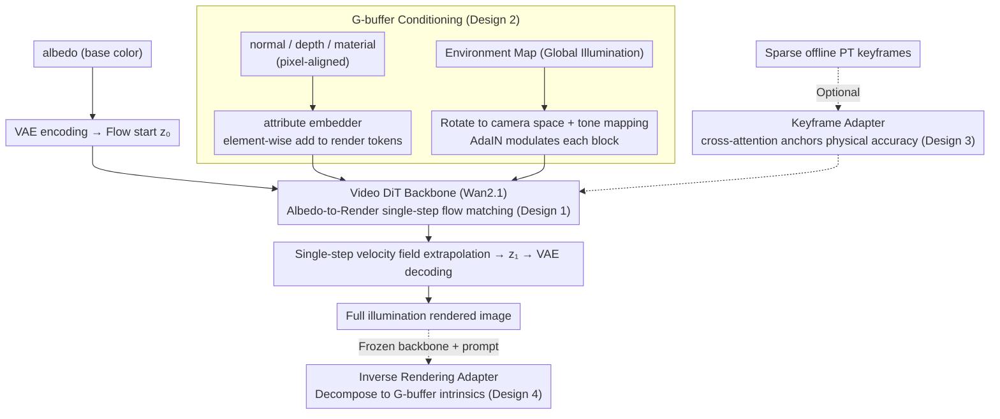

# RenderFlow: Single-Step Neural Rendering via Flow Matching

**Conference**: CVPR 2026  
**arXiv**: [2601.06928](https://arxiv.org/abs/2601.06928)  
**Code**: None (Disney Research internal project)  
**Area**: Diffusion Models / Image Generation / 3D Vision  
**Keywords**: Neural Rendering, Flow Matching, Single-step Inference, G-buffer, Keyframe Guidance

## TL;DR
The authors propose RenderFlow, which reformulates neural rendering as a single-step conditional flow matching problem from albedo to full-light images. Utilizing G-buffer as a condition and a pre-trained video DiT as the backbone, the method achieves deterministic rendering over 10 times faster than diffusion-based methods (~0.19s/frame). Optional sparse keyframe guidance further improves physical accuracy, while inverse rendering is supported via a frozen backbone and lightweight adapters.

## Background & Motivation

1. **Background**: Physically Based Rendering (PBR) through Monte Carlo path tracing is the gold standard for offline rendering but is computationally expensive. Recent diffusion-based neural rendering methods (e.g., RGB-X, DiffusionRenderer) utilize G-buffers as conditions to generate realistic images and have shown promising visual quality.

2. **Limitations of Prior Work**: (a) The iterative denoising process of diffusion models requires 20–50 network evaluations, resulting in latency too high for interactive applications; (b) the stochastic nature of diffusion sampling leads to insufficient physical accuracy and temporal flickering, failing to meet industrial rendering standards. Both issues stem from the "generation from noise" paradigm of diffusion models.

3. **Key Challenge**: A fundamental conflict exists between the generative capacity of diffusion models and the requirements for real-time deterministic rendering—high-frequency detail synthesis is needed, but iterative sampling and randomness are unacceptable.

4. **Goal**: (a) Achieve single-step, deterministic neural rendering; (b) improve physical accuracy without relying on explicit scene geometry or light transport simulation; (c) reuse the same backbone for both forward and inverse rendering.

5. **Key Insight**: Rendering can be interpreted as a "residual flow" learning problem from albedo (diffuse base color) to full-light images. Since albedo already contains low-frequency color information, the model only needs to learn to add high-frequency effects such as lighting, shadows, and reflections. Replacing noise with albedo as the starting point of the flow preserves geometric integrity.

6. **Core Idea**: Flow matching is employed to learn a deterministic velocity field from albedo to full-light images. Using G-buffer as a condition and a pre-trained video DiT as the backbone, high-fidelity rendering is achieved in a single step within a bridge matching framework.

## Method

### Overall Architecture
Input consists of a set of G-buffer attributes: albedo, normal, depth, material (roughness/metalness/specular), and an environment map (global illumination). Albedo serves as the flow starting point instead of noise and is encoded by a VAE into a latent $\mathbf{z}_0$; the target is the ground-truth path-traced image $\mathbf{z}_1$. The model learns a velocity field $v_\theta$ that maps $\mathbf{z}_0$ directly to $\mathbf{z}_1$, enabling full rendering via single-step inference. Optional sparse keyframes act as physical accuracy anchors through a cross-attention adapter.

### Key Designs

**1. Albedo-to-Render Flow Matching: Treating rendering as a deterministic single-step flow from base color to full illumination instead of denoising from noise.**

The root cause of slowness and instability in diffusion rendering is the requirement to iteratively denoise for 20–50 steps starting from pure noise. RenderFlow changes the starting point: albedo already carries low-frequency color and geometric information, so the model does not need to generate from scratch but merely "completes" the high-frequency effects like lighting, shadows, and reflections. It is trained within the bridge matching framework—denoting the albedo latent as $\mathbf{z}_0$ and the path-tracing ground truth as $\mathbf{z}_1$. During training, $t \in [0,1]$ is sampled to construct an interpolated path with perturbations:

$$\mathbf{z}_t = (1-t)\mathbf{z}_0 + t\mathbf{z}_1 + \sigma\sqrt{t(1-t)}\,\epsilon,\qquad \sigma=0.005$$

The network $v_\theta(\mathbf{z}_t, t)$ learns to approximate the target direction $\frac{\mathbf{z}_1 - \mathbf{z}_t}{1-t}$. During inference, a single-step extrapolation $\hat{\mathbf{z}}_1 = \mathbf{z}_t + v_\theta(\mathbf{z}_t, t)(1-t)$ yields the rendered result. Because the flow starting point is informative and close to the target, the ODE path is short and straight, reaching the destination with high precision in one step—which is an order of magnitude faster than diffusion. Using a 4-step SDE schedule for training but only a single step for inference actually prevents error accumulation.

**2. G-buffer Conditioning: Injecting geometry, material, and lighting via dual paths based on spatial alignment.**

To apply light to the correct geometry and materials, the model requires pixel-wise normal, depth, roughness, and metalness, as well as global illumination. The challenge lies in the different "natures" of these conditions: G-buffer attributes are pixel-aligned with the image, whereas the environment map provides global information. RenderFlow injects them through two paths into the Wan2.1 video DiT backbone. Albedo latents are transformed into render tokens via an input embedder. Normal, depth, and material attributes are encoded by the same VAE and passed through a dedicated attribute embedder; since they are spatially aligned with render tokens, they are added element-wise (following the VACE architecture). The environment map is rotated to camera space, processed with Reinhard tone mapping for LDR, encoded by the VAE, and injected into each Transformer block via AdaIN, where predicted scale $\gamma$ and shift $\beta$ modulate the render features. Rotating the environment map to camera space allows the network to implicitly learn directional lighting without explicit directional encoding.

**3. Keyframe Adapter: Anchoring generation to ground-truth light transport using sparse offline rendered reference frames.**

Pure feed-forward rendering has limits in physical accuracy and temporal consistency. RenderFlow allows for optional high-quality offline path-traced keyframes as anchors. A cross-attention branch is added in parallel to self-attention, where render tokens serve as queries and keyframe tokens as keys/values. RoPE is applied to keys and queries to encode the temporal distance between the current frame and keyframes—allowing closer keyframes to have a stronger influence. An FFN layer with LoRA is used for lightweight adaptation. Training is conducted in two stages: Stage 1 trains the base rendering model, and Stage 2 freezes it to train the Keyframe Adapter. This ensures the model works independently even without keyframes. This addition increases inference time by only ~0.05s but improves PSNR from 24.214 to 26.663.

**4. Inverse Rendering Adapter: Decomposing images back to G-buffers by freezing the forward backbone.**

The authors demonstrate that the backbone can perform tasks beyond forward rendering. By freezing the entire forward backbone and adding only a set of trainable components—an inverse embedder to encode RGB into tokens, LoRA on self-attention projections, and prompt-conditioned cross-attention—the model can select which intrinsic (albedo/normal/depth/material) to decompose via a lightweight MLP head. Only the adapter parameters are trained using modality-specific losses: L1+LPIPS for albedo, cosine similarity for normal, scale-and-shift-invariant loss for depth, and L1 for material. This efficiently reuses the rendering prior within a single pre-trained backbone.

### Loss & Training
- Total loss: $\mathcal{L}_{\text{total}} = \mathcal{L}_{\text{latent}} + \lambda \mathcal{L}_{\text{pixel}}$
- latent loss: Bridge matching velocity prediction loss.
- pixel loss: $\mathcal{L}_{\text{LPIPS}} + \mathcal{L}_{\text{grad}}$ (LPIPS perceptual loss + gradient loss for recovering high-frequency details like contact shadows).
- Training is performed on short clips (5 frames); long video inference uses a progressive overlapping chunk strategy.
- Dataset: Custom UE5 dataset containing ~4,000 unique meshes and 30 HDR environment maps, totaling ~130K frames (30K artistic, 100K procedural) at 512x512 resolution, 256 SPP + Intel OIDN.

## Key Experimental Results

### Main Results

| Method | Paradigm | Params | PSNR↑ | SSIM↑ | LPIPS↓ | Latency(s)↓ |
|------|------|--------|-------|-------|--------|------------|
| Path Tracing | Traditional | - | - | - | - | >10 |
| Deferred Rendering | Traditional | - | 24.649 | 0.927 | 0.097 | - |
| RGB-X | Diffusion | 950M | 20.984 | 0.793 | 0.165 | ~2.19 |
| DiffusionRenderer | Diffusion | 1.7B | 23.758 | 0.863 | 0.128 | ~1.40 |
| **Ours (w/o key)** | **Flow** | **1.4B** | **24.214** | **0.874** | **0.113** | **~0.19** |
| **Ours (w/ key)** | **Flow** | **1.7B** | **26.663** | **0.883** | **0.101** | **~0.24** |

### Ablation Study

| Training Strategy | PSNR↑ | SSIM↑ | LPIPS↓ |
|---------|-------|-------|--------|
| Uniform SDE (4 steps) | 22.192 | 0.858 | 0.120 |
| 4-step ODE (4-step inference) | 23.089 | 0.865 | 0.110 |
| 4-step ODE (1-step inference) | 23.304 | 0.867 | 0.108 |
| 4-step SDE (4-step inference) | 23.384 | 0.865 | 0.111 |
| **4-step SDE (1-step inference)** | **23.590** | **0.868** | **0.107** |

| Loss Config | PSNR↑ | SSIM↑ | LPIPS↓ |
|---------|-------|-------|--------|
| Latent loss only | 21.588 | 0.840 | 0.148 |
| + LPIPS | 23.538 | 0.867 | 0.105 |
| + LPIPS + gradient | 23.590 | 0.868 | 0.107 |

### Key Findings
- **Single-step inference outperforms multi-step**: Training with a 4-step SDE schedule and inferring in 1 step (23.590) is superior to 4-step inference (23.384), as it avoids error accumulation. This is a counter-intuitive finding.
- **SDE training is superior to ODE**: Small noise perturbations ($\sigma=0.005$) allow the model to generate more diverse effects and enhance robustness.
- **Keyframe guidance is highly effective**: PSNR increases from 24.214 to 26.663 (+2.449), LPIPS drops from 0.113 to 0.101, with only ~0.05s added to latency.
- **Deterministic output with zero variance**: Unlike diffusion methods which show significant variance across inferences, RenderFlow is completely deterministic (zero variance over 100 frames), which is critical for production.
- **VAE as the performance bottleneck**: Out of the ~0.19s latency, G-buffer encoding takes ~0.12s and image decoding takes ~0.04s; the VAE accounts for ~90% of the time.
- **Competitive inverse rendering quality**: The angular error for normals (16.2°) is significantly better than RGB-X (46.5°) and DiffusionRenderer (47.6°).

## Highlights & Insights
- **Albedo-as-flow-start design provides a triple advantage**: (a) Preserving low-frequency color results in short flow paths for high-precision single-step inference; (b) it maintains geometric integrity; (c) it is semantically natural—rendering adds light to a base color. This "meaningful starting point" for flow matching is transferable to any image-to-image task with structured input-output alignment (e.g., depth estimation).
- **Practical training/inference asymmetry**: Training with SDE to introduce noise for robustness while using a single-step inference for the best results is a highly effective strategy.
- **Unified Forward/Inverse framework**: Switching between forward and inverse rendering via a frozen backbone and lightweight adapters reflects the high reusability of large-scale pre-trained rendering priors.

## Limitations & Future Work
- **VAE encoding/decoding bottleneck**: The model itself is fast, but the VAE occupies ~90% of the latency. Lightweight VAEs or end-to-end pixel-space methods could improve speed.
- **Reliance on UE5 synthetic data**: Generalization to real-world photo scenes has not been fully verified; the domain gap may limit deployment.
- **Strong environment map assumptions**: Real scenes may have more complex direct/indirect light sources that a single environment map cannot fully capture.
- **512x512 resolution limit**: Current experiments are at 512x512; scalability to higher resolutions (e.g., 4K) remains unverified.
- **Not a replacement for explicit geometry rendering**: The authors note this is not intended to replace highly optimized industrial real-time rendering pipelines, but rather to provide high-quality approximations when explicit geometry is absent.

## Related Work & Insights
- **vs DiffusionRenderer**: DiffusionRenderer uses video diffusion but requires 30 steps (~1.40s) for a PSNR of 23.758; RenderFlow achieves 24.214 in a single step (~0.19s), being 7x faster and higher quality.
- **vs RGB-X**: RGB-X is an image-level diffusion model requiring 50 steps (~2.19s) for a PSNR of 20.984; RenderFlow is 10x faster with significantly better quality.
- **vs LBM (Latent Bridge Matching)**: RenderFlow adopts the bridge matching training strategy ($\sigma=0.005$) from LBM but introduces task-specific designs like albedo-as-start, G-buffer conditioning, and keyframe guidance.

## Rating
- Novelty: ⭐⭐⭐⭐ The albedo-to-render flow matching perspective is novel, though the overall framework builds on existing technologies (bridge matching, Wan2.1, adapters).
- Experimental Thoroughness: ⭐⭐⭐⭐ Quantitative and qualitative comparisons are robust, with detailed ablations, though evaluation is limited to synthetic data.
- Writing Quality: ⭐⭐⭐⭐⭐ Clear motivation, complete technical details, and excellent figure design.
- Value: ⭐⭐⭐⭐ Practical value for interactive rendering and virtual production, with deterministic output being a requirement for production environments.

<!-- RELATED:START -->

## Related Papers

- [\[CVPR 2026\] Stable Mean Flow: Lyapunov-Inspired One-Step Flow Matching](stable_mean_flow_lyapunov-inspired_one-step_flow_matching.md)
- [\[CVPR 2026\] BiFM: Bidirectional Flow Matching for Few-Step Image Editing and Generation](bifm_bidirectional_flow_matching_for_few-step_image_editing_and_generation.md)
- [\[CVPR 2026\] LeapAlign: Post-Training Flow Matching Models at Any Generation Step by Building Two-Step Trajectories](leapalign_post_training_flow_matching_models_at_any_generation_step.md)
- [\[NeurIPS 2025\] Flow Matching Neural Processes](../../NeurIPS2025/image_generation/flow_matching_neural_processes.md)
- [\[CVPR 2026\] Flow Matching for Multimodal Distributions](flow_matching_for_multimodal_distributions.md)

<!-- RELATED:END -->
