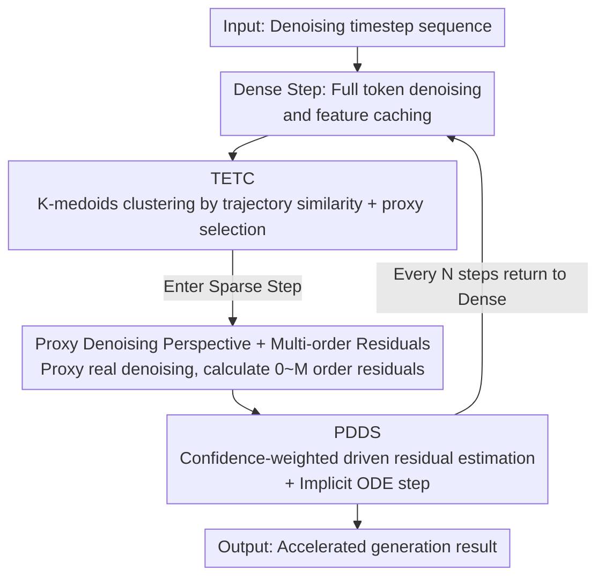

# ResCa: Residual Caching for Diffusion Transformers Acceleration

**Conference**: CVPR 2026  
**Paper**: [CVF Open Access](https://openaccess.thecvf.com/content/CVPR2026/html/Fang_ResCa_Residual_Caching_for_Diffusion_Transformers_Acceleration_CVPR_2026_paper.html)  
**Code**: None (Project page https://fanghaipeng.github.io/ResCa)  
**Area**: Diffusion Models / Inference Acceleration  
**Keywords**: Diffusion Transformer, Feature Caching, Token Reuse, Multi-order Residuals, Training-free

## TL;DR
ResCa is a training-free acceleration framework for Diffusion Transformers. It performs actual denoising on only a single "proxy token" within each trajectory cluster and uses its multi-order residuals to "simulate" the denoising direction of other tokens in the same cluster. This achieves a 5.5× GFLOPs speedup on FLUX with almost no loss in image quality.

## Background & Motivation
**Background**: Diffusion Transformers such as DiT, FLUX, and HunyuanVideo are powerful for high-quality image/video generation. However, each denoising step requires all tokens to pass through the entire network, leading to massive computational overhead during multi-step sampling. Training-free "token reduction" acceleration has become popular, primarily following two paths: caching and merging.

**Limitations of Prior Work**: The authors attribute the failure of both paths to the "destruction of denoising directions." Caching methods (ToCa, DuCa, TokenCache) directly reuse token features from the previous timestep, but due to residual skip connections, this reused direction does not actually "stay in place," resulting in a **non-updated** denoising direction. Merging methods (ToMeSD, SDTM, ToMA) combine similar tokens and use mixed features, resulting in a **non-self** denoising direction (not belonging to the token itself). Both categories cause the actual trajectory to deviate from the original full-computation trajectory, leading to quality degradation.

**Key Challenge**: Reducing computational cost requires skipping calculations for some tokens. However, "skipping" currently relies either on reusing history (outdated directions) or borrowing from neighbors (non-self directions), failing to achieve tokens that are simultaneously **self** (using one's own features as the primary direction) and **updated** (incorporating current timestep updates).

**Key Insight**: The authors made two preliminary observations. First, tokens along similar denoising paths exhibit similar residual trends (feature changes between adjacent timesteps). Therefore, tokens should be clustered based on **historical trajectories** rather than features at the final moment to group truly similar tokens. Second, after transforming residuals into multi-order differences, the **intra-cluster reusability of low-order residuals (1st/2nd order) is much higher than that of 0th-order residuals** (0th-order still encodes the token's own representation, while higher orders decouple the denoising direction). Furthermore, the availability of a specific residual order can be estimated from trajectory relationships in previous timesteps.

**Core Idea**: Only one token per trajectory cluster is selected as a "proxy" for real denoising. Its calculated multi-order residuals are used as "look-ahead corrections" to guide the "simulated denoising" of other tokens in the same cluster. In this way, other tokens retain their own features as the primary direction (**self**) while receiving the update direction for the current step (**updated**).

## Method

### Overall Architecture
ResCa partitions sampling timesteps into **dense** and **sparse** categories. In dense timesteps, all tokens pass through the network normally, features are cached, and **TETC (Temporal-Enhanced Trajectory Clustering)** is triggered to cluster tokens by trajectory similarity. In the following sequence of sparse timesteps (caching interval $N$), only one proxy token per cluster undergoes real denoising. The remaining driven tokens are handled by **PDDS (Proxy-Driven Denoising Simulation)**: proxy multi-order residuals are calculated, individual driven token residuals are estimated, and driven tokens are advanced via an **implicit ODE update**. The entire pipeline requires no weight changes or fine-tuning and can be directly integrated into DiT, FLUX, or HunyuanVideo.

### Key Designs

**1. Proxy Denoising Perspective and Multi-order Residuals: Reusing Residuals instead of Features**

This design directly addresses the issue where caching features leads to outdated directions. ResCa reuses the **residuals** (the change in features along timesteps) rather than the feature values, formalized as multi-order differences. Given a proxy token feature $p_t$, the 0th-order residual is the feature itself $\mathcal{F}^{(0)}(p_t)=p_t$, and higher orders are defined by recursive finite differences:

$$\mathcal{F}^{(m)}(p_t) = \mathcal{F}^{(m-1)}(p_t) - \mathcal{F}^{(m-1)}(p_{t+1}),\quad m \ge 1.$$

This set $\{\mathcal{F}^{(m)}(p_t)\}_{m=1}^{M}$ serves as a "multi-order derivative descriptor" of the proxy trajectory. Preliminary experiments quantified that 0th-order residuals have high intra-cluster variance (due to identity encoding), while 1st/2nd order residuals have low variance and are most suitable for cross-token reuse. Beyond the 3rd order, performance decreases slightly due to noise amplification. Thus, the 1st order is used by default to extract "proxy direction information" for other tokens without directly transferring the proxy's identity. This is the foundation for being simultaneously **self** (keeping own features) and **updated** (injecting current updates via proxy residuals).

**2. TETC (Temporal-Enhanced Trajectory Clustering): Clustering by "Path Taken" rather than "Current Appearance"**

Merging methods often cluster by feature similarity at the final moment, which misgroups tokens with diverging trajectories. TETC clusters based on the entire historical trajectory, with higher weights for more recent timesteps, in three steps: first, calculate the cosine similarity matrix between tokens at each timestep $\mathcal{S}_t = \frac{X_t X_t^\top}{\|X_t\|_2 \|X_t^\top\|_2}$; second, apply a temporal moving average to accumulate $\tilde{\mathcal{S}}_t = \alpha_{\mathcal{S}}\,\mathcal{S}_t + (1-\alpha_{\mathcal{S}})\,\tilde{\mathcal{S}}_{t+1}$, where $\alpha_{\mathcal{S}}$ controls the weight of recent steps; finally, perform **K-medoids** clustering on this accumulated similarity (centroids are constrained to be real tokens, making it suitable for high-dimensional sparse features):

$$\min_{\{C_1,\dots,C_K\}} \sum_{t=1}^{N}\sum_{k=1}^{K} \mathbb{I}(X_t\in C_k)\cdot \big(1-\tilde{\mathcal{S}}_t(X_t, C_k)\big).$$

A proxy token $p_k$ is randomly selected from each cluster $C_k$, and the rest are driven tokens $D_k=\{X_i\in C_k\mid X_i\neq p_k\}$. Experiments prove that intra-cluster residual distances for trajectory clustering are significantly smaller than for feature clustering, ensuring more reliable residual reuse.

**3. PDDS (Proxy-Driven Denoising Simulation): Confidence Weighting + Implicit ODE Advancement**

PDDS enables driven tokens to complete a denoising step without passing through the network. **① Proxy Denoising**: Each cluster runs one real network step for the proxy $p_{k,t}^l = \mathcal{F}(p_{k,t+1}^l, t+1)$ and constructs its multi-order residuals. **② Driven Residual Estimation**: A per-order confidence degree is calculated to measure directional consistency between the proxy and driven token for the $m$-th order residual:

$$\theta_t^{(m)} = \max\!\Big(0,\ \cos\big(\mathcal{F}^{(m)}(p_t),\ \mathcal{F}^{(m)}(d_t)\big)\Big),\quad \theta_t^{(m)}\in[0,1].$$

This is used to fuse the driven token's own residual with the proxy's residual at $t-1$ to estimate the driven token's next residual:

$$\hat{\mathcal{F}}^{(m)}(d_{t-1}) = (1-\theta_t^{(m)})\,\mathcal{F}^{(m)}(d_t) + \theta_t^{(m)}\,\mathcal{F}^{(m)}(p_{t-1}).$$

Here, $\mathcal{F}^{(m)}(d_t)$ is the driven token's basic direction (**self**), and $\mathcal{F}^{(m)}(p_{t-1})$ is the look-ahead correction from the proxy (**updated**). When trajectories are highly aligned ($\theta\to1$), it aligns strongly with the proxy; otherwise, it reverts to its own residual. **③ Implicit ODE Update**: Estimated residuals are treated as discrete approximations of temporal derivatives, advanced via an implicit Taylor unit step:

$$d_{t-1} = d_t + \sum_{m=1}^{M}\frac{1}{m!}\,\hat{\mathcal{F}}^{(m)}(d_{t-1}).$$

When $M{=}1$, this reduces to implicit Euler (ResCa-IE). These estimated residuals can also be plugged into standard implicit multi-step formats like BDF2 (ResCa-IB), yielding $d_{t-1} = \tfrac{4}{3}d_t - \tfrac{1}{3}d_{t+1} + \tfrac{2}{3}\hat{\mathcal{F}}^{(1)}(d_{t-1})$. Unlike "purely historical extrapolation" like TaylorSeer/FoCa, PDDS uses "on-step feedback" from real proxy denoising at every sparse step, ensuring stable and adaptive directions.

### Loss & Training
ResCa is entirely **training-free** and contains no learnable parameters. Primary hyperparameters include the caching interval $N$, cluster count $K$, residual order $O$, and ODE solver format (IE / IB / IT); by default $K{=}16$ and $O{=}1$ are used for simplicity.

## Key Experimental Results

### Main Results
On FLUX.1-dev text-to-image (DrawBench 200 prompts, Image Reward / CLIP evaluation), ResCa achieves higher quality at similar speedup ratios and maintains quality even under extreme caching intervals.

| Setup (FLUX) | FLOPs Gain | Image Reward ↑ | CLIP ↑ |
|--------------|-----------|----------------|--------|
| Original 50 steps | 1.00× | 0.9898 | 19.761 |
| ClusCa (N=5,O=1,K=16) | 4.14× | 0.9825 | 19.481 |
| **ResCa-IE (N=5,K=16)** | 4.14× | **0.9958** | **19.537** |
| ClusCa (N=6,O=1,K=16) | 4.96× | 0.9762 | 19.533 |
| **ResCa-IT (N=6,O=2,K=16)** | 4.96× | **0.9937** | 19.452 |
| TaylorSeer (N=5,O=2) | 4.16× | 0.9864 | 19.406 |
| **ResCa-IB (N=7,K=16)** | 5.51× | 0.9889 | 19.441 |

On DiT-XL/2 ImageNet 256² class-conditional generation (FID-50k as the primary metric), ResCa consistently achieves lower FID at equivalent or higher acceleration:

| Setup (DiT-XL/2) | FLOPs Gain | FID ↓ | sFID ↓ |
|------------------|-----------|-------|--------|
| DDIM-50 steps | 1.00× | 2.32 | 4.32 |
| DuCa (N=3) | 2.49× | 2.85 | 4.64 |
| **ResCa-IE (N=3,K=16)** | 2.58× | **2.37** | **4.63** |
| TaylorSeer (N=3,O=1) | 2.77× | 2.49 | 4.81 |
| **ResCa-IE (N=4,K=16)** | 3.23× | 2.49 | 4.99 |
| ClusCa (N=5,K=16) | 3.97× | 2.65 | 5.13 |
| **ResCa-IE (N=5,K=16)** | 3.96× | **2.62** | 5.08 |

On HunyuanVideo text-to-video (VBench, 946 prompts), ResCa-IE achieves a VBench score of 79.98 at 5.53× FLOPs acceleration, roughly 0.2 points higher than TaylorSeer at a similar speedup.

### Ablation Study
| Config (DiT, N=5) | FID ↓ | sFID ↓ | Description |
|------------------|-------|--------|-------------|
| ResCa-IT, O=1 | 2.62 | 5.08 | 1st-order residual only (Default) |
| ResCa-IT, O=2 | 2.57 | 4.98 | Improved to 2nd-order, best FID |
| ResCa-IT, O=3 | 2.58 | 5.02 | Performance decreases slightly |
| ResCa-IT, O=4 | 2.58 | 5.00 | Benefits saturated, FLOPs increase |

Ablation on clustering (visual comparison at $N=8$ to amplify residual reuse effect) shows that feature clustering leads to overexposure and loss of detail (due to misgrouping tokens with dissimilar residuals), whereas trajectory clustering preserves details—validating the necessity of TETC. Ablation on $K$ indicates that $K{=}16{\sim}32$ is the optimal quality/efficiency tradeoff; 16 is fixed as the default.

### Key Findings
- **Low-order residuals are the sweet spot**: Increasing order from 1 to 2 significantly improves FID, but higher orders (3/4) provide negligible gains while increasing computation, confirming the noise amplification analysis.
- **Clustering method is more critical than expected**: Replacing "clustering by final-step features" with "clustering by historical trajectories" is fundamental to preventing incorrect direction injection. Removing it leads directly to visible quality degradation.
- **Implicit ODE outperforms pure historical extrapolation**: At similar or higher speeds, ResCa’s implicit prediction consistently outperforms methods like TaylorSeer/FoCa that rely only on history. This is attributed to the non-stationary nature of diffusion dynamics, where current samples provide essential directional feedback.

## Highlights & Insights
- **Reconceptualizing "Feature Reuse" as "Residual Direction Reuse"**: The core insight is that the essence of caching problems lies in the "denoising direction"—it must be both self-relevant and updated. Using multi-order residuals as direction descriptors and proxy residuals for look-ahead correction achieves both.
- **Practical Confidence Gating $\theta_t^{(m)}$**: Using cosine similarity to adaptively decide per-order whether to "trust the proxy or trust oneself" prevents error injection and is a useful trick transferable to other caching or distillation scenarios.
- **Plug-and-play with Classic ODE Solvers**: Mapping estimated multi-order residuals directly to implicit Euler, BDF2, or Taylor formats effectively connects the "numerical ODE toolbox" to feature caching, providing a unified and scalable framework.

## Limitations & Future Work
- Introduced additional hyperparameters ($N, K, O$, ODE format) that require tuning for different models; the optimal $K$ varies by configuration.
- The proxy token is **randomly selected within the cluster** rather than explicitly choosing the most representative token. ⚠️ In clusters with high variance, a random proxy might introduce bias; this is not deeply discussed.
- Multi-order residuals and clustering involve extra computations; dense steps still require full network passes. At extreme long intervals (e.g., $N{=}8$), though quality is maintained, visible degradation remains possible.
- Evaluation focused on standard benchmarks (DrawBench/ImageNet/VBench); compatibility with complex controllable generation (e.g., ControlNet) requires further verification.

## Related Work & Insights
- **vs Caching (ToCa / DuCa / TokenCache)**: These reuse historical features, making directions non-updated; ResCa reuses low-order residuals with proxy corrections to make directions updated.
- **vs Merging (ToMeSD / SDTM / ToMA)**: These use mixed features, making directions non-self; ResCa lets each token keep its own features, ensuring directions are self-relevant.
- **vs Prediction (TaylorSeer / FoCa)**: These rely on pure historical extrapolation, which drifts when diffusion is non-stationary; ResCa uses real proxy feedback at each sparse step plus implicit ODEs for better stability.
- **vs Hybrid (SDTM / ClusCa)**: These linearly weight temporal caching and spatial similarity, but spatial terms are often underestimated; ResCa organizes spatial tokens into clusters and explicitly injects updates via proxy residuals, consistently outperforming ClusCa in main experiments.

## Rating
- Novelty: ⭐⭐⭐⭐⭐ Bringing "Proxy Denoising + Multi-order Residuals + Implicit ODE" to reframe caching directions is highly novel.
- Experimental Thoroughness: ⭐⭐⭐⭐ Solid testing across DiT/FLUX/HunyuanVideo, but lacks compatibility tests with controllable generation modules.
- Writing Quality: ⭐⭐⭐⭐ Motivation is clear with pilot experiments; formulas are complete, though notations are slightly dense.
- Value: ⭐⭐⭐⭐⭐ Training-free, plug-and-play, 5.5× near-lossless acceleration; high deployment value.

<!-- RELATED:START -->

## Related Papers

- [\[CVPR 2026\] Forecast the Principal, Stabilize the Residual: Subspace-Aware Feature Caching for Diffusion Transformers](forecast_the_principal_stabilize_the_residual_subspace-aware_feature_caching_for.md)
- [\[AAAI 2026\] ProCache: Constraint-Aware Feature Caching with Selective Computation for Diffusion Transformer Acceleration](../../AAAI2026/image_generation/procache_constraint-aware_feature_caching_with_selective_computation_for_diffusi.md)
- [\[CVPR 2026\] Just-in-Time: Training-Free Spatial Acceleration for Diffusion Transformers](just-in-time_training-free_spatial_acceleration_for_diffusion_transformers.md)
- [\[CVPR 2026\] Adaptive Spectral Feature Forecasting for Diffusion Sampling Acceleration](adaptive_spectral_feature_forecasting_for_diffusion_sampling_acceleration.md)
- [\[CVPR 2026\] TC-Padé: Trajectory-Consistent Padé Approximation for Diffusion Acceleration](tc-padé_trajectory-consistent_padé_approximation_for_diffusion_acceleration.md)

<!-- RELATED:END -->
