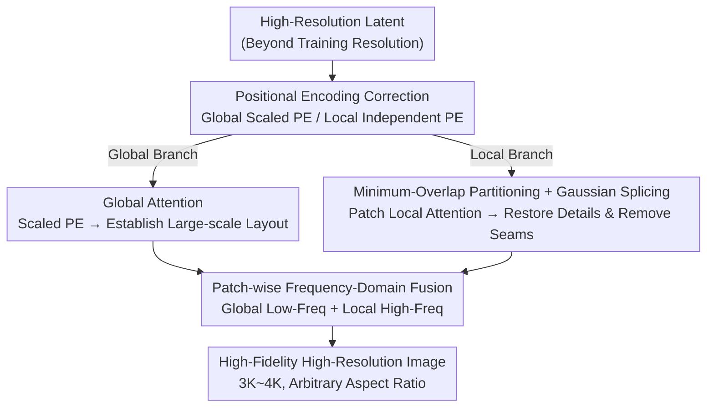

# ResDiT: Evoking the Intrinsic Resolution Scalability in Diffusion Transformers

**Conference**: CVPR 2026  
**Paper**: [CVF Open Access](https://openaccess.thecvf.com/content/CVPR2026/html/Ma_ResDiT_Evoking_the_Intrinsic_Resolution_Scalability_in_Diffusion_Transformers_CVPR_2026_paper.html)  
**Code**: None  
**Area**: Diffusion Models / Image Generation  
**Keywords**: Training-Free High-Resolution Generation, Diffusion Transformer, Positional Encoding, Local Attention, Frequency-Domain Fusion

## TL;DR
Through mechanistic analysis, ResDiT discovers that in DiT high-resolution inference, "positional encodings determine spatial layout, while attention receptive fields determine details." Based on this, the original attention is decoupled into a global branch with scaled positional encodings and a patch-level local branch, which are then fused in the frequency domain. It enables training-free, direct generation of 3K–4K high-fidelity images with FLUX/SD3 without relying on low-resolution image guidance.

## Background & Motivation
**Background**: The current generation of text-to-image models, such as FLUX and SD3, has fully transitioned to Diffusion Transformers (DiTs). They rely on global attention to model long-range dependencies and can generate high-fidelity images at training resolutions. However, they can barely operate beyond their training resolutions; pulling the inference resolution to 3K or 4K leads to severe image degradation or complete collapse.

**Limitations of Prior Work**: Direct training or fine-tuning at high resolutions requires massive high-definition datasets and compute power, which is impractical. Consequently, numerous training-free methods have been proposed, falling into two main categories, each with its own issues. One category is designed for U-Net architectures (e.g., ScaleCrafter, which uses dilated convolutions to expand receptive fields, and PBC, which uses virtual zero padding), heavily relying on convolutional structures and failing to transfer to DiTs. The other category is designed specifically for DiTs, but almost all follow a "two-stage" pipeline—generating a native-resolution image first, and then using its denoising trajectory to guide high-resolution sampling (such as I-Max, HiFlow, etc.).

**Key Challenge**: Two-stage methods essentially treat high-resolution generation as a "super-resolution task." The high-resolution image is tightly bound to the distribution of the low-resolution baseline. Although structural stability is maintained, details are often flattened (e.g., HiFlow over-smooths facial details of children, tree bark textures, and distant mountain outlines). Under this paradigm, the model relies on external guidance rather than truly unleashing its intrinsic ability to directly generate high-resolution content, which also unnecessarily increases pipeline complexity.

**Key Insight**: Instead of applying heuristic patches, the authors return to the mechanistic level and investigate exactly why DiTs fail at high resolutions. Since attention is the core mechanism governing token spatial interactions in DiTs, they conduct controlled intervention experiments on two spatial factors in attention: positional encoding (PE) and the range of the attention receptive field (as shown in Figure 2 of the paper). (a) Under base-resolution global attention with original PE, both layout and details are well-preserved. (b) When directly scaling to high resolutions, the main subjects suffer from shrinking and misalignment, causing a "layout collapse," which indicates a mismatch between the extrapolated PE and the expanded attention field. (c) Swapping in scaled PE restores the layout but yields blurry details. (d) Applying base-resolution PE to each patch establishes correct local structures, but details remain poor. (e) Further incorporating patch-level local attention yields a notable improvement in detail fidelity.

**Core Idea**: These experiments lead to a clear mechanistic conclusion: **positional encodings determine spatial layout, while the scale of the attention receptive field determines detail fidelity**. Leveraging this insight, the authors decouple attention into a "global branch for layout calibration" and a "local branch for detail restoration," and then cleanly combine the strengths of both to enable training-free, direct generation of high-resolution images.

## Method

### Overall Architecture
ResDiT does not alter model weights or rely on base-resolution images. During inference, it restructures the single original "full-resolution global attention" in each DiT block into two complementary parallel branches: The **global branch** employs scaled positional encodings for global attention to maintain the large-scale layout of the image. The **local branch** partitions the high-resolution feature maps into patches matching the training resolution, performing local attention within each patch to restore fine-grained texture. To prevent seam artifacts at patch boundaries in the local branch, the authors introduce "minimum-overlap partitioning + Gaussian weighting splicing" to ensure smooth, grid-free boundaries. Finally, "patch-wise frequency-domain fusion" merges the outputs of the two branches in the frequency domain, extracting the low frequencies from the global branch (layout structure) and the high frequencies from the local branch (details) to yield a coherent and detailed high-resolution output. A timestep scheduling scheme is also designed based on the "coarse-to-fine denoising" process: the first 10 steps use only the global branch to establish structure, the last 15 steps use only the local branch to refine details, and the intermediate steps employ frequency-domain fusion to balance both.

### Key Designs

**1. Positional Encoding Correction: Dual PE Schemes to Stabilize Layout**

Layout collapse is fundamentally caused by incorrect spatial relationship mapping when extrapolating the original PE to high resolutions. The authors address this by providing dedicated PE strategies for the two branches. The global branch employs **PE Scaling (interpolation)**: it scales the spatial indices of high-resolution feature maps proportionally back to the training resolution, keeping spatial coordinates within the "familiar" range of the pre-trained model, thereby preserving the macro-structural skeleton. For a high-resolution feature map of size $H\times W$ and a training resolution of $h\times w$, the original 2D indices $(p_h, p_w) \in \{0, \dots, H-1\} \times \{0, \dots, W-1\}$ are scaled back via:

$$(p_h,p_w)\in\Big\{\tfrac{0}{s_h},\tfrac{1}{s_h},\dots,\tfrac{H-1}{s_h}\Big\}\times\Big\{\tfrac{0}{s_w},\dots,\tfrac{W-1}{s_w}\Big\},\quad s_h=H/h,\ s_w=W/w$$

The scaled indices are then used to calculate the positional embeddings (supporting RoPE and other PE designs, since only the raw indices are manipulated). The local branch utilizes **Patch-wise Independent PE**: assigning a standalone set of PEs (bounded by the base resolution) to each patch, ensuring correct localized structure within each spatial window to enhance detail generation. Briefly speaking, the global branch leverages scaled PE to determine "how the whole image is arranged," while the local branch utilizes independent PEs to govern "how textures grow within each local region."

**2. Patch Partitioning and Splicing: Detail Enhancement without Seam Artifacts**

Forcing full-resolution attention into unseen scales blurs details. The most natural solution is constraining attention within patches matching the training resolution. However, simply carving up the features on a rigid grid leaves visible seams and blocky grid artifacts. The authors resolve this with two techniques:
**Minimum-Overlap Partitioning**: Adjacent patches are slightly overlapped to share boundary context. Along one axis of length $H$ with a patch size of $h$, we choose an integer $N > H/h$ such that the starting coordinate of the $k$-th patch is $t_k=\frac{(k-1)(H-h)}{N-1}$. This ensures that the first patch starts at 0, the last patch ends exactly at $H$, and the step size between adjacent patches is less than $h$. It guarantees full grid coverage and proper overlap with a minimal number of patches.
**Gaussian Weighting Splicing**: Instead of using naive uniform averaging for the overlapping regions, the authors apply Gaussian weights based on the distance to the patch center. For a token $p$ situated in an overlapping region, let $W(p)$ be the set of overlapping windows covering $p$. The weight for the $i$-th patch is:

$$w_i(p)=\exp\!\Big(-\frac{\lVert p-c_i\rVert_2^2}{2\sigma^2}\Big)$$

The final fused feature is:

$$f(p)=\frac{\sum_{i\in W(p)}w_i(p)f_i(p)}{\sum_{i\in W(p)}w_i(p)}$$

where $c_i$ denotes the center of the patch. Relying more on the patch whose center is closer ensures smoother transitions and effectively suppresses boundary block artifacts.

**3. Patch-wise Frequency-Domain Fusion: Harmonizing Strengths in Spectral Domain**

The global branch contributes a robust low-frequency layout structure, whereas the local branch excels at recovery of fine-grained high-frequency details. This complementarity naturally lends itself to spectral separation and recombination. Moreover, because frequency components are unevenly distributed across space (with high frequencies dominating textured/edge areas and low frequencies dominated by flat areas), doing the fusion block-by-block (patch-wise) rather than globally allows for spatially adaptive frequency filtering. Specifically, the global output $x_g$ is partitioned into $\{x_g^i\}$ using the same minimum-overlap partitioning to align with the local patch outputs. For each pair $(x_g^i, x_l^i)$, a fast Fourier transform (FFT) yields $\hat x_g^i=\mathcal F(x_g^i)$ and $\hat x_l^i=\mathcal F(x_l^i)$. They are merged in the spectral domain using a binary mask $M$ and mapped back to the spatial domain via inverse FFT:

$$x^i=\mathcal F^{-1}\big(M\odot\hat x_g^i+(1-M)\odot\hat x_l^i\big)$$

This retains the global branch's low frequencies and the local branch's high frequencies (setting the normalized frequency cutoff to 0.2), realizing clean separation and integration of layout and detailed components.

## Key Experimental Results

### Main Results
The base model is FLUX.1-dev, sampled with 35 steps and a guidance scale of 3.5 on a single RTX 4090 GPU. The evaluation dataset comprises images generated from 500 high-quality captions. KID is calculated against 2K real HD images from LAION-Aesthetics-v2 6.5+, IS measures diversity/clarity, CLIP Score assesses text-image alignment, along with patch-level KID/IS ($KID_p$, $IS_p$), and a user study with 20 participants (scored 1–5). Baseline methods include Demofusion, DiffuseHigh, I-Max, and HiFlow, all of which are two-stage methods that generate base-resolution images prior to extrapolation.

| Resolution | Method | KID↓ | KIDp↓ | IS↑ | ISp↑ | CLIP↑ | User↑ |
|--------|------|------|-------|-----|------|-------|-------|
| 3072² | Demofusion | 0.0211 | 0.0342 | 12.20 | 10.21 | 31.92 | 3.1 |
| 3072² | DiffuseHigh | 0.0195 | 0.0213 | 12.61 | 10.13 | 32.74 | 4.2 |
| 3072² | I-Max | 0.0192 | 0.0207 | 12.96 | 10.48 | 32.73 | 4.2 |
| 3072² | HiFlow | 0.0190 | 0.0194 | 12.87 | 10.67 | 32.76 | 4.6 |
| 3072² | **ResDiT** | **0.0189** | 0.0199 | 12.91 | **10.87** | **32.85** | **4.8** |
| 4096² | HiFlow | 0.0203 | 0.0245 | 11.65 | 10.12 | 32.74 | 4.3 |
| 4096² | **ResDiT** | 0.0217 | 0.0252 | 11.46 | 9.97 | 32.71 | 4.3 |

At 3072×3072, ResDiT achieves the best KID, the highest CLIP score, and the highest $IS_p$ and user preference score (4.8), all without relying on any baseline low-resolution guidance. At 4096×4096, KID/IS scores drop slightly. The authors attribute this to the fact that single-stage high-resolution generation is inherently more challenging. The outputs of two-stage methods are tightly constrained by their generated low-resolution baseline, which naturally biases benchmarks in their favor. In contrast, ResDiT directly samples from the high-resolution noise space. This yields higher and more realistic detail density, but also presents a distribution shift relative to the original model's training distribution, resulting in slightly lower KID/IS scores.

### Ablation Study
Ablations are predominantly illustrated through qualitative comparisons (Figure 6 of the paper), with quantitative results deferred to the appendix.

| Configuration | Observation | Explanation |
|------|------|------|
| Full (PES+PIPE+PSF) | Coherent structure + Sharp details | Full model |
| w/o PES | Complete structural collapse | Reverts to original PE, losing control over global layout; proves PES is foundational for high-resolution structures |
| w/o PIPE | Traceable layout but severely degraded details | Removed patch-wise independent PE; local detail fidelity collapses |
| w/o PSF | Repetitive generation artifacts + Overall blurriness | Replaced spectral fusion with spatial averaging, failing to combine complementary strengths |
| w/o MOP & GWS | Obvious boundary/grid artifacts | Partitioning without overlap; discontinuous patch boundaries |
| MOP only | Close to full performance but retains residual local artifacts | Overlap mitigates visibility of seam lines but increases the frequency of artifacts, harming details |

### Key Findings
- **The Three Pillars are Complementary and Mandatory**: PES handles the global structure (removing it causes collapse), PIPE secures local details (removing it degrades textures), and PSF harmoniously merges them in the frequency domain without degradation (removing it leads to duplication artifacts and blurriness).
- **Overlap Partitioning Needs Splicing**: While utilizing MOP alone approaches the full effect, it must be paired with Gaussian weighting splicing (GWS) to fully eradicate boundary artifacts without degrading details.
- **The Trade-off of Single-Stage Generation is Distribution Shift**: ResDiT's slightly lower KID/IS compared to two-stage methods at 4K is a reasonable trade-off of "direct sampling in high-resolution space" for authentic details and diversity. It is not an inherent algorithmic flaw, as evidenced by competitive CLIP and user study scores.
- **Downstream Compatibility**: It seamlessly integrates with ControlNet (e.g., using depth or HED maps) for structure-controlled 3072² generation, and natively supports arbitrary aspect ratios (e.g., 2048×4096, 4096×2048).

## Highlights & Insights
- **Mechanistic Analysis Before System Design**: The controlled interventions in Figure 2 firmly establish the decoupled conclusion that "PE controls layout, and attention receptive fields control details." Every subsequent module is a direct logical extension of this insight, making the solution feel principled and theoretically grounded rather than a collection of ad-hoc tricks.
- **Elegant Division in Frequency Domain**: Decomposing images into low frequencies (layout) and high frequencies (details) is natural. Fusing them block-by-block using FFT and a binary mask is significantly cleaner than spatial-domain summation and allows for spatially adaptive frequency filtering.
- **True Training-Free Direct Generation with No Low-Resolution Guidance**: Stepping out of the two-stage "high-res equals super-resolution" paradigm and directly sampling in the high-resolution noise space is the most fundamental difference from current SOTAs. This also explains its trade-off between academic benchmarks and visual detail fidelity.
- **Transferable Timestep Scheduling**: Establishing structure globally early on, refining details locally toward the end, and fusing both in the middle offers a robust "coarse-to-fine phased attention switching" scheduling paradigm. This pipeline is highly transferable to other diffusion inference tasks involving multiscale transitions.

## Limitations & Future Work
- **Slightly Lower Benchmarks at 4K**: Single-stage direct sampling incurs a distribution shift, causing KID/IS metrics at 4096² to trail behind two-stage baselines. The authors acknowledge this design trade-off. To align distributions better, lightweight distribution alignment techniques might be needed instead of resorting to low-resolution guidance.
- **Reliance on Manual Hyperparameters**: Parameters like the 0.2 frequency cutoff, timestep allocation (10/15/middle), patch count $N$, and Gaussian $\sigma$ are empirically set. Their stability across different base models and resolutions, and whether they can be adaptively tuned, has not been fully explored.
- **Subjective Evaluation**: Core evidence heavily relies on qualitative images and user studies. Since quantitative ablations are relegated to the appendix, it is difficult to rigidly quantify the exact performance gain contributed by each individual module.
- **Computational Overhead**: Parallel dual branches and patch-wise FFT fusion inevitably incur higher inference costs compared to a single global attention pass. The main paper indicates that latency comparisons are in the appendix but stops short of detailing quantitative overhead in the main body.

## Related Work & Insights
- **vs. HiFlow / I-Max (Two-Stage DiT Training-Free Methods)**: These generate a baseline image first and use its trajectory to guide high-resolution sampling, essentially treating high-resolution generation as super-resolution. This restricts the outputs to the low-resolution distribution and blurs textures. In contrast, ResDiT eliminates low-resolution guidance and directly samples from the high-resolution space, relying on scaled PE for layout and local attention for details; this yields more realistic textures despite a slight drop in KID/IS at extremely high resolutions due to distribution shift.
- **vs. ScaleCrafter / PBC (U-Net Training-Free Methods)**: These rely on dilated convolutions or virtual zero-padding to expand or correct convolutional receptive fields. They are tightly bound to the U-Net architecture and cannot be transferred to DiTs. ResDiT directly modifies the attention mechanisms and positional encodings in Transformers.
- **vs. Direct High-Resolution Training/Fine-Tuning**: The latter demands massive high-definition datasets and heavy compute power, whereas ResDiT is a training-free plug-and-play strategy for off-the-shelf FLUX/SD3 models.

## Rating
- Novelty: ⭐⭐⭐⭐⭐ Decouples "PE controls layout, and attention receptive fields control details" via rigorous mechanism analysis. Based on this, it restructures attention into a dual-branch framework with spectral-domain fusion, deviating from the conventional two-stage super-resolution paradigm.
- Experimental Thoroughness: ⭐⭐⭐⭐ Compares against 4 SOTAs, includes patch-level metrics and user studies, and ablates all modules. However, quantitative ablations and latency overhead are relegated to the appendix, and 4K performance benchmarks are slightly weak.
- Writing Quality: ⭐⭐⭐⭐⭐ Strong logical coherence from controlled experiments to methodological formulation. The mechanistic narrative provides solid theoretical justification for each design component.
- Value: ⭐⭐⭐⭐ Enables training-free direct generation of 3K–4K images, is compatible with ControlNet, and supports arbitrary aspect ratios, showing strong practical utility for high-resolution DiT generation.

<!-- RELATED:START -->

## Related Papers

- [\[CVPR 2026\] Training-free Mixed-Resolution Latent Upsampling for Spatially Accelerated Diffusion Transformers](training-free_mixed-resolution_latent_upsampling_for_spatially_accelerated_diffu.md)
- [\[CVPR 2026\] Region-Adaptive Sampling for Diffusion Transformers](region-adaptive_sampling_for_diffusion_transformers.md)
- [\[CVPR 2026\] Intrinsic Concept Extraction Based on Compositional Interpretability](intrinsic_concept_extraction_based_on_compositional_interpretability.md)
- [\[CVPR 2026\] SpotEdit: Selective Region Editing in Diffusion Transformers](spotedit_selective_region_editing_in_diffusion_transformers.md)
- [\[CVPR 2026\] ResCa: Residual Caching for Diffusion Transformers Acceleration](resca_residual_caching_for_diffusion_transformers_acceleration.md)

<!-- RELATED:END -->
