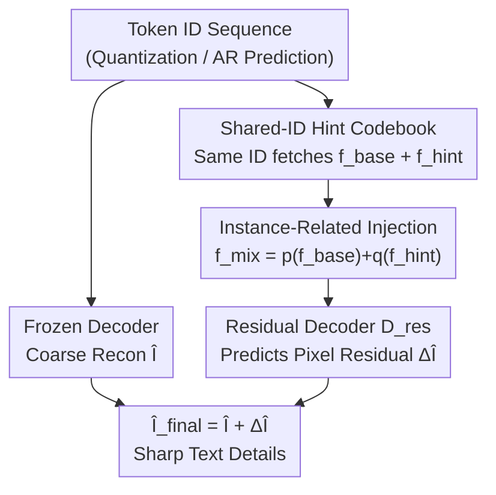

# Residual Decoder Adapter: ID-Preserving Tokenizer Adaption for Autoregressive Text Rendering

**Conference**: CVPR 2026  
**arXiv**: [2606.01911](https://arxiv.org/abs/2606.01911)  
**Code**: https://github.com/CSU-JPG/RDA (Available)  
**Area**: Image Generation / Autoregressive Visual Generation  
**Keywords**: Visual tokenizer, Autoregressive image generation, Text rendering, Residual decoding, Plug-and-play

## TL;DR
To address the issues of blurred strokes and distorted glyphs in autoregressive (AR) image generation during text rendering, this paper identifies the root cause as the insufficient reconstruction capability of the visual tokenizer. It proposes the **Residual Decoder Adapter (RDA)**: freezing the original tokenizer and AR model, while attaching a Shared-ID Hint codebook and a pixel-level residual decoding branch. This restores text reconstruction quality without changing the token space or retraining any models—boosting Janus-Pro 1B's OCR accuracy from 24.52% to 58.26%.

## Background & Motivation
**Background**: Autoregressive visual models (Janus-Pro, TAR, Lumina-mGPT, etc.) model image generation as a next-token prediction task on discrete visual tokens, which are then decoded back to pixels by the visual tokenizer (VQ-VAE decoder). They rival diffusion models on general text-to-image benchmarks like GenEval (0.80 vs 0.82).

**Limitations of Prior Work**: When required to **render clear text**, AR models significantly lag behind diffusion models, showing fuzzy strokes and deformed letters. Text rendering is recognized as the most rigorous test of "fine-grained generation capability," where AR models collectively fail.

**Key Challenge**: The authors trace the problem to the **reconstruction capability of the tokenizer**, rather than the token prediction itself. VQ quantization inherently loses high-frequency/local textures ($Fig.1b$: Janus-Pro's VQ-VAE rFID 9.63 on ImageNet, weaker than FLUX's continuous VAE 7.92). Since AR models only communicate via discrete tokens, details lost during quantization cannot be recovered—the tokenizer defines the "visual language" of the AR model, setting a ceiling for text rendering.

**Goal**: Can the text rendering of AR models be improved **without retraining the tokenizer or the AR model**? Replacing the tokenizer would change the token ID distribution, invalidating previously trained AR models and requiring thousands of GPU hours to retrain billion-parameter systems.

**Key Insight**: **Reconstruction quality improvement can be decoupled from token distribution**. Instead of reworking the "input side" (encoder, codebook index) of the tokenizer, work only on the "output side" (decoded pixels). Keep the original codebook ID mapping unchanged and learn a compensation module to correct pixels.

**Core Idea**: Re-interpreting the tokenizer as an "extensible interface"—attaching a **Shared-ID Hint codebook + residual decoder** to learn the "pixel difference (residual) between ground truth and reconstruction," providing a non-intrusive enhancement for plug-and-play use in downstream AR models.

## Method

### Overall Architecture
RDA is a plug-and-play refinement framework: **freeze** the original visual tokenizer (encoder, quantizer, original decoder) and the AR model, training only two lightweight components to compensate for lost text details as residuals.

The pipeline: Given an image (training) or a token sequence (inference), first use the **frozen decoder $\mathcal{D}$** to get a coarse reconstruction $\hat{I}$. Simultaneously, each token ID is used to fetch a base feature $f_{\text{base}}$ from the **frozen codebook $Z$** and a high-frequency hint feature $f_{\text{hint}}$ from the trainable **Hint codebook $Z'$** (Shared-ID mechanism). Features are fused into $f_{\text{mix}}$ and fed to a parallel **residual decoder $\mathcal{D}_{\text{res}}$** to predict pixel-level residuals $\Delta\hat{I}$. Final output is $\hat{I}_{\text{final}} = \hat{I} + \Delta\hat{I}$.

### Key Designs

**1. Shared-ID Hint Codebook: A complementary high-frequency dictionary**
VQ quantization loses high-frequency textures. The authors create a **trainable Hint codebook $Z' = \{z'_k\}_{k=1}^{K}$** that **shares indices** with the frozen codebook $Z = \{z_k\}_{k=1}^{K}$. For any token id $i$, $f_{\text{base}}(i) = z_i$ and $f_{\text{hint}}(i) = z'_i$ are fetched. This Shared-ID design is key: since indices are shared, $Z'$ complements $Z$ without changing the discrete distribution or semantic clusters, allowing pre-trained AR models to benefit without retraining.

**2. Residual Decoder + Instance-Related Feature Injection**
Details are defined as fine-grained differences $\Delta I = I - \hat{I}$. 
First, **Instance-Related Feature Injection**: Fusion $f_{\text{mix}} = p(f_{\text{base}}) + q(f_{\text{hint}})$ where $p(\cdot)$ is the original projector and $q(\cdot)$ is trained from scratch. Hint features are instance-invariant (same ID always fetches same vector); without injecting $f_{\text{base}}$, the residual decoder lacks instance-specific info, leading to failure.
Second, **Pixel-level Residual Learning**: $\mathcal{D}_{\text{res}}$ predicts $\Delta\hat{I}$. It reuses the VQ-VAE decoder structure but doubles the channels in the last two layers to capture high frequencies.

**3. Multi-Loss Supervision for Sparse Residuals**
Residual signals for text are sparse and can be overwhelmed by background. The **residual-aware loss $\mathcal{L}_{\text{perc}}^{\text{res}}$** is critical: it applies VGG perceptual supervision directly to $\Delta\hat{I}$, forcing the model to focus on structural details rather than pixel-wise means.

### Loss & Training
Total loss consists of five terms:

$$\mathcal{L}_{\text{total}} = \mathcal{L}_{\text{rec}} + \mathcal{L}_{\text{perc}}^{\text{final}} + \mathcal{L}_{\text{perc}}^{\text{res}} + \mathcal{L}_{\text{sobel}} + \mathcal{L}_{\text{freq}}$$

- **Reconstruction Loss $\mathcal{L}_{\text{rec}}$**: MAE on residual, MSE on final recon.
- **Final Perceptual Loss $\mathcal{L}_{\text{perc}}^{\text{final}}$**: VGG supervision on the final image.
- **Residual Perceptual Loss $\mathcal{L}_{\text{perc}}^{\text{res}}$**: VGG supervision directly on $\Delta\hat{I}$.
- **Sobel Edge Loss $\mathcal{L}_{\text{sobel}}$**: Uses Sobel masks to emphasize gradients.
- **Frequency Loss $\mathcal{L}_{\text{freq}}$**: Spectral domain high-pass supervision using FFT.

Details: Based on LlamaGen-VQ and Chameleon-VQ, training RDA while freezing the base. 120k steps at 256x256, batch 512, 64x V100, AdamW, LR 1e-4. Data: Mario-10M.

## Key Experimental Results

### Main Results

**General AR Models (Plug-and-play, no fine-tuning)** (Acc. wo/w RDA):

| Model | Res | AnyText Acc.↑ | Mario-Eval Acc.↑ | LongTextBench Acc.↑ | CVTG-2K NED.↑ |
|------|-----|------|------|------|------|
| Janus-Pro 7B | 384 | 8.85/**10.07** | 6.75/**8.33** | 0.47/**0.96** | 20.14/**22.59** |
| TAR 7B | 512 | 30.92/**32.43** | 25.46/**27.89** | 6.92/**7.22** | 47.63/**52.00** |

**Text-Specific AR Models (Post text-finetuning)** (Massive Gain):

| Model | Res | Subset | Acc. wo/w | F1 wo/w | CER wo/w↓ |
|------|-----|------|------|------|------|
| Janus-Pro* 1B | 1024 | StyledTextVisionBlend | 24.52/**58.26** | 29.85/**63.18** | 0.47/**0.23** |
| Lumina-mGPT* 7B | 1024 | StyledTextSynth | 34.33/**48.96** | 37.91/**53.43** | 0.42/**0.32** |

General models gain ~1.2 points, while text-tuned models gain +33.74 points. **Key Finding**: General AR models have a "dual bottleneck" (weak token prediction + low recon fidelity). Fine-tuning fixed the former, making the tokenizer the primary bottleneck; RDA then resolves this bottleneck to realize clear text.

### Ablation Study

**Loss Ablation**:

| Config | Acc.↑ | F1.↑ | Description |
|------|------|------|------|
| Baseline | 58.04 | 64.55 | No RDA |
| Full (ours) | **66.48** | **70.95** | Complete |
| w/o $\mathcal{L}_{\text{perc}}^{\text{res}}$ | 58.30 | 64.84 | Failed; back to baseline |

**Injection Ablation**:

| Config | Acc.↑ | Description |
|------|------|------|
| No Injection (only $f_{\text{hint}}$) | 58.04 | Lacks instance info; worse than baseline |
| Add (ours) | 66.48 | Simple addition is effective |

### Key Findings
- **$\mathcal{L}_{\text{perc}}^{\text{res}}$ is the core**: Without structural supervision specifically on sparse residuals, training fails.
- **Instance-Related Injection is essential**: Hint features are static for a given ID; the decoder needs base features to adapt to specific images.
- **Strong Generalization**: Trained at 256px, it generalizes to 1024px without fine-tuning.
- **High Efficiency**: Achieving significant gains with only 5M images vs. 1.28B for UniTok.

## Highlights & Insights
- **Decoupling Recon from Distribution**: Shifting improvement from "input side" (changing codebooks) to "output side" (correcting pixels) allows AR models to stay agnostic while gaining fidelity.
- **Diagnostic Contribution**: The comparison between general and text-tuned AR models validates the "dual bottleneck" hypothesis.
- **Economic Value**: Bypassing the "new tokenizer = retrain everything" trap is highly practical for large-scale systems.

## Limitations & Future Work
- **Pixels vs. Semantics**: RDA fixes blurred pixels, not incorrect token sequences (semantic errors).
- **OOD Risk**: Potential performance drops on natural images when trained exclusively on text-heavy datasets.
- **Ceiling**: While better than original VAEs, it might still lag behind massive retraining efforts like UniTok.

## Related Work & Insights
- **vs. Retraining (UniTok)**: UniTok is stronger but requires retraining downstream AR models. RDA is data-efficient and training-free for downstream.
- **Inspiration**: This "non-intrusive upgrade of frozen interfaces" could apply to any multi-modal system constrained by fixed discrete token spaces.

## Rating
- Novelty: ⭐⭐⭐⭐⭐ Decoupling recon from distribution via Shared-ID is a clever solution.
- Experimental Thoroughness: ⭐⭐⭐⭐⭐ Comprehensive coverage across multiple AR models and resolutions.
- Writing Quality: ⭐⭐⭐⭐ Clear motivation, though minor typos in tables.
- Value: ⭐⭐⭐⭐⭐ Extremely practical for immediate integration into VQ-based AR models.

<!-- RELATED:START -->

## Related Papers

- [\[ICLR 2026\] Towards Sequence Modeling Alignment Between Tokenizer and Autoregressive Model](../../ICLR2026/image_generation/towards_sequence_modeling_alignment_between_tokenizer_and_autoregressive_model.md)
- [\[ICML 2026\] End-to-End Autoregressive Image Generation with 1D Semantic Tokenizer](../../ICML2026/image_generation/end-to-end_autoregressive_image_generation_with_1d_semantic_tokenizer.md)
- [\[CVPR 2026\] TextPecker: Rewarding Structural Anomaly Quantification for Enhancing Visual Text Rendering](textpecker_rewarding_structural_anomaly_quantification_for_enhancing_visual_text.md)
- [\[CVPR 2026\] GlyphPrinter: Region-Grouped Direct Preference Optimization for Glyph-Accurate Visual Text Rendering](glyphprinter_region-grouped_direct_preference_optimization_for_glyph-accurate_vi.md)
- [\[CVPR 2026\] IntroSVG: Learning from Rendering Feedback for Text-to-SVG Generation via an Introspective Generator-Critic Framework](introsvg_learning_from_rendering_feedback_for_text-to-svg_generation_via_an_intr.md)

<!-- RELATED:END -->

## Related Papers

- [\[ICML 2026\] End-to-End Autoregressive Image Generation with 1D Semantic Tokenizer](../../ICML2026/image_generation/end-to-end_autoregressive_image_generation_with_1d_semantic_tokenizer.md)
- [\[CVPR 2026\] TextPecker: Rewarding Structural Anomaly Quantification for Enhancing Visual Text Rendering](textpecker_rewarding_structural_anomaly_quantification_for_enhancing_visual_text.md)
- [\[ICCV 2025\] Holistic Tokenizer for Autoregressive Image Generation](../../ICCV2025/image_generation/holistic_tokenizer_for_autoregressive_image_generation.md)
- [\[CVPR 2026\] ResCa: Residual Caching for Diffusion Transformers Acceleration](resca_residual_caching_for_diffusion_transformers_acceleration.md)
- [\[CVPR 2026\] GlyphPrinter: Region-Grouped Direct Preference Optimization for Glyph-Accurate Visual Text Rendering](glyphprinter_region-grouped_direct_preference_optimization_for_glyph-accurate_vi.md)

<!-- RELATED:END -->
