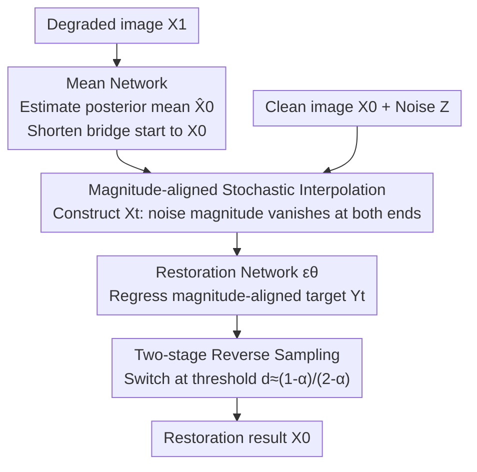

# Resolving Endpoint Underfitting in Diffusion Bridges via Noise Alignment

**Conference**: CVPR 2026  
**Paper**: [CVF Open Access](https://openaccess.thecvf.com/content/CVPR2026/html/Gao_Resolving_Endpoint_Underfitting_in_Diffusion_Bridges_via_Noise_Alignment_CVPR_2026_paper.html)  
**Code**: https://github.com/gyr02/NADB  
**Area**: Diffusion Models / Image Generation  
**Keywords**: Diffusion bridge, endpoint underfitting, noise alignment, stochastic interpolation, image restoration

## TL;DR
The authors discover that diffusion bridge models, exemplified by I2SB, undergo "endpoint underfitting"—variance collapse and directional misalignment—when approaching the target endpoint ($t\to0$). The root cause is the conflicting noise magnitude trends between the network input and the regression target. They propose NADB, which utilizes "magnitude-aligned stochastic interpolation" to correct variance and a mean network to align endpoints to fix direction, consistently outperforming I2SB across multiple ImageNet restoration and translation tasks.

## Background & Motivation
**Background**: Image restoration (deblurring, JPEG de-artifacting, super-resolution) has recently been dominated by generative models. Standard conditional diffusion maps low-quality images to pure Gaussian noise and reconstructs them, which follows a "detoured" path. Diffusion bridges learn a stochastic trajectory directly between the "degraded distribution" and the "clean distribution," which naturally fits restoration tasks; I2SB is a pioneering work in this area.

**Limitations of Prior Work**: The approach in I2SB "copies" standard diffusion—learning a score function and training with the same regression target. By plotting the network output over the entire timeline, the authors found severe underfitting near the **target endpoint** ($t\to0$), characterized by a sharp collapse in predicted variance and a drop in predicted direction (cosine similarity with the ground truth). This occurs during the final phase where high-frequency details are most needed, effectively capping the restoration quality.

**Key Challenge**: The root cause is the **inconsistency in noise scheduling trends between input and target**. Examining the interpolation path of I2SB (Eq. 2): the noise coefficient of the network input $X_t$ approaches 0 as $t\to0$, making the input nearly the deterministic clean image $X_0$. However, the noise coefficient of the training target $\frac{X_t-X_0}{\sigma_t}$ (Eq. 3, expanded as Eq. 4) approaches 1, making the target nearly pure noise $Z$. Consequently, the network is forced to "predict random noise from a deterministic clean input"—a learning task that is ill-conditioned.

**Goal**: Deconstruct endpoint underfitting into two solvable sub-problems—**magnitude failure** (variance mismatch) and **directional failure** (alignment mismatch)—and resolve them respectively.

**Core Idea**: Instead of mimicking score-matching, the mapping is redesigned from the flexible perspective of Stochastic Interpolants. This aligns the noise magnitudes of input and target to the same scale and utilizes a mean network to pull the two ends of the bridge closer together.

## Method

### Overall Architecture
The input to NADB is the degraded image $X_1$, and the output is the restored clean image $X_0$. The pipeline modifies I2SB in two places. First, at the "starting point" of the bridge: a frozen **mean network** is used to preprocess the degraded image $X_1$ into its posterior mean estimate $\hat{X}_0=\mathbb{E}[X_0\mid X_1]$, which replaces $X_1$ as the proxy endpoint—this end is much closer to the target $X_0$ than $X_1$ was. Second, in the "shape" of the bridge: a **magnitude-aligned stochastic interpolation** redefines the trajectory $X_t$ and the regression target between $X_0$ and $\hat{X}_0$, ensuring that noise magnitudes for both input and target vanish at $t=0$ and $t=1$. The restoration network $\epsilon(X_t,t;\theta)$ is trained on this new interpolation; during inference, reverse sampling is performed, switching to an endpoint-conditioned two-stage process near the final endpoint.

### Key Designs

**1. Mean Network: Shifting the bridge start from "degraded image" to "posterior mean" to fix directional failure**

Magnitude alignment (Design 2) can recover variance, but the regression target always retains a deterministic displacement term $(X_1-X_0)$. When the distribution gap between $X_1$ and $X_0$ is large, this term is difficult to regress accurately, causing directional errors. The authors introduce a mean network $M(\cdot;\phi)$, trained separately to approximate the posterior mean $\mathbb{E}[X_0\mid X_1]$:

$$\mathcal{L}_{\text{MSE}}(\phi)=\mathbb{E}_{(X_0,X_1)}\big[\|M(X_1;\phi)-X_0\|^2\big]$$

The output is denoted as $\hat{X}_0=M(X_1;\phi)$. This provides two benefits: first, it simplifies the displacement to be regressed from the complex $(X_1-X_0)$ to the shorter $(\hat{X}_0-X_0)$, directly mitigating directional error; second, the distribution $\hat\rho_0$ formed by $\hat{X}_0$ is closer to the target $\rho_0$ than the original $\rho_1$—Theorem 2 provides a guarantee in the Wasserstein-2 sense: $W_2(\rho_0,\hat\rho_0)\le W_2(\rho_0,\rho_1)$. Building a bridge between closer distributions leads to more stable fitting. Although $\hat{X}_0$ may be over-smoothed, it is only an endpoint and not the final output; the subsequent restoration network will recover the details. $M$ is pre-trained to MSE convergence for each task and then frozen, with its time step constant at 0.

**2. Magnitude-aligned Stochastic Interpolation: Synchronizing input and target noise to cure variance collapse**

I2SB suffers because the input noise coefficient tends to 0 while the target coefficient tends to 1. The authors redesign the interpolation path and training target so their noise magnitudes are "coupled" and vanish at both endpoints. Defining the magnitude-aligned interpolation (using $\hat{X}_0$ as the endpoint):

$$X_t := (1-t^\alpha)X_0 + t^\alpha \hat{X}_0 + kt(1-t)Z$$

The corresponding training target is the "scaled displacement":

$$Y_t := \frac{X_t-X_0}{t^\alpha} = (\hat{X}_0-X_0) + kt^{1-\alpha}(1-t)Z$$

where $\alpha\in(0,1)$, $k$ is a finite constant, and $Z\sim\mathcal{N}(0,I)$. Thus, the noise coefficient of input $X_t$, $\gamma_X(t)=kt(1-t)$, and the noise coefficient of target $Y_t$, $\gamma_Y(t)=kt^{1-\alpha}(1-t)$, **simultaneously vanish** at $t=0$ and $t=1$ (Proposition 1), remaining at the same order of magnitude throughout the interval—the "magnitude alignment" missing in I2SB. The restoration network is trained with:

$$\mathcal{L}_{\text{NADB}}=\mathbb{E}_{t,X_0,X_1,Z}\Big[\big\|\epsilon(X_t,t;\theta)-\tfrac{X_t-X_0}{t^\alpha}\big\|^2\Big]$$

This is complementary to the mean network: ablation shows that magnitude alignment alone fixes variance but the direction still collapses; the mean network alone fails to save either variance or direction—both are indispensable.

### Loss & Training
Both networks use the same U-Net architecture (initialized with ADM checkpoints pre-trained on ImageNet 256×256). The mean network $M_\phi$ is first trained to convergence for each task and frozen, followed by training the restoration network $\epsilon_\theta$ using $\mathcal{L}_{\text{NADB}}$ (Algorithm 1). Hyperparameters are $\alpha=0.4$, $k=0.75$, Adam optimizer, learning rate $1\times10^{-4}$, batch size 256, 8×A100. Inference (Algorithm 2) first calculates $\hat{X}_0$ once, then switches the reverse sampling at the time threshold $d\approx\frac{1-\alpha}{2-\alpha}$: standard transitions are used for $t\ge d$, and endpoint-conditioned transitions are used for $t<d$ to ensure non-negative variance terms near $t\to0$.

## Key Experimental Results

### Main Results
Head-to-head comparison with I2SB on three ImageNet 256×256 restoration tasks (identical training budget) at NFE=10 and 100. NADB dominates in perceptual metrics (FID/LPIPS) and fidelity metrics, with particularly large gains in deblurring:

| Task (NFE=10) | Metric | I2SB | NADB |
|------|------|------|------|
| JPEG QF5 | FID↓ / LPIPS↓ | 8.0 / 0.30 | 6.9 / 0.30 |
| 4× Super-res (Pool) | FID↓ / LPIPS↓ | 7.3 / 0.27 | 5.3 / 0.23 |
| Deblur (Uniform) | FID↓ / PSNR↑ / LPIPS↓ | 10.3 / 24.19 / 0.32 | 4.8 / 27.70 / 0.18 |
| Deblur (Gaussian) | FID↓ / PSNR↑ / SSIM↑ | 7.4 / 25.42 / 0.71 | 4.2 / 30.03 / 0.87 |

Comparison with mainstream conditional diffusion models (NFE=100, FID as primary metric):

| Task | Best Baseline | NADB FID↓ |
|------|---------------|-----------|
| JPEG QF5 | Palette 8.3 | 4.3 |
| 4× Super-res (Pool) | DDNM/ΠGDM 3.8 | 1.1 |
| Deblur (Uniform) | DDNM 3.0 | 3.4 ⚠️ Slightly lower |

In image-to-image translation (64×64, edges→handbags / edges→shoes), NADB also outperforms I2SB and the strong baseline DDBM, with more stable quality at low NFE (where DDBM degrades significantly):

| Task | DDBM | I2SB | NADB |
|------|------|------|------|
| Edges→Handbags FID↓ | 114.3 | 116.0 | 111.3 |
| Edges→Shoes FID↓ | 120.1 | 119.5 | 117.8 |

### Ablation Study
Comparison of four configurations on JPEG-5, where heavy degradation amplifies endpoint failures (NFE=10):

| Config | FID↓ | PSNR↑ | Note |
|------|------|-------|------|
| I2SB | 8.0 | 24.50 | Original baseline, both variance and direction collapse |
| I2SB w. Mean | 8.8 | 24.51 | Mean network only, underfitting unresolved |
| NADB w/o Mean | 7.0 | 24.36 | Magnitude alignment only, variance fixed but direction still collapses |
| NADB (Full) | 6.9 | 24.45 | Both components required for a complete solution |

### Key Findings
- **Clear division of labor between components**: The mean network fixes "direction" (cosine similarity), while the magnitude-aligned interpolation fixes "variance" (magnitude). Neither is sufficient alone—adding only the mean network even slightly increased FID to 8.8, indicating that preprocessing endpoints is useless if the underlying mapping remains ill-conditioned.
- **The endpoint is the decider**: Gains are concentrated in the final refinement stage $t\to0$. This explains why deblurring (PSNR jump from ~24 to ~30) sees the most significant improvement—heavy degradation tasks are most sensitive to endpoint fitting.
- **Robust at low NFE**: NADB maintains quality in translation tasks even as NFE decreases, whereas DDBM degrades significantly, suggesting that noise alignment makes the sampling trajectory "easier to follow."

## Highlights & Insights
- **Diagnosis of "endpoint underfitting" as noise trend contradiction**: Instead of vaguely stating that "diffusion bridges are hard to train," the authors contrast the noise coefficient curves of input and target, pinpointing that one approaching 0 while the other approaches 1 at $t \to 0$ is the root cause. This diagnosis is highly persuasive and cleanly splits the problem into two tackleable axes: "magnitude + direction."
- **"Magnitude alignment" as a transferable design principle**: Requiring noise coefficients of network input and regression target to vanish simultaneously at the endpoints (both $\gamma_X, \gamma_Y$ containing the $t(1-t)$ factor) is a constraint applicable to any "bridge/interpolant" generative framework beyond restoration.
- **Mean network = shortening the bridge with a cheap deterministic predictor**: Regressing the posterior mean first to pull endpoints closer and then letting the diffusion bridge fill in details is a "coarse-to-fine relay" strategy transferable to other paired generation/translation tasks.

## Limitations & Future Work
- **Additional training/storage cost**: The mean network must be trained and frozen for each task, resulting in a "Dual U-Net" setup heavier than a single-network I2SB.
- **Endpoint sampling requires piecewise tricks**: The reverse process must switch at threshold $d$ to ensure non-negative variance; $d$ is coupled with $\alpha$, and the universality of hyperparameters ($\alpha=0.4, k=0.75$) lacks exhaustive discussion.
- **Not leading in all tasks**: FID for the Uniform deblurring kernel (3.4) is slightly behind DDNM (3.0), showing that conditional diffusion still holds an advantage under certain kernels/degradations.
- ⚠️ Reverse sampling derivations and Theorem 2 proofs are in the supplementary material; the main text only provides conclusions. Implementation details should be verified against the code.

## Related Work & Insights
- **vs I2SB**: I2SB adopts the standard score-matching target, causing noise trend contradictions and underfitting at endpoints. NADB redesigns the mapping via stochastic interpolation (magnitude alignment) and uses a mean network to close the endpoint gap. The core value lies in "coupling the training target with the interpolation path."
- **vs Conditional Diffusion (DDRM/DDNM/ΠGDM/Palette)**: These map low-quality images to pure noise and reconstruct them, following longer paths and often suffering from the perception-distortion trade-off (blurrier outputs). Diffusion bridges establish trajectories directly between degraded and clean manifolds, where NADB generally achieves better FID.
- **vs Other Diffusion Bridges (DDBM/I3SB/RDBM/GOUB)**: Most follow standard diffusion improvements (h-transforms, accelerated sampling, etc.). NADB reconstructs the bridge from the Perspective of Stochastic Interpolants, targeting the overlooked structural defect of endpoint failure.

## Rating
- Novelty: ⭐⭐⭐⭐ Diagnoses "endpoint underfitting" as noise trend contradiction and provides specific remedies (magnitude alignment + mean network) with a clean perspective.
- Experimental Thoroughness: ⭐⭐⭐⭐ Covers three restoration categories + image translation, multiple NFEs, and provides clear ablation of component roles; slightly lags in specific kernels.
- Writing Quality: ⭐⭐⭐⭐ Logical loop from problem to diagnosis to solution; clear formulas; sampling/proofs moved to supplement slightly affects self-consistency.
- Value: ⭐⭐⭐⭐ The "magnitude alignment" principle is transferable to generalized bridge generation, holding methodological significance for the diffusion bridge community.

<!-- RELATED:START -->

## Related Papers

- [\[CVPR 2026\] Resolving the Identity Crisis in Text-to-Image Generation](resolving_the_identity_crisis_in_text-to-image_generation.md)
- [\[CVPR 2026\] Elucidating the Design Space of Arbitrary-Noise-Based Diffusion Models](eda_arbitrary_noise_diffusion_design_space.md)
- [\[ICML 2026\] Restoring Initial Noise Sensitivity in Text-to-Image Distillation via Geometric Alignment](../../ICML2026/image_generation/restoring_initial_noise_sensitivity_in_text-to-image_distillation_via_geometric_.md)
- [\[CVPR 2026\] Beyond the Golden Data: Resolving the Motion-Vision Quality Dilemma via Timestep Selective Training](beyond_the_golden_data_resolving_the_motion-vision_quality_dilemma_via_timestep_.md)
- [\[CVPR 2026\] Correspondence-Attention Alignment for Multi-View Diffusion Models](correspondence-attention_alignment_for_multi-view_diffusion_models.md)

<!-- RELATED:END -->
