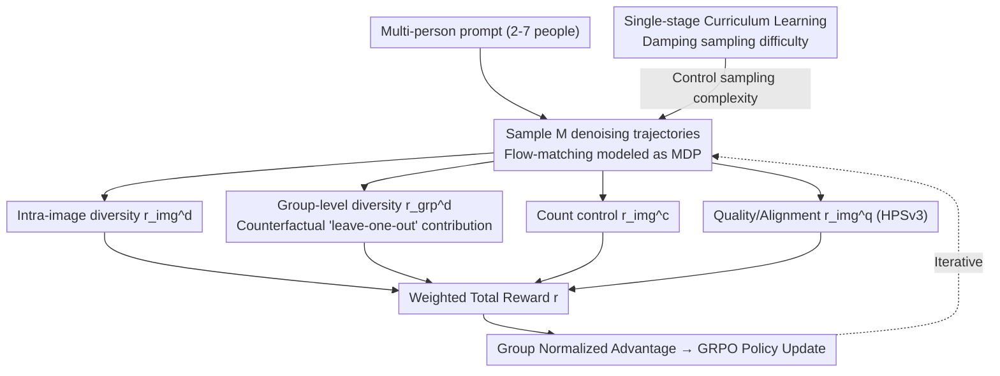

# Resolving the Identity Crisis in Text-to-Image Generation

**Conference**: CVPR 2026  
**arXiv**: [2510.01399](https://arxiv.org/abs/2510.01399)  
**Code**: [https://qualcomm-ai-research.github.io/disco/](https://qualcomm-ai-research.github.io/disco/)  
**Area**: Diffusion Models  
**Keywords**: Identity Diversity, Multi-person Image Generation, Reinforcement Learning, GRPO, Text-to-Image  

## TL;DR
This paper reveals the "identity crisis" (duplicated faces, identity merging) in text-to-image models during multi-person generation. It proposes the DisCo framework, which utilizes compositional reward functions and Group Relative Policy Optimization (GRPO) to fine-tune flow-matching models. DisCo achieves a 98.6% unique face accuracy, surpassing closed-source models including GPT-Image-1.

## Background & Motivation
1. **Background**: Current text-to-image models (e.g., FLUX, SD3.5) generate high-quality single-person images but struggle significantly in multi-person scenarios.
2. **Limitations of Prior Work**: Multi-person generation frequently suffers from three issues: duplicated faces (different people having the same face), identity merging (mixed features across individuals), and incorrect counts (mismatch between the number of people and the prompt). Even high-quality images lack sufficient identity differentiation.
3. **Key Challenge**: Existing methods and RL fine-tuning works primarily optimize aesthetics, text consistency, and human preferences, but have never explicitly optimized for identity diversity, especially across different samples.
4. **Goal**: (a) Reduce intra-image identity duplication, (b) mitigate inter-sample identity duplication, (c) improve counting accuracy, and (d) maintain overall image quality.
5. **Key Insight**: The authors discovered that optimizing only for intra-image diversity leads to "global diversity collapse"—where duplicated identities shift from within the same image to across different images. This finding drives the design of group-level rewards.
6. **Core Idea**: Solve the multi-person identity crisis without requiring ground-truth annotations by using the GRPO reinforcement learning framework with four compositional rewards (intra-image diversity + inter-sample diversity + counting control + quality preservation).

## Method

### Overall Architecture
DisCo is based on the Flow-GRPO framework, modeling the denoising process of flow-matching models as a Markov Decision Process (MDP). Given a text prompt, a group of $M$ trajectories is sampled. Combined rewards are calculated for the final image of each trajectory, and policy updates are performed using the group-normalized advantage function. Training uses fewer denoising steps for efficiency, while full steps are used during inference.

### Key Designs

The core of DisCo is decomposing the "identity crisis" into four independently detectable reward signals, stabilized by a curriculum learning layer. The first two rewards govern diversity, while the latter two prevent optimization drift.

**1. Intra-image diversity reward $r_{\text{img}}^d$: Addressing "identical faces in the same image"**

This is the most intuitive baseline. RetinaFace detects faces, and ArcFace extracts identity embeddings. The reward considers the most similar pair within a single image: $r_{\text{img}}^d = 1 - \max_{j \neq k} s(f_j, f_k)$, where $s$ is cosine similarity. If fewer than two faces are detected, a neutral value of 0.5 is assigned. High rewards are given when the most similar pair is distinct. However, the authors noted that the model might simply move duplicate faces across different images to game this reward.

**2. Group-level diversity reward $r_{\text{grp}}^d$: Preventing identity "flow" between samples**

This is the most critical design. It addresses whether $M$ images sampled from the same prompt result in the same set of individuals. Since "set-level diversity" is non-differentiable and hard to attribute to a specific image, the authors use a counterfactual "leave-one-out" approach. They first calculate the average pairwise similarity $S_G$ across all faces in the group of $M$ images. Then, they remove all faces from image $i$ to recalculate the similarity $S_{G-i}$. The marginal contribution is $\Delta_i = S_G - S_{G-i}$. If $\Delta_i > 0$, it indicates image $i$ increases the group redundancy and should be penalized. The reward is defined as $\sigma(-\lambda \Delta_i)$, mapping the marginal contribution to $[0,1]$ via a sigmoid function. This decomposes the set-level objective into per-image optimizable signals to counteract "global identity collapse."

**3. Counting control reward $r_{\text{img}}^c$: Preventing "omitting people" as a shortcut**

Diversity rewards can lead to reward hacking: since more people increase the risk of duplication penalties, models may generate fewer people. The counting reward directly addresses this by giving a reward of 1 if the detected face count matches the prompt, and 0 otherwise. This binary constraint forces the model to achieve both diversity and correct quantity.

**4. Quality/Alignment reward $r_{\text{img}}^q$: Preventing artifacts and prompt drifting**

Optimizing solely for diversity can result in faces being arranged in rigid grid-like artifacts or a decline in prompt following. DisCo uses the HPSv3 human preference score, normalized to $[0,1]$, as a reward to maintain overall quality and alignment. This reward also unexpectedly improves the model's ability to follow compositional prompts.

**5. Single-stage Curriculum Learning: Ensuring convergence for expert models**

Expert models like Krea-Dev often struggle to converge when directly presented with complex prompts for 2-$N_{\max}$ people. Curriculum learning biases the early training phase toward simpler scenarios (2-4 people), transitioning to uniform sampling across all complexities via an annealing weight $\lambda_t = (t/t_{\text{curriculum}})^{\gamma_c}$. This process remains single-stage without switching objectives, only adjusting the sampling difficulty.

### Loss & Training
The total reward is defined as $r(\tau_i, c, G) = \alpha r_{\text{img}}^d + \beta r_{\text{grp}}^d + \gamma r_{\text{img}}^c + \zeta r_{\text{img}}^q$, with all components normalized to [0,1]. Training uses 30,000 GPT-5 generated prompts for multi-person scenes (2-7 people) without any real-world data annotations.

## Key Experimental Results

### Main Results (DiverseHumans-TestPrompts)

| Model | Count Acc | UFA | GIS | HPS | Average |
|------|----------|-----|-----|-----|------|
| GPT-Image-1 | 90.5 | 85.1 | 89.8 | 33.4 | 78.7 |
| DisCo (Flux) | **92.4** | **98.6** | **98.3** | 33.4 | **81.7** |
| DisCo (Krea) | 83.5 | 89.7 | 90.6 | 32.2 | 76.8 |
| Flux-Dev (Baseline) | 70.8 | 48.2 | 50.5 | 31.7 | 56.0 |
| Krea-Dev (Baseline) | 73.6 | 45.8 | 50.6 | 31.2 | 57.8 |

### Ablation Study (Krea-Dev Baseline)

| Configuration | Count Acc | UFA | GIS | HPS |
|------|----------|-----|-----|-----|
| Baseline | 73.6 | 45.8 | 50.6 | 31.2 |
| + Intra-image Diversity | 66.2 | 78.6 | 50.8 | 31.7 |
| + Group-level Diversity | 67.3 | 80.2 | 72.5 | 32.0 |
| + Counting Control + HPS | 79.2 | 82.6 | 73.7 | 32.4 |
| + Curriculum Learning (Full DisCo) | **83.5** | **89.7** | **90.6** | 32.2 |

### Key Findings
- **Global Identity Collapse**: Using only intra-image diversity rewards improved UFA from 45.8% to 78.6%, but GIS remained virtually unchanged (50.6→50.8). Adding group-level rewards significantly boosted GIS to 72.5%, proving that cross-sample diversity is an independent and vital objective.
- **Reward Hacking**: Diversity rewards caused drop in counting accuracy (73.6→66.2) as the model attempted to generate fewer people to avoid penalties. The counting reward effectively resolved this issue.
- **DisCo outperforms closed-source models**: Ours significantly exceeds GPT-Image-1 in UFA (98.6% vs 85.1%) and GIS (98.3% vs 89.8%) while maintaining quality (HPS).
- **Curriculum Learning is Essential for Expert Models**: Krea-Dev requires curriculum learning for convergence, whereas the general model (Flux-Dev) is less dependent on it.

## Highlights & Insights
- The **group-level counterfactual reward** design is clever—it translates non-differentiable set-level diversity into single-sample attribution signals. This approach is applicable to any RL scenario requiring set-level optimization.
- The framework identifies and addresses **three types of reward hacking** in RL fine-tuning: undercounting, grid-like artifacts, and prompt drifting.
- **Zero-annotation Training**: The pipeline requires no human-labeled real data, relying solely on GPT-5 generated prompts and pre-trained face detection/recognition models as reward signals.

## Limitations & Future Work
- Reliance on RetinaFace and ArcFace means detection/recognition errors (e.g., side profiles, occlusions) can affect results.
- Focus is limited to facial identity diversity; other attributes like body type or age distribution are not explicitly optimized.
- Training prompts only cover 2-7 people; generalization to larger crowds is unverified.
- Extension to multi-character consistency in video generation remains unexplored.

## Related Work & Insights
- **vs Flow-GRPO**: DisCo builds upon Flow-GRPO but introduces identity-specific rewards. Flow-GRPO focuses on generic alignment and quality.
- **vs MultiHuman-TestBench**: While MultiHuman-TestBench (NeurIPS 2025) identified biases in multi-person generation, it did not provide a solution. DisCo serves as a direct solution to those identified issues.
- **vs Adversarial Training**: DisCo uses RL fine-tuning rather than adversarial training, allowing more flexible optimization of multiple heterogeneous and non-differentiable objectives.

## Rating
- Novelty: ⭐⭐⭐⭐ First to explicitly optimize identity diversity; original counterfactual group reward design.
- Experimental Thoroughness: ⭐⭐⭐⭐⭐ Evaluated on multiple test sets and baselines (including closed-source) with extensive ablation.
- Writing Quality: ⭐⭐⭐⭐ Clear problem definition and deep analysis of reward hacking.
- Value: ⭐⭐⭐⭐ Solves a significant practical problem with a scalable method.

<!-- RELATED:START -->

## Related Papers

- [\[CVPR 2026\] Disentangling to Re-couple: Resolving the Similarity-Controllability Paradox in Subject-Driven Text-to-Image Generation](disentangling_to_re-couple_resolving_the_similarity-controllability_paradox_in_s.md)
- [\[CVPR 2026\] Identity-Preserving Image-to-Video Generation via Reward-Guided Optimization](identity-preserving_image-to-video_generation_via_reward-guided_optimization.md)
- [\[CVPR 2026\] PromptEnhancer: Taming Your Rewriter for Text-to-Image Generation via Fine-Grained Reward](promptenhancer_taming_your_rewriter_for_text-to-image_generation_via_fine-graine.md)
- [\[CVPR 2026\] SpatialReward: Verifiable Spatial Reward Modeling for Fine-Grained Spatial Consistency in Text-to-Image Generation](spatialreward_verifiable_spatial_reward_modeling_for_fine-grained_spatial_consis.md)
- [\[CVPR 2026\] Synthetic Curriculum Reinforces Compositional Text-to-Image Generation](synthetic_curriculum_reinforces_compositional_text-to-image_generation.md)

<!-- RELATED:END -->
