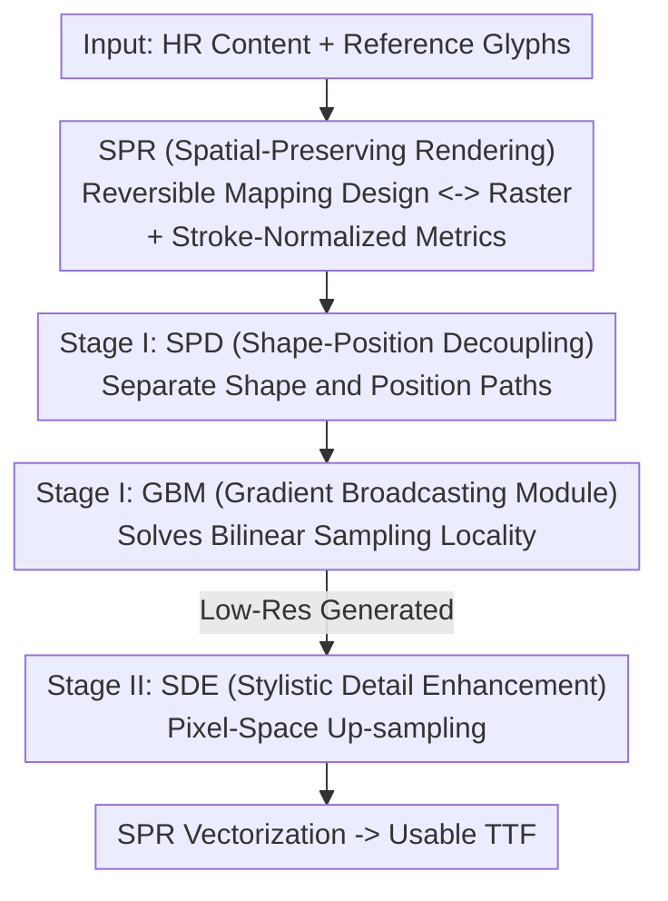

# Rethinking Glyph Spatial Information in Font Generation

**Conference**: CVPR 2026  
**Paper**: [CVF Open Access](https://openaccess.thecvf.com/content/CVPR2026/html/Su_Rethinking_Glyph_Spatial_Information_in_Font_Generation_CVPR_2026_paper.html)  
**Code**: https://github.com/sp777g/GlyphSpatialNet (Available)  
**Area**: Diffusion Models / Image Generation  
**Keywords**: Few-shot Font Generation, Chinese Fonts, Spatial Information, Shape-Position Decoupling, Vectorization

## TL;DR
Addressing few-shot font generation (FFG), this paper points out that existing methods ignore "glyph spatial information" by destroying control point coordinates with distorted rendering in data pipelines and implicitly coupling "shape" and "position" in model optimization. It proposes a spatial-preserving rendering scheme, SPR (with an OFL Chinese font dataset and normalized metrics), to enable reversible mapping between raster and vector formats. Additionally, it designs the two-stage GlyphSpatialNet—incorporating shape-position decoupling (SPD), gradient broadcasting (GBM), and stylistic detail enhancement (SDE)—to explicitly model spatial transformations in pixel space, achieving new SOTA results on a unified benchmark without any component or stroke labels.

## Background & Motivation
**Background**: Few-shot font generation aims to automatically generate a complete font set from minimal reference characters (e.g., $N=8$). The mainstream approach is "raster-driven"—rendering glyphs into images and using GANs or diffusion models for style transfer due to the stable and easily modeled raster representation. In contrast, vector-driven methods often produce stroke errors on complex glyphs (especially Chinese) because control point representations are non-unique.

**Limitations of Prior Work**: The authors identify two fundamental flaws. ① Pipeline level: Fonts are inherently stored as vectors, but common rendering practices like "bounding-box centering + non-uniform scaling" destroy the absolute coordinates of control points and introduce **spatial bias**. This harms vectorization accuracy and contaminates dataset quality; coupled with copyright restrictions, diverse self-collected data and rendering schemes prevent the formation of a unified benchmark. ② Model level: Early methods focused on style-content decoupling, while later ones modeled "source-to-target" deformation. However, both lack explicit modeling of spatial information, folding **shape errors and position biases into a single optimization objective**. This implicit coupling hinders fine-grained shape learning and makes generalization fragile under spatial transformations.

**Key Challenge**: Manual font design separately handles "geometric editing" and "spatial editing." Existing models optimize them as a single entangled unit—any perturbation in spatial translation or scaling can disrupt learned shape mappings, which is the root cause of generalization failure.

**Goal**: (1) Eliminate spatial bias at the rendering and evaluation levels, establishing a reversible raster-vector bridge and a unified benchmark; (2) Explicitly decouple "shape" and "position" modeling at the architectural level.

**Key Insight**: Since problems stem from "destroyed spatial information + shape-position coupling," spatial information should be preserved from the source (spatial-preserving rendering). Furthermore, separate positioning paths should be developed in pixel space, drawing inspiration from Spatial Transformer Networks (STN).

**Core Idea**: Replace "distorted rendering + implicit coupling" with "spatial-preserving rendering + shape-position decoupling" to explicitly model glyph spatial information in pixel space, enabling end-to-end usable font library generation.

## Method

### Overall Architecture
The approach consists of two main pillars: an **infrastructure for data/evaluation (SPR scheme)** and a **two-stage generative model (GlyphSpatialNet)**. SPR ensures distortion-free rendering from design space to raster and reversible vectorization of model outputs back to TTF. GlyphSpatialNet performs low-resolution shape-position decoupled style transfer (Stage I) followed by high-resolution detail enhancement (Stage II). Inputs are high-resolution content glyph images $I_C^h$ and a few reference images; the output is a target glyph image ready for conversion into a TTF font via SPR.

SPR involves three coordinate systems: pixel space raster $\mathcal{R}$, floating-point vector $\mathcal{V}$, and font design space glyph $\mathcal{G}$ (defined in EM units, e.g., 1000). Rendering parameters are defined by font metrics (baseline, control points) to translate the origin of $\mathcal{G}$ into the raster grid $(T_x, T_y)$: $\begin{bmatrix}T_x\\T_y\end{bmatrix}=\frac{H}{2}\big(\begin{bmatrix}1-F_{scale}\\1+F_{scale}\end{bmatrix}-\begin{bmatrix}0\\2B_{offset}\end{bmatrix}\big)$, where $F_{scale}$ is the EM-to-pixel scale ratio and $B_{offset}$ compensates for the descent below the baseline. Vectorization uses Potrace to convert grayscale images to vector outlines $\mathcal{V}$, then applies the inverse transform $\begin{bmatrix}x'\\y'\end{bmatrix}=\frac{EM}{F_{scale}\cdot H}\begin{bmatrix}x-T_x\\T_y-y\end{bmatrix}$ back to $\mathcal{G}$, bypassing the difficulty of directly predicting vector coordinates.

### Key Designs

**1. SPR Scheme: Eliminating Spatial Bias and Enabling Reversible Vectorization**

To address distorted rendering, SPR abandons bounding-box centering and non-uniform scaling. It uses precise design-space metrics to establish a reversible mapping between $\mathcal{G} \leftrightarrow \mathcal{R}$. Its value lies in automation: model outputs in pixel space can be restored to vector coordinates and assembled into TTF files. Complementarily, **stroke-normalized metrics** are proposed for fair evaluation. The authors note that larger padding increases empty space, inflating SSIM/PSNR. The metric is defined as $\mathbf{N}[d](I,\hat I)=\frac{d(I,\hat I)}{\mathcal{W}_{stroke}(I)+\delta}$, where stroke weight $\mathcal{W}_{stroke}(I)=\frac{1}{|\Omega|}\iint_\Omega\big(1-I(x,y)\big)dxdy$ (with $I=1$ as background). This converts absolute loss into "relative loss density within strokes," allowing $\mathbf{N}[L1]$ and $\mathbf{N}[RMSE]$ to be compared fairly across rendering schemes.

**2. SPD (Shape-Position Decoupling): Separating Shape Error from Position Bias**

SPD splits the diffusion reverse process into two paths. The **Shape Path** uses $I_\theta(\cdot)$ and $\epsilon_\theta(\cdot)$ to predict the initial shape estimate $I_G^{l,init}$ and noise. The **Position Path** extracts down-sampled features $\{F_l\}$ from U-Net layers, flattens and concatenates them, and passes them through an MLP to predict a spatial correction offset $\varphi_\Delta\in\mathbb{R}^{2\times1}$ (translation). A grid generator $\mathcal{T}_{\varphi_\Delta}(G)$ creates the spatial offset field to produce the corrected $\hat I_G^l$. The base is RDDM (Residual Denoising Diffusion), where the target $I_G^l$ is injected into the residual $I_{res}^l=I_C^l-I_G^l$. This ensures shape learning is not disrupted by translation, mimicking manual "geometric" vs. "spatial" editing.

**3. GBM (Gradient Broadcasting Module): Correcting Large-Scale Spatial Bias**

Bilinear samplers suffer from **gradient locality**, where gradients only propagate to immediate neighbors. GBM uses a straight-through style trick from VQ-VAE to broadcast gradients across pixels while keeping the forward pass unchanged: $\mathrm{GBM}(I)=\mathcal{B}_\sigma(I)+\big(I-\mathcal{B}_\sigma(I).\mathrm{detach}()\big)$, where $\mathcal{B}_\sigma$ is Gaussian blur with standard deviation $\sigma$. In the backward pass, the gradient is split: $\frac{\partial\mathcal{L}}{\partial I_{i,j}}=\sum_{p,q}\frac{\partial\mathcal{L}}{\partial Y_{p,q}}\mathcal{K}_\sigma(p-i,q-j) + \frac{\partial\mathcal{L}}{\partial Y_{i,j}}$. The first term uses a Gaussian kernel $\mathcal{K}_\sigma$ to "spread" gradients from neighbors, allowing the position path to perceive distant targets and correct larger biases.

**4. SDE (Stylistic Detail Enhancement): High-Resolution Refinement in Pixel Space**

Stage I operates at $64^2$ for efficiency. Stage II's SDE handles up-sampling to $128^2$ while preserving details. Avoiding latent space methods (like LDM) prevents loss of spatial information and semantic interpretability. SDE stays in **pixel space**, using a non-parametric bilinear down-sampler $DS$ and an up-sampler $US$. $US$ incorporates stylistic details from reference condition $\mathcal{F}_S$, obtained via an "Average Condition Mechanism": $\mathcal{F}_S=\frac{1}{k}\sum_{i=1}^k\mathcal{E}_{style}(I_{S,i}^h)$. This supports arbitrary reference counts without needing component labels. Training uses $\mathcal{L}_{StageII}=\|US(DS(I_G^h),\mathcal{F}_S)-I_G^h\|_2^2$.

### Loss & Training
Two stages are trained separately. Stage I Loss: $\mathcal{L}_{StageI}=\|\hat I_G^l-I_G^l\|_2^2+\|\epsilon_\theta-\epsilon\|_2^2$. Stage II freezes the style encoder and trains SDE. Key hyper-parameters: $F_{scale}=0.8, B_{offset}=0.1$, low-res $64^2$, high-res $128^2$. Diffusion uses $T=1000$ steps but only 5 steps for DDIM inference.

## Key Experimental Results

### Main Results
Evaluation was conducted on the author's self-built OFL Chinese font dataset (1.5M glyphs, 222 fonts). Tests included UFSC (Unseen Font, Seen Character) and UFUC (Unseen Font, Unseen Character). Comparisons were made against LF-Font, MX-Font, NTF, and MSD-Font:

| Configuration | RMSE↓ | PSNR↑ | SSIM↑ | LPIPS↓ |
|------|-------|-------|-------|--------|
| LF-Font (Needs component labels) | 0.2224 | 13.91 | 0.7381 | 0.1300 |
| MX-Font (Needs component labels) | 0.2357 | 13.27 | 0.7154 | 0.1271 |
| NTF (GAN) | 0.2055 | 14.69 | 0.7702 | 0.1134 |
| MSD-Font (Diffusion, Global Style) | 0.1038 | 22.68 | 0.9050 | 0.0529 |
| **Ours (8-shot UFSC)** | **0.0916** | **25.86** | **0.9136** | **0.0479** |

Ours also led in 8-shot UFUC (RMSE 0.1588 vs. MSD-Font 0.1638). Explicit spatial modeling breaks the bottleneck where previous diffusion-based methods hit a performance ceiling.

### Ablation Study

| Configuration | RMSE↓ | PSNR↑ | SSIM↑ | LPIPS↓ | Note |
|------|-------|-------|-------|--------|------|
| Base | 0.1295 | 19.14 | 0.8835 | 0.0563 | 8-shot UFSC baseline |
| Base + SDE | 0.0994 | 25.29 | 0.9045 | 0.0503 | Matches MSD-Font |
| + SPD w/o GBM | 0.1007 | 24.97 | 0.9015 | 0.0516 | SPD alone degrades performance |
| + SPD w/ GBM (Full) | **0.0916** | **25.86** | **0.9136** | **0.0479** | Full model |

### Key Findings
- **GBM is the enabler for SPD**: Without GBM, RMSE slightly increased from 0.0994 to 0.1007 because the position path could not learn due to gradient locality. GBM reduced it to 0.0916.
- **Pixel Space vs. Latent Space**: Remaining in pixel space avoids the loss of spatial and semantic details inherent in latent representations, providing a better foundation for spatial transformations.
- **Resolution Trade-off**: SPR error decreases as resolution increases. At $128^2$, SPR error is significantly lower than generative error, indicating the bottleneck is the model's generation capability.

## Highlights & Insights
- **Metrics as Research Objects**: By highlighting how padding inflates scores, the authors emphasize benchmark fairness—a rare reflection in the FFG field.
- **Reusable GBM Technique**: The straight-through formulation for broadcasting gradients is applicable to any task where sampling/interpolation limits gradient flow, such as optical flow or STN-based tasks.
- **End-to-End "Spatial Consistency"**: Maintaining spatial integrity through rendering, modeling, and evaluation allows for direct TTF output and a complete engineering loop.

## Limitations & Future Work
- Calligraphy and extreme styles remain underrepresented due to data scarcity.
- The position path currently predicts only a $2\times1$ translation offset; complex non-rigid deformations are not fully explored.
- The focus is on Chinese glyphs; gains on simpler scripts like Latin may be limited.

## Related Work & Insights
- **vs. MSD-Font**: Both avoid labels, but MSD-Font's latent encoding blurs complex structures; Ours stays in pixel space with explicit spatial modeling.
- **vs. LF-Font / MX-Font**: These require component labels, limiting flexibility; Ours uses an average mechanism for zero-label, flexible reference counts.
- **vs. Vector-driven (DeepVecFont / SVG)**: These predict control points directly, struggling with non-uniqueness and complexity; Ours reverses high-quality pixel outputs.

## Rating
- Novelty: ⭐⭐⭐⭐⭐ Rethinks FFG via the "glyph spatial information" lens + SPR + SPD.
- Experimental Thoroughness: ⭐⭐⭐⭐ Strong benchmarks and ablation, though non-rigid transformation and cross-script generalization could be deeper.
- Writing Quality: ⭐⭐⭐⭐ Clear structure and formulas, though metric normalization arguments are slightly brief.
- Value: ⭐⭐⭐⭐⭐ High infrastructure value for the FFG community (OFL dataset + unified benchmark + TTF output).

<!-- RELATED:START -->

## Related Papers

- [\[CVPR 2026\] VecGlypher: Unified Vector Glyph Generation with Language Models](vecglypher_unified_vector_glyph_generation_with_language_models.md)
- [\[ICLR 2026\] What Matters for Representation Alignment: Global Information or Spatial Structure?](../../ICLR2026/image_generation/what_matters_for_representation_alignment_global_information_or_spatial_structur.md)
- [\[CVPR 2026\] SpatialReward: Verifiable Spatial Reward Modeling for Fine-Grained Spatial Consistency in Text-to-Image Generation](spatialreward_verifiable_spatial_reward_modeling_for_fine-grained_spatial_consis.md)
- [\[CVPR 2026\] FaithFusion: Harmonizing Reconstruction and Generation via Pixel-wise Information Gain](faithfusion_harmonizing_reconstruction_and_generation_via_pixel-wise_information.md)
- [\[CVPR 2026\] Beyond Patches: Global-aware Autoregressive Model for Multimodal Few-Shot Font Generation](beyond_patches_global-aware_autoregressive_model_for_multimodal_few-shot_font_ge.md)

<!-- RELATED:END -->
## Related Papers

- [\[CVPR 2026\] VecGlypher: Unified Vector Glyph Generation with Language Models](vecglypher_unified_vector_glyph_generation_with_language_models.md)
- [\[CVPR 2026\] Beyond Patches: Global-aware Autoregressive Model for Multimodal Few-Shot Font Generation](beyond_patches_global-aware_autoregressive_model_for_multimodal_few-shot_font_ge.md)
- [\[CVPR 2026\] SpatialReward: Verifiable Spatial Reward Modeling for Fine-Grained Spatial Consistency in Text-to-Image Generation](spatialreward_verifiable_spatial_reward_modeling_for_fine-grained_spatial_consis.md)
- [\[CVPR 2026\] FaithFusion: Harmonizing Reconstruction and Generation via Pixel-wise Information Gain](faithfusion_harmonizing_reconstruction_and_generation_via_pixel-wise_information.md)
- [\[CVPR 2026\] FontCrafter: High-Fidelity Element-Driven Artistic Font Creation with Visual In-Context Generation](fontcrafter_high-fidelity_element-driven_artistic_font_creation_with_visual_in-c.md)

<!-- RELATED:END -->
