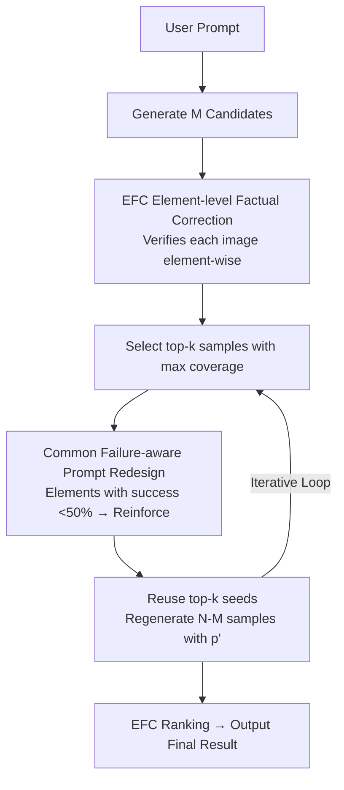

# Rethinking Prompt Design for Inference-time Scaling in Text-to-Visual Generation

**Conference**: CVPR 2026  
**Paper**: [CVF Open Access](https://openaccess.thecvf.com/content/CVPR2026/html/Kim_Rethinking_Prompt_Design_for_Inference-time_Scaling_in_Text-to-Visual_Generation_CVPR_2026_paper.html)  
**Code**: https://subin-kim-cv.github.io/PRIS (Project Page)  
**Area**: Diffusion Models / Image Generation / Inference-time Scaling  
**Keywords**: text-to-visual, inference-time scaling, prompt redesign, MLLM verifier, text-to-video

## TL;DR
This paper introduces PRIS: In text-to-image/video inference-time scaling, instead of simply increasing computation for "sampling more images," it utilizes a fine-grained verifier (EFC) to identify "common failure elements" recurring across multiple samples. It then redesigns the prompt for regeneration, allowing the prompt and visual quality to scale together with computation. This achieves a $+7\%$ gain on GenAI-Bench and a $+15\%$ gain on VBench 2.0.

## Background & Motivation

**Background**: In text-to-image (T2I) and text-to-video (T2V) generation, a single sampling often fails to precisely align with user intent. This has led to "inference-time scaling"—given a prompt, computation is increased either by adding decoding steps for a single candidate or by generating many candidates and selecting the best using a reward model (Best-of-N, Search-over-Paths).

**Limitations of Prior Work**: These methods scale only on the "visual" side; the prompt remains fixed and decoupled from the scaling process. The authors observe a key phenomenon: when repeatedly sampling, failure modes are **recurring**. For instance, if the prompt is "a single shoe without laces," every image might get the "shoe" right, but "laces" **appear in every sample**. Continued sampling merely repeats the same error, causing prompt-adherence to plateau quickly.

**Key Challenge**: Scaling visuals under a **sub-optimal prompt** yields diminishing returns, as the prompt is the primary guidance for conditional generation. Existing prompt-refinement methods are **per-sample**, focusing on stochastic deviations in single images while ignoring "population-level failure modes recurring across samples," thus missing the opportunity to improve both text and visuals simultaneously.

**Goal**: To extend inference-time scaling from the visual domain **to the prompt domain**, allowing the prompt to be adaptively revised as the number of generated samples increases, without compromising the user's original intent. This is decomposed into two sub-problems: (1) how to **precisely diagnose** which elements of the prompt are missing or incorrect in a generated image; (2) how to **aggregate** diagnoses across samples into effective prompt revisions.

**Key Insight**: The authors argue that "failures are informative"—rather than discarding low-score samples, their common failures should be analyzed to feedback into the prompt. This requires a verifier that is more fine-grained and interpretable than a "single scalar alignment score."

**Core Idea**: In one sentence—**treat the prompt as another axis for inference-time scaling**: use a fine-grained verifier, EFC, to identify common failure elements across samples, rewrite the prompt to reinforce these neglected elements, and regenerate using successful seeds to achieve joint prompt-visual scaling.

## Method

### Overall Architecture
PRIS (Prompt Redesign for Inference-time Scaling) is built upon a fine-grained verifier, EFC, and operates as an iterative closed-loop: "Generation → Diagnosis → Prompt Redesign → Regeneration." Given a user prompt, $M$ candidates are generated and verified element-wise by EFC. The top-$k$ samples covering the most elements are selected, and elements with a **success rate <50%** in these top samples are identified as common failures. The original prompt is then rewritten into $p'$ to reinforce these weak elements. Finally, $N-M$ new samples are generated using $p'$ while reusing the noise seeds from the top-$k$ samples, followed by a final ranking by EFC.

### Key Designs

**1. EFC: Element-level Factual Correction Verifier**

EFC decomposes the question "Is this image correct?" into "Are each of the semantic elements correct?" Overall alignment scores (like VQAScore) only indicate general similarity but fail to specify which elements are met or missing. EFC uses a training-free MLLM (Qwen2.5-VL) for a three-step verification. First, **Decomposition**: the prompt $p$ is split into atomic semantic elements $p=\{p_1,\dots,p_s\}$, categorized by type (Image-level: existence/attribute/spatial; Motion-level: movement/camera/transition/sequence). Each $p_i$ is labeled as `core` (factual/essential) or `extra` (subjective/stylistic). Second, **Factual Correction**: instead of binary VQA, EFC generates a natural language caption for image $D$, then treats the relationship between $p_i$ and the caption as a Natural Language Inference (NLI) task (entailment/contradiction/neutral). This text-to-text comparison mitigates the affirmative bias common in MLLM VQA. Elements judged as neutral undergo a second round involving an open-ended question $q_i$. Third, **Scoring**: images are ranked by the number of entailed elements, **prioritizing core elements**.

**2. Common Failure-aware Prompt Redesign: Addressing Collective Misses**

Unlike per-sample refinement, PRIS identifies common failures among the **top-$k$** samples—those that collectively cover the most elements. Within this subset, **common failures** are defined as elements with a success rate below 50%. The original prompt $p$ is rewritten into $p'$ to explicitly reinforce these neglected elements while preserving successful parts. For example, for a **negation** constraint like "fork is not made of wood," where BoN might repeatedly produce wooden forks, PRIS identifies the failure and explicitly rewrites the prompt to "silver fork," directly resolving the model's misunderstanding of negation.

**3. Seed Reuse: Inheriting Computation Wealth**

When generating with $p'$, PRIS **reuses the noise latents (seeds) from the top-$k$ samples** instead of random initialization. The motivation is that specific noise conditions are naturally more conducive to aligning certain prompt types. Reusing seeds that were "partially successful" is more likely to preserve prior successes than starting from scratch. By treating "partially correct generations" as informative feedback rather than waste, PRIS outperforms BoN under fixed compute budgets.

## Key Experimental Results

### Main Results
For T2I on GenAI-Bench using FLUX.1-dev ($N=20$, $NFE=2000$), VQAScore is used for guidance, with DA-Score (fine-grained alignment) and Aesthetic scores for evaluation. `*` denotes the addition of standard prompt expansion.

| Method (GenAI-Bench / FLUX.1-dev) | VQAScore (Given) | DA-Score (Unseen) | Aesthetic (Unseen) |
|--------|------|------|------|
| FLUX.1-dev | 0.718 | 0.681 | 5.764 |
| +BoN | 0.783 | 0.682 | 5.761 |
| **+PRIS** | **0.854** | **0.707** | 5.765 |
| FLUX.1-dev* | 0.769 | 0.695 | 5.824 |
| +BoN* | 0.829 | 0.710 | 5.820 |
| **+PRIS*** | **0.853** | **0.713** | **5.841** |

PRIS consistently outperforms BoN and standard expansion in prompt-adherence while maintaining aesthetic quality, showing a **+7% gain on GenAI-Bench**.

For T2V on VBench 2.0 (Wan2.1-1.3B/14B), PRIS shows significant gains in temporal reasoning.

| Dimension (VBench 2.0 / Wan2.1) | 1.3B Model | 14B Model |
|------|------|------|
| Controllability & Creativity Gain | **+13.88%** | **+15.19%** |
| Overall VBench 2.0 Gain | **+15%** | **+15%** |

### Ablation Study

| Config | Observation | Conclusion |
|------|---------|------|
| Fixed Prompt Scaling (BoN) | Adherence plateaus quickly | Diminishing returns on visual-only scaling |
| Standard Expansion (*) | Better than none, weaker than PRIS | Failed-aware redesign is superior to detail padding |
| EFC vs. Binary VQA | EFC is more accurate in ranking | Mitigating affirmative bias is key |
| PRIS (Common Failure + Seed Reuse) | Consistently outperforms BoN | Joint prompt-visual scaling is core |

### Key Findings
- **Failure modes are collective and reusable**: Multi-sampling reveals systematic failures rather than random noise; PRIS exploits this signal which per-sample methods miss.
- **Text-to-Text verification > Direct VQA**: Converting images to captions before NLI bypasses the "yes-bias" of MLLMs.
- **Temporal and Negation constraints benefit most**: Scenarios involving motion order or complex negations see the largest improvements after explicit prompt redesign.

## Highlights & Insights
- **Prompting as an independent scaling axis**: This shifts the paradigm from visual-only scaling to joint prompt-visual scaling.
- **The "<50% success" criterion**: A simple yet effective heuristic that filters stochastic noise to focus on systematic model weaknesses.
- **EFC's 3-step verification**: This module can be used independently as a training-free, fine-grained reward or diagnostic tool for any T2I/T2V generator.
- **Seed Reuse strategy**: A clever engineering trick to treat noise latents as "inheritable assets," maximizing the utility of previously spent computation.

## Limitations & Future Work
- **Dependency on MLLM Verifier**: The accuracy of PRIS is bounded by the MLLM's ability to decompose, caption, and reason. Specialized domains may remain challenging.
- **Computational Overhead**: EFC's multi-step verification involves several MLLM calls, which adds latency compared to pure visual sampling.
- **Single Iteration Focus**: While the loop can be repeated, the main results focus on one iteration. The long-term behavior of prompt drift requires more study.

## Related Work & Insights
- **vs. Best-of-N / Search-over-Paths**: These focus on the visual side with a fixed prompt. PRIS uses low-score samples as feedback to update the prompt.
- **vs. Per-sample Prompt-refinement**: Traditional methods address single-image noise. PRIS aggregates failures across the population for more robust updates.
- **vs. CoT/Unified Models**: PRIS is training-free and plug-and-play, compatible with existing modular generators.

## Rating
- Novelty: ⭐⭐⭐⭐⭐ 
- Experimental Thoroughness: ⭐⭐⭐⭐ 
- Writing Quality: ⭐⭐⭐⭐ 
- Value: ⭐⭐⭐⭐ 

<!-- RELATED:START -->

## Related Papers

- [\[ICLR 2026\] Compositional Visual Planning via Inference-Time Diffusion Scaling](../../ICLR2026/image_generation/compositional_visual_planning_via_inference-time_diffusion_scaling.md)
- [\[ICLR 2026\] Inference-Time Scaling of Diffusion Models Through Classical Search](../../ICLR2026/image_generation/inference-time_scaling_of_diffusion_models_through_classical_search.md)
- [\[ICLR 2026\] Inference-Time Scaling of Discrete Diffusion Models via Importance Weighting and Optimal Proposal Design](../../ICLR2026/image_generation/inference-time_scaling_of_discrete_diffusion_models_via_importance_weighting_and.md)
- [\[CVPR 2026\] Progress by Pieces: Test-Time Scaling for Autoregressive Image Generation](progress_by_pieces_test-time_scaling_for_autoregressive_image_generation.md)
- [\[ICLR 2026\] Scaling Group Inference for Diverse and High-Quality Generation](../../ICLR2026/image_generation/scaling_group_inference_for_diverse_and_high-quality_generation.md)

<!-- RELATED:END -->
