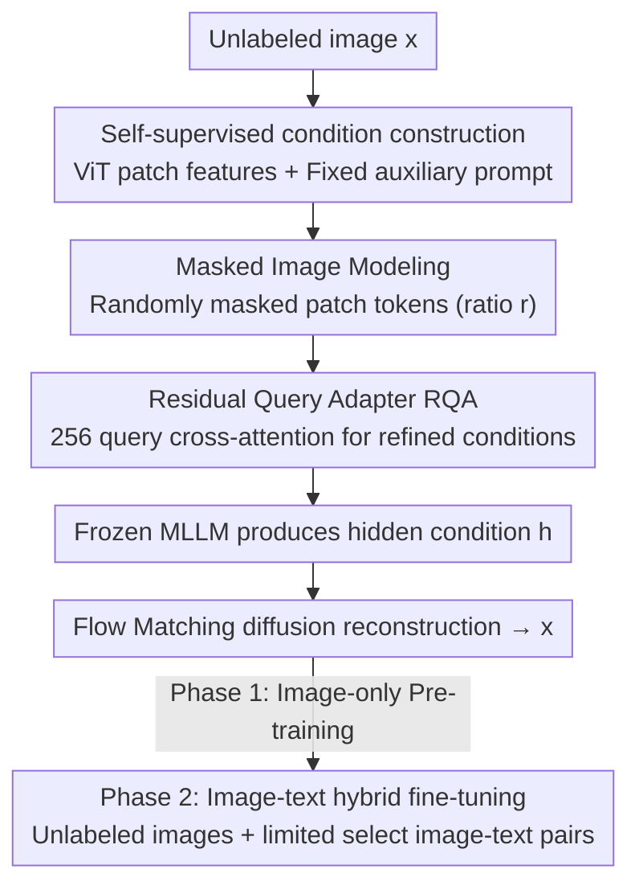

# Rethinking UMM Visual Generation: Masked Modeling for Efficient Image-Only Pre-training

**Conference**: CVPR 2026  
**Paper**: [CVF Open Access](https://openaccess.thecvf.com/content/CVPR2026/html/Sun_Rethinking_UMM_Visual_Generation_Masked_Modeling_for_Efficient_Image_Only_Pre_training_CVPR_2026_paper.html)  
**Code**: https://github.com/LINs-lab/IOMM  
**Area**: Image Generation / Unified Multimodal Models  
**Keywords**: Unified Multimodal Models (UMM), Image-Only Pre-training, Masked Image Modeling, Self-Supervised Conditioning, Flow Matching

## TL;DR
Addressing the bottlenecks of "scarcity of image-text pairs" and "inefficient training" in the visual generation components of Unified Multimodal Models (UMM), this paper proposes IOMM, a two-stage framework. It first pre-trains on massive unlabeled images using image semantics as self-conditions via masked reconstruction, followed by hybrid fine-tuning with limited high-quality image-text pairs. Using only ~1050 H800 GPU hours, a 3.6B model trained from scratch achieves 0.89 on GenEval and 0.55 on WISE, surpassing strong baselines like BAGEL-7B and BLIP3-o.

## Background & Motivation
**Background**: Unified Multimodal Models (UMM) aim to integrate "understanding" and "generation" into a single model. The standard approach involves bridging a frozen Multimodal Large Language Model (MLLM) with a diffusion backbone using learnable queries or multi-stage protocols (e.g., MetaQuery, BLIP3-o, BAGEL, Qwen-Image), where the MLLM provides semantic conditions and the diffusion model handles pixel generation.

**Limitations of Prior Work**: Training these visual generation components relies heavily on **large-scale, high-quality, and often proprietary image-text paired data**. The cost of collection and cleaning is extremely high, hindering open and reproducible research. Furthermore, the training process is **computationally inefficient**, consuming massive resources. It is also observed that UMMs fine-tuned on limited data often generate images with "missing details and poor prompt fidelity" (as seen in Figure 6a, where even strong baselines like Qwen-Image fail).

**Key Challenge**: The scarcity of supervision signals is a double-edged sword: while text descriptions are scarce, they are naturally "sparse," forcing the model to learn compositional scene completion. If the image itself is used as a condition, the condition is "dense and complete," which easily leads the model to degenerate into a trivial identity mapping (simply copying the input) without learning true generative priors.

**Goal**: ① Completely decouple the expensive pre-training phase from "image-text pair dependency"; ② Enable frozen, understanding-oriented MLLMs to provide suitable conditions for generation without fine-tuning or catastrophic forgetting; ③ Systematically clarify the optimal data composition for pre-training and fine-tuning.

**Key Insight**: The authors hypothesize that **explicit text is merely one modality carrying high-level semantics, and the rich semantics inherent in the image itself are sufficient to serve as conditioning signals**. Thus, a training paradigm can be designed entirely around unlabeled image corpora.

**Core Idea**: Replace "image-text pair supervision" with "image self-conditioning + masked reconstruction" for generative pre-training, then restore instruction alignment through hybrid data fine-tuning—specifically, a two-stage paradigm (IOMM) consisting of image-only pre-training followed by image-text hybrid fine-tuning.

## Method

### Overall Architecture
The input to IOMM is an unlabeled image, and the output is a UMM capable of generating images based on text instructions. The pipeline first encodes the image into patch features using the ViT from a frozen MLLM, prepending a fixed auxiliary prompt to form a "self-supervised condition." After randomly masking the image patch tokens, a lightweight "Residual Query Adapter (RQA)" refines the condition, which is then passed to the frozen MLLM to produce the hidden condition $h$. Finally, a Flow Matching diffusion network restores the noise to the original image guided by $h$. This occurs only in **Phase 1 (Image-only Pre-training)**. In **Phase 2**, the model is fine-tuned on hybrid data (unlabeled images + limited select image-text pairs) to recoup instruction alignment.

### Key Designs

**1. Image Self-Conditioned Pre-training: Using image semantics as conditions to eliminate pair dependency**

This directly addresses the bottleneck of pre-training's reliance on scarce image-text pairs. Instead of feeding text, the target image $x$ is encoded into patch embeddings $c_{img}=v(x)\in\mathbb{R}^{P^2\times D}$ using the ViT in the frozen MLLM. These are concatenated with token embeddings $c_{aux}$ of a general fixed prompt (e.g., "Generate an image that is identical to the reference image:"), forming the complete condition $c=\mathrm{concat}(c_{aux},c_{img})$. This is fed into the frozen MLLM $g$ to obtain the hidden condition $h=g(c)$ for diffusion. The underlying assumption is that semantics in the image itself are sufficient for conditioning. This allows pre-training to use only unlabeled image corpora (Megalith-10M, text-to-image-2M).

**2. Residual Query Adapter (RQA): Directing understanding representations toward generation without tuning the MLLM**

Directly using the frozen MLLM output $g(c)$ as a diffusion condition yields poor results (as shown in Figure 2b, "Raw" achieves only 0.44) because understanding-oriented MLLM representations are not optimized for the fine-grained control required for generation, leading to a domain mismatch. However, full fine-tuning of the MLLM is prohibitive due to its scale (MetaQuery-XL's MLLM has 7B parameters, while the diffusion is only 0.6B) and the risk of catastrophic forgetting of understanding capabilities. RQA solves this via a trainable adapter $q_\theta$ with only **29M parameters**. It uses **256 learnable query tokens** to perform cross-attention on $c$, generating a "residual query" appended back to the sequence $c\leftarrow\mathrm{concat}(c,q_\theta(c))$. This serves as a learnable "soft prompt," inducing the frozen MLLM to extract features more useful for generation. Ablations show RQA increases GenEval from 0.44 to 0.82 (+0.38) and converges much faster than MetaQuery.

**3. Masked Image Modeling (MIM): Forcing true generative priors via sparse-to-dense reconstruction**

The risk of self-conditioning is that if the condition is "dense and complete," the model may learn a shortcut identity mapping. Borrowing from MAE, the authors randomly zero out image patch tokens with a mask ratio $r\in[0,1]$ during training. An element-wise multiplication $c_{img}\leftarrow c_{img}\odot M$ is applied using a Bernoulli-sampled binary mask $M$. This transforms the objective from "dense reconstruction" to the more difficult "sparse-to-dense reconstruction," forcing the model to infer masked content from visible patches and learn robust, context-aware visual priors—mimicking the benefits of sparse text supervision. The optimal ratio is $r=0.45$, yielding a GenEval peak of 0.88; a ratio of $r=0.95$ drops performance to 0.77 due to excessive information loss.

**4. Two-Stage Paradigm and Hybrid Fine-tuning: Image-only foundation, hybrid finishing**

The paper compares six recipes for Phase 1/Phase 2 data selection from {Image-only, Image-text Pairs, Hybrid}. The core conclusion is that **Image-only Pre-training + Hybrid Fine-tuning** is optimal. Two patterns emerged: pre-training on images only is consistently equal to or better than pre-training on pairs, regardless of subsequent fine-tuning; for the fine-tuning stage, hybrid data is best, while image-only fine-tuning is worst (as it erases instruction alignment, evidenced by Qwen-Image's GenEval dropping by 0.43). This strategy is plug-and-play: it improved OpenUni-L (GenEval 0.85 to 0.88) and the 20B Qwen-Image (using LoRA, $r{=}64,\alpha{=}64$, 512px from 0.85 to 0.89).

### Loss & Training
The generative backbone utilizes Flow Matching: a linear path $x_t=(1-t)x+tz$ is defined between data $x$ and noise $z\sim\mathcal{N}(0,I)$. The network $F_\theta(x_t,t,c)$ learns a constant-velocity vector field $z-x$, with the objective $L(\theta)=\mathbb{E}\big[\lVert F_\theta(x_t,t,h)-(z-x)\rVert_2^2\big]$, where $h$ is produced by RQA and the frozen MLLM. Sampling is solved via the PF-ODE $\mathrm{d}x_t/\mathrm{d}t=F_\theta$. The backbone uses the MM-DiT from FLUX with sizes IOMM-B(1.6B), L(2.7B), and XL(6B, Z-Image). The auxiliary MLLM is a frozen InternVL3-2B. Optimizers used are AdamW (B/L) and Muon (XL) with EMA decay of 0.999.

## Key Experimental Results

### Main Results

| Model | Scale/Data | GenEval ↑ | DPGBench ↑ | WISE ↑ | Training Cost |
|------|-----------|-----------|------------|--------|----------|
| BLIP3-o-8B* | +30M Private Pairs | 0.84 | 81.60 | 0.62 | — |
| Janus-Pro-7B | — | 0.80 | 84.19 | 0.35 | — |
| BAGEL-7B | — | 0.88 | — | 0.52 | — |
| MetaQuery-XL | — | 0.80 | 82.05 | 0.55 | — |
| **IOMM-B 512** | 1.6B, All Public | **0.89** | 82.95 | 0.55 | **~1050 H800h** |
| IOMM-L 512 | 2.7B | 0.87 | 76.09 | 0.53 | — |

IOMM-B (512px) with a 1.6B backbone, using only public data and ~1050 H800 GPU hours (1000 of which are in the image-only pre-training phase), achieves a GenEval of 0.89. This exceeds BAGEL-7B (0.88) and BLIP3-o-8B (0.84), the latter of which used 30M private pairs. A WISE score of 0.55 indicates world knowledge remains intact.

### Ablation Study

| Configuration | GenEval | Note |
|------|---------|------|
| Raw (Frozen MLLM direct) | 0.44 | Misalignment between understanding and generation |
| ⊕ Residual Query Adapter | 0.82 | +0.38, primary source of gain |
| ⊕ Masked Image Modeling | 0.88 | +0.06, prevents identity shortcuts |
| Mask ratio $r=0.45$ | 0.88 | Peak; $r=0.95$ drops to 0.77 |

| Fine-tuning (on Qwen-Image-512) | GenEval | Change |
|------|---------|------|
| Baseline (Pre-trained) | 0.85 | — |
| ⊕ Image-only Tuning | 0.42 | ↓0.43, alignment collapse |
| ⊕ Pair Tuning | 0.88 | ↑0.03 |
| ⊕ Hybrid Tuning | 0.89 | ↑0.04, Best |

### Key Findings
- **RQA Contribution**: Jumping from Raw 0.44 to 0.82 (+0.38) makes it the most significant architectural component; MIM provides an additional +0.06. Without these, self-conditioning either mismatches or degenerates.
- **Mask Ratio Sweet Spot**: $r=0.45$ is optimal. Too low provides over-dense supervision, while too high (0.95) causes excessive information loss, supporting the "sparse-to-dense" design.
- **Emergent Zero-Shot Editing**: Image-only pre-trained IOMM-B achieves 2.82 on ImgEdit-Bench without specific training, outperforming the pair-pre-trained version (2.61) and even UltraEdit (2.70), which was explicitly trained on edit data. This suggests self-conditioning + MIM learns transferable visual manipulation priors.
- **Positive Scaling**: While IOMM-L appeared lower, it was due to having half the training epochs of IOMM-B. When controlling for 5 epochs, IOMM-L outperformed IOMM-B (0.87 vs 0.86).

## Highlights & Insights
- **Paradigm Shift to "Image as Condition"**: Freeling generative pre-training from pair dependency allows the use of massive unlabeled visual data, providing a substantial reduction in the cost of open, reproducible research.
- **Efficiency of Frozen LLM + Lightweight Adapter**: The 29M RQA uses soft prompts to "nudge" a 7B frozen MLLM without modifying its parameters, avoiding catastrophic forgetting while saving compute.
- **MIM Cures Self-Conditioning Degeneration**: Manually creating sparsity through masking when condition information is too complete is a universal technique to prevent shortcuts and can be transferred to other self-reconstruction/distillation tasks.

## Limitations & Future Work
- **Dependency on High-Quality Frozen MLLM**: The framework relies on InternVL3-2B's representations; whether weaker visual encoders could provide sufficient semantics remains to be verified.
- **Fixed Auxiliary Prompt**: A generic fixed prompt was used; the potential space for prompt design design to improve quality was not deeply explored.
- **Scaling Constraints**: IOMM-L/XL were not fully trained due to epoch limits; the true ceiling at larger scales is unknown. Furthermore, paired data remains essential in hybrid fine-tuning, as image-only tuning fails instruction alignment.

## Related Work & Insights
- **vs MetaQuery / BLIP3-o (Frozen MLLM + Learnable Query)**: These still rely on large-scale pairs for the generative end. IOMM replaces this with image-only self-conditioning and MIM, achieving faster convergence and saving on private data.
- **vs Lumos-T2I (Image-only Pre-training for T2I)**: While both use image pre-training, Lumos is a specialized T2I model lacking understanding; IOMM is designed for UMMs with understanding+generation and introduces MIM.
- **vs MAE (Masked Auto-encoders)**: IOMM borrows the "mask-and-predict" concept but applies it to prevent self-conditioning degeneration rather than just learning discriminative representations.

## Rating
- Novelty: ⭐⭐⭐⭐⭐ The "Image as Condition + MIM" paradigm shift removes dependency on image-text pairs for pre-training.
- Experimental Thoroughness: ⭐⭐⭐⭐⭐ Systematic ablation of six data recipes, multi-benchmark testing, and generalization to OpenUni/Qwen-Image.
- Writing Quality: ⭐⭐⭐⭐ Motives and ablations are clear, though minor inconsistencies exist in decimal reporting (0.88 vs 0.89).
- Value: ⭐⭐⭐⭐⭐ Reaching SOTA with only ~1050 H800h and public data is highly significant for low-cost, reproducible UMM training.

<!-- RELATED:START -->

## Related Papers

- [\[CVPR 2026\] Black-box Membership Inference Attacks on the Pre-training Data of Image-generation Models](black-box_membership_inference_attacks_on_the_pre-training_data_of_image-generat.md)
- [\[CVPR 2026\] Depth Adaptive Efficient Visual Autoregressive Modeling](depthvar_depth_adaptive_var.md)
- [\[CVPR 2026\] SparVAR: Exploring Sparsity in Visual Autoregressive Modeling for Training-Free Acceleration](sparvar_exploring_sparsity_in_visual_autoregressive_modeling_for_training-free_a.md)
- [\[CVPR 2026\] Rethinking Prompt Design for Inference-time Scaling in Text-to-Visual Generation](rethinking_prompt_design_for_inference-time_scaling_in_text-to-visual_generation.md)
- [\[CVPR 2026\] DPAR: Dynamic Patchification for Efficient Autoregressive Visual Generation](dpar_dynamic_patchification_for_efficient_autoregressive_visual_generation.md)

<!-- RELATED:END -->
