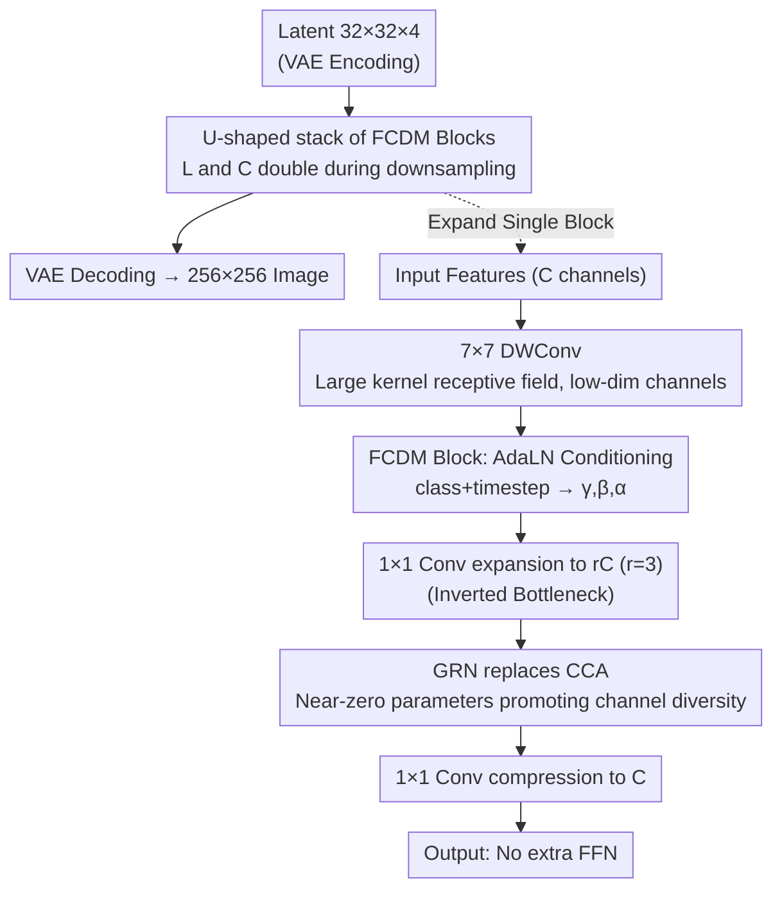

# Reviving ConvNeXt for Efficient Convolutional Diffusion Models

**Conference**: CVPR 2026  
**arXiv**: [2603.09408](https://arxiv.org/abs/2603.09408)  
**Code**: Yes (Official implementation public)  
**Area**: Image Generation  
**Keywords**: Diffusion Models, ConvNeXt, Fully Convolutional, Efficient Generation, Image Generation  
**Institutions**: KAIST, ETH Zürich, ISTI-CNR, University of Pisa

## TL;DR
This paper proposes FCDM (Fully Convolutional Diffusion Model), adapting the ConvNeXt architecture as a conditional diffusion model backbone. Using only 50% of the FLOPs of DiT-XL, it achieves a competitive FID (2.03) on ImageNet and allows training an XL-sized model on four RTX 4090 GPUs, demonstrating the significantly undervalued efficiency advantages of fully convolutional architectures in generative modeling.

## Background & Motivation

**Background**: Diffusion model backbones have evolved from hybrid convolutional-attention architectures (DDPM, ADM, LDM) to all-Transformer architectures (DiT, SiT, FLUX). The scalability of Transformers has driven the success of large-scale models like FLUX and SD3 but has also introduced heavy dependencies on GPU cluster resources.

**Limitations of Prior Work**: DiT-XL/2 requires 7M training steps to achieve optimal FID, with a training throughput of only 80.5 it/s. The $O(n^2)$ computational complexity of Transformers becomes particularly severe at high resolutions—when resolution doubles, DiT throughput drops approximately 4×. This makes the training and inference costs of diffusion models a primary bottleneck.

**Key Challenge**: While the industry generally believes "scaling Transformer = better generative quality," the inductive bias, parameter efficiency, and hardware friendliness of ConvNets have remained largely unexplored in modern generative modeling. ConvNeXt has demonstrated performance matching ViT in classification tasks but remains absent in the generative domain.

**Key Insight**: This work transforms ConvNeXt into a backbone for conditional diffusion models, maintaining its core designs (depthwise conv, inverted bottleneck, GRN) while adding conditional injection (AdaLN) and a U-shaped layout to verify if a fully convolutional architecture can simultaneously balance generative quality and computational efficiency.

## Method

### Overall Architecture

FCDM addresses a neglected question: as diffusion model backbones shift toward Transformers, can a pure convolutional architecture (ConvNeXt) excel in both generative quality and computational efficiency? It operates in latent space (consistent with DiT): RGB images of $256 \times 256 \times 3$ are encoded by a VAE into $32 \times 32 \times 4$ latents, passed through multiple FCDM blocks, and then decoded back to pixels by the VAE decoder. These blocks are organized into a simplified U-shaped structure, where the encoder and decoder are connected via skip connections.

Unlike DiT, which requires four hyperparameters (layers $L$, channels $C$, attention heads, patch size), FCDM requires only **two**—the number of blocks $L$ and the hidden channel dimension $C$. Both double during each 2× downsampling step. This "Easy Scaling Law" reduces the architecture search space to a minimum; scaling from FCDM-S to FCDM-XL involves changing only two numbers ($L$ from 2 to 3, $C$ from 128 to 512).

The following diagram reveals the internal data flow of a single FCDM Block, where four key designs are implemented:

### Key Designs

**1. FCDM Block: Minimally Adapting ConvNeXt for Conditional Diffusion**

The success of DiT has made attention-based generation the default, yet ConvNeXt matched ViT in classification while remaining absent in generation. FCDM applies minimal modifications to the ConvNeXt block: the original pipeline $\text{Input} \to 7\times7 \text{ DWConv} \to \text{LN} \to 1\times1 \text{ Conv}(\uparrow r) \to \text{GRN} \to 1\times1 \text{ Conv}(\downarrow r) \to \text{Output}$ is mostly preserved. LayerNorm is replaced with Adaptive LayerNorm (AdaLN) for condition injection—a lightweight MLP maps the concatenated class and timestep embeddings to $(\gamma, \beta, \alpha)$, where $\gamma, \beta$ perform affine modulation and $\alpha$ performs output scaling. Following DiT, $\alpha$ is initialized to zero, making each block an identity mapping at the start of training for better stability. The $7\times7$ depthwise convolution is retained to provide sufficient receptive field.

**2. Inverted Bottleneck: Placing DWConv Before Expansion to Save Half the Compute**

The critical difference between FCDM and its closest competitor, DiCo, lies in channel handling—the source of FCDM's 25% lower FLOPs. DiCo maintains a constant channel count in the convolution module and performs expansion in a separate feedforward module. FCDM uses an inverted bottleneck: first performing $7\times7$ depthwise conv (channels $C$, computation $\propto C$), then using $1\times1$ pointwise conv to expand to $rC$ (expansion ratio $r=3$), and finally compressing back to $C$. Crucially, the depthwise conv is placed **before** expansion—it operates only in the low-dimensional space without inter-channel interaction, keeping compute low while pointwise convs handle higher-dimensional features.

| Model | Params | Blocks L | Channel C | FLOPs(G) | vs DiT | vs DiCo |
|------|--------|----------|-----------|----------|--------|---------|
| FCDM-S | 32.7M | 2 | 128 | 3.1 | 50.8% | 72.9% |
| FCDM-B | 127.7M | 2 | 256 | 12.2 | 53.0% | 72.3% |
| FCDM-L | 504.5M | 2 | 512 | 48.3 | 59.9% | 80.2% |
| FCDM-XL | 698.8M | 3 | 512 | 64.6 | 54.5% | 74.0% |

**3. Replacing CCA with GRN: Near-Zero Parameter Channel Diversity**

To mitigate channel redundancy, DiCo introduced Compact Channel Attention (CCA), adding a $1\times1$ conv for channel weights. FCDM reuses Global Response Normalization (GRN) from ConvNeXt V2: computing the global L2 norm for each channel and normalizing the response, which is parameter-free. Both aim to increase channel diversity, but GRN introduces virtually no learnable parameters. Ablations show replacing GRN with CCA increases FID from 19.97 to 23.85 (+3.9), suggesting GRN's superiority in generation.

**4. Removal of Extra Feedforward: Single Expansion**

The inverted bottleneck already expands and compresses channels within the block, making DiCo's separate feedforward module redundant. Adding an extra FFN to FCDM increases FID from 19.97 to 28.52—demonstrating that redundant channel expansion is harmful.

### Loss & Training

The setup follows DiT/ADM exactly without extra tricks: diffusion $t_{\max}=1000$ steps, linear noise schedule ($\beta$ from $1\times10^{-4}$ to $2\times10^{-2}$), iDDPM covariance parameterization; AdamW optimizer, lr $=1\times10^{-4}$ (constant), no weight decay; fp32 training; EMA decay 0.9999; evaluation using 250-step DDPM sampling with 50K samples for FID.

## Key Experimental Results

### Main Results: ImageNet 256×256 Multi-scale Comparison (400K steps)

| Model | Architecture | FLOPs(G)↓ | Throughput(it/s)↑ | FID↓ | IS↑ |
|------|---------|-----------|---------------|------|-----|
| DiT-XL/2 | Transformer | 118.6 | 80.5 | 19.47 | - |
| DiG-XL/2 | Hybrid | 89.4 | 71.7 | 18.53 | 68.53 |
| DiCo-XL | Conv | 87.3 | 174.2 | 11.67 | 100.4 |
| DiC-H | Conv | 204.4 | 144.5 | 11.36 | 106.5 |
| **FCDM-XL** | **Conv** | **64.6** | **272.7** | **10.72** | **108.0** |

FCDM-XL achieves the lowest FID (10.72) at 400K steps with the lowest FLOPs (64.6G) and highest throughput (272.7 it/s). After 1M steps, FID further drops to 7.91, whereas DiT-XL/2 requires 7M steps to reach 9.62.

### Benchmark Results (Long training + Classifier-Free Guidance)

| Model | Epochs | FLOPs(G)↓ | Throughput↑ | FID↓ | IS↑ |
|------|-----------|-----------|---------|------|-----|
| DiT-XL/2 | 1400 | 118.6 | 80.5 | 2.27 | 278.2 |
| SiT-XL/2 | 1400 | 118.6 | 80.5 | 2.06 | 277.5 |
| DiCo-XL | 750 | 87.3 | 174.2 | 2.05 | 282.2 |
| **FCDM-XL** | **400** | **64.6** | **272.7** | **2.03** | **285.7** |

FCDM-XL reaches SOTA FID (2.03) in 400 epochs—3.5× fewer epochs than DiT and 1.9× fewer than DiCo.

### 512×512 Resolution

FCDM-XL reaches an FID of 7.46 at 1M steps on 512×512, outperforming DiT-XL/2's 12.03 at 3M steps (7.5× fewer training steps). Notably, when resolution doubles, DiT throughput drops ~4× ($O(n^2)$ effect) while FCDM only drops ~2× (linear complexity).

### Ablation Study (FCDM-L, 200K steps)

| Configuration | FLOPs(G) | FID↓ | IS↑ | Conclusion |
|---------|----------|------|-----|------|
| Default (7×7 DWConv + GRN) | 48.3 | 19.97 | 69.19 | Baseline |
| → 5×5 DWConv | 48.2 | 20.48 | 66.69 | Slight drop from smaller RF |
| → 3×3 DWConv | 48.1 | 21.28 | 64.11 | Large kernels are vital (FID +1.3) |
| → CCA replacing GRN | 48.3 | 23.85 | 61.60 | GRN far outperforms CCA (FID +3.9) |
| → Add Feedforward | 48.2 | 28.52 | 47.16 | Extra FFN is harmful (FID +8.5) |
| → Remove Inverted Bottleneck | 48.3 | 28.76 | 52.20 | IB structure is critical |
| → ResNet block replacement | 48.4 | 31.14 | 49.10 | Modern ConvNeXt exceeds ResNet |

### Compute Resources

FCDM-XL can be trained on 256×256 ImageNet using 4 RTX 4090s (consumer GPUs) with a batch size of 256 and a throughput of ~0.9 step/s. This allows XL-scale training on single A100s, whereas comparable DiTs often require 8 A100/H100 GPUs.

## Highlights & Insights

- **Two-Parameter Scaling Law**: L and C define the entire network, reducing architecture search costs significantly through a minimal design space.
- **Inverted Bottleneck Reordering**: Placing depthwise conv before channel expansion is key to the 25% FLOP saving (vs DiCo), a trick generalizable to other architectures.
- **Unexpected Success of GRN**: The ConvNeXt V2 module, originally for classification, is highly effective for generation and far superior to CCA mechanisms.
- **Resolution Scalability**: The linear complexity of convolutions ensures that throughput degradation with resolution is far less severe than in Transformers.
- **Consumer GPU Accessibility**: Training XL models on four 4090s has huge practical value for academic and resource-constrained settings.

## Limitations & Future Work

- Has not yet outperformed methods using more advanced training frameworks (e.g., EDM-2, Simpler Diffusion) with improved noise schedules or preconditioning.
- Only tested on ImageNet class-conditional; text-to-image and video generation remain to be verified.
- Fully convolutional architectures theoretically have weaker long-range dependency modeling than Transformers; global semantic consistency may be limited.
- Primarily uses fp32; mixed-precision training efficiency and stability remain unexplored.

## Related Work & Insights

- **vs DiT/SiT**: Replaces attention with conv, halving FLOPs at the same parameter count and reaching comparable FID with 7× fewer training steps. DiT's advantage lies in its global modeling and natural compatibility with text conditions.
- **vs DiCo**: Most similar competitor. FCDM saves 25% FLOPs through IB reordering and replacing CCA+FF with GRN, with slightly better generation quality.
- **vs DiC**: DiC uses standard 3×3 conv; while scaling S/B has better hardware optimization, FCDM dominates at L/XL scales.

## Rating
- Novelty: ⭐⭐⭐⭐ ConvNeXt in diffusion is not brand new (DiC/DiCo existed), but the IB reordering analysis and systematic DiCo comparison provide value.
- Experimental Thoroughness: ⭐⭐⭐⭐⭐ Comprehensive evaluation across 4 scales, multiple steps, dual resolutions, and detailed ablations for FLOPs/throughput/FID.
- Writing Quality: ⭐⭐⭐⭐ Clear structure; Figure 4 comparing DiCo vs FCDM is intuitive; the analysis of differences is thorough.
- Value: ⭐⭐⭐⭐ Training XL models on four 4090s is highly attractive for resource-limited research; the two-parameter scaling law has engineering merit.

<!-- RELATED:START -->

## Related Papers

- [\[CVPR 2026\] Efficient and Training-Free Single-Image Diffusion Models](efficient_and_training-free_single-image_diffusion_models.md)
- [\[CVPR 2026\] Efficient Weighted Sampling via Score-based Generative Models](efficient_weighted_sampling_via_score-based_generative_models.md)
- [\[CVPR 2026\] Beyond Fixed Formulas: Data-Driven Linear Predictor for Efficient Diffusion Models](beyond_fixed_formulas_data-driven_linear_predictor_for_efficient_diffusion_model.md)
- [\[CVPR 2025\] DiG: Scalable and Efficient Diffusion Models with Gated Linear Attention](../../CVPR2025/image_generation/dig_scalable_and_efficient_diffusion_models_with_gated_linear_attention.md)
- [\[CVPR 2026\] Decoupled Residual Denoising Diffusion Models for Unified and Data Efficient Image-to-Image Translation](decoupled_residual_denoising_diffusion_models_for_unified_and_data_efficient_ima.md)

<!-- RELATED:END -->
