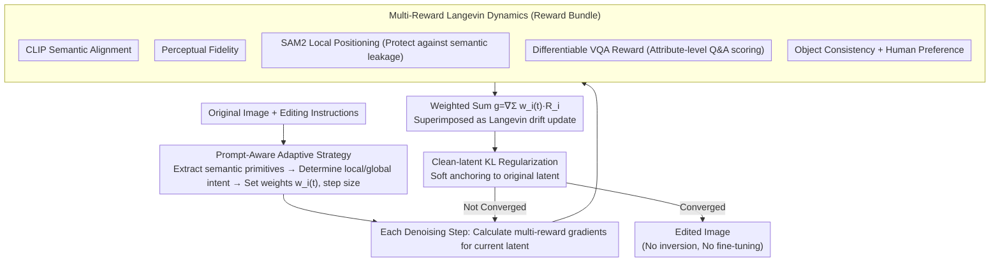

# RewardFlow: Generate Images by Optimizing What You Reward

**Conference**: CVPR 2026  
**arXiv**: [2604.08536](https://arxiv.org/abs/2604.08536)  
**Code**: [https://huggingface.co/onkarsus13/RewardFlow](https://huggingface.co/onkarsus13/RewardFlow)  
**Area**: Image Generation/Editing  
**Keywords**: Reward-guided generation, Diffusion models, Langevin dynamics, Image editing, Compositional generation

## TL;DR

RewardFlow proposes an inversion-free inference-time framework that integrates multiple differentiable reward signals—including semantic alignment, perceptual fidelity, local positioning, object consistency, and human preference—via multi-reward Langevin dynamics. It achieves SOTA editing fidelity and compositional alignment in image editing and compositional generation tasks.

## Background & Motivation

**Background**: Diffusion and flow-matching models have achieved great success in image generation, yet controllable editing and compositional generation remain challenging. Existing methods often rely on text guidance or model fine-tuning to achieve specific editing effects.

**Limitations of Prior Work**: Current image editing methods face three primary issues: (1) Inversion-based methods are computationally expensive and prone to noise accumulation; (2) A single reward signal cannot simultaneously balance semantic correctness, visual fidelity, and local precision; (3) "Semantic leakage" often occurs during the editing process, where edits inadvertently spread beyond the target regions.

**Key Challenge**: The coordination of heterogeneous reward objectives (semantic alignment, perceptual quality, regional precision, human preference, etc.). Simple weighting often leads to certain objectives being suppressed, and different editing intents require distinct reward weight configurations.

**Goal**: To design a unified inference-time framework that integrates multiple complementary differentiable reward signals into the sampling process of diffusion/flow-matching models without requiring fine-tuning or inversion.

**Key Insight**: Starting from Langevin dynamics, the authors theorize the reward-guided sampling process as an effective discretization of a Langevin SDE targeting a prompt-tilted density, providing theoretical guarantees for stable convergence.

**Core Idea**: A bundle of complementary differentiable rewards (CLIP semantic alignment, perceptual fidelity, SAM2 localization, object consistency, human preference) plus a newly proposed differentiable VQA attribute-level reward are unified into the sampling process via Langevin dynamics. A prompt-aware adaptive strategy is designed to dynamically adjust reward weights.

## Method

### Overall Architecture

The objective of RewardFlow is straightforward: to allow a pre-trained diffusion/flow-matching model to modify an image according to editing instructions without fine-tuning or inverting the original image. It reinterprets "editing" as "optimizing the rewards you actually want during the sampling process." Given the original image and instructions, the model performs step-by-step denoising as usual, but at each step, it additionally calculates gradients for several differentiable rewards relative to the current latent, using these gradients to push the denoising direction toward "instruction-compliant" regions. To prevent the image from being distorted beyond recognition, the entire sampling trajectory is softly anchored to the original latent via a clean-latent KL regularization term. This process is proven by the authors to be equivalent to the discretization of a Langevin SDE whose target is a prompt-tilted density, providing a theoretical rather than purely heuristic basis for convergence.

The figure below illustrates this inference-time sampling loop: the prompt-aware strategy first configures weights based on the instructions; then, each denoising step superimposes multi-reward gradients and is pulled back by KL regularization, cycling until convergence.

### Key Designs

**1. Multi-Reward Langevin Dynamics: Monitoring multiple editing dimensions with a bundle of rewards**

Quality in image editing is never determined by a single standard—semantics must be correct, image quality must not degrade, changes must be localized, and the result must be aesthetically pleasing. Any single reward fails to capture all these: focusing solely on CLIP semantics may sacrifice image quality, while focusing only on perceptual quality may fail to modify the target object. RewardFlow thus synthesizes five categories of differentiable rewards into a bundle: semantic alignment (CLIP-style text-image matching), perceptual fidelity (post-edit image quality), local positioning (regional constraints via SAM2), object consistency, and human preference (e.g., ImageReward). At each sampling step, each reward calculates its gradient with respect to the current latent, which are then weighted and summed into a unified correction signal:

$$g(x_t) = \nabla_{x_t} \sum_i w_i(t)\, R_i(x_t)$$

Superimposing this onto the original denoising update is equivalent to adding a drift toward multi-objective optimal regions on top of the "random walk" of Langevin sampling. Unlike simple post-hoc weighting, this fusion occurs at every step of sampling, and weights change over time steps, ensuring no single objective is suppressed by another from the start.

**2. Differentiable VQA Reward: Extracting attribute-level precision via Q&A**

Global semantic models like CLIP excel at judging "overall similarity" but have limited resolution for fine-grained attributes such as "is the car red?" or "is the background at night?" Image editing, however, often involves modifying specific attributes. RewardFlow's solution is to decompose editing instructions into several attribute-related Q&A pairs and use a differentiable VQA model to score the current image question by question, using the probability of a correct answer as the reward. Since VQA performs vision-language reasoning, it provides precise instruction-level signals regarding whether an attribute has been corrected, filling the gaps left by global semantic rewards. Being differentiable allows this feedback to propagate gradients directly for sampling correction.

**3. Prompt-Aware Adaptive Strategy: Letting instructions dictate reward priority**

Different editing tasks rely on rewards to varying degrees—local color changes should trust SAM2 regional constraints most, while global style transfers should prioritize perceptual rewards. Using a fixed weight across all tasks inevitably penalizes certain objectives. This strategy first extracts semantic primitives from the editing instructions (editing type: color transformation / style transfer / object addition...) to infer global vs. local intent. It then dynamically modulates the weight $w_i(t)$ and step size for each reward during sampling. Consequently, the local positioning reward is automatically prioritized during local color edits, while the perceptual reward dominates during global style transfer, eliminating manual per-task parameter tuning.

### Case Study: Changing a red car to blue

The input is a street scene and the instruction "change the car to blue." The prompt-aware strategy first parses this as a **local + color transformation** edit, increasing the weight of the SAM2 local positioning reward to restrict changes to the car body; the VQA reward is decomposed into the question "Is the color of the car blue?" for continuous scoring. Once sampling begins, each denoising step superimposes gradients from this bundle: the semantic alignment reward pulls the image toward "blue car" semantics, the VQA reward focuses on the color attribute for refinement, and the SAM2 positioning reward suppresses changes attempting to spill into the road or sky (preventing "semantic leakage"). Meanwhile, the clean-latent KL regularization anchors the background and car shape to the original image, ensuring only the color changes. After dozens of sampling steps, a blue car with clean color replacement and a static background is produced—without ever inverting the original image or training a dedicated editing model.

### Loss & Training

RewardFlow is a pure inference-time framework and requires no additional training. The "loss" is entirely reflected in the reward gradient guidance during the sampling phase: the multi-reward fusion signal $\nabla_x \sum_i w_i(t)\cdot R_i(x_t)$ provides the drift toward multi-objective optimality, while the clean-latent KL regularization anchors the sampling trajectory near the original latent. This acts as a soft constraint between "reward maximization" and "fidelity to original content." The authors further demonstrate that these updates correspond to a valid Langevin SDE discretization for a prompt-tilted density, providing theoretical convergence guarantees.

## Key Experimental Results

### Main Results

| Benchmark | Metric | RewardFlow | Prev. SOTA | Gain |
|-----------|------|-----------|----------|------|
| EMU-Edit | Edit Fidelity | SOTA | - | Significant |
| T2I-CompBench | Compositional Alignment | SOTA | - | Significant |
| MagicBrush | CLIP-I / DINO Score | Best | InstructPix2Pix, etc. | 1st in multiple |
| InstructPix2Pix Bench | Editing Quality | Best | SDEdit, P2P | Exceeds all baselines |

### Ablation Study

| Configuration | Edit Fidelity | Description |
|------|----------|------|
| Full RewardFlow | Best | All rewards + Adaptive strategy |
| w/o VQA Reward | Significant Drop | Lacks fine-grained attribute supervision |
| w/o SAM Localization | Increased Leakage | Poor control over editing regions |
| w/o Adaptive Policy | Performance Drop | Weights cannot adapt to different intents |
| w/o KL Regularizer | Excessive Drift | Loss of original content anchoring |

### Key Findings

- The VQA reward contributes most to fine-grained editing (color, texture changes); its removal significantly degrades attribute-level accuracy.
- SAM2 localization effectively prevents semantic leakage and is indispensable for local editing scenarios.
- The adaptive strategy automatically adjusts weight distribution based on editing intent, avoiding manual tuning.
- The inversion-free design significantly reduces computational overhead while maintaining generation quality.

## Highlights & Insights

- **Theoretical Elegance of Multi-Reward Langevin Dynamics**: Unifying multi-objective optimization as a Langevin SDE discretization is both theoretically grounded and practically efficient. The philosophy of "optimizing what you reward during sampling" is intuitive and versatile.
- **Innovation of VQA as a Fine-Grained Reward**: Using a VQA model to provide attribute-level feedback is a clever design that could be transferred to any generation task requiring fine-grained semantic control.
- **Training-Free Inference-Time Method**: Avoids the cost of training specialized models for every edit type; diverse editing is achieved simply by combining different rewards.

## Limitations & Future Work

- Gradient calculation for multiple reward functions increases inference latency, which may be a bottleneck for real-time applications.
- The quality of the reward functions themselves determines the upper bound of editing performance—inaccuracies in a reward model for specific scenes will degrade overall results.
- The adaptive strategy currently relies on heuristic semantic primitive extraction; learnable intent inference might yield better results.
- Robustness in highly complex compositional editing scenarios (e.g., simultaneously modifying different attributes of multiple objects) remains to be verified.

## Related Work & Insights

- **vs. SDEdit / DDIM Inversion**: These methods require inverting the original image to noise space before editing, leading to computational costs and error accumulation. RewardFlow requires no inversion, guiding the process directly during sampling.
- **vs. InstructPix2Pix**: InstructPix2Pix requires training a dedicated editing model. RewardFlow is a pure inference-time method that does not modify model weights.
- **vs. Single Reward Guidance (e.g., DPS)**: Methods like DPS typically use only a single reward for guidance. RewardFlow’s multi-reward fusion + adaptive weight strategy is significantly more flexible.

## Rating

- Novelty: ⭐⭐⭐⭐ The multi-reward Langevin framework has theoretical contributions, though reward-guided generation is an established direction.
- Experimental Thoroughness: ⭐⭐⭐⭐ Validated across multiple benchmarks with comprehensive ablations.
- Writing Quality: ⭐⭐⭐⭐ Tight integration of theory and experiments with a clear structure.
- Value: ⭐⭐⭐⭐ The idea of inference-time multi-reward guidance is highly generalizable and holds significant practical value.

<!-- RELATED:START -->

## Related Papers

- [\[CVPR 2026\] Align Images Before You Generate](align_images_before_you_generate.md)
- [\[CVPR 2026\] Low-Resolution Editing is All You Need for High-Resolution Editing](low-resolution_editing_is_all_you_need_for_high-resolution_editing.md)
- [\[CVPR 2026\] Enhancing Spatial Understanding in Image Generation via Reward Modeling](enhancing_spatial_understanding_in_image_generation_via_reward_modeling.md)
- [\[CVPR 2026\] UniGen-1.5: Enhancing Image Generation and Editing through Reward Unification in RL](unigen-15_enhancing_image_generation_and_editing_through_reward_unification_in_r.md)
- [\[CVPR 2026\] CTCal: Rethinking Text-to-Image Diffusion Models via Cross-Timestep Self-Calibration](ctcal_rethinking_text-to-image_diffusion_models_via_cross-timestep_self-calibrat.md)

<!-- RELATED:END -->
