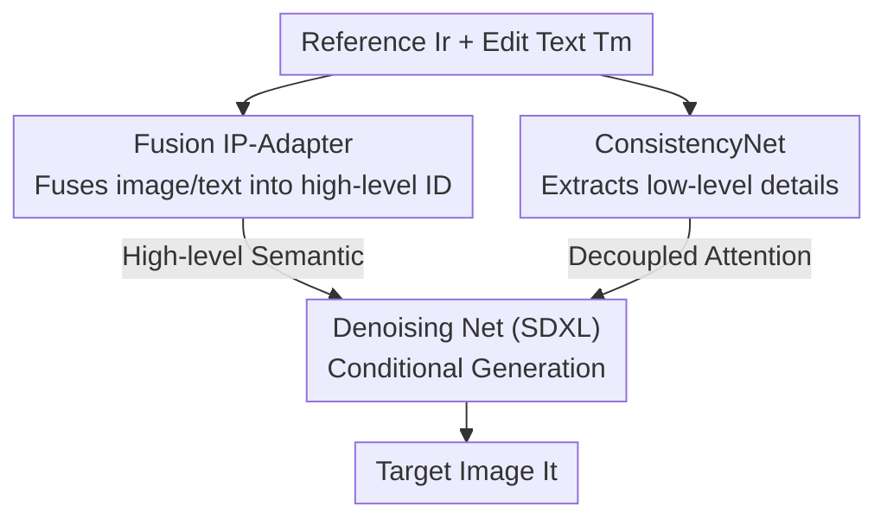

# Say Cheese! Detail-Preserving Portrait Collection Generation via Natural Language Edits

**Conference**: CVPR 2026  
**Paper**: [CVF Open Access](https://openaccess.thecvf.com/content/CVPR2026/html/Sun_Say_Cheese_Detail-Preserving_Portrait_Collection_Generation_via_Natural_Language_Edits_CVPR_2026_paper.html)  
**Code**: None  
**Area**: Image Generation  
**Keywords**: Portrait Generation, Natural Language Editing, IP-Adapter, Detail Preservation, Diffusion Models

## TL;DR
This paper introduces the new task of "Portrait Collection Generation (PCG)"—generating a set of portraits with consistent identity and details but varying poses, perspectives, and compositions, given a reference portrait and natural language editing instructions. For this purpose, the first large-scale dataset, CHEESE (~24K collections, 576K triplets, annotated via Large Vision-Language Models + inversion verification), was constructed, and the SCheese framework was designed (Fusion IP-Adapter for identity, ConsistencyNet + Decoupled Attention for details), achieving Prev. SOTA performance in Prompt Following (PF) and Detail Preservation (DP).

## Background & Motivation
**Background**: In the social media era, users want to "replicate" a consistent set of stylized portraits with diverse poses from a single reference photo. This is essentially a reference-based image editing problem: existing approaches either rely on structural conditions like ControlNet (depth maps, Canny edges) for fine-grained control or instruction-editing models (like InstructPix2Pix) fine-tuned on instruction datasets.

**Limitations of Prior Work**: Both approaches are insufficient. Structural conditions (ControlNet/ControlNet++) "lock" the spatial layout; the generation results are strictly constrained by the pose and composition of the reference image, failing to meet the layout flexibility required in portrait photography. Instructions in instruction-editing models are often single-dimensional (changing an expression or background) and cannot handle composite instructions such as "simultaneously changing pose + camera angle + composition." Regarding detail preservation, DreamBooth/LoRA require individual training per subject and are not scalable; zero-shot methods like IP-Adapter/InstantID are fast but rely on high-level semantic embeddings, **failing to preserve pixel-level details** (makeup, clothing patterns, jewelry), which blur under complex changes.

**Key Challenge**: PCG must satisfy two conflicting goals: **substantial changes** (composite transformations of pose/camera/composition) and **strict detail preservation** (pixel-level consistency of identity + attire + accessories). The more radical the change, the easier it is to lose details; the stricter the preservation, the more likely the model is to "copy-paste" the original image and fail to execute instructions. Existing methods optimize only one end of this spectrum.

**Goal**: (1) Create training data supporting "composite changes + detail preservation"; (2) Design a generation framework that balances this contradiction.

**Key Insight**: Hierarchically separate "identity preservation" and "detail preservation" structurally—high-level semantics (identity, overall style) belong to one conditional branch, while low-level pixel details (patterns, jewelry) belong to another, preventing a single embedding from failing at both tasks by trying to handle both.

**Core Idea**: Use "text-infused image conditions (Fusion IP-Adapter)" to provide precise high-level identity guidance, and use an "extra UNet encoder + Decoupled Attention (ConsistencyNet)" to inject low-level details of the reference image directly into the denoising process. These two cooperate to achieve high-fidelity detail preservation under composite changes.

## Method

### Overall Architecture
SCheese aims to solve: given a triplet $(I_r, T_m, I_t)$—reference image $I_r$, editing text $T_m$, and target image $I_t$ (known during training, to be generated during inference)—generate a target image that satisfies $T_m$ while preserving the details of $I_r$. The system is divided into two parts: the **Data Side** uses a Large Vision-Language Model (LVLM) to automatically annotate web-scraped portrait collections into triplets with "composite editing instructions" and performs inversion verification (resulting in the CHEESE dataset); the **Model Side** uses Stable Diffusion (SDXL) as the denoising backbone, equipped with two conditional modules—Fusion IP-Adapter for high-level identity semantics and ConsistencyNet for low-level details via decoupled attention, with the Denoising Net generating the final target.

The following diagram illustrates the data flow for the generation side (SCheese model): the reference image and editing text enter two separate conditional branches before merging into the main denoising network.

> Note: The dataset construction pipeline (Key Design 1) is an offline process for producing training data and is not included in the generation diagram above; the model is trained using the CHEESE triplets produced by it.

### Key Designs

**1. CHEESE Data Construction: LVLM Annotation + Inversion Verification**

PCG lacks data—existing instruction-based datasets feature only single-attribute changes, which cannot support the composite instruction training of "simultaneous pose/angle/composition changes." The authors created data using a three-step automated pipeline. **Image Pairing**: Approximately 24K portrait collections (multiple images of the same subject and style) were collected from the web. All image pairs $(I_i, I_j)$ within a collection were enumerated, and LVLM was used to filter out near-duplicates and pairs with excessive background/scene drift—the former lacks editing value, while the latter conflates "detail preservation" with "scene change," interfering with supervision. **Instruction Annotation**: For the remaining pairs $(I_r, I_t)$, LVLM generated editing text $T_m$ describing the $I_r{\to}I_t$ transformation. Prompts explicitly required coverage of camera angle (depth of field/viewpoint), spatial layout, and subject-level changes (pose/expression/orientation), allowing a single text to cover multi-dimensional composite changes.

Since direct LVLM annotation quality is unstable, a critical **Inversion Verification** step was added: given $(I_r, T_m)$, the LVLM generates an "inversion target description" $\hat c$—a text predicting what the target image should look like based on the reference and instruction. The CLIP similarity $s = \cos(f_I(I_t), f_T(\hat c))$ is then calculated. If $s > \tau$, the $T_m$ is accepted; otherwise, the failed sample $(T_m, s)$ is used as feedback to re-prompt the LVLM for a refined version $T'_m$, with up to $M$ retries. The intuition is: if the instruction is accurate and comprehensive, the "target description derived from the instruction" should highly align with the real target image. This score quantifies annotation quality, specifically salvaging annotations for complex multi-attribute instructions. The paper uses $\tau=0.45$ and $M=5$. The result is ~24K collections, ~40K images, and ~576K triplets. (Note: discrepancies in numbers like 573K/575K/576K appear in the paper; the experimental section value is used here).

**2. Fusion IP-Adapter: Fusing Edit Text into Image Conditions for Precise ID Control**

Standard IP-Adapter encodes only $I_r$ to produce an image condition, which only describes the "reference image itself" without knowing how the user wants to change it. This leads to a gap between the condition and the desired target features, resulting in poor instruction following. This work's modification is inspired by Composed Image Retrieval (CIR): an additional text encoder extracts the semantics of $T_m$. Image features $f_r = f_{img}(I_r)$ and text features $f_m = f_{txt}(T_m)$ are concatenated and fused via a query-based projection network: $f_{fused} = \mathrm{Proj}([f_r; f_m])$. The resulting fused condition directly approximates the "target image features" rather than the "reference image features," providing the denoising network with conditions that better fit the user's desired outcome, reducing ambiguity and improving instruction following.

To ensure the fusion quality approximates the target, an **Alignment Loss** is added: KL divergence constrains the fused features to align with the image features of the target image, $L_{align} = \mathrm{KL}(f_{fused} \,\|\, f_{img}(I_t))$. Simultaneously, **teacher forcing** is used during training: with probability $p_{ro}$, the fused features are replaced with the ground-truth target features $f_{img}(I_t)$. This provides two training modes—using target features provides a "precise supervision signal" for better learning, while using fused features simulates the real inference scenario. Alternating between these allows the model to benefit from strong supervision without over-fitting to the requirement of having target features at inference time. The paper uses $p_{ro}=0.35$.

**3. ConsistencyNet + Decoupled-Attention: Pixel-level Injection of Low-level Details**

Even with Fusion IP-Adapter handling high-level semantics, pixel-level details (complex patterns, prints, intricate jewelry) are lost in high-level embeddings. The countermeasure is a separate UNet encoder, **ConsistencyNet**, which extracts low-level intermediate representations of $I_r$ and injects them into the generation process via **Decoupled-Attention**. Specifically, in each block of the denoising UNet, a cross-attention layer is added in **parallel** to the existing self-attention: the query for cross-attention comes from the current generated image $I_t$, while key/value come from $I_r$. The outputs of self-attention and cross-attention are **averaged** and then further fused with features from the text encoder and Fusion IP-Adapter through a decoupled cross-attention layer.

This "decoupled + additive" design is key: self-attention focuses on internal spatial dependencies of the generated image, while cross-attention handles the explicit alignment between "generation state ↔ reference features." Both maintain individual feature spaces and combine via addition, allowing the model to **selectively** absorb reference details without disrupting the main generation flow (avoiding "copy-pasting" the reference image). An implementation trick: ConsistencyNet uses a pretrained inpainting model with its **mask-related layers removed**, as inpainting models are inherently skilled at pixel-level correspondence/completion.

### Loss & Training
Total Objective = Diffusion Denoising Loss + Alignment Loss $L_{align}$ (KL). Training utilizes teacher forcing ($p_{ro}=0.35$ replacement with target features). Implementation: Denoising Net uses SDXL, ConsistencyNet uses SDXL inpainting model, Fusion IP-Adapter uses IP-Adapter+ initialized with Kolors weights; 8×H800 80GB, effective batch 64, 50k steps, AdamW, learning rate 1e-5. Data side LVLM uses Qwen2.5-VL 72B; text/image encoders use OpenCLIP ViT-G/14.

## Key Experimental Results

### Main Results
The test set consists of ~2K CHEESE triplets. Metrics: CLIP-I / DINO-I measure detail similarity with the reference (tending toward global similarity and easily skewed by "copy-pasting"), CLIP-T measures instruction following, plus two LVLM evaluations using Qwen2.5-VL 72B—Qwen-DP (Detail Preservation) and Qwen-PF (Prompt Following), with a de-biasing mechanism in the prompt to penalize "copy-pasting."

| Method | CLIP-I | DINO-I | CLIP-T | Qwen-DP | Qwen-PF |
|------|--------|--------|--------|---------|---------|
| DreamBooth | 0.642 | 0.636 | 0.375 | 0.305 | 0.443 |
| DB LoRA | 0.738 | 0.677 | 0.395 | 0.458 | 0.579 |
| IP-Adapter | 0.764 | 0.663 | 0.386 | 0.464 | 0.511 |
| IP-Adapter+ | 0.794 | 0.699 | 0.376 | 0.659 | 0.549 |
| EasyRef | 0.783 | 0.687 | 0.358 | 0.647 | 0.545 |
| Emu2 | 0.849 | 0.821 | 0.379 | 0.767 | 0.352 |
| Kolors | 0.853 | 0.824 | 0.406 | 0.808 | 0.428 |
| Kontext | 0.857 | 0.791 | 0.413 | 0.792 | 0.679 |
| **Ours** | 0.839 | 0.773 | **0.436** | **0.855** | **0.793** |

Ours achieves the highest scores in CLIP-T, Qwen-DP, and Qwen-PF. While Kontext / Emu2 have slightly higher CLIP-I and DINO-I, the authors note this reflects their tendency to "copy-paste" the reference image (with significantly lower PF, e.g., Emu2 at 0.352), inflated reference similarity at the cost of failing instructions—exactly what the LVLM de-biasing metric exposes.

**User Study** (50 samples, 0–4 scale, including Collection Coherence "willingness to put generated images in the same collection"):

| Metric | Target (Upper) | Emu2 | Kolors | Kontext | Ours |
|------|------|------|--------|---------|---------|
| Human-DP | 0.936 | 0.158 | 0.410 | 0.653 | **0.778** |
| Human-PF | 0.930 | 0.138 | 0.397 | 0.670 | **0.803** |
| Human-CC | 0.915 | 0.115 | 0.293 | 0.467 | **0.688** |

Human evaluation aligns with LVLM results; Ours leads among models in all three metrics. The near-perfect PF of "Target" confirms superior annotation quality.

### Ablation Study
Incremental ablation of components (starting from zero-shot IP-Adapter):

| Config | CLIP-I | DINO-I | CLIP-T | Qwen-DP | Qwen-PF | Description |
|------|--------|--------|--------|---------|---------|------|
| IP-Adapter (Zero-shot) | 0.853 | 0.824 | 0.406 | 0.808 | 0.428 | Baseline, extremely low PF |
| + SFT | 0.822 | 0.728 | 0.421 | 0.783 | 0.683 | Fine-tuning on CHEESE greatly boosts PF |
| + ConNet | 0.826 | 0.732 | 0.418 | 0.832 | 0.673 | Adding ConsistencyNet noticeably boosts DP |
| + Fusion IP-A | 0.828 | 0.732 | 0.416 | 0.828 | 0.723 | Adding fused text conditions boosts PF |
| + Align Loss | 0.837 | 0.753 | 0.426 | 0.836 | 0.777 | Alignment loss provides overall Gain |
| + Teacher (Full) | 0.839 | 0.773 | 0.436 | 0.855 | 0.793 | Teacher forcing achieves best overall metrics |

An ablation on "Inversion Verification" shows that verification guides the LVLM to detect subtle differences and provide more comprehensive annotations; ViT-G/14 outperformed ViT-B/32 by providing more accurate supervision signals.

### Key Findings
- **SFT is the primary driver of PF (Prompt Following)**: Fine-tuning on CHEESE increased Qwen-PF from 0.428 to 0.683, proving that composite instruction data itself is key—without it, no zero-shot model can handle composite edits.
- **ConsistencyNet is the primary driver of DP (Detail Preservation)**: +ConNet increased Qwen-DP from 0.783 to 0.832. While PF slightly decreased—confirming that detail injection pulls the model toward the reference—Fusion IP-Adapter recovers instruction following. The dual branches successfully manage competing objectives.
- **Teacher forcing is the finishing touch**: Final improvements across all metrics suggest that "using ground-truth target features as precise supervision" benefits both the fusion module and the denoising network.
- **CLIP-I/DINO-I can be misleading**: High reference similarity might just be "copy-pasting." It must be paired with PF (LVLM or Human) to reveal true capability—a valuable methodological insight for evaluation.

## Highlights & Insights
- **Dual-branch management of "high-level semantics / low-level details"** is a core innovation: forcing one embedding to handle both identity and intricate patterns inevitably fails. By splitting into Fusion IP-Adapter (high-level) and ConsistencyNet (low-level) separate pathways, the model addresses the PCG dilemma. This "hierarchical feature division" is transferable to any task requiring large modifications alongside strict detail preservation.
- **Inversion verification quantifies "annotation quality"**: Using LVLM to infer a target description from an instruction and checking CLIP similarity against the truth—with feedback loops for failure—creates a universal "automated annotation loop" reusable for other high-quality conditional text generation tasks.
- **Reusing an inpainting model as ConsistencyNet** (minus mask layers) is a cost-effective, logical engineering choice: inpainting models naturally excel at pixel-level completion, fitting the "detail preservation" requirement without needing a detail encoder trained from scratch.
- **Teacher forcing applied to diffusion conditions**: Moving the teacher forcing concept from sequence generation to "fused vs. target features" to balance strong supervision with inference consistency is a useful training trick.

## Limitations & Future Work
- **Data Sourcing and Privacy**: CHEESE is scraped from real portraits; the authors do not fully discuss authorization and privacy risks. Identity-consistent generation also carries risks of misuse (faking portraits).
- **Dependency on heavy LVLMs**: The data construction pipeline depends on Qwen2.5-VL 72B, limiting reproducibility and cost-effectiveness. Sensitivity analyses for hyper-parameters like $\tau=0.45$ and $M=5$ are missing. ⚠️
- **Metric Bias**: The authors correctly identify CLIP-I/DINO-I bias, yet their own Qwen-DP/PF metrics rely on another LVLM, potentially creating a "circular bias" (using LVLMs to evaluate LVLM-annotated data). The human evaluation sample size (50) is relatively small.
- **Numerical Inconsistencies**: There are small discrepancies in the sample count (573K/575K/576K) across the abstract, introduction, and experiment sections. ⚠️
- **Future Directions**: Exploring lightweight annotation (distilling LVLM capabilities), making inversion verification thresholds adaptive, and evaluating the detail-instruction balance under extreme changes (changing clothes/scenes).

## Related Work & Insights
- **vs. IP-Adapter / IP-Adapter+**: IP-Adapter encodes only the reference as an image condition via high-level semantics, losing pixel details in complex edits and lacking "how to change" information. Ours fuses edit text into the condition, aligns with target features via KL loss, and uses ConsistencyNet for low-level details, surpassing them in PF/DP.
- **vs. DreamBooth / LoRA**: These require per-subject fine-tuning, multiple reference samples, and are not scalable. In this task, DreamBooth had the lowest DP/PF (0.305/0.443). Ours is zero-shot, requiring only one reference image, making it more scalable.
- **vs. Emu2 / FLUX.1 Kontext / Kolors**: These strong general models have higher reference similarity (CLIP-I/DINO-I) but at the cost of "copy-pasting" and failing instructions (low PF). Ours is superior at the balance of "substantial change + preservation."
- **vs. ControlNet / ControlNet++**: Structural conditions like depth/edges lock spatial layout, sacrificing the compositional freedom needed for portraits. Ours uses text instructions + dual-branch conditions to retain layout diversity.

## Rating
- Novelty: ⭐⭐⭐⭐ Proposes the PCG task, the first large dataset, and a dual-branch fidelity framework. Clear problem definition with real-world demand, though individual modules are clever combinations of existing tech.
- Experimental Thoroughness: ⭐⭐⭐⭐ Compared against 9 baselines, included LVLM and human evals, and full component/data ablations. However, human evaluation is small and key hyper-parameters lack sensitivity analysis.
- Writing Quality: ⭐⭐⭐⭐ Motivation and methodology are clear; diagrams are effective. Minor numerical inconsistencies in data counts.
- Value: ⭐⭐⭐⭐ Task and dataset are highly practical for photography, e-commerce, and social media. The "dual-branch division + inversion verification" ideas are highly transferable.

<!-- RELATED:START -->

## Related Papers

- [\[CVPR 2026\] FlowFixer: Towards Detail-Preserving Subject-Driven Generation](flowfixer_towards_detail-preserving_subject-driven_generation.md)
- [\[CVPR 2026\] HiFi-Inpaint: Towards High-Fidelity Reference-Based Inpainting for Generating Detail-Preserving Human-Product Images](hifi-inpaint_towards_high-fidelity_reference-based_inpainting_for_generating_det.md)
- [\[CVPR 2026\] ExpPortrait: Expressive Portrait Generation via Personalized Representation](expportrait_expressive_portrait_generation_via_personalized_representation.md)
- [\[CVPR 2026\] FG-Portrait: 3D Flow Guided Editable Portrait Animation](fg-portrait_3d_flow_guided_editable_portrait_animation.md)
- [\[CVPR 2026\] Attribute-Preserving Pseudo-Labeling for Diffusion-Based Face Swapping](attribute-preserving_pseudo-labeling_for_diffusion-based_face_swapping.md)

<!-- RELATED:END -->
