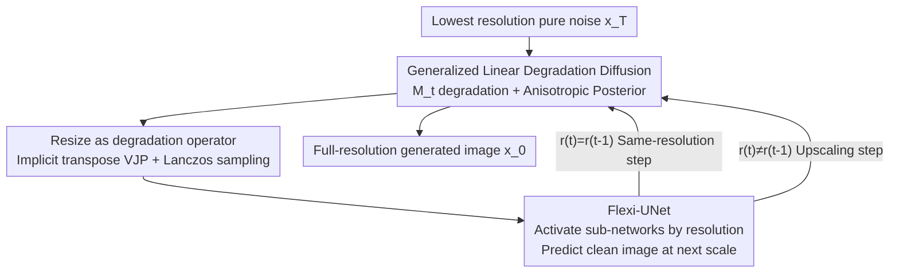

# Scale Space Diffusion: Integrating Scale Space into the Diffusion Process

**Conference**: CVPR 2026  
**Paper**: [CVF Open Access](https://openaccess.thecvf.com/content/CVPR2026/html/Mukhopadhyay_Scale_Space_Diffusion_CVPR_2026_paper.html)  
**Code**: None (Project page: prateksha.github.io/projects/scale-space-diffusion)  
**Area**: Diffusion Models / Image Generation  
**Keywords**: Scale Space, Pixel Diffusion, Generalized Linear Degradation, Multi-resolution Generation, Flexi-UNet

## TL;DR
This paper argues that "diffusion noising" and "scale-space downsampling" are nearly equivalent in terms of information degradation—high-noise states carry no more information than a small image. By treating "progressive downsampling" as the degradation operator in the diffusion process, the authors derive a family of Scale Space Diffusion (SSD) based on generalized linear degradation. This allows the model to perform high-noise steps at low resolutions and low-noise steps at high resolutions. Accompanied by a Flexi-UNet that activates only relevant network layers, the method reduces training time and FLOPs by more than half on CelebA / ImageNet at the cost of a slight FID increase.

## Background & Motivation
**Background**: Pixel-domain diffusion models (DDPM families) perform denoising at **full resolution** across all timesteps $t$. Previous observations suggest that different stages of diffusion encode different levels of information—higher noise levels first lose fine textures and then coarse structures, essentially forming an "information hierarchy." Another classic tool in computer vision, scale space (Gaussian pyramids), also generates an information hierarchy through successive low-pass filtering and downsampling.

**Limitations of Prior Work**: If high-noise diffusion states only contain coarse structures with information equivalent to a small image, processing them on full-resolution tensors is a waste of computation. Existing attempts to introduce multi-resolution into diffusion either compute at the highest resolution (Cascaded Diffusion, Matryoshka), rely on simplifying assumptions like isotropic covariance (UDPM, which fails as resize kernels overlap), or inject **additional high-frequency/decorrelated noise** during scale transitions to align distributions (Relay Diffusion, Pyramidal Flow Matching). The latter is essentially an **inference-time approximation**, as the diffusion process itself is not mathematically modeled to "change resolution."

**Key Challenge**: Jumping between independent diffusion processes at different resolutions accumulates error, and patch-like noise addition does not solve the root cause—**the mathematical form of the diffusion forward process lacks a "resolution change" term.**

**Core Idea**: Replace the scalar coefficient $\sqrt{\alpha_t}$ of $x_{t-1}$ in the forward process with a **generalized linear operator** $M_t$ (using resizing to achieve scale space). This derives a family of "generalized linear degradation diffusion," allowing resolution changes to be naturally embedded in the forward and backward formulas—DDPM becomes a special case where $M_t$ is the identity operator.

## Method

### Overall Architecture
SSD unifies "noising" and "downsampling" into a single information degradation: the forward process starts from a clean image $x_0$, applying a linear degradation operator $M_t$ (resizing that reduces tensor size) and adding Gaussian noise at each step. Consequently, as $t$ increases, $x_t$ becomes noisier and lower in resolution. During sampling, starting from the **lowest resolution** pure noise, the model predicts the "clean image at the next resolution," denoises via the posterior distribution, and **upsamples** progressively until the target resolution is reached. Since $x_t$ varies in size across steps and sometimes requires higher-resolution outputs, a Flexi-UNet is designed to dynamically activate sub-networks based on resolution.

### Key Designs

**1. Generalized Linear Degradation Diffusion: Embedding "Downsampling" into Formulas**

Standard DDPM forward process is $x_t = \sqrt{\alpha_t}\,x_{t-1} + \sqrt{1-\alpha_t}\,\epsilon$, with the marginal $x_t = \sqrt{\bar\alpha_t}\,x_0 + \sqrt{1-\bar\alpha_t}\,\epsilon$. The authors replace the scalar $\sqrt{\alpha_t}$ with an arbitrary linear operator $M_t$. The transition distribution is $x_t = M_t x_{t-1} + \eta_t,\ \eta_t \sim \mathcal{N}(0, \Sigma_{t|t-1})$, where $\Sigma_{t|t-1}$ is **not** assumed to be isotropic. Under the constraint of "marginal isotropy" $\Sigma_t = \sigma_t^2 I$, the marginal is:

$$x_t = M_{1:t}\,x_0 + \sigma_t\,\epsilon,\qquad M_{1:t} = M_t M_{t-1}\cdots M_1.$$

The transition noise covariance is $\Sigma_{t|t-1} = \sigma_t^2 I - \sigma_{t-1}^2 M_t M_t^T$. To maintain positive semi-definiteness, it must satisfy $\sigma_t^2 \ge \sigma_{t-1}^2\,\lambda_{\max}(M_t M_t^T)$, coupling "noise scheduling" with "degradation intensity." The reverse posterior $q(x_{t-1}\mid x_t, x_0)$ remains Gaussian. Simplified via the Woodbury identity, it is:

$$\Sigma_{t\to t-1} = \sigma_{t-1}^2 I - \frac{\sigma_{t-1}^4}{\sigma_t^2} M_t^T M_t,\qquad \mu_{t\to t-1} = \mu_{t-1} + \frac{\sigma_{t-1}^2}{\sigma_t^2} M_t^T\big(x_t - M_t \mu_{t-1}\big).$$

When $M_t = \sqrt{\bar\alpha_t}\,I$ and $\sigma_t = \sqrt{1-\bar\alpha_t}$, the equations revert to DDPM. The fundamental difference from "inference-time scale alignment" (e.g., Pyramidal Flow) is that resolution change is a **first-class citizen in the forward process**, with the posterior and noise distributions rigorously derived from $M_t$.

**2. Resize as Degradation: Implicit Operators and Lanczos Sampling**

Setting $M_t$ as "resize (bilinear with anti-aliasing) multiplied by $a_t = \sqrt{\bar\alpha_t}$" embeds the Gaussian pyramid into diffusion. A **resolution schedule** $r(t)$ maps timesteps to resolutions. Since $M_t$ is a function call without an explicit matrix, its transpose $M_t^T$ and the square root of the anisotropic covariance $\Sigma_{t\to t-1}$ are handled as follows:

- **Transpose $M_t^T$**: Leverages Vector-Jacobian Products (VJP), $M_t^T v = \nabla_x \langle v, M_t x\rangle$, computed via `torch.autograd.grad(M(x), x, grad_outputs=v)`.
- **Anisotropic Noise Sampling**: Sampling from $\mathcal{N}(0, \Sigma_{t\to t-1})$ requires $\Sigma_{t\to t-1}^{1/2}\epsilon$. Since $\Sigma_{t\to t-1}$ acts implicitly, the **Lanczos algorithm** is used to apply a square-root spectral function to the implicit symmetric operator $A(\cdot)=I - \rho\,M_t^T M_t$ (where $\rho=\sigma_{t-1}^2/\sigma_t^2$). Forcing isotropic approximations at this stage leads to saturation artifacts.

For steps without resolution changes ($r(t)=r(t-1)$), $M_t$ reduces to scalar multiplication, and the posterior reverts to standard DDPM, allowing `torch.randn()`. Lanczos is only used for cross-resolution steps with negligible overhead.

**3. Flexi-UNet: Dynamic Layer Activation**

The size of $x_t$ in SSD varies, and upscaling steps require "small input, large output." Using a standard UNet is problematic: first, it requires matching input/output sizes; second, the UNet depth limits the number of scales. Flexi-UNet addresses this: **inputs of different resolutions activate only relevant segments of the UNet**. High resolutions use the full network, while low resolutions bypass outer blocks and pass through deeper middle layers. $1\times1$ convolutions map input features to the corresponding channel dimensions. During upscaling steps, a non-symmetric path (extra upsampling block) is used, and skip-connections from skipped encoder blocks are filled with **zero tensors**.

### Loss & Training
The model predicts the "clean image at the next resolution" $x_{0,\theta}^{r(t-1)}(x_t, t)$. The training objective is $x_0$-parameterized and weighted by the Signal-to-Noise Ratio (SNR), using Min-SNR-$\gamma$ ($\gamma=5$):

$$L = \mathbb{E}_{x_0,t,\epsilon}\Big[\min\big(s^2(t),\gamma\big)\,\big\|\,x_{0,\theta}^{r(t-1)}(x_t,t) - \tfrac{1}{a_{t-1}}M_{1:t-1}x_0\,\big\|_2^2\Big],$$

where $s(t)=\sqrt{\bar\alpha_t}/\sqrt{1-\bar\alpha_t}$. During training, to avoid size mismatches within a batch, a timestep $t$ is sampled first: if $r(t)=r(t-1)$, the batch is filled with various $t_i$ sharing that resolution; if $r(t)\neq r(t-1)$, the entire batch uses the same $t$. A ConvexDecay 0.5 schedule (staying longest at high resolution) is used.

## Key Experimental Results

Tasks include **unconditional image generation** on CelebA (resolutions 64/128/256) and ImageNet (64×64). Metrics reported are FID (50k samples), training time, and average GFLOPs per iteration. SSD(nL) denotes $n$ resolution levels.

### Main Results (CelebA Multi-resolution)

| Method | CelebA-64 FID | CelebA-64 Training (h) | CelebA-256 FID | CelebA-256 Training (h) | CelebA-256 GFLOPs |
|:---|:---:|:---:|:---:|:---:|:---:|
| DDPM-$\epsilon$ | 2.22 | 70.30 | 5.52 | 87.31 | 497.0 |
| DDPM-$x_0$ | 2.98 | 70.71 | 5.47 | 87.33 | – |
| Blurring Diffusion | 2.06 | 71.79 | 4.76 | 88.08 | – |
| **Ours (2L)** | **2.14** | **62.63** | – | – | – |
| **Ours (4L)** | 4.28 | 52.38 | 10.52 | 51.70 | 273.0 |
| **Ours (6L)** | – | – | 13.50 | **42.88** | 209.7 |

Increasing levels significantly reduces training time and GFLOPs at the cost of FID. SSD(6L) on CelebA-256 takes less than half the training time of DDPM (42.88h vs 87.31h) and less than half the GFLOPs (210 vs 497).

### Ablation Study

| Dimension | Configuration | Key Metric | Description |
|:---|:---|:---|:---|
| Architecture | Full UNet 2L | FID 2.33 / Inf. 16.19s | Baseline |
| | **Flexi-UNet 2L** | **FID 2.26 / Inf. 15.38s** | Slightly better FID and faster |
| | **Flexi-UNet 4L** | **FID 4.87 / Inf. 13.43s** | Speedup more significant at 4 levels |
| Resolution Schedule | ConvexDecay 2 | FID 11.03 / 11.71h | Fastest but worst quality |
| | **ConvexDecay 0.5** | **FID 4.87 / 13.81h** | Best FID, used as final |

### Key Findings
- **Level count is the core knob**: More resolution levels monotonically decrease training/FLOPs but increase FID, providing a quality-efficiency trade-off curve.
- **Resolution scheduling dictates the upper bound**: More steps at the highest resolution improve FID (ConvexDecay 0.5 is optimal) but increase training time.
- **Anisotropic sampling is essential**: Approximating with isotropic noise causes artifacts; Lanczos sampling is necessary.
- **Robust to sampling steps**: SSD is reportedly more robust to reduced sampling steps compared to DDPM.

## Highlights & Insights
- **Information equivalence ("High noise = Small image")**: Quantifying "proportion of signal-dominated pixels" and resolution information creates a clear design principle.
- **DDPM as a special case**: Theoretical compatibility with DDPM (where $M_t$ is identity) ensures framework validity.
- **Engineering of implicit operators**: Using VJP for transposes and Lanczos for covariance square roots makes non-isotropic posterior sampling practical.
- **Flexi-UNet zero-padding**: A clean solution to missing encoder skip-connections during upscaling steps, enabling cross-resolution parameter sharing.

## Limitations & Future Work
- **Quality cost**: Achieving significant efficiency gains requires sacrificing FID (e.g., 13.50 vs 5.47 on CelebA-256). It is a "quality-for-speed" trade-off rather than Pareto dominance.
- **Unconditional/Pixel-only**: Not yet validated on text-to-image, latent diffusion, or DiT backbones.
- **Limited degradation operators**: While the framework supports any linear $M_t$, only resizing was thoroughly explored in the main text.
- **Implementation complexity**: VJP and Lanczos increase the complexity of the training and sampling pipeline.

## Related Work & Insights
- **vs DDPM / Blurring Diffusion**: DDPM maintains fixed resolution; Blurring Diffusion degrades in the DCT domain but keeps tensor size. SSD changes spatial resolution to save computation during high-noise steps.
- **vs Cascaded / Matryoshka Diffusion**: These use multiple models or joint multi-res denoising but often compute on high resolutions. SSD uses a **single model** with rigorous posterior derivation for resolution transitions.
- **vs Relay / Pyramidal Flow Matching**: These rely on inference-time noise patches or isotropic assumptions for scale alignment. SSD embeds resolution changes into the forward process to address distribution mismatches at the root.

## Rating
- Novelty: ⭐⭐⭐⭐⭐ (Unifying scale space and diffusion hierarchy with generalized linear degradation)
- Experimental Thoroughness: ⭐⭐⭐⭐ (Extensive multi-res and ImageNet testing, though lacks large-scale conditional scenes)
- Writing Quality: ⭐⭐⭐⭐⭐ (Logical chain from intuition to mathematical derivation is very clear)
- Value: ⭐⭐⭐⭐ (Provides a new quality-efficiency axis; ideas are transferable to other linear degradation diffusion)

<!-- RELATED:START -->

## Related Papers

- [\[CVPR 2026\] Semantic Scale Space: A Framework for Controllable Image Abstraction](semantic_scale_space_a_framework_for_controllable_image_abstraction.md)
- [\[CVPR 2026\] DiP: Taming Diffusion Models in Pixel Space](dip_taming_diffusion_models_in_pixel_space.md)
- [\[CVPR 2026\] Latent Diffusion Inversion Requires Understanding the Latent Space](latent_diffusion_inversion_requires_understanding_the_latent_space.md)
- [\[CVPR 2026\] Elucidating the Design Space of Arbitrary-Noise-Based Diffusion Models](eda_arbitrary_noise_diffusion_design_space.md)
- [\[CVPR 2026\] Functional Mean Flow in Hilbert Space](functional_mean_flow_in_hilbert_space.md)

<!-- RELATED:END -->
