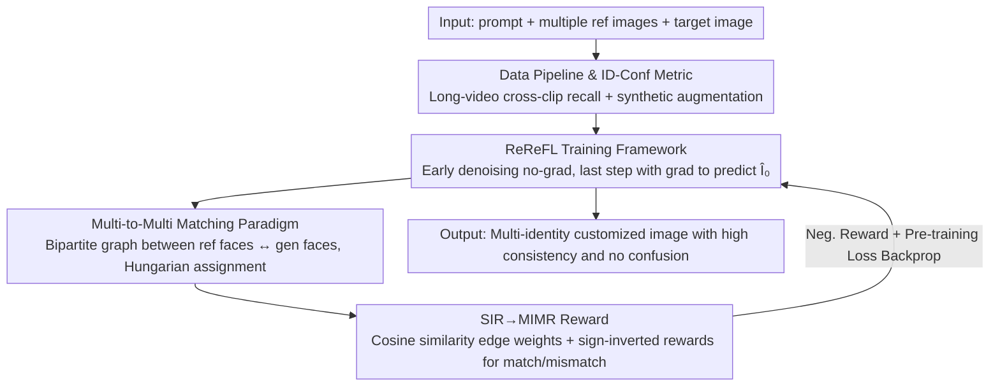

# Scaling Multi-Identity Consistency for Image Customization via Multi-to-Multi Matching Paradigm

**Conference**: CVPR 2026  
**Paper**: [CVF Open Access](https://openaccess.thecvf.com/content/CVPR2026/html/Cheng_Scaling_Multi-Identity_Consistency_for_Image_Customization_via_Multi-to-Multi_Matching_Paradigm_CVPR_2026_paper.html)  
**Code**: https://github.com/bytedance/UMO  
**Area**: Image Generation / Diffusion Models  
**Keywords**: Image Customization, Multi-Identity Preservation, Reward Feedback Learning, Bipartite Matching, Identity Confusion

## TL;DR
UMO reformulates "multi-identity customization" as a global assignment problem between multiple reference images and multiple generated faces. By utilizing a plug-and-play Reference Reward Feedback Learning (ReReFL) framework combined with a Multi-Identity Matching Reward (MIMR) based on Hungarian matching, it significantly enhances identity similarity and suppresses identity confusion without retraining the base models.

## Background & Motivation
**Background**: Image customization requires generated images to follow text instructions while maintaining the appearance of reference images. "Facial identity (ID) customization" is the most focused and challenging aspect, as humans are extremely sensitive to facial features, where minor deviations are easily perceived. Existing multi-identity customization methods (DreamO, OmniGen, MSDiffusion, RealCustom++, etc.) either rely on larger paired multi-person datasets or use masks to explicitly constrain the generation position of each ID.

**Limitations of Prior Work**: As the number of reference individuals increases, these methods suffer from a decline in identity similarity and intensified identity confusion—some reference individuals "disappear" in the generated results, or "ID A's face is paired with ID B's clothing" (attribute swapping).

**Key Challenge**: The authors attribute the root cause to the **one-to-one mapping** paradigm used in existing methods, which learns direct connections between "each reference ID ↔ its corresponding generated ID." This paradigm must simultaneously handle two entangled factors: **intra-ID variability** (pose/expression differences between reference and generated faces) and **inter-ID distinction** (differentiation between individuals to avoid blending). As the number of individuals grows, the boundary between intra-ID and inter-ID variance becomes blurred, causing one-to-one mapping to fail and capping identity scalability.

**Goal**: Achieve "scalability without performance drop"—maintaining identity fidelity while suppressing confusion—without redesigning per-base architectures or relying on expensive preference annotations.

**Key Insight**: Instead of hard-linking individuals one by one, the mapping of "which generated face corresponds to which reference ID" should be treated as a **global assignment** problem to be optimized simultaneously. This ensures each generated identity matches the most appropriate reference, corresponding to the bipartite matching approach used in detection and tracking (e.g., DETR, Multi-Object Tracking).

**Core Idea**: Replace the one-to-one mapping paradigm with a "multi-to-multi matching" paradigm. This transforms multi-identity generation into a global assignment problem aimed at maximizing overall matching quality, implemented on any off-the-shelf customization model via a fine-tuning framework (ReReFL) that directly backpropagates rewards.

## Method

### Overall Architecture
UMO (Unified Multi-identity Optimization) is a **reinforcement fine-tuning framework wrapped around off-the-shelf customization models**. The inputs are "text prompt + multiple reference images + target image," and the training objective is to ensure multiple generated faces are both similar to their respective references and distinguishable from each other. It does not modify the base architecture and uses LoRA (rank 512) for fine-tuning.

The pipeline consists of three components: (1) A data pipeline to collect multi-person datasets where "each identity has multiple reference images and the number of people >2"; (2) **ReReFL (Reference Reward Feedback Learning)**—most denoising steps are performed without gradients, while only the final step involves a gradient-passing forward pass to predict the clean image $\hat I_0$; (3) Face detection on $\hat I_0$, followed by bipartite matching with reference faces using the Hungarian algorithm to find the optimal assignment. This is used to calculate the **MIMR (Multi-Identity Matching Reward)**, which backpropagates negative rewards along with the pre-training loss to update parameters.

### Key Designs

**1. Multi-to-Multi Matching Paradigm: Leaving "Who is Who" to Global Assignment**

This is the conceptual pillar of the paper, addressing the confusion of one-to-one mapping in multi-person scenarios. The authors construct a bipartite graph between $N$ detected faces in the generated result $\hat I_0$ and $M$ reference identities. One side contains $N$ generated faces $\hat F$, the other contains $M$ reference faces $F$. Edge weights are defined by the cosine similarity of facial embeddings $e_{F_j,\hat F_k}=\cos(\phi(\hat I_0)_j,\phi(I_r^k))$. The optimal assignment $\hat\sigma$ is found by minimizing total cost (maximizing total similarity) among all possible assignments $S_n$:

$$\hat\sigma = \arg\min_{\sigma\in S_n}\sum_{i} L_{match}(F_i,\hat F_{\sigma(i)}) = \arg\max_{\sigma\in S_n}\sum_{i} e_{F_i,\hat F_{\sigma(i)}}$$

where $L_{match}=-e$ is the matching cost for a reference-generated pair. This optimal assignment is solved efficiently via the **Hungarian algorithm**. Compared to one-by-one linking, global assignment naturally balances "each generated face being similar to a reference (fidelity)" and "different references not competing for the same face (inter-ID distinction)," preventing collapse even as the number of individuals increases—enabling scalability.

**2. ReReFL: Direct Reward Backpropagation for Faster Convergence than GRPO**

This addresses the challenges of applying RL directly to diffusion models and the relative ineffectiveness of standard supervised fine-tuning (SFT). The authors observed that SFT on constructed data yielded negligible identity fidelity gains (Table 4) because facial supervision is diluted within the diffusion objective. They extended ReFL to the customization context: for each sample, a denoising timestep $t\in[T_s,T_e]$ is randomly selected. Starting from $x_T$, **early denoising steps are performed without gradients**, while only step $t$ uses a gradient-passing forward pass to obtain $x_{t-1}$, which is then used by the noise scheduler to predict the clean image $\hat I_0$. Rewards are calculated on $\hat I_0$, and the loss is defined as $L=\beta L_{diff} + L_{ReReFL}$ (where $L_{ReReFL}=-R(\hat I_0)$, the negative reward). Unlike algorithms like GRPO that perform weighted SFT on rollouts, ReReFL backpropagates reward gradients directly to the inference result, leading to faster convergence. The timestep range is determined by the stability of the reward scores (e.g., $T=25, [1,10]$ for UNO).

**3. From SIR to MIMR: Balancing Fidelity and Confusion via Sign-Inverted Rewards**

To handle the tension between "looking similar" and "remaining distinct," the simplest single-reference case uses **SIR (Single Identity Reward)**—the cosine similarity between the predicted and reference face embeddings $R_{SIR}=\cos(\phi(\hat I_0),\phi(I_r^1))$. The authors verified that SIR is stable in the later stages of denoising and that high-score results are visually more similar. In multi-person scenarios, maximizing individual similarity is insufficient (as multiple generated faces might match the same reference). Thus, after obtaining the optimal assignment $\hat\sigma$, **MIMR** is defined:

$$R_{MIMR}=\frac{1}{MN}\sum_{j=1}^{N}\sum_{k=1}^{M}\big(\lambda_1\mathbb{1}_{\{k=\hat\sigma(j)\}}+\lambda_2\mathbb{1}_{\{k\neq\hat\sigma(j)\}}\big)e_{F_j,\hat F_k}$$

where $\lambda_1>0, \lambda_2<0$ (experimentally $\lambda_1=1, \lambda_2=-1$). Intuitively: **edges assigned as correct correspondences ($k=\hat\sigma(j)$) receive positive rewards to pull them closer**, while all other mismatched edges receive negative rewards to push them apart. This dual-direction gradient simultaneously improves fidelity and expands inter-ID distance, explaining its significant lead over SIR (Table 4).

**4. Multi-Person Data Pipeline + ID-Conf Metric: Filling Engineering Gaps**

This addresses the scarcity of samples with >2 identities in public datasets and the lack of quantitative metrics for confusion. For data, the authors recall references for each identity from different clips within the same long video (similar to MovieGen) to collect real data with high pose/expression variability. Synthetic data is generated following the UNO approach, but only high-imagination/stylized scenes passing strict facial similarity filters are kept to compensate for lower similarity in synthetic IDs. For evaluation, they propose **ID-Conf**: for each reference ID, the two most similar candidate faces in the generation (top-1 $j^{[1]}_i$ and top-2 $j^{[2]}_i$) are identified. The relative margin is used to measure confusion: $\text{ID-Conf}=\frac{1}{n}\sum_i \text{clip}(1-\frac{\cos(\phi(F_i),\phi(\hat F_{j^{[2]}_i}))}{\cos(\phi(F_i),\phi(\hat F_{j^{[1]}_i}))},0,1)$. Higher values indicate less confusion (top-1 is significantly higher than top-2, indicating clear correspondence).

### Loss & Training
The total loss is $L=\beta L_{diff}+L_{ReReFL}$ with $\beta=1$. $L_{ReReFL}$ is the negative MIMR reward. The setup uses LoRA rank 512, learning rate $5\times10^{-6}$, total batch size 8, and training on 8×A100. Other hyperparameters follow the original base model settings.

## Key Experimental Results

The "generalized gains" of UMO were verified on XVerseBench and OmniContext using two SOTA bases: UNO and OmniGen2.

### Main Results

XVerseBench Single-Subject (Table 1, ID-Sim / IP-Sim / AVG):

| Method | ID-Sim | IP-Sim | AVG |
|------|--------|--------|-----|
| OmniGen | 76.51 | 78.46 | 77.49 |
| XVerse | 79.48 | 76.86 | 78.17 |
| UNO (Base) | 47.91 | 80.40 | 64.16 |
| **UMO (UNO)** | 80.89 | 77.09 | 78.99 |
| OmniGen2 (Base) | 62.41 | 74.08 | 68.25 |
| **UMO (OmniGen2)** | **91.57** | 79.74 | **85.66** |

XVerseBench Multi-Subject (Table 2, including ID-Conf)—The confusion metric shows particularly significant gains:

| Method | ID-Sim | ID-Conf† | IP-Sim | AVG |
|------|--------|----------|--------|-----|
| XVerse | 66.59 | 72.44 | 71.48 | 70.17 |
| UNO (Base) | 31.82 | 61.06 | 67.00 | 53.29 |
| **UMO (UNO)** | 69.09 | 78.06 | 68.57 | 71.91 |
| OmniGen2 (Base) | 40.81 | 62.02 | 67.15 | 56.66 |
| **UMO (OmniGen2)** | **71.59** | 77.74 | 73.80 | **74.38** |

OmniContext (Table 3, GPT-4.1 Scoring + ID Metrics): UMO increased OmniGen2's ID-Sim from 3.51→**7.07**, ID-Conf from 6.35→**7.60**, and AVG from 5.68→**7.28**. Identity dimensions were significantly boosted while maintaining overall quality scores (7.18→7.16).

### Ablation Study

Based on UNO on XVerseBench Multi-Subject (Table 4):

| Config | ID-Sim | ID-Conf† | IP-Sim | AVG | Description |
|------|--------|----------|--------|-----|------|
| UNO | 31.82 | 61.06 | 67.00 | 53.29 | Base Model |
| SFT | 33.94 | 62.88 | 65.17 | 54.00 | SFT on the same data; minimal change |
| ReReFL w/ SIR | 65.16 | 65.28 | 67.25 | 65.90 | Single identity reward; fidelity up but confusion remains |
| **UMO (ReReFL + MIMR)** | 69.09 | 78.06 | 68.57 | 71.91 | Full Model |

### Key Findings
- **Standard SFT is Ineffective**: Compared to the base, ID-Sim only moved from 31.82→33.94. This confirms the hypothesis that facial supervision is diluted in the diffusion objective; RL focusing on facial rewards is necessary to unlock consistency.
- **MIMR is Critical for Suppressing Confusion**: Switching from SIR to MIMR pushed ID-Conf from 65.28 to 78.06. Visualizations show SIR leads to multiple faces matching the same reference, whereas MIMR assigns correct supervision to each face to push them apart.
- **Generalization Across Bases**: The method works for both UNO and OmniGen2 and scales from single to multi-identity scenarios, indicating a paradigm-level improvement rather than overfitting to a specific base.

## Highlights & Insights
- **Reformulating multi-identity customization as an assignment problem** is the "aha moment": leveraging mature bipartite + Hungarian matching from detection/tracking cleanly decouples fidelity and distinction into edge weights and match/mismatch signs.
- **Plug-and-play ReReFL**: As a LoRA-based framework without structural changes, UMO acts as a reusable "identity enhancement plugin" with low migration costs for models like UNO or OmniGen2.
- **ID-Conf as a Portable Metric**: Using the margin between top-1/top-2 similarity offers a simple, annotation-free diagnostic for confusion in any multi-person generation task.
- **Reward Stability Determination**: The observation that reward scores fluctuate initially and stabilize after approximately 5 denoising steps led to backpropagating rewards only in later steps—a valuable engineering detail.

## Limitations & Future Work
- The reward is entirely founded on facial recognition embedding cosine similarity, creating a heavy reliance on the quality of the recognition network. For non-facial subjects (general objects), the benefit is "maintenance/slight increase" as they are not the direct optimization target.
- ID-Conf is defined by top-2 margins. ⚠️ The behavior of this metric when the number of generated faces does not match the references (missed or extra detections) is not fully detailed in the text.
- Training requires 8×A100 and LoRA rank 512, alongside the need to collect "multi-reference >2 people" datasets, posing a high entry barrier. Obtaining real multi-person data remains a bottleneck.
- Verification is limited to UNO / OmniGen2 architectures; effectiveness on other structures (e.g., pure mask-guided methods) remains to be seen.

## Related Work & Insights
- **vs. One-to-One Mapping Methods (DreamO / OmniGen / MSDiffusion / RealCustom++)**: These rely on massive paired data or mask constraints to reduce confusion. UMO ignores positional constraints and optimizes assignment globally, demonstrating superior scalability as the number of individuals grows.
- **vs. Identity-GRPO**: Also uses RL for identity similarity but requires expensive preference data generation and labeling for a reward model. UMO reuses existing facial recognition models as rewards, which is more economical, and ReReFL backpropagates directly for faster convergence than weighted SFT.
- **vs. DETR / Multi-Object Tracking**: Methodologically borrows the bipartite + Hungarian matching assignment ideology, transferring "box-object matching" from detection/tracking to "generated face-reference identity matching."

## Rating
- Novelty: ⭐⭐⭐⭐⭐ Paradigm-level innovation by reformulating multi-ID customization as global assignment.
- Experimental Thoroughness: ⭐⭐⭐⭐ Verified across two bases and benchmarks with human studies and clear ablations, though data/base diversity could expand.
- Writing Quality: ⭐⭐⭐⭐ Strong logical flow from motivation to paradigm and reward, with well-supported formulas.
- Value: ⭐⭐⭐⭐⭐ Plug-and-play and cross-model generalized, directly addressing a high-frequency pain point in multi-person generation.

<!-- RELATED:START -->

## Related Papers

- [\[CVPR 2026\] PositionIC: Unified Position and Identity Consistency for Image Customization](positionic_unified_position_and_identity_consistency_for_image_customization.md)
- [\[CVPR 2026\] PSR: Scaling Multi-Subject Personalized Image Generation with Pairwise Subject-Consistency Rewards](psr_scaling_multi-subject_personalized_image_generation_with_pairwise_subject-co.md)
- [\[CVPR 2026\] Aligning Multi-Character Narrative Image Generation with Multi-Aspect Human Preferences](aligning_multi-character_narrative_image_generation_with_multi-aspect_human_pref.md)
- [\[CVPR 2026\] PhotoFramer: Multi-modal Image Composition Instruction](photoframer_multi-modal_image_composition_instruction.md)
- [\[CVPR 2026\] MultiCrafter: High-Fidelity Multi-Subject Generation via Disentangled Attention and Identity-Aware Preference Alignment](multicrafter_high-fidelity_multi-subject_generation_via_disentangled_attention_a.md)

<!-- RELATED:END -->
